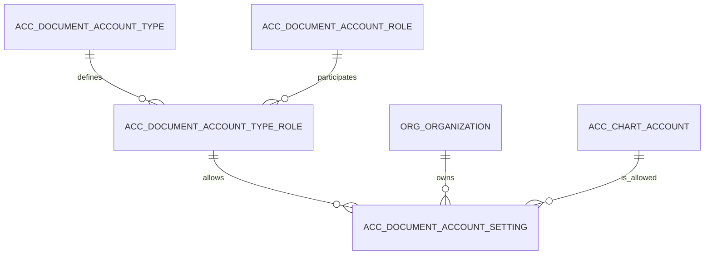

# Настройка счетов для документов

## Назначение

`DocumentAccountSettings` — единый справочник **допустимых бухгалтерских счетов для бизнес-действия** в конкретной организации.

Он отделяет смысл счета от его номера. Документ и его строки работают с понятными ролями: «расчеты с покупателем», «доход», «НДС», «себестоимость», «склад». Организация сама определяет, какие счета ее рабочего плана счетов разрешены для каждой роли, какой из них предлагается по умолчанию и может ли пользователь изменить выбор.

Цель — не хранить в коде или во фронтенде фиксированные номера счетов (`4010`, `6010`, `9020` и т. п.). Один и тот же сценарий можно настроить по-разному для разных организаций и планов счетов.

## Основной принцип


Настройка определяет **набор вариантов до создания или изменения документа**. Документ сохраняет выбранный `account_id`; проводка должна использовать именно сохраненное значение. Поэтому последующее изменение настройки не должно менять счета уже проведенных документов.

## Модель данных

| Таблица | Роль в модели |
|---|---|
| `acc_document_account_type` | Глобальный тип бизнес-действия: продажа товара, закупка услуги, банковский расход и т. д. |
| `acc_document_account_role` | Глобальная смысловая роль счета: доход, НДС, склад, расчеты с поставщиком. |
| `acc_document_account_type_role` | Правило: какие роли участвуют в типе действия, ожидаемая сторона (`debit`/`credit`), обязательность и порядок. |
| `acc_document_account_setting` | Настройка организации: разрешает конкретный `acc_chart_account` для правила «тип + роль». |
| `acc_chart_account` | Рабочий план счетов организации; только его счета могут быть назначены в настройку. |
| `acc_document_account_type_translation` | Локализованные название и описание типа действия. |
| `acc_document_account_role_translation` | Локализованные название и описание роли счета. |

### Связи



### Значение полей настройки организации

`acc_document_account_setting` содержит:

- `organization_id` — организация, для которой действует правило;
- `document_account_type_role_id` — комбинация действия и смысловой роли;
- `chart_account_id` — разрешенный счет рабочего плана;
- `is_default` — счет, который предлагается первым;
- `can_change` — пользователь может или не может заменить предложенный счет при вводе документа;
- `sort_order` — порядок вариантов;
- `state_id` — активность настройки.

Для одной организации и одной комбинации «тип + роль» может быть много разрешенных счетов, но среди активных может быть только один `is_default = true`. Одна и та же комбинация «организация + тип + роль + счет» не дублируется.

## Типы действий и роли

`acc_document_account_type_role` — глобальная матрица. Она не зависит от организации и описывает, что требуется для сценария.

| Тип действия | Роль | Сторона | Обязательна |
|---|---|---:|---:|
| `purchase_goods` | `supplier_settlement` | credit | да |
| `purchase_goods` | `purchase_debit` | debit | да |
| `purchase_goods` | `purchase_vat` | debit | нет |
| `purchase_service` | `supplier_settlement` | credit | да |
| `purchase_service` | `purchase_debit` | debit | да |
| `purchase_service` | `purchase_vat` | debit | нет |
| `sale_goods` | `customer_settlement` | debit | да |
| `sale_goods` | `sale_income` | credit | да |
| `sale_goods` | `sale_vat` | credit | нет |
| `sale_goods` | `sale_cost` | debit | да |
| `sale_goods` | `sale_inventory` | credit | да |
| `sale_service` | `customer_settlement` | debit | да |
| `sale_service` | `sale_income` | credit | да |
| `sale_service` | `sale_vat` | credit | нет |
| `sale_service` | `sale_cost` | debit | нет |
| `sale_service` | `sale_inventory` | credit | нет |
| `bank_income` | `bank_account` | debit | да |
| `bank_income` | `offset_account` | credit | да |
| `bank_expense` | `bank_account` | credit | да |
| `bank_expense` | `offset_account` | debit | да |
| `cash_income` | `cash_account` | debit | да |
| `cash_income` | `offset_account` | credit | да |
| `cash_expense` | `cash_account` | credit | да |
| `cash_expense` | `offset_account` | debit | да |
| `payroll_accrual` | `salary_expense` | debit | да |
| `payroll_accrual` | `salary_payable` | credit | да |
| `payroll_accrual` | `deduction_payable` | credit | да |
| `payroll_accrual` | `employer_tax_expense` | debit | да |
| `payroll_accrual` | `employer_tax_payable` | credit | да |
| `payroll_accrual` | `advance_receivable` | credit | да |

`account_side` описывает ожидаемую сторону роли в типовом действии. Он помогает фронтенду и серверной валидации объяснить назначение счета, но не заменяет реальные правила создания проводки.

## Жизненный цикл настройки

1. Администратор рабочего плана счетов создает активные `acc_chart_account` для организации.
2. Система содержит глобальные типы действий, роли и их матрицу.
3. Бухгалтер открывает настройки нужного типа действия.
4. Для каждой роли добавляет один или несколько разрешенных счетов организации.
5. Для вариантов выбирает один счет по умолчанию, задает порядок и признак `can_change`.
6. При вводе документа система получает только разрешенные счета для его типа и роли.
7. Система предлагает счет по умолчанию; при `can_change = true` пользователь может выбрать другой счет из разрешенного списка.
8. Выбранный идентификатор счета сохраняется в заголовке или строке документа согласно роли.
9. При подтверждении документа сервер проверяет, что сохраненный счет активен, принадлежит организации и разрешен для требуемой роли.
10. После проведения выбор счета является частью исторических данных документа; изменение настройки действует только на новые документы и разрешенные к изменению черновики.

Если роль обязательна (`is_required = true`), нельзя создать или подтвердить документ без выбранного и разрешенного счета. Для необязательной роли отсутствие счета допустимо, например при отсутствии НДС.

## Пример: продажа товара

Для типа `sale_goods` организация может настроить:

| Роль | Разрешенные счета | По умолчанию |
|---|---|---|
| `customer_settlement` | `4010`, `4020` | `4010` |
| `sale_income` | `9020`, `9030` | `9020` |
| `sale_vat` | `6410` | `6410` |
| `sale_cost` | `9120` | `9120` |
| `sale_inventory` | `2910`, `1010` | `2910` |

При вводе продажи система показывает для каждой роли только перечисленные варианты. В конкретной строке товара сохраняются выбранные `income_account_id`, `vat_account_id`, `cost_account_id` и `inventory_account_id`, а в заголовке — счет расчетов с покупателем. Из этих сохраненных счетов формируются проводки, например:

```text
Дт customer_settlement  / Кт sale_income
Дт customer_settlement  / Кт sale_vat
Дт sale_cost            / Кт sale_inventory
```

Номера в примере не являются правилом кода: организация может выбрать другие счета, если они разрешены ее настройкой.

## API

Базовый маршрут: `api/document-account-settings`.

| Метод | Маршрут | Назначение |
|---|---|---|
| `GET` | `/` | Постраничный список типов действий, доступных для настройки. |
| `GET` | `/{documentTypeId}` | Полная матрица ролей выбранного типа и разрешенные счета текущей организации. Роли возвращаются даже без добавленных счетов. |
| `GET` | `/{documentTypeId}/chart-accounts?documentRoleId=…` | Список разрешенных активных счетов для одной роли. Вместо `documentRoleId` можно передать `documentRoleCode`. |
| `POST` | `/` | Синхронно сохраняет настройки ролей: добавляет, обновляет, активирует и переводит отсутствующие варианты в неактивное состояние. |

Для всех ответов с названием типа и роли используется язык текущего пользователя.

## Правила для фронтенда

- Не выводить полный план счетов там, где требуется счет документа: запрашивать список через `chart-accounts` по типу и роли.
- Предвыбирать вариант с `isDefault = true`.
- При `canChange = false` отображать предложенный счет без возможности выбрать другой.
- Не отправлять произвольный `account_id`: отправляется только счет из списка разрешенных вариантов.
- Не считать отсутствие настройки окончательным значением `null` для обязательной роли: показать пользователю, какую роль должен настроить бухгалтер.

## Правила для серверной части

- Центральное правило выбора счетов должно опираться на `document_account_type + document_account_role`, а не на номера счетов в коде.
- При сохранении документа валидировать принадлежность счета текущей организации, его активность и наличие активной настройки для нужной роли.
- При подтверждении повторять валидацию: настройки могли быть изменены после создания черновика.
- Не подменять уже сохраненный счет новым значением по умолчанию автоматически: это нарушит ожидаемую историю документа.
- При добавлении нового сценария сначала создать тип действия, роли и их матрицу, затем дать организации возможность настроить разрешенные счета.

## Граница ответственности

`DocumentAccountSettings` не рассчитывает суммы, НДС, себестоимость, остатки или сами проводки. Он отвечает только за то, **какие счета разрешены и предлагаются для конкретной роли бизнес-действия**. Расчет документа, складская логика и создание проводок используют выбранные и сохраненные в документе счета.
