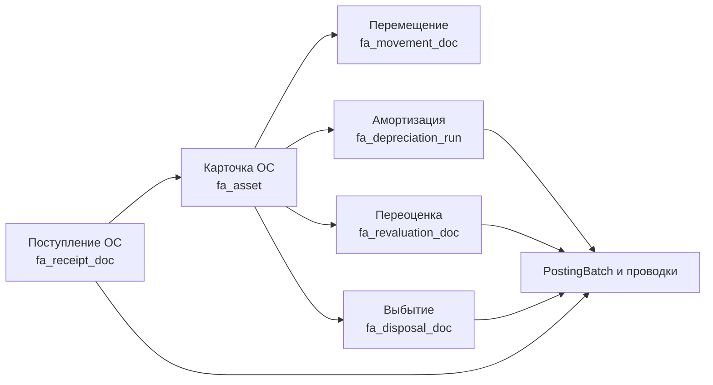
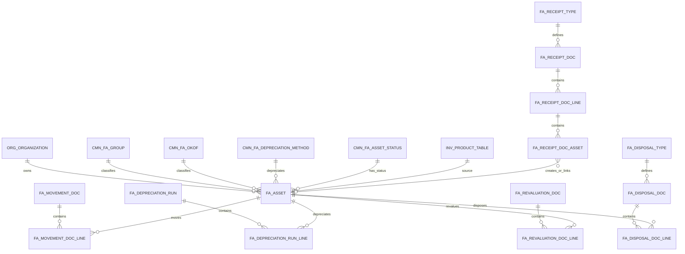
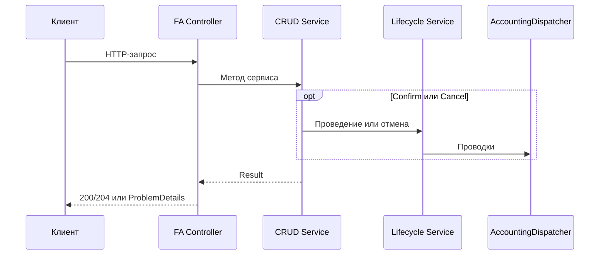

# Основные средства (FA)

## 1. Назначение модуля

Модуль FA ведёт карточки основных средств и документы, которые изменяют их состояние, стоимость, место эксплуатации и бухгалтерский учёт.

В текущем проекте реализованы:

- карточка основного средства;
- поступление и ввод в эксплуатацию;
- внутреннее перемещение между подразделениями и ответственными лицами;
- ежемесячное начисление амортизации;
- переоценка;
- выбытие: продажа, списание или поломка;
- отмена проведённых документов со сторнированием проводок;
- автоматическая нумерация документов, аудит и контроль открытого периода.

## 2. Общая архитектура



Центральная сущность — `fa_asset`. Документы не заменяют карточку, а фиксируют хозяйственные события и изменяют её поля.

## 3. Статусы

### 3.1. Статус карточки ОС

`cmn_fa_asset_status` и `FaAssetStatusIdConst`:

| ID | Константа | Значение |
|---:|---|---|
| 1 | `DRAFT` | Карточка подготовлена, но ОС не введено в эксплуатацию. |
| 2 | `ACTIVE` | ОС введено в эксплуатацию и участвует в амортизации. |
| 3 | `DISPOSED` | ОС выбыло. |

### 3.2. Статус документа

Документы используют `cmn_document_status`:

| ID | Константа | Значение |
|---:|---|---|
| 1 | `DRAFT` | Черновик. |
| 2 | `POSTED` | Проведён. |
| 3 | `CANCELLED` | Отменён. |
| 4 | `PENDING` | Ожидает проведения. |

### 3.3. Состояние записи

`state_id` не равен бизнес-статусу:

| ID | Константа | Значение |
|---:|---|---|
| 1 | `ACTIVE` | Запись активна. |
| 2 | `PASSIVE` | Запись логически удалена или деактивирована. |

## 4. Схема данных



## 5. Таблицы и поля

Знак `?` означает nullable-поле.

### 5.1. `fa_asset`

Карточка основного средства.

| Поле | Тип | Назначение |
|---|---|---|
| `id` | bigint | Идентификатор ОС. |
| `organization_id` | int | Организация-владелец. |
| `state_id` | smallint | Активность записи. |
| `inventory_number` | varchar | Уникальный инвентарный номер в пределах организации. |
| `name` | varchar | Наименование ОС. |
| `fa_group_id` | int | Группа ОС из `cmn_fa_group`. |
| `okof_id` | smallint? | Классификатор ОКОФ из `cmn_fa_okof`. |
| `depreciation_method_id` | smallint | Метод амортизации. |
| `useful_life_months` | int | Срок полезного использования в месяцах. |
| `initial_cost` | numeric(18,2) | Первоначальная или текущая переоценённая стоимость. |
| `salvage_value` | numeric(18,2) | Ликвидационная стоимость; не должна превышать `initial_cost`. |
| `commissioning_date` | timestamp? | Дата ввода в эксплуатацию. |
| `depr_start_date` | timestamp? | Дата начала амортизации. |
| `planned_units_total` | numeric(18,3)? | Плановый объём выпуска для производственного метода. |
| `department_id` | int? | Текущее подразделение эксплуатации. |
| `responsible_user_id` | int? | Текущее материально-ответственное лицо. |
| `status_id` | smallint | `DRAFT`, `ACTIVE` или `DISPOSED`. |
| `asset_account_id` | int? | Балансовый счёт ОС. |
| `accumulated_depreciation_account_id` | int? | Счёт накопленной амортизации. |
| `depreciation_expense_account_id` | int? | Счёт расходов на амортизацию. |
| `created_date` | timestamp | Дата создания. |
| `updated_date` | timestamp | Дата последнего изменения. |

Основные ограничения:

- инвентарный номер уникален внутри организации;
- срок полезного использования больше нуля;
- первоначальная и ликвидационная стоимость неотрицательны;
- ликвидационная стоимость не больше первоначальной;
- `planned_units_total`, если задан, больше нуля.

### 5.2. `fa_receipt_doc`

Заголовок документа поступления ОС.

| Поле | Тип | Назначение |
|---|---|---|
| `id` | bigint | Идентификатор документа. |
| `organization_id` | int | Организация. |
| `state_id` | smallint | Активность записи. |
| `doc_number` | varchar | Автоматически сформированный номер. |
| `doc_date` | timestamp | Дата документа и проводок. |
| `counterparty_id` | int? | Поставщик или другой контрагент. |
| `currency_id` | smallint | Валюта документа. |
| `total_amount` | decimal | Сумма без НДС. |
| `vat_amount` | decimal | Сумма НДС. |
| `final_amount` | decimal | Итог с НДС. |
| `status_id` | smallint | Статус документа. |
| `receipt_type_id` | smallint | Покупка, строительство или другое поступление. |
| `supplier_account_id` | int? | Счёт расчётов с поставщиком. |
| `created_date` | timestamp | Дата создания. |
| `updated_date` | timestamp | Дата изменения. |
| `posted_at` | timestamp? | Дата проведения. |
| `posted_by_user_id` | int? | Кто провёл документ. |
| `cancelled_at` | timestamp? | Дата отмены. |
| `cancelled_by_user_id` | int? | Кто отменил документ. |

### 5.3. `fa_receipt_doc_line`

Товарная или стоимостная строка прихода. Одна строка может создать несколько карточек ОС.

| Поле | Тип | Назначение |
|---|---|---|
| `id` | bigint | Идентификатор строки. |
| `owner_id` | bigint | Ссылка на `fa_receipt_doc`. |
| `name` | varchar | Название строки. |
| `quantity` | decimal | Количество создаваемых объектов ОС. |
| `price` | decimal | Цена единицы без НДС. |
| `amount` | decimal | `quantity × price`. |
| `vat_rate_id` | smallint? | Ставка НДС. |
| `vat_amount` | decimal | НДС строки. |
| `total_amount` | decimal | `amount + vat_amount`. |
| `capital_investment_account_id` | int? | Счёт капитальных вложений. |
| `vat_account_id` | int? | Счёт входного НДС. |

### 5.4. `fa_receipt_doc_asset`

Детализация конкретных объектов ОС внутри строки прихода. До проведения хранит будущую карточку; после проведения `fa_asset_id` связывает её с созданным ОС.

| Поле | Тип | Назначение |
|---|---|---|
| `id` | bigint | Идентификатор объекта строки. |
| `owner_id` | bigint | Ссылка на `fa_receipt_doc_line`. |
| `fa_asset_id` | bigint? | Созданная или связанная карточка ОС. |
| `inventory_number` | varchar | Инвентарный номер. |
| `name` | varchar | Наименование ОС. |
| `initial_cost` | numeric(18,2) | Первоначальная стоимость объекта. |
| `salvage_value` | numeric(18,2) | Ликвидационная стоимость. |
| `useful_life_months` | int | Срок полезного использования. |
| `depreciation_method_id` | smallint | Метод амортизации. |
| `fa_group_id` | int | Группа ОС. |
| `okof_id` | smallint? | ОКОФ. |
| `commissioning_date` | timestamp? | Дата ввода. |
| `depr_start_date` | timestamp? | Дата начала амортизации. |
| `planned_units_total` | numeric(18,3)? | Плановый объём выпуска. |
| `department_id` | int? | Подразделение. |
| `responsible_user_id` | int? | Ответственное лицо. |
| `asset_account_id` | int? | Балансовый счёт ОС. |
| `accumulated_depreciation_account_id` | int? | Счёт накопленной амортизации. |
| `depreciation_expense_account_id` | int? | Счёт расходов на амортизацию. |

### 5.5. `fa_receipt_type`

| Поле | Тип | Назначение |
|---|---|---|
| `id` | smallint | Идентификатор типа. |
| `code` | varchar | Системный код. |
| `name` | varchar | Базовое название. |

Типы:

| ID | Код в логике | Назначение |
|---:|---|---|
| 1 | `PURCHASE` | Покупка. |
| 2 | `CONSTRUCTION` | Создание или строительство. |
| 3 | `OTHER` | Иное поступление. |

### 5.6. `fa_receipt_type_translation`

| Поле | Тип | Назначение |
|---|---|---|
| `receipt_type_id` | smallint | Тип поступления. |
| `language_id` | smallint | Язык. |
| `name` | varchar | Локализованное название. |

Первичный ключ составной: `receipt_type_id + language_id`.

### 5.7. `fa_movement_doc`

Документ внутреннего перемещения ОС.

| Поле | Тип | Назначение |
|---|---|---|
| `id` | bigint | Идентификатор. |
| `organization_id` | int | Организация. |
| `state_id` | smallint | Активность записи. |
| `doc_number` | varchar | Номер документа. |
| `doc_date` | timestamp | Дата перемещения. |
| `status_id` | smallint | Статус документа. |
| `from_department_id` | int? | Исходное подразделение, определяется по карточкам. |
| `to_department_id` | int? | Новое подразделение. |
| `from_responsible_user_id` | int? | Исходное ответственное лицо. |
| `to_responsible_user_id` | int? | Новое ответственное лицо. |
| `note` | varchar? | Примечание. |
| `created_date` | timestamp | Дата создания. |
| `created_by_user_id` | int? | Автор. |
| `updated_date` | timestamp | Дата изменения. |
| `updated_by_user_id` | int? | Кто изменил. |
| `posted_at` | timestamp? | Дата проведения. |
| `posted_by_user_id` | int? | Кто провёл. |
| `cancelled_at` | timestamp? | Дата отмены. |
| `cancelled_by_user_id` | int? | Кто отменил. |

### 5.8. `fa_movement_doc_line`

| Поле | Тип | Назначение |
|---|---|---|
| `id` | bigint | Идентификатор строки. |
| `movement_doc_id` | bigint | Документ перемещения. |
| `fa_asset_id` | bigint | Перемещаемое ОС. |
| `note` | varchar? | Примечание по объекту. |

### 5.9. `fa_depreciation_run`

Заголовок ежемесячного запуска амортизации.

| Поле | Тип | Назначение |
|---|---|---|
| `id` | bigint | Идентификатор запуска. |
| `organization_id` | int | Организация. |
| `state_id` | smallint | Активность записи. |
| `doc_number` | varchar | Номер документа. |
| `period_month` | date | Первый день расчётного месяца. |
| `status_id` | smallint | `POSTED` или `CANCELLED`. |
| `note` | varchar? | Описание запуска. |
| `created_date` | timestamp | Дата создания. |
| `created_by_user_id` | int? | Автор. |
| `updated_date` | timestamp | Дата изменения. |
| `updated_by_user_id` | int? | Кто изменил. |
| `posted_at` | timestamp? | Дата проведения. |
| `posted_by_user_id` | int? | Кто провёл. |
| `cancelled_at` | timestamp? | Дата отмены. |
| `cancelled_by_user_id` | int? | Кто отменил. |

### 5.10. `fa_depreciation_run_line`

| Поле | Тип | Назначение |
|---|---|---|
| `id` | bigint | Идентификатор строки. |
| `depreciation_run_id` | bigint | Запуск амортизации. |
| `fa_asset_id` | bigint | ОС. |
| `amount` | numeric(18,2) | Амортизация за месяц. |
| `note` | varchar? | Примечание расчёта. |
| `expense_account_id` | int? | Дебетовый счёт расходов. |
| `accumulated_depreciation_account_id` | int? | Кредитовый счёт накопленной амортизации. |

### 5.11. `fa_revaluation_doc`

Заголовок переоценки.

| Поле | Тип | Назначение |
|---|---|---|
| `id` | bigint | Идентификатор. |
| `organization_id` | int | Организация. |
| `state_id` | smallint | Активность записи. |
| `doc_number` | varchar | Номер документа. |
| `revaluation_date` | timestamp | Дата переоценки. |
| `status_id` | smallint | Статус документа. |
| `reason` | varchar? | Основание переоценки. |
| `revaluation_reserve_account_id` | int? | Счёт резерва/дооценки. |
| `revaluation_loss_account_id` | int? | Счёт расхода от уценки. |
| `created_date` | timestamp | Дата создания. |
| `created_by_user_id` | int? | Автор. |
| `updated_date` | timestamp | Дата изменения. |
| `updated_by_user_id` | int? | Кто изменил. |
| `posted_at` | timestamp? | Дата проведения. |
| `posted_by_user_id` | int? | Кто провёл. |
| `cancelled_at` | timestamp? | Дата отмены. |
| `cancelled_by_user_id` | int? | Кто отменил. |

### 5.12. `fa_revaluation_doc_line`

| Поле | Тип | Назначение |
|---|---|---|
| `id` | bigint | Идентификатор строки. |
| `revaluation_doc_id` | bigint | Документ переоценки. |
| `fa_asset_id` | bigint | ОС. |
| `old_value` | numeric(18,2) | Балансовая стоимость до переоценки. |
| `new_value` | numeric(18,2) | Новая балансовая стоимость. |
| `revaluation_amount` | numeric(18,2) | `new_value - old_value`. |
| `note` | varchar? | Примечание. |
| `asset_account_id` | int? | Балансовый счёт ОС. |
| `accumulated_depreciation_account_id` | int? | Счёт накопленной амортизации; сейчас в проводке не используется. |

### 5.13. `fa_disposal_doc`

Заголовок выбытия ОС.

| Поле | Тип | Назначение |
|---|---|---|
| `id` | bigint | Идентификатор. |
| `organization_id` | int | Организация. |
| `state_id` | smallint | Активность записи. |
| `doc_number` | varchar | Номер документа. |
| `disposal_date` | timestamp | Дата выбытия. |
| `status_id` | smallint | Статус документа. |
| `disposal_type_id` | smallint | Продажа, списание или поломка. |
| `reason` | varchar? | Причина. |
| `disposal_account_id` | int? | Промежуточный счёт выбытия. |
| `customer_account_id` | int? | Счёт расчётов с покупателем. |
| `vat_account_id` | int? | Счёт НДС; текущий построитель проводок его не использует. |
| `gain_account_id` | int? | Счёт дохода от выбытия. |
| `loss_account_id` | int? | Счёт убытка от выбытия. |
| `created_date` | timestamp | Дата создания. |
| `created_by_user_id` | int? | Автор. |
| `updated_date` | timestamp | Дата изменения. |
| `updated_by_user_id` | int? | Кто изменил. |
| `posted_at` | timestamp? | Дата проведения. |
| `posted_by_user_id` | int? | Кто провёл. |
| `cancelled_at` | timestamp? | Дата отмены. |
| `cancelled_by_user_id` | int? | Кто отменил. |

### 5.14. `fa_disposal_doc_line`

| Поле | Тип | Назначение |
|---|---|---|
| `id` | bigint | Идентификатор строки. |
| `disposal_doc_id` | bigint | Документ выбытия. |
| `fa_asset_id` | bigint | Выбывающее ОС. |
| `book_value` | numeric(18,2) | Остаточная стоимость на дату выбытия. |
| `sale_amount` | numeric(18,2) | Цена продажи. Для списания может быть нулём. |
| `gain_loss` | numeric(18,2) | `sale_amount - book_value`. |
| `note` | varchar? | Примечание. |
| `asset_account_id` | int? | Балансовый счёт ОС. |
| `accumulated_depreciation_account_id` | int? | Счёт накопленной амортизации. |

### 5.15. `fa_disposal_type`

| Поле | Тип | Назначение |
|---|---|---|
| `id` | smallint | Идентификатор типа. |
| `code` | varchar | Системный код. |
| `name` | varchar | Базовое название. |

Типы:

| ID | Код в логике | Назначение |
|---:|---|---|
| 1 | `SALE` | Продажа. Требуется положительная сумма хотя бы по одной строке. |
| 2 | `WRITEOFF` | Списание. |
| 3 | `BREAKDOWN` | Выбытие вследствие поломки. |

### 5.16. `fa_disposal_type_translation`

| Поле | Тип | Назначение |
|---|---|---|
| `disposal_type_id` | smallint | Тип выбытия. |
| `language_id` | smallint | Язык. |
| `name` | varchar | Локализованное название. |

Первичный ключ составной: `disposal_type_id + language_id`.

## 6. Связанные справочники `cmn_fa_*`

### 6.1. `cmn_fa_group`

Организационный справочник групп ОС.

| Поле | Тип | Назначение |
|---|---|---|
| `id` | int | Идентификатор. |
| `organization_id` | int | Организация. |
| `code` | varchar | Код группы. |
| `name` | varchar | Название. |
| `state_id` | smallint | Активность. |

### 6.2. `cmn_fa_okof`

| Поле | Тип | Назначение |
|---|---|---|
| `id` | smallint | Идентификатор. |
| `code` | varchar | Код ОКОФ. |
| `name` | varchar | Название. |
| `state_id` | smallint | Активность. |

### 6.3. `cmn_fa_depreciation_method`

| Поле | Тип | Назначение |
|---|---|---|
| `id` | smallint | Идентификатор. |
| `code` | varchar | `LINEAR`, `DECLINING_BALANCE` или `UNITS_OF_PRODUCTION`. |
| `name` | varchar | Название. |
| `state_id` | smallint | Активность. |

### 6.4. `cmn_fa_asset_status`

| Поле | Тип | Назначение |
|---|---|---|
| `id` | smallint | Идентификатор. |
| `code` | varchar | Код статуса. |
| `name` | varchar | Название. |
| `state_id` | smallint | Активность. |

## 7. Другие внешние таблицы

| Таблица | Связь с FA |
|---|---|
| `org_organization` | Владелец карточек и документов. |
| `org_department` | Подразделение эксплуатации. |
| `sys_user` | Ответственное лицо и авторы операций. |
| `cmn_state` | Активность записей. |
| `cmn_document_status` | Статусы документов. |
| `cmn_currency` | Валюта поступления. |
| `cmn_vat_rate` | Ставка НДС поступления. |
| `counterparty_card` | Поставщик при поступлении. |
| `acc_chart_account` | Все account-поля FA. |
| `acc_posting_batch` | Группа проводок проведения или отмены. |
| `acc_reg_entry` | Итоговые бухгалтерские записи. |
| `sys_audit_log` | История создания, изменения, проведения и отмены. |

## 8. API

Все контроллеры требуют авторизацию и соответствующий `ModuleAuthorize` permission.

### 8.1. Карточки ОС — `/api/fa-assets`

| Метод | Маршрут | Назначение |
|---|---|---|
| `GET` | `/api/fa-assets` | Пагинированный список. Фильтры: `faGroupId`, `statusId`, `search`, `page`, `pageSize`. |
| `GET` | `/api/fa-assets/{id}` | Полная карточка. |
| `PUT` | `/api/fa-assets/{id}` | Изменить карточку. |
| `DELETE` | `/api/fa-assets/{id}` | Логическое удаление: `state_id = PASSIVE`. |

Карточки создаются только при проведении документа поступления ОС. Прямой `POST`, `confirm` и `cancel` у `/api/fa-assets` отсутствуют.

`PUT /api/fa-assets/{id}` меняет только независимые справочные и амортизационные реквизиты. Стоимость, даты ввода, размещение, статус и состояние напрямую не изменяются.
### 8.2. Поступление — `/api/fa-receipts`

| Метод | Маршрут | Назначение |
|---|---|---|
| `GET` | `/api/fa-receipts` | Список. Фильтры: контрагент, статус, тип, даты, поиск, пагинация. |
| `GET` | `/api/fa-receipts/{id}` | Документ со строками и будущими/созданными карточками. |
| `POST` | `/api/fa-receipts` | Создать черновик. |
| `PUT` | `/api/fa-receipts/{id}` | Изменить черновик. |
| `PUT` | `/api/fa-receipts/{id}/confirm` | Создать/активировать ОС и создать проводки. |
| `PUT` | `/api/fa-receipts/{id}/cancel` | Отменить документ и сторнировать проводки. |
| `DELETE` | `/api/fa-receipts/{id}` | Логически удалить допустимый по статусу документ. |

### 8.3. Перемещение — `/api/fa-movements`

| Метод | Маршрут | Назначение |
|---|---|---|
| `GET` | `/api/fa-movements` | Список с фильтрами по статусу, подразделению, ответственному, датам и поиску. |
| `GET` | `/api/fa-movements/{id}` | Детали. |
| `POST` | `/api/fa-movements` | Создать черновик перемещения. |
| `PUT` | `/api/fa-movements/{id}` | Изменить черновик. |
| `PUT` | `/api/fa-movements/{id}/confirm` | Изменить подразделение/ответственного в карточках. |
| `PUT` | `/api/fa-movements/{id}/cancel` | Вернуть исходные значения. |

Отдельного `DELETE` API нет.

### 8.4. Амортизация — `/api/fa/depreciation`

| Метод | Маршрут | Назначение |
|---|---|---|
| `GET` | `/api/fa/depreciation/run` | Список запусков. |
| `GET` | `/api/fa/depreciation/run/{id}` | Детали запуска и рассчитанные строки. |
| `POST` | `/api/fa/depreciation/run?period=yyyy-MM` | Рассчитать и сразу провести амортизацию месяца. |
| `PUT` | `/api/fa/depreciation/run/{id}/cancel` | Сторнировать амортизацию. |

У запуска нет черновика: успешный `POST` сразу создаёт документ `POSTED`.

### 8.5. Переоценка — `/api/fa/revaluations`

| Метод | Маршрут | Назначение |
|---|---|---|
| `GET` | `/api/fa/revaluations` | Список по статусу, датам, поиску и пагинации. |
| `GET` | `/api/fa/revaluations/{id}` | Детали. |
| `POST` | `/api/fa/revaluations` | Создать черновик. |
| `PUT` | `/api/fa/revaluations/{id}` | Изменить черновик. |
| `PUT` | `/api/fa/revaluations/{id}/confirm` | Пересчитать стоимость ОС и провести разницу. |
| `PUT` | `/api/fa/revaluations/{id}/cancel` | Восстановить стоимость и сторнировать проводки. |

Отдельного `DELETE` API нет.

### 8.6. Выбытие — `/api/fa/disposals`

| Метод | Маршрут | Назначение |
|---|---|---|
| `GET` | `/api/fa/disposals` | Список по статусу, типу, датам, поиску и пагинации. |
| `GET` | `/api/fa/disposals/{id}` | Детали. |
| `POST` | `/api/fa/disposals` | Создать черновик. |
| `PUT` | `/api/fa/disposals/{id}` | Изменить черновик. |
| `PUT` | `/api/fa/disposals/{id}/confirm` | Рассчитать остаточную стоимость, провести выбытие и поставить `DISPOSED`. |
| `PUT` | `/api/fa/disposals/{id}/cancel` | Вернуть ОС в `ACTIVE` и сторнировать проводки. |

Отдельного `DELETE` API нет.

### 8.7. Manual API — `/api/manuals`

| Метод | Маршрут | Назначение |
|---|---|---|
| `GET` | `/api/manuals/fa-groups` | Группы ОС текущей организации. |
| `GET` | `/api/manuals/fa-okofs` | ОКОФ. |
| `GET` | `/api/manuals/fa-depreciation-methods` | Методы амортизации. |
| `GET` | `/api/manuals/fa-receipt-types` | Локализованные типы поступления. |
| `GET` | `/api/manuals/fa-disposal-types` | Локализованные типы выбытия. |
| `GET` | `/api/manuals/fa-assets` | Выбор активов с использованием `FaAssetListFilter`. |

Названия типов поступления и выбытия выбираются по `_userContext.LanguageId` с fallback на базовое `name`.

## 9. Публичные сервисные методы

| Сервис | Методы |
|---|---|
| `IFaAssetService` | `GetAllAsync`, `GetByIdAsync`, `UpdateAsync`, `DeleteAsync`. |
| `IFaReceiptService` | `GetAllAsync`, `GetByIdAsync`, `CreateAsync`, `UpdateAsync`, `ConfirmAsync`, `CancelAsync`, `DeleteAsync`. |
| `IFaMovementService` | `GetAllAsync`, `GetByIdAsync`, `CreateAsync`, `UpdateAsync`, `ConfirmAsync`, `CancelAsync`. |
| `IFaDepreciationRunService` | `GetAllAsync`, `GetByIdAsync`, `RunAsync`, `CancelAsync`. |
| `IFaRevaluationService` | `GetAllAsync`, `GetByIdAsync`, `CreateAsync`, `UpdateAsync`, `ConfirmAsync`, `CancelAsync`. |
| `IFaDisposalService` | `GetAllAsync`, `GetByIdAsync`, `CreateAsync`, `UpdateAsync`, `ConfirmAsync`, `CancelAsync`. |

CRUD-сервисы создают и изменяют данные. Отдельные lifecycle-сервисы выполняют проведение и отмену там, где операция влияет на другие подсистемы.

### 9.1. Общая архитектура API

FA-контроллеры являются тонким HTTP-слоем: принимают route/query/body, проверяют `[Authorize]` и `[ModuleAuthorize(...)]`, вызывают application service и преобразуют `Result<T>` в успешный ответ либо `ProblemDetails`. Расчёты и изменение состояния выполняются в сервисах.



### 9.2. Контроллеры и разрешения

| Контроллер | Базовый маршрут | Методы API | Permissions |
|---|---|---|---|
| `FaAssetController` | `/api/fa-assets` | `GET`, `GET {id}`, `PUT {id}`, `DELETE {id}` | `FaAssetView`, `FaAssetViewDetail`, `FaAssetUpdate`, `FaAssetDelete` |
| `FaReceiptController` | `/api/fa/receipts` | `GET`, `GET {id}`, `POST`, `PUT {id}`, `PUT {id}/confirm`, `PUT {id}/cancel`, `DELETE {id}` | `FaReceiptView`, `FaReceiptViewDetail`, `FaReceiptCreate`, `FaReceiptUpdate`, `ConfirmFaReceipt`, `CancelFaReceipt`, `FaReceiptDelete` |
| `FaMovementController` | `/api/fa/movements` | `GET`, `GET {id}`, `POST`, `PUT {id}`, `PUT {id}/confirm`, `PUT {id}/cancel` | `FaMovementView`, `FaMovementViewDetail`, `FaMovementCreate`, `FaMovementUpdate`, `ConfirmFaMovement`, `CancelFaMovement` |
| `FaDepreciationController` | `/api/fa/depreciation` | `GET runs`, `GET runs/{id}`, `POST run?period=yyyy-MM`, `PUT runs/{id}/cancel` | `FaDepreciationView`, `FaDepreciationViewDetail`, `RunFaDepreciation`, `CancelFaDepreciation` |
| `FaRevaluationController` | `/api/fa/revaluations` | `GET`, `GET {id}`, `POST`, `PUT {id}`, `PUT {id}/confirm`, `PUT {id}/cancel` | `FaRevaluationView`, `FaRevaluationViewDetail`, `FaRevaluationCreate`, `FaRevaluationUpdate`, `ConfirmFaRevaluation`, `CancelFaRevaluation` |
| `FaDisposalController` | `/api/fa/disposals` | `GET`, `GET {id}`, `POST`, `PUT {id}`, `PUT {id}/confirm`, `PUT {id}/cancel` | `FaDisposalView`, `FaDisposalViewDetail`, `FaDisposalCreate`, `FaDisposalUpdate`, `ConfirmFaDisposal`, `CancelFaDisposal` |

Точное назначение каждого маршрута приведено в разделе 8. Контроллеры не обращаются к репозиториям напрямую.

### 9.3. `FaAssetService`

- `GetAllAsync` строит фильтры, проекцию и пагинацию.
- `GetByIdAsync` возвращает detail DTO карточки.
- `UpdateAsync` валидирует и меняет только независимые справочные и амортизационные реквизиты.
- `DeleteAsync` выполняет логическое удаление.

Прямое создание и ручное изменение статуса карточки удалены. Карточку создаёт `FaReceiptLifecycleService`, а стоимость, даты, размещение и статус изменяют соответствующие документы.
### 9.4. Поступление: CRUD и lifecycle

`FaReceiptService.GetAllAsync/GetByIdAsync` читают список и детали. `CreateAsync` валидирует шапку и строки, генерирует номер, рассчитывает суммы и создаёт `DRAFT`. `UpdateAsync` и `DeleteAsync` разрешены только для черновика; update полностью заменяет строки. `ConfirmAsync/CancelAsync` делегируются в `FaReceiptLifecycleService`.

`FaReceiptLifecycleService.ConfirmAsync` проверяет период и статус, создаёт или обновляет `FaAsset`, создаёт `acc_posting_batch`, проводит через `AccountingDispatcher`, ставит `POSTED` и пишет аудит. `CancelAsync` создаёт сторно проводок, отменяет состояние карточек и ставит `CANCELLED`.

### 9.5. Перемещение: CRUD и lifecycle

`FaMovementService` читает документы, создаёт и обновляет черновики. Он проверяет подразделения, ответственных, уникальность ОС, единое исходное размещение и отсутствие перемещения в те же реквизиты. `FaMovementLifecycleService` при confirm меняет подразделение и ответственного, при cancel восстанавливает исходные значения. Складские движения и бухгалтерские проводки не создаются.

### 9.6. `FaDepreciationRunService`

`GetAllAsync/GetByIdAsync` возвращают запуски и строки. `RunAsync` проверяет период и отсутствие повторного запуска за месяц, выбирает активные ОС, рассчитывает строки, генерирует номер и сразу создаёт проведённый документ, posting batch и проводки. Редактируемого черновика нет. `CancelAsync` создаёт обратные записи и переводит запуск в `CANCELLED`.

### 9.7. Переоценка: CRUD и lifecycle

`FaRevaluationService` читает документы, создаёт и обновляет черновики с полной заменой строк; проверяет активность ОС, дубли, новую стоимость и счета. `FaRevaluationLifecycleService` вычисляет накопленную амортизацию, старую стоимость и разницу, меняет первоначальную стоимость и формирует проводки. Cancel восстанавливает стоимость и сторнирует проводки.

### 9.8. Выбытие: CRUD и lifecycle

`FaDisposalService` проверяет тип выбытия, активный статус ОС, дубли, счета и обязательную сумму для продажи. `FaDisposalLifecycleService` рассчитывает накопленную амортизацию, остаточную стоимость и финансовый результат, переводит карточку в `DISPOSED` и создаёт проводки. Cancel возвращает ОС в `ACTIVE` и создаёт сторно.

### 9.9. Posting builders и бухгалтерский dispatcher

| Builder | Назначение |
|---|---|
| `FaReceiptContextBuilder` | Капитализация, НДС и предусмотренный правилами ввод в эксплуатацию. |
| `FaDepreciationRunContextBuilder` | Начисление амортизации. |
| `FaRevaluationContextBuilder` | Увеличение или уменьшение стоимости. |
| `FaDisposalContextBuilder` | Списание стоимости, амортизации и финансового результата. |

Builder создаёт `PostingContext` с документом, датой, валютой, `FixedAssetId`, суммами, счетами и субконто, но ничего не сохраняет. `AccountingDispatcher.ProcessAsync` выбирает builder, вызывает `PostingService.BuildEntriesAsync`, присваивает `postingBatchId`, валидирует и сохраняет `AccountingRegisterEntry` в `acc_reg_entry`.

### 9.10. Отсутствие складской интеграции

FA больше не регистрируется в `InventoryDispatcher`. Поступление ОС не принимает склад, `Product`, `ProductTable` и не создаёт движения, остатки или партии склада.
### 9.11. Репозитории и общие зависимости

| Компонент | Роль |
|---|---|
| `IQueryBuilder` и `IQueryRepository<TEntity>` | Фильтры, проекции, списки и детали без прямого EF Core в Application. |
| FA command repositories | Создание/изменение документов и замена дочерних строк. |
| `IUnitOfWork` | Единая транзакция документа, карточек, проводок и аудита. |
| `IDocumentNumberService` | Генерация номера по типу документа и организации. |
| `IAccountingPeriodValidator` | Запрет операций в закрытом периоде. |
| `IPostingLockService` | Защита от параллельного повторного проведения. |
| `IAuditLogService` | История создания, изменения, проведения и отмены. |
| `IUserContext` | Текущие пользователь, организация и язык. |

CRUD-сервисы, lifecycle-сервисы, command repositories и posting builders зарегистрированы как scoped-зависимости и в одном HTTP-запросе используют общий scoped `DbContext`.

## 10. Бизнес-логика

### 10.1. Управление карточкой ОС

Карточка `fa_asset` создаётся только при проведении `FaReceipt`. API карточки предоставляет чтение, ограниченный update и логическое удаление.

Через `PUT /api/fa-assets/{id}` разрешено менять:

- `inventoryNumber`, `name`;
- `faGroupId`, `okofId`;
- `depreciationMethodId`, `usefulLifeMonths`, `plannedUnitsTotal`;
- `assetAccountId`, `accumulatedDepreciationAccountId`, `depreciationExpenseAccountId`.

`initialCost`, `salvageValue`, даты ввода и амортизации, подразделение, ответственный, статус и состояние управляются документами и напрямую не обновляются.
### 10.2. Поступление ОС

При создании документа:

```text
amount      = price × quantity
vatAmount   = amount × vatRate / 100
totalAmount = amount + vatAmount
```

Правила:

- количество строки должно быть целым;
- `quantity` должно совпадать с количеством элементов `assets`;
- инвентарные номера не повторяются в документе и организации;
- сумма `initialCost` всех `assets` строки должна совпадать с `amount` с допуском `0.01`;
- проверяются НДС, группа, метод амортизации, ОКОФ, подразделение и ответственный;
- номер формируется через `IDocumentNumberService`;
- новый документ создаётся в `DRAFT`.

При подтверждении:

1. Проверяется допустимый статус и открытый бухгалтерский период.
2. Для каждого `fa_receipt_doc_asset` создаётся или обновляется `fa_asset`.
3. Карточка получает `ACTIVE`.
4. Если даты не заданы, `commissioning_date` и `depr_start_date` становятся равны дате документа.
5. Создаётся `PostingBatch` и бухгалтерские проводки.
6. Документ становится `POSTED`.

При отмене проведённого прихода:

- бухгалтерские записи сторнируются;
- созданные карточки становятся `PASSIVE + DRAFT`;
- даты ввода и начала амортизации очищаются;
- документ становится `CANCELLED`.

### 10.3. Внутреннее перемещение

Перемещение разрешено только для активных карточек ОС. Все строки одного документа должны иметь одинаковые исходные подразделение и ответственное лицо.

При подтверждении:

- `department_id` меняется на `to_department_id`;
- `responsible_user_id` меняется на `to_responsible_user_id`;
- документ становится `POSTED`.

При отмене значения возвращаются из `from_*`.

Перемещение не создаёт бухгалтерских проводок и не меняет стоимость ОС. Это изменение аналитики и материальной ответственности.

### 10.4. Амортизация

`POST /api/fa/depreciation/run?period=yyyy-MM`:

1. Проверяет формат периода и открытый бухгалтерский период.
2. Запрещает второй неотменённый запуск за тот же месяц и организацию.
3. Выбирает активные ОС с `depr_start_date <= конец месяца`.
4. Исключает объекты после окончания срока полезного использования или с полностью начисленной амортизацией.
5. Суммирует амортизацию только из более ранних `POSTED` запусков.
6. Рассчитывает сумму по каждому объекту.
7. Создаёт документ сразу в `POSTED`, `PostingBatch` и проводки.

Амортизируемая база:

```text
depreciableBase = max(0, initialCost - salvageValue)
remaining       = max(0, depreciableBase - previousDepreciation)
```

Линейный метод:

```text
monthly = round(depreciableBase / usefulLifeMonths, 2)
```

В последнем месяце списывается весь оставшийся остаток, чтобы убрать погрешность округления.

Уменьшаемый остаток:

```text
monthlyRate = 2 / usefulLifeMonths
amount      = remainingBookValue × monthlyRate
```

Сумма ограничивается оставшейся амортизируемой базой.

`UNITS_OF_PRODUCTION` сейчас не использует фактический выпуск. Код применяет к нему линейный ежемесячный fallback и записывает соответствующее примечание.

### 10.5. Переоценка

В документ можно включить только активные ОС текущей организации без повторов.

При подтверждении по каждой строке:

```text
accumulated       = амортизация до даты переоценки
oldValue          = max(0, initialCost - accumulated)
revaluationAmount = newValue - oldValue
newInitialCost    = accumulated + newValue
```

То есть `newValue` трактуется как новая остаточная стоимость, а накопленная амортизация сохраняется. Для получения этой остаточной стоимости изменяется `fa_asset.initial_cost`.

При отмене проводки сторнируются, а `initial_cost` восстанавливается как `accumulated + old_value`.

### 10.6. Выбытие

В документ включаются только активные ОС текущей организации без повторов. Для типа `SALE` хотя бы одна строка должна иметь `saleAmount > 0`.

При подтверждении:

```text
accumulated = амортизация до даты выбытия
bookValue   = max(0, initialCost - accumulated)
gainLoss    = saleAmount - bookValue
```

После расчёта карточка становится `DISPOSED`. При отмене проводки сторнируются, а карточка возвращается в `ACTIVE`.

Типы `WRITEOFF` и `BREAKDOWN` проходят ту же формулу; обычно `saleAmount = 0`, поэтому `gainLoss` отрицательный и отражает убыток.

## 11. Бухгалтерские проводки

### 11.1. Поступление

Для каждого создаваемого ОС:

```text
Дт capital_investment_account / Кт supplier_account   = initialCost
Дт asset_account              / Кт capital_investment = initialCost
```

Для НДС строки:

```text
Дт vat_account / Кт supplier_account = vatAmount
```

Добавляются субконто:

- ОС (`SubkontoTypeIdConst.FixedAssets`);
- контрагент, если указан поставщик.

### 11.2. Амортизация

```text
Дт depreciation_expense_account
Кт accumulated_depreciation_account = amount
```

Добавляется субконто ОС.

### 11.3. Переоценка

Дооценка:

```text
Дт asset_account / Кт revaluation_reserve_account = abs(revaluationAmount)
```

Уценка:

```text
Дт revaluation_loss_account / Кт asset_account = abs(revaluationAmount)
```

### 11.4. Выбытие

Списание накопленной амортизации:

```text
Дт accumulated_depreciation_account / Кт asset_account
```

Перенос остаточной стоимости:

```text
Дт disposal_account / Кт asset_account = bookValue
```

Продажа:

```text
Дт customer_account / Кт disposal_account = saleAmount
```

Прибыль:

```text
Дт disposal_account / Кт gain_account = gainLoss
```

Убыток:

```text
Дт loss_account / Кт disposal_account = abs(gainLoss)
```

### 11.5. Отмена

Для проведённых приходов, амортизации, переоценки и выбытия создаётся новый `PostingBatch` со статусом `REVERSAL`. В нём дебет и кредит исходных записей меняются местами. Исходный batch получает статус `REVERSED`.

## 12. Общие технические правила

- Организация берётся из `_userContext.OrganizationId`.
- Получение списков и объектов ограничивается организационными query filters.
- Все номера FA-документов формируются через `IDocumentNumberService` и соответствующий `DocumentTypeIdConst`.
- Проведение защищено `IPostingLockService` от параллельной повторной обработки.
- Перед проведением проверяется открытый бухгалтерский период.
- Изменения документа, карточек и проводок выполняются внутри транзакций.
- Результаты проведения и отмены записываются в аудит.
- Повторный `confirm` проведённого документа обычно идемпотентен, но для бухгалтерских документов дополнительно проверяется наличие активного `PostingBatch`.

## 13. Текущие несостыковки и ограничения

### 13.1. Account-поля не валидируются централизованно

FA DTO содержат nullable `account_id`, но сервисы не проверяют, что:

- обязательный счёт заполнен;
- счёт активен;
- счёт принадлежит текущей организации;
- счёт разрешён для роли через `DocumentAccountSettings`.

При отсутствии счёта ошибка может возникнуть уже при создании проводок. Для FA желательно добавить типы действий и роли в `DocumentAccountSettings`, затем валидировать выбранные счета до проведения.

### 13.2. НДС при продаже ОС не проводится

`fa_disposal_doc.vat_account_id` и DTO существуют, но:

- в документе нет отдельного поля суммы НДС;
- `FaDisposalContextBuilder` не создаёт проводку НДС;
- `vat_account_id` фактически не используется.

Если продажа ОС облагается НДС, требуется добавить расчёт/поле НДС и проводку.

### 13.3. Производственный метод амортизации не завершён

`planned_units_total` проверяется, но фактические единицы выпуска за период нигде не передаются и не хранятся. Метод `UNITS_OF_PRODUCTION` рассчитывается как линейный.

### 13.4. Поступление сразу вводит ОС в эксплуатацию

Подтверждение `FaReceipt` одновременно:

- капитализирует стоимость;
- создаёт карточку;
- проводит ввод в эксплуатацию;
- переводит карточку в `ACTIVE`;
- задаёт дату начала амортизации.

Если бизнесу нужен промежуток «получено, но ещё не введено», понадобится отдельный статус/документ ввода в эксплуатацию или настройка режима поступления.

### 13.5. Карточка создаётся только документом

Прямой `POST /api/fa-assets` удалён. Источник создания карточки — проведённый `FaReceipt`, поэтому происхождение и бухгалтерская операция фиксируются документом.
### 13.6. Статус изменяется документами

Прямые `confirm` и `cancel` карточки удалены. Проведение и отмена выполняются через документы FA, которые синхронно изменяют карточку и бухгалтерские записи.
### 13.7. Переоценка хранит лишний account-параметр

`fa_revaluation_doc_line.accumulated_depreciation_account_id` сохраняется и возвращается API, но текущий `FaRevaluationContextBuilder` его не использует.

### 13.8. Типы документов пока мало влияют на проводки

- `PURCHASE`, `CONSTRUCTION` и `OTHER` у поступления используют одинаковую схему проводок.
- `SALE`, `WRITEOFF` и `BREAKDOWN` используют одну общую схему выбытия; различается в основном требование `saleAmount`.

Если счета и проводки должны зависеть от типа, эту ветвящуюся логику ещё нужно добавить.

## 14. Рекомендуемые роли для `DocumentAccountSettings`

| Тип действия | Роли счетов |
|---|---|
| `fa_receipt_purchase` | `supplier_settlement`, `capital_investment`, `input_vat`, `fixed_asset`. |
| `fa_receipt_construction` | `construction_cost`, `capital_investment`, `fixed_asset`. |
| `fa_depreciation` | `depreciation_expense`, `accumulated_depreciation`. |
| `fa_revaluation_increase` | `fixed_asset`, `revaluation_reserve`. |
| `fa_revaluation_decrease` | `revaluation_loss`, `fixed_asset`. |
| `fa_disposal_sale` | `fixed_asset`, `accumulated_depreciation`, `disposal`, `customer_settlement`, `output_vat`, `disposal_gain`, `disposal_loss`. |
| `fa_disposal_writeoff` | `fixed_asset`, `accumulated_depreciation`, `disposal`, `disposal_loss`. |

`fa_movement` обычно не требует счетов: для него важны субконто подразделения, ответственного лица и самого ОС.
