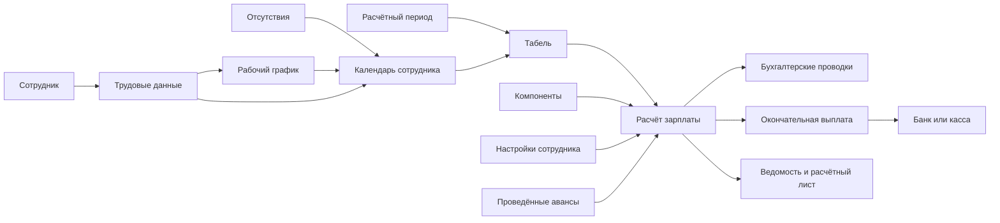
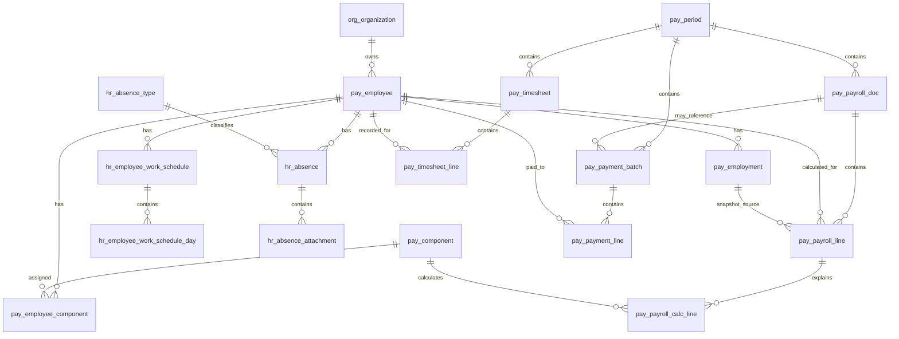
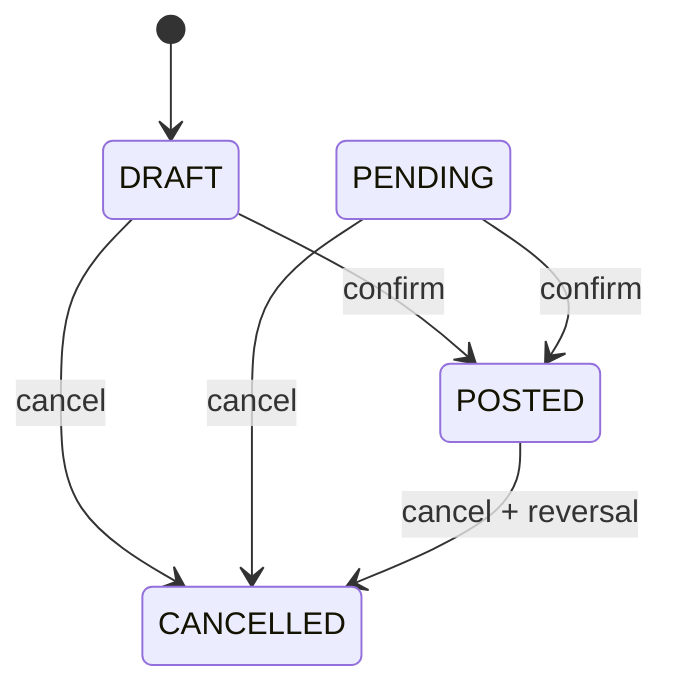

# Кадры, рабочее время и заработная плата

## Полная документация текущей реализации backend

Дата анализа: 05.09.2026.

Документ описывает именно текущий код проекта `Accounting`: таблицы PostgreSQL, Domain-модели, DTO, сервисы, расчёт рабочего времени и зарплаты, бухгалтерские счета, проводки, API, права доступа и фактические ограничения. Это не описание желаемой системы и не нормативная методика расчёта зарплаты.

## 1. Краткий итог

Модуль состоит из двух тесно связанных частей:

- `HR` — сотрудник, трудовые данные, индивидуальный график, отсутствие и календарь;
- `PAY` — расчётный период, табель, компоненты начисления, расчёт зарплаты, аванс/окончательная выплата и отчёты.

Основной поток данных:



Ключевые факты текущей реализации:

- номер кадрового/зарплатного документа генерируется backend автоматически;
- на одну организацию и месяц допускается один активный обычный табель и один активный обычный расчёт зарплаты;
- зарплата рассчитывается только по подтверждённому табелю;
- базовый оклад рассчитывается по отработанным дням, а не по часам;
- сумма каждого компонента и итог округляются до двух знаков методом `AwayFromZero`;
- подтверждение расчёта зарплаты создаёт проводки;
- подтверждение выплаты создаёт и подтверждает банковскую либо кассовую операцию;
- сотрудник и подразделение передаются в проводки как субконто;
- `is_paid` у вида отсутствия сейчас не влияет на формулу зарплаты;
- `overtime_hours` сохраняется, но автоматически в зарплате не используется;
- праздничного производственного календаря в текущей реализации нет.

## 2. Архитектура кода

| Слой | Расположение | Ответственность |
|---|---|---|
| Presentation | `src/Presentation/WebApi/Controllers/Hr`, `Controllers/Pay` | HTTP-маршруты, авторизация, чтение body/query/form, преобразование `Result` в HTTP-ответ |
| Application | `src/Application/Features/Hr`, `Features/Pay` | DTO, интерфейсы, сервисы, валидация, расчёты, ошибки, фильтрация и сортировка |
| Domain | `src/Domain/Entities/Pay` | EF Core-модели кадровых и зарплатных таблиц, FK-навигации |
| Infrastructure | `src/Infrastructure/Persistence` | `AppDbContext`, global organization scope, SQL-скрипты и репозитории |
| SharedKernel | `src/SharedKernel/Constants` | коды видов компонентов, методов расчёта, статусов, типов документов и прав |
| Register | `src/Application/Features/Register/PostingEngines` | преобразование подтверждённой зарплаты в бухгалтерские проводки |

Сервисы чтения строят запросы через `IQueryBuilder` и `IQueryRepository<T>`. Изменения выполняются через `ICommandRepository<T>` и `IUnitOfWork`. Методы создания, изменения, подтверждения и отмены обёрнуты в `ExecuteInTransactionAsync`: успешный `Result` приводит к `Commit`, ошибочный `Result` и исключение — к `Rollback`.

Все организационные HR/PAY-сущности подключены к global access scope по `organization_id`. Глобальный справочник `hr_absence_type` к организации не привязан.

## 3. Схема основных сущностей



## 4. Общие значения и статусы

### 4.1 Состояние записи

| `state_id` | Значение |
|---:|---|
| `1` | `ACTIVE` — активная запись |
| `2` | `PASSIVE` — логически отключённая запись |

### 4.2 Статус документа

| `status_id` | Код | Использование в модуле |
|---:|---|---|
| `1` | `DRAFT` | черновик табеля, зарплаты или выплаты |
| `2` | `POSTED` | подтверждённый документ |
| `3` | `CANCELLED` | отменённый документ |
| `4` | `PENDING` | допускается сервисами подтверждения, но отдельного API перевода в этот статус нет |

### 4.3 Коды общесистемных типов документов

| ID | Код | Таблица |
|---:|---|---|
| `5` | `salary` | `pay_payroll_doc` |
| `20` | `payroll_timesheet` | `pay_timesheet` |
| `21` | `payroll_payment` | `pay_payment_batch` |
| `22` | `hr_absence` | `hr_absence` |

Нумерация ведётся через `cmn_document_number_sequence` отдельно по комбинации `organization_id + document_type_id + document_year`. Значение `doc_number` — строковое представление последовательности `1`, `2`, `3` и так далее. После выполнения актуального скрипта унификации уникальность документов проверяется в пределах организации и года.

## 5. Таблицы базы данных

В модуле 17 собственных таблиц: 12 с префиксом `pay_` и 5 с префиксом `hr_`.

### 5.1 `pay_employee` — карточка сотрудника

Одна запись представляет физическое лицо внутри конкретной организации.

| Поле | Тип | Назначение и правило |
|---|---|---|
| `id` | `bigint` | PK сотрудника |
| `organization_id` | `int` | FK на `org_organization`; граница доступа |
| `employee_number` | `varchar(50)` | внутренний табельный номер; уникален в организации; backend приводит к верхнему регистру |
| `pinfl` | `varchar(14)` nullable | ПИНФЛ; при наличии ровно 14 символов и уникален в организации |
| `tin` | `varchar(20)` nullable | ИНН сотрудника |
| `first_name` | `varchar(150)` | имя |
| `last_name` | `varchar(150)` | фамилия |
| `middle_name` | `varchar(150)` nullable | отчество |
| `birth_date` | `date` nullable | дата рождения |
| `phone_number` | `varchar(50)` nullable | телефон |
| `email` | `varchar(200)` nullable | email; API проверяет формат |
| `bank_account_number` | `varchar(100)` nullable | банковский счёт/карточный реквизит сотрудника; в автоматической выплате сейчас не используется |
| `state_id` | `smallint` | активность карточки |
| `created_date`, `updated_date` | `timestamp` | даты создания/изменения |
| `created_by_user_id`, `updated_by_user_id` | `int` nullable | пользователи, изменившие карточку |

Удаление через API является мягким: сотрудник, его трудовые записи и назначения компонентов переводятся в `PASSIVE`. Исторические табели, расчёты и выплаты остаются.

### 5.2 `pay_employment` — трудовые условия сотрудника

Хранит период работы и параметры, необходимые календарю и зарплате.

| Поле | Тип | Назначение и правило |
|---|---|---|
| `id` | `bigint` | PK трудовой записи |
| `organization_id` | `int` | организация |
| `employee_id` | `bigint` | FK на `pay_employee` |
| `department_id` | `int` nullable | FK на `org_department`; подразделение |
| `position_id` | `int` nullable | FK на `org_position`; должность |
| `employment_type` | `varchar(30)` | `PRIMARY`, `PART_TIME` или `CONTRACT`; сам код пока не меняет формулу |
| `start_date` | `date` | первый день действия |
| `end_date` | `date` nullable | последний день действия; `null` означает бессрочно |
| `monthly_salary` | `numeric(18,2)` | месячный оклад до пропорционального расчёта |
| `employment_rate` | `numeric(5,4)` | доля ставки: больше 0 и не больше 2; участвует в формуле оклада |
| `weekly_hours` | `numeric(6,2)` | недельная норма; используется fallback-календарём и проверкой графика |
| `currency_id` | `smallint` | валюта зарплаты |
| `expense_account_id` | `int` nullable | персональный счёт затрат на зарплату; имеет приоритет над общей настройкой, но ниже счёта компонента |
| `state_id` | `smallint` | активность |
| `created_date`, `updated_date` | `timestamp` | даты записи |

API запрещает пересекающиеся активные трудовые периоды одного сотрудника. База сама гарантирует только уникальность `employee_id + start_date`, поэтому прямые SQL-изменения могут нарушить прикладное правило. Трудовую запись, уже использованную в подтверждённой зарплате, изменить нельзя.

### 5.3 `pay_component` — вид начисления/удержания/налога

Это настраиваемая формула расчёта, например оклад, премия, НДФЛ или социальный налог.

| Поле | Тип | Назначение и правило |
|---|---|---|
| `id` | `int` | PK компонента |
| `organization_id` | `int` | организация-владелец |
| `code` | `varchar(50)` | внутренний код; backend приводит к верхнему регистру |
| `name` | `varchar(250)` | название для пользователя и содержания проводки |
| `component_type` | `varchar(30)` | `EARNING`, `DEDUCTION`, `EMPLOYER_TAX` |
| `calculation_method` | `varchar(30)` | `SALARY_PRORATED`, `FIXED`, `PERCENT_OF_GROSS`, `PER_HOUR` |
| `default_amount` | `numeric(18,2)` nullable | сумма по умолчанию для `FIXED` |
| `default_rate` | `numeric(9,4)` nullable | процент или ставка по умолчанию |
| `is_mandatory` | `boolean` | если `true`, компонент применяется всем сотрудникам в обычном расчёте |
| `expense_account_id` | `int` nullable | переопределённый дебетовый счёт расхода для начисления/налога работодателя |
| `liability_account_id` | `int` nullable | переопределённый кредитовый счёт обязательства |
| `effective_from`, `effective_to` | `date` | период действия; конец может быть `null` |
| `sort_order` | `int` | порядок расчёта и показа; больше 0 |
| `state_id` | `smallint` | активность |
| `created_date`, `updated_date` | `timestamp` | даты записи |

Уникальность: `organization_id + code + effective_from`. Компонент, использованный подтверждённой зарплатой, нельзя изменить. Удаление мягкое. Готовые компоненты зарплаты SQL-скриптами не создаются — организация должна настроить их через API.

### 5.4 `pay_employee_component` — индивидуальное назначение компонента

Связывает сотрудника с необязательным компонентом и переопределяет его сумму или ставку.

| Поле | Тип | Назначение |
|---|---|---|
| `id` | `bigint` | PK назначения |
| `organization_id` | `int` | организация |
| `employee_id` | `bigint` | сотрудник |
| `component_id` | `int` | компонент |
| `amount` | `numeric(18,2)` nullable | индивидуальная сумма; приоритет над `default_amount` |
| `rate` | `numeric(9,4)` nullable | индивидуальная ставка/процент; приоритет над `default_rate` |
| `effective_from`, `effective_to` | `date` | период действия |
| `state_id` | `smallint` | активность назначения |
| `created_date`, `updated_date` | `timestamp` | даты записи |

API запрещает пересечение периодов одного `component_id` у одного сотрудника. Удаление назначения переводит его в `PASSIVE`.

### 5.5 `pay_period` — месячный расчётный период

| Поле | Тип | Назначение |
|---|---|---|
| `id` | `bigint` | PK периода |
| `organization_id` | `int` | организация |
| `period_year`, `period_month` | `smallint` | год и месяц; комбинация уникальна в организации |
| `start_date`, `end_date` | `date` | backend автоматически задаёт первый и последний календарный день месяца |
| `norm_work_days` | `numeric(6,2)` | общая норма дней; резервный denominator расчёта оклада |
| `norm_work_hours` | `numeric(8,2)` | общая норма часов; сейчас не входит в формулу оклада |
| `status` | `varchar(20)` | `OPEN` или `CLOSED` |
| `created_date` | `timestamp` | дата создания |
| `closed_date` | `timestamp` nullable | дата закрытия |
| `closed_by_user_id` | `int` nullable | кто закрыл период |

Закрытие запрещено, пока есть активный табель, зарплата или выплата в `DRAFT/PENDING`. Закрытие не требует наличия зарплаты и не требует полного погашения задолженности. Повторное открытие разрешено без отдельной проверки бухгалтерского периода.

### 5.6 `hr_employee_work_schedule` — индивидуальный рабочий график

| Поле | Тип | Назначение |
|---|---|---|
| `id` | `bigint` | PK графика |
| `organization_id` | `int` | организация |
| `employee_id` | `bigint` | сотрудник |
| `name` | `varchar(200)` | название графика |
| `effective_from`, `effective_to` | `date` | период действия |
| `state_id` | `smallint` | активность |
| `created_date`, `updated_date` | `timestamp` | даты |
| `created_by_user_id`, `updated_by_user_id` | `int` nullable | пользователи |

Активные графики сотрудника не могут пересекаться. Нельзя изменить или удалить график, затрагивающий подтверждённый табель.

### 5.7 `hr_employee_work_schedule_day` — рабочие дни графика

| Поле | Тип | Назначение |
|---|---|---|
| `id` | `bigint` | PK строки |
| `organization_id` | `int` | организация |
| `schedule_id` | `bigint` | FK на график; каскадное удаление |
| `day_of_week` | `smallint` | ISO-день недели: 1 — понедельник, 7 — воскресенье |
| `work_hours` | `numeric(5,2)` | плановые часы этого дня; больше 0 и не больше 24 |

Один день недели может встречаться в графике один раз. Сумма часов дней должна совпадать с `pay_employment.weekly_hours` для всех пересекающихся трудовых записей.

### 5.8 `hr_absence_type` — глобальный справочник отсутствий

| Поле | Тип | Назначение |
|---|---|---|
| `id` | `smallint` | PK вида |
| `code` | `varchar(50)` | уникальный код |
| `name` | `varchar(200)` | название; сейчас одна строка без таблицы переводов |
| `timesheet_category` | `varchar(20)` | агрегирование в табеле: `LEAVE`, `SICK`, `ABSENT` |
| `is_paid` | `boolean` | признак оплачиваемого отсутствия; пока только возвращается клиенту |
| `state_id` | `smallint` | активность |
| `created_date` | `timestamp` | дата создания |

Начальные значения:

| ID | Код | Категория | Оплачиваемое |
|---:|---|---|---|
| 1 | `ANNUAL_LEAVE` | `LEAVE` | да |
| 2 | `SICK_LEAVE` | `SICK` | да |
| 3 | `UNPAID_LEAVE` | `ABSENT` | нет |
| 4 | `MATERNITY_LEAVE` | `LEAVE` | да |
| 5 | `STUDY_LEAVE` | `LEAVE` | да |
| 6 | `UNEXCUSED_ABSENCE` | `ABSENT` | нет |
| 7 | `OTHER_ABSENCE` | `ABSENT` | нет |

### 5.9 `hr_absence` — документ отсутствия

| Поле | Тип | Назначение |
|---|---|---|
| `id` | `bigint` | PK документа |
| `organization_id` | `int` | организация |
| `employee_id` | `bigint` | сотрудник |
| `absence_type_id` | `smallint` | вид отсутствия |
| `doc_number` | `varchar(100)` | автоматически сгенерированный номер |
| `doc_date` | `date` | дата документа |
| `start_date`, `end_date` | `date` | включительные границы отсутствия |
| `note` | `varchar(1000)` nullable | комментарий |
| `state_id` | `smallint` | активность |
| `created_date`, `updated_date` | `timestamp` | даты |
| `created_by_user_id`, `updated_by_user_id` | `int` nullable | пользователи |

Период должен целиком находиться внутри активного трудового периода. Он не может пересекать другое активное отсутствие того же сотрудника и не может превышать 732 календарных дня. Создание/изменение/удаление блокируется, если период пересекает подтверждённый табель.

### 5.10 `hr_absence_attachment` — файл отсутствия

| Поле | Тип | Назначение |
|---|---|---|
| `id` | `bigint` | PK файла |
| `organization_id` | `int` | организация |
| `absence_id` | `bigint` | документ отсутствия; каскадное удаление |
| `file_path` | `varchar(500)` | относительный путь локального хранилища |
| `original_file_name` | `varchar(255)` | исходное имя |
| `content_type` | `varchar(150)` | MIME-тип |
| `file_size` | `bigint` | размер, обязательно больше 0 |
| `telegram_file_id` | `varchar(300)` | идентификатор резервной копии Telegram |
| `telegram_message_id` | `int` | сообщение Telegram для удаления/восстановления |
| `created_date` | `timestamp` | дата |
| `created_by_user_id` | `int` nullable | пользователь |

Файл сначала сохраняется локально, затем архивируется в Telegram. При скачивании отсутствующий локальный файл восстанавливается из Telegram. Ошибка сохранения возвращает бизнес-ошибку и откатывает DB-транзакцию; очистка внешних файлов выполняется best effort.

### 5.11 `pay_timesheet` — заголовок табеля

| Поле | Тип | Назначение |
|---|---|---|
| `id` | `bigint` | PK документа |
| `organization_id` | `int` | организация |
| `period_id` | `bigint` | расчётный месяц |
| `doc_number` | `varchar(100)` | автоматический номер |
| `doc_date` | `timestamp` | дата документа |
| `status_id` | `smallint` | `DRAFT/POSTED/CANCELLED/PENDING` |
| `note` | `varchar(1000)` nullable | комментарий |
| `state_id` | `smallint` | активность |
| поля `created/updated/posted/cancelled` | `timestamp/int` | полный жизненный цикл и пользователи |

В одной организации на период возможен один активный неотменённый табель.

### 5.12 `pay_timesheet_line` — показатели сотрудника в табеле

| Поле | Тип | Назначение |
|---|---|---|
| `id` | `bigint` | PK строки |
| `organization_id` | `int` | организация |
| `timesheet_id` | `bigint` | табель; каскадное удаление |
| `employee_id` | `bigint` | сотрудник; уникален внутри табеля |
| `worked_days`, `worked_hours` | `numeric` | введённые отработанные дни и часы |
| `norm_work_days`, `norm_work_hours` | `numeric` | снимок персональной нормы из календаря на момент сохранения табеля |
| `leave_days` | `numeric(6,2)` | дни категории `LEAVE` |
| `sick_days` | `numeric(6,2)` | дни категории `SICK` |
| `absent_days` | `numeric(6,2)` | дни категории `ABSENT` |
| `overtime_hours` | `numeric(8,2)` | сверхурочные часы; пока только хранение/вывод |
| `note` | `varchar(500)` nullable | комментарий |

Все числовые значения неотрицательны. `norm_work_days` и `norm_work_hours` — это снимок нормы из расчётного периода, а не верхний предел для фактически введённых данных. API проверяет корректность дат, статусов и категорий отсутствия относительно HR-календаря, но не запрещает отработанные дни или часы выше нормы.

### 5.13 `pay_payroll_doc` — документ расчёта зарплаты

| Поле | Тип | Назначение |
|---|---|---|
| `id` | `bigint` | PK документа |
| `organization_id` | `int` | организация |
| `period_id` | `bigint` | расчётный месяц |
| `doc_number` | `varchar(100)` | автоматический номер |
| `doc_date` | `timestamp` | дата документа и проводки |
| `document_kind` | `varchar(20)` | `REGULAR` или `CORRECTION` |
| `correction_of_doc_id` | `bigint` nullable | исходный подтверждённый расчёт для корректировки |
| `currency_id` | `smallint` | единая валюта всех строк |
| `status_id` | `smallint` | статус документа |
| `gross_amount` | `numeric(18,2)` | сумма всех начислений `EARNING` |
| `deduction_amount` | `numeric(18,2)` | сумма удержаний `DEDUCTION` |
| `employer_tax_amount` | `numeric(18,2)` | налоги/взносы работодателя; не уменьшают net |
| `advance_amount` | `numeric(18,2)` | проведённые авансы периода, зачтённые обычным расчётом |
| `net_amount` | `numeric(18,2)` | `gross_amount - deduction_amount` |
| `payable_amount` | `numeric(18,2)` | `net_amount - advance_amount` |
| `note`, `state_id` |  | комментарий и активность |
| поля `created/updated/posted/cancelled` |  | жизненный цикл и пользователи |

Для обычного расчёта на период разрешён один активный неотменённый документ. Корректировок может быть несколько.

### 5.14 `pay_payroll_line` — итог зарплаты сотрудника

| Поле | Тип | Назначение |
|---|---|---|
| `id` | `bigint` | PK строки |
| `organization_id` | `int` | организация |
| `payroll_doc_id` | `bigint` | документ; каскадное удаление |
| `employee_id` | `bigint` | сотрудник; уникален внутри документа |
| `employment_id` | `bigint` | использованная трудовая запись |
| `worked_days`, `worked_hours` | `numeric` | снимок показателей табеля |
| `gross_amount` | `numeric(18,2)` | начислено |
| `deduction_amount` | `numeric(18,2)` | удержано |
| `employer_tax_amount` | `numeric(18,2)` | расходы работодателя сверху |
| `advance_amount` | `numeric(18,2)` | зачтённый аванс |
| `net_amount` | `numeric(18,2)` | начисления минус удержания |
| `payable_amount` | `numeric(18,2)` | остаток к выплате после аванса |

### 5.15 `pay_payroll_calc_line` — расшифровка по компонентам

| Поле | Тип | Назначение |
|---|---|---|
| `id` | `bigint` | PK расчётной строки |
| `organization_id` | `int` | организация |
| `payroll_line_id` | `bigint` | строка сотрудника; каскадное удаление |
| `component_id` | `int` | использованный компонент; уникален в строке сотрудника |
| `base_amount` | `numeric(18,2)` | база формулы |
| `quantity` | `numeric(12,4)` nullable | дни или часы |
| `rate` | `numeric(9,4)` nullable | процент/часовая ставка |
| `amount` | `numeric(18,2)` | рассчитанная либо ручная сумма; в корректировке может быть отрицательной |
| `is_manual` | `boolean` | сумма пришла из `adjustments`, а не из формулы |
| `note` | `varchar(500)` nullable | пояснение ручной корректировки |

### 5.16 `pay_payment_batch` — документ выплаты

| Поле | Тип | Назначение |
|---|---|---|
| `id` | `bigint` | PK выплаты |
| `organization_id` | `int` | организация |
| `period_id` | `bigint` | месяц выплаты |
| `payroll_doc_id` | `bigint` nullable | для `FINAL` обязателен подтверждённый расчёт |
| `doc_number`, `doc_date` |  | автоматический номер и дата |
| `payment_kind` | `varchar(20)` | `ADVANCE` или `FINAL` |
| `source_type` | `varchar(20)` | `BANK` или `CASH` |
| `bank_account_id` | `int` nullable | счёт организации при `BANK` |
| `cash_box_id` | `int` nullable | касса при `CASH` |
| `source_chart_account_id` | `int` | бухгалтерский счёт источника денег |
| `offset_account_id` | `int` nullable | заполняется при подтверждении: аванс сотруднику или задолженность по зарплате |
| `currency_id` | `smallint` | валюта |
| `total_amount` | `numeric(18,2)` | сумма строк |
| `status_id` | `smallint` | статус |
| `bank_operation_id` | `bigint` nullable | созданная `bank_operation` |
| `cash_operation_id` | `bigint` nullable | созданная `cash_operation` |
| `note`, `state_id` |  | комментарий и активность |
| поля `created/posted/cancelled` |  | жизненный цикл и пользователи |

Ровно один источник соответствует типу: для `BANK` нужен `bank_account_id`, для `CASH` — `cash_box_id`. Одновременно банковская и кассовая операция запрещены.

### 5.17 `pay_payment_line` — выплата сотруднику

| Поле | Тип | Назначение |
|---|---|---|
| `id` | `bigint` | PK строки |
| `organization_id` | `int` | организация |
| `payment_batch_id` | `bigint` | документ выплаты; каскадное удаление |
| `employee_id` | `bigint` | получатель; уникален внутри выплаты |
| `payroll_line_id` | `bigint` nullable | строка расчёта для `FINAL`; у аванса обычно `null` |
| `amount` | `numeric(18,2)` | сумма, строго больше 0 |
| `note` | `varchar(500)` nullable | комментарий |

## 6. Связанные общие таблицы

| Таблица | Как используется кадровым/зарплатным модулем |
|---|---|
| `org_organization` | владелец всех организационных записей |
| `org_department` | подразделение трудовой записи и субконто проводки |
| `org_position` | должность трудовой записи и отчётов |
| `cmn_currency` | валюта трудовой записи, зарплаты и выплаты |
| `cmn_state` | активность справочников и документов |
| `cmn_document_status` | статус табеля, зарплаты и выплаты |
| `cmn_document_type` | типы `salary`, `payroll_timesheet`, `payroll_payment`, `hr_absence` |
| `cmn_document_number_sequence` | последний номер по организации, типу документа и году |
| `cmn_document_registry` | общий реестр; хранит зарплату с `payable_amount`, выплату с `total_amount`, табель/отсутствие с нулевой суммой |
| `acc_chart_account` | счета затрат, обязательств, банка и кассы |
| `acc_document_account_type` | содержит тип `payroll_accrual` |
| `acc_document_account_role` | содержит шесть зарплатных ролей счетов |
| `acc_document_account_type_role` | связывает `payroll_accrual` с ролями, стороной и порядком |
| `acc_document_account_setting` | хранит счета по умолчанию конкретной организации |
| `acc_posting_batch` | пакет проводок подтверждённой зарплаты и пакет сторно |
| `acc_reg_entry` | бухгалтерские записи Дт/Кт |
| `acc_reg_entry_subkonto` | аналитика сотрудника и подразделения на проводке |
| `acc_subkonto_type` | тип `OrganizationEmployees` указывает на `pay_employee` |
| `org_bank_account` | источник банковской выплаты |
| `cash_box` | источник наличной выплаты |
| `bank_operation`, `cash_operation` | фактическое движение денег после подтверждения выплаты |
| `sys_user` | авторы создания, подтверждения, отмены |
| `sys_audit_log` | old/new snapshots действий сервисов |

`cmn_document_registry` синхронизируется SQL-триггерами после `insert/update/delete` заголовков. Для `hr_absence` в реестре `status_id` и `currency_id` равны `null`, сумма равна 0.

## 7. Domain-модели и навигации

Все бизнес-модели находятся в `Domain.Entities`.

| Класс | Таблица | Основные навигации и цель |
|---|---|---|
| `PayEmployee` | `pay_employee` | `Organization`, `State`, `Employments`, `EmployeeComponents`, `TimesheetLines`, `PayrollLines`, `PaymentLines`, `WorkSchedules`, `Absences` |
| `PayEmployment` | `pay_employment` | `Employee`, `Department`, `Position`, `Currency`, `ExpenseAccount`, `PayrollLines` |
| `PayComponent` | `pay_component` | `ExpenseAccount`, `LiabilityAccount`, `EmployeeComponents`, `PayrollCalcLines` |
| `PayEmployeeComponent` | `pay_employee_component` | `Employee`, `Component`, `State` |
| `PayPeriod` | `pay_period` | `Timesheets`, `PayrollDocs`, `PaymentBatches`, `ClosedByUser` |
| `PayTimesheet` | `pay_timesheet` | `Period`, `Status`, `State`, `Lines` |
| `PayTimesheetLine` | `pay_timesheet_line` | `Timesheet`, `Employee` |
| `PayPayrollDoc` | `pay_payroll_doc` | `Period`, self-reference `CorrectionOfDoc/Corrections`, `Currency`, `Status`, `Lines`, `PaymentBatches` |
| `PayPayrollLine` | `pay_payroll_line` | `PayrollDoc`, `Employee`, `Employment`, `CalcLines`, `PaymentLines` |
| `PayPayrollCalcLine` | `pay_payroll_calc_line` | `PayrollLine`, `Component` |
| `PayPaymentBatch` | `pay_payment_batch` | `Period`, `PayrollDoc`, `BankAccount/CashBox`, source/offset chart accounts, operations, `Lines` |
| `PayPaymentLine` | `pay_payment_line` | `PaymentBatch`, `Employee`, optional `PayrollLine` |
| `HrEmployeeWorkSchedule` | `hr_employee_work_schedule` | `Employee`, `State`, `Days` |
| `HrEmployeeWorkScheduleDay` | `hr_employee_work_schedule_day` | `Schedule`, `Organization` |
| `HrAbsenceType` | `hr_absence_type` | `Absences` |
| `HrAbsence` | `hr_absence` | `Employee`, `AbsenceType`, `State`, `Attachments` |
| `HrAbsenceAttachment` | `hr_absence_attachment` | `Absence`, `Organization` |

Папка `src/Infrastructure/Persistence/Generated/Entities` содержит сгенерированные копии схемы БД. Бизнес-сервисы модуля работают с моделями из `src/Domain/Entities/Pay`; Generated-модели не являются отдельной бизнес-моделью.

## 8. DTO и назначение полей API

### 8.1 Сотрудник и трудовая запись

`PayrollEmployeeBaseDto`: `employeeNumber`, `pinfl`, `tin`, `firstName`, `lastName`, `middleName`, `birthDate`, `phoneNumber`, `email`, `bankAccountNumber`.

`PayrollEmployeeCreateDto` дополнительно требует `employment` — первую трудовую запись. `PayrollEmployeeUpdateDto` меняет только карточку, трудовые данные меняются отдельным endpoint.

`PayrollEmploymentSaveDto`:

| Поле | Смысл |
|---|---|
| `departmentId`, `positionId` | подразделение и должность |
| `employmentType` | `PRIMARY`, `PART_TIME`, `CONTRACT` |
| `startDate`, `endDate` | включительный период действия |
| `monthlySalary` | полный месячный оклад |
| `employmentRate` | коэффициент ставки |
| `weeklyHours` | недельная норма |
| `currencyId` | валюта зарплаты |
| `expenseAccountId` | персональный счёт затрат |

`PayrollEmployeeComponentSaveDto`: `componentId`, optional `amount/rate`, `effectiveFrom/effectiveTo`.

Списочный ответ сотрудника показывает актуальные подразделение, должность и оклад из последней активной трудовой записи. Детальный ответ возвращает все трудовые записи и все назначения компонентов, включая пассивные.

### 8.2 График и календарь

`HrWorkScheduleSaveDto`: `name`, `effectiveFrom`, `effectiveTo`, массив `days`. Элемент `days` содержит `dayOfWeek` и `workHours`.

`HrEmployeeCalendarDayDto` возвращает дату, ISO-день недели, статус, плановые/фактические часы, выбранный график и отсутствие. `HrEmployeeCalendarSummaryDto` агрегирует норму, отработано, будущий план, отпуск, болезнь и прочие отсутствия.

### 8.3 Отсутствие

`HrAbsenceCreateRequest` передаётся как multipart/form-data: `employeeId`, `absenceTypeId`, `docDate`, `startDate`, `endDate`, `note`, `files`. Номер документа отсутствует во входе и создаётся автоматически.

`HrAbsenceDto` дополнительно возвращает `calendarDays`, количество и список файлов. Каждый файл содержит `downloadUrl`.

### 8.4 Компонент зарплаты

`PayrollComponentBaseDto` содержит все поля `pay_component`, кроме системных ID/organization/state/audit. Ответ добавляет ID, номера выбранных счетов и системные поля.

Фильтры: `search`, `componentType`, `effectiveOn`, `stateId`, `page`, `pageSize`.

### 8.5 Период

Create: `year`, `month`, `normWorkDays`, `normWorkHours`. Ответ дополнительно содержит рассчитанные `startDate/endDate`, статус и даты.

### 8.6 Табель

Create/update: `periodId`, `docDate`, `note`, `lines`. Строка содержит `employeeId`, `workedDays`, `workedHours`, `leaveDays`, `sickDays`, `absentDays`, `overtimeHours`, `note`.

Ответ дополнительно возвращает номер/статус, персональные нормы каждой строки и объект `calendar` с двумя представлениями:

- `dailyAttendance` — календарная дата и все сотрудники;
- `monthlySummary` — итоги по сотрудникам и признак `isIncludedInDocument`.

### 8.7 Расчёт зарплаты

`PayrollCalculateDto`:

| Поле | Смысл |
|---|---|
| `periodId` | открытый месяц |
| `docDate` | дата документа/проводки |
| `documentKind` | `REGULAR` либо `CORRECTION` |
| `correctionOfDocId` | обязательно только для `CORRECTION` |
| `note` | комментарий |
| `adjustments` | ручные суммы по сотруднику и компоненту |

Ручная строка: `employeeId`, `componentId`, `amount`, `note`. `amount` является готовой суммой и полностью заменяет формулу этого компонента. Для `REGULAR` отрицательная сумма запрещена, для `CORRECTION` разрешена.

Детальный ответ содержит заголовочные итоги, строки сотрудников и `calcLines` — полную расшифровку формул.

### 8.8 Выплата

`PayrollPaymentCreateDto`:

| Поле | Смысл |
|---|---|
| `periodId` | открытый период |
| `payrollDocId` | обязателен для `FINAL` |
| `docDate` | дата выплаты |
| `paymentKind` | `ADVANCE` или `FINAL` |
| `sourceType` | `BANK` или `CASH` |
| `bankAccountId` / `cashBoxId` | ровно один источник согласно `sourceType` |
| `sourceChartAccountId` | ID счёта 5110/5010 либо другого фактического денежного счёта |
| `currencyId` | валюта источника и выплаты |
| `note` | комментарий |
| `lines` | `employeeId`, положительный `amount`, optional `note` |

Ответ показывает `offsetAccountId`, а после подтверждения — `bankOperationId` либо `cashOperationId`.

### 8.9 Отчёты

Реестр возвращает итоги периода и массив сотрудников: gross, deductions, employer tax, advance, net, paid и outstanding. Расчётный лист дополнительно возвращает worked days/hours и сгруппированные компоненты.

### 8.10 Стандарт пагинации

Все списки PAY/HR с пагинацией возвращают:

```json
{
  "items": [],
  "page": 1,
  "pageSize": 50,
  "totalCount": 0,
  "totalPages": 0,
  "hasPreviousPage": false,
  "hasNextPage": false
}
```

Фактический `pageSize` по умолчанию — 50, максимум в сервисах PAY/HR — 200.

## 9. Сервисы и методы

### 9.1 `PayrollEmployeeService`

| Метод | Назначение |
|---|---|
| `GetAllAsync` | список сотрудников с фильтром и последней активной трудовой записью |
| `GetByIdAsync` | полная карточка с трудовыми записями и компонентами |
| `CreateAsync` | создаёт сотрудника вместе с первой трудовой записью |
| `UpdateAsync` | меняет персональные поля карточки |
| `DeleteAsync` | мягко отключает сотрудника, трудовые записи и назначения компонентов |
| `AddEmploymentAsync` | добавляет новый непересекающийся трудовой период |
| `UpdateEmploymentAsync` | меняет незафиксированную подтверждённой зарплатой трудовую запись |
| `AssignComponentAsync` | назначает компонент и индивидуальные amount/rate |
| `RemoveComponentAsync` | мягко отключает назначение |
| `ValidateEmployeeUniquenessAsync` | проверяет табельный номер и ПИНФЛ |
| `ValidateEmploymentAsync` | проверяет пересечение, подразделение, должность, валюту и счёт |

### 9.2 `HrWorkScheduleService`

| Метод | Назначение |
|---|---|
| `GetAllAsync` | все активные графики сотрудника без пагинации |
| `CreateAsync` | создаёт график и дни |
| `UpdateAsync` | заменяет дни и заголовок графика |
| `DeleteAsync` | физически удаляет незаблокированный график |
| `ValidateAsync` | проверяет даты, дни, часы, пересечения и соответствие трудовой норме |
| `IsLockedByPostedTimesheetAsync` | не даёт переписать историю подтверждённого табеля |

### 9.3 `HrEmployeeCalendarService` и `HrEmployeeCalendarCalculator`

| Метод | Назначение |
|---|---|
| `GetAsync` | календарь одного сотрудника |
| `GetManyAsync` | календари набора сотрудников для табличного представления |
| `GetSummariesAsync` | только агрегаты для проверки/сохранения табеля |
| `LoadSourcesAsync` | одним набором загружает сотрудников, трудовые записи, графики и отсутствия |
| `HrEmployeeCalendarCalculator.Build` | чистый расчёт каждого календарного дня и итогов |

Максимальный диапазон календаря — 732 дня включительно.

### 9.4 `HrAbsenceService`

| Метод | Назначение |
|---|---|
| `GetAllAsync`, `GetByIdAsync` | список и детальная карточка отсутствия |
| `GetTypesAsync` | глобальный справочник видов |
| `CreateAsync` | создаёт документ, генерирует номер, сохраняет файлы |
| `UpdateAsync`, `DeleteAsync` | меняет/физически удаляет незаблокированное отсутствие |
| `AddAttachmentsAsync` | добавляет файлы после создания |
| `DownloadAttachmentAsync` | открывает локально либо восстанавливает из Telegram |
| `DeleteAttachmentAsync` | удаляет DB-запись и пытается удалить оба экземпляра файла |
| `ValidateAsync` | проверяет даты, сотрудника, вид, трудовой период, пересечения и блокировку табелем |

### 9.5 `PayrollPeriodService`

| Метод | Назначение |
|---|---|
| `GetAllAsync`, `GetByIdAsync` | чтение периодов |
| `CreateAsync` | создаёт уникальный календарный месяц в `OPEN` |
| `CloseAsync` | закрывает при отсутствии незавершённых документов |
| `ReopenAsync` | возвращает в `OPEN` |
| `HasUnfinishedDocumentsAsync` | ищет табели, расчёты и выплаты в `DRAFT/PENDING` |

### 9.6 `PayrollTimesheetService`

| Метод | Назначение |
|---|---|
| `GetAllAsync`, `GetByIdAsync` | чтение табеля; detail дополнительно строит календарь |
| `GetEmployeeCalendarAsync` | календарь одного сотрудника за выбранный период |
| `GetCalendarTableAsync` | календарная таблица всех работающих в периоде сотрудников |
| `GetDocumentCalendarAsync` | календарная таблица только сотрудников существующего табеля |
| `CreateAsync` | создаёт единственный активный табель периода |
| `UpdateAsync` | полностью заменяет строки черновика |
| `ConfirmAsync` | переводит в `POSTED`; проводок не создаёт |
| `CancelAsync` | отменяет, если расчёт зарплаты ещё не создан/активен |
| `BuildLinesAsync` | проверяет строки по календарю и фиксирует персональную норму |

### 9.7 `PayrollComponentService`

| Метод | Назначение |
|---|---|
| `GetAllAsync`, `GetByIdAsync` | чтение компонентов |
| `CreateAsync` | создаёт версию компонента |
| `UpdateAsync` | меняет компонент, пока он не использован в подтверждённом расчёте |
| `DeleteAsync` | мягко отключает компонент |
| `ValidateAsync` | проверяет уникальность версии и принадлежность счетов организации |

### 9.8 `PayrollDocumentService`

| Метод | Назначение |
|---|---|
| `GetAllAsync`, `GetByIdAsync` | чтение расчётов и расшифровок |
| `CalculateAsync` | проверяет входные данные, выбирает сотрудников/компоненты и создаёт черновой расчёт |
| `BuildPayrollLine` | рассчитывает gross, deductions, employer tax, advance, net, payable сотрудника |
| `CalculateComponent` | реализует четыре формулы и ручную сумму |
| `ConfirmAsync` | проверяет открытые периоды, создаёт `acc_posting_batch` и проводки, ставит `POSTED` |
| `CancelAsync` | требует отмены связанных выплат и создаёт зеркальные сторно-проводки |
| `DeleteAsync` | мягко удаляет только `DRAFT` |
| `ReverseEntriesAsync` | меняет Дт/Кт и стороны субконто исходных проводок |

### 9.9 `PayrollAccountResolver` и `PayrollDocumentContextBuilder`

`PayrollAccountResolver.ResolveAsync` ищет активный `is_default=true` счёт организации для каждой зарплатной роли внутри `payroll_accrual`.

`PayrollDocumentContextBuilder.ValidateAsync` проверяет наличие всех шести ролей. `BuildAsync` создаёт контекст проводок по каждой строке сотрудника. `AddSignedEntry` для отрицательной корректировки меняет Дт и Кт местами. `BuildSubkontos` добавляет сотрудника и, если есть, подразделение.

### 9.10 `PayrollPaymentService`

| Метод | Назначение |
|---|---|
| `GetAllAsync`, `GetByIdAsync` | чтение выплат |
| `CreateAsync` | создаёт черновик аванса/окончательной выплаты и проверяет источник |
| `ConfirmAsync` | повторно проверяет остаток, создаёт и подтверждает bank/cash operation |
| `CancelAsync` | отменяет связанную денежную операцию и выплату |
| `ValidateSourceAsync` | проверяет XOR источника, организацию, валюту и активность счетов |
| `GetOutstandingByEmployeeAsync` | `max(0, сумма payable подтверждённых зарплат - подтверждённые FINAL)` |

### 9.11 `PayrollReportService`

| Метод | Назначение |
|---|---|
| `GetRegisterAsync` | ведомость всех сотрудников периода |
| `GetPayslipAsync` | расчётный лист одного сотрудника |
| `GetPayrollLinesAsync` | берёт только активные `POSTED` расчёты, включая корректировки |
| `GetPaidByEmployeeAsync` | считает только `POSTED FINAL`; авансы отдельно уже учтены в `payable_amount` |

### 9.12 Вспомогательные классы

| Класс | Назначение |
|---|---|
| `PayrollTimesheetCalendarBuilder` | переворачивает календари сотрудников в матрицу дата × сотрудник и месячные итоги |
| `PayrollValidators` | FluentValidation входных DTO |
| `PayrollErrors`, `HrErrors` | локализованные `Result`-ошибки |
| `*OrderByBuilder` | стандартная сортировка list DTO |
| `DocumentNumberService` | последовательность номера по организации, типу и году |

## 10. Как рассчитывается рабочее время

Для каждого календарного дня система делает следующее:

1. Ищет последнюю активную трудовую запись, действующую в эту дату. Если её нет — `NOT_EMPLOYED`.
2. Ищет последний активный индивидуальный график на дату.
3. Если график есть, берёт часы соответствующего ISO-дня недели. Отсутствующий в графике день — выходной.
4. Если графика нет, понедельник–пятница получают `weekly_hours / 5`, суббота/воскресенье — 0.
5. Рабочий день увеличивает персональные `normWorkDays` и `normWorkHours`.
6. Если есть отсутствие, день попадает в `leaveDays`, `sickDays` или `absentDays`.
7. Если отсутствия нет и дата не позже системного сегодня, день автоматически считается `WORKED`; будущая дата — `PLANNED_WORK`.

Отсутствие в выходной не увеличивает счётчик отсутствий, потому что обработка завершается на шаге выходного дня.

Табель не создаётся автоматически из календаря. Frontend получает рассчитанные данные и отправляет строки. Backend требует точного совпадения `leaveDays/sickDays/absentDays`, но разрешает передать `workedDays/workedHours` меньше рассчитанного максимума.

## 11. Как рассчитывается зарплата

### 11.1 Условия запуска обычного расчёта

- период существует и открыт;
- за период нет другого активного неотменённого `REGULAR`;
- за период есть `POSTED` табель;
- есть активные компоненты;
- среди них есть обязательный `EARNING + SALARY_PRORATED`;
- у каждого сотрудника есть активная трудовая запись в периоде;
- все выбранные трудовые записи имеют одну валюту.

В `REGULAR` участвуют все сотрудники подтверждённого табеля. Компонент применяется, если он обязательный, индивидуально назначен сотруднику или передан ручной корректировкой.

### 11.2 Порядок компонентов

1. `EARNING`, кроме `PERCENT_OF_GROSS`, по `sort_order`.
2. `EARNING + PERCENT_OF_GROSS`, по `sort_order`.
3. Все `DEDUCTION` и `EMPLOYER_TAX`, по `sort_order`, от окончательного gross.

Процентное начисление видит gross, накопленный к моменту его расчёта. Поэтому несколько процентных начислений могут последовательно увеличивать базу друг друга.

### 11.3 Формулы

#### `SALARY_PRORATED`

```text
baseAmount = monthlySalary × employmentRate
normDays   = timesheetLine.normWorkDays, если > 0,
             иначе payPeriod.normWorkDays
amount     = baseAmount × workedDays / normDays
quantity   = workedDays
```

`workedHours`, `normWorkHours`, отпускные, больничные и overtime в этой формуле не используются.

#### `FIXED`

```text
baseAmount = employeeComponent.amount
             ?? component.defaultAmount
             ?? 0
amount     = baseAmount
```

#### `PERCENT_OF_GROSS`

```text
rate       = employeeComponent.rate
             ?? component.defaultRate
             ?? 0
baseAmount = текущий gross
amount     = baseAmount × rate / 100
```

#### `PER_HOUR`

```text
rate       = employeeComponent.rate
             ?? component.defaultRate
             ?? 0
baseAmount = rate
quantity   = workedHours
amount     = rate × workedHours
```

#### Ручная сумма

Если для `employeeId + componentId` есть adjustment:

```text
amount = adjustment.amount
isManual = true
```

Обычная формула не выполняется.

### 11.4 Итоги сотрудника

```text
grossAmount       = сумма EARNING
deductionAmount   = сумма DEDUCTION
employerTaxAmount = сумма EMPLOYER_TAX
netAmount         = grossAmount - deductionAmount
advanceAmount     = сумма проведённых ADVANCE за период (только REGULAR)
payableAmount     = netAmount - advanceAmount
```

`employerTaxAmount` — дополнительный расход работодателя и не вычитается из зарплаты сотрудника. `payableAmount` код не ограничивает нулём, поэтому при большом авансе или отрицательной корректировке он может стать отрицательным.

### 11.5 Округление

Каждая рассчитанная сумма и итог округляются до 2 знаков:

```csharp
Math.Round(value, 2, MidpointRounding.AwayFromZero)
```

Из-за поэтапного округления сумма теоретически может отличаться от расчёта одной общей формулой на несколько тийинов.

### 11.6 Пример

Исходные данные:

```text
monthlySalary = 4 400 000
employmentRate = 1
normWorkDays = 22
workedDays = 20
премия = 10% gross
удержание НДФЛ = 12% gross
налог работодателя = 12% gross
ранее выплаченный аванс = 500 000
```

Расчёт:

```text
Оклад       = 4 400 000 × 20 / 22 = 4 000 000
Премия      = 4 000 000 × 10%     =   400 000
Gross       =                         4 400 000
Удержание   = 4 400 000 × 12%     =   528 000
Employer tax= 4 400 000 × 12%     =   528 000
Net         = 4 400 000 - 528 000 = 3 872 000
Payable     = 3 872 000 - 500 000 = 3 372 000
```

### 11.7 Корректировка

`CORRECTION`:

- ссылается на `POSTED` документ того же периода;
- требует хотя бы один adjustment;
- включает только сотрудников и компоненты из adjustments;
- не пересчитывает разницу автоматически — frontend обязан передать дельту;
- разрешает отрицательные суммы;
- не зачитывает аванс;
- в отчётах складывается с обычным расчётом;
- отрицательная проводка формируется перестановкой Дт/Кт и положительным абсолютным amount.

## 12. Бухгалтерские счета и проводки

### 12.1 Важный принцип

Код не ищет счёт по номеру `6710`, `6420.1` и т. п. Все поля `...AccountId` содержат PK `acc_chart_account.id` конкретной организации.

Для подтверждения зарплаты текущий код требует шесть default-настроек `acc_document_account_setting` для типа `payroll_accrual`:

| Роль | Смысл | Типичная запись проекта |
|---|---|---|
| `salary_expense` | затраты на зарплату | 2010/2310/2510/9410/9420/9430 по функции сотрудника |
| `salary_payable` | расчёты с персоналом | 6710 |
| `deduction_payable` | обязательство по удержаниям | для НДФЛ лучше задать компоненту 6420.1 |
| `employer_tax_expense` | расход налога работодателя | выбранный организацией расходный счёт |
| `employer_tax_payable` | обязательство налога работодателя | в preset есть 6510.1/6520; выбирается по экономическому смыслу компонента |
| `advance_receivable` | выданный сотруднику аванс | 4210 |

Все шесть ролей проверяются даже тогда, когда в конкретном документе нет удержаний, employer tax или аванса. Следовательно, для payroll `acc_document_account_setting` сейчас не только подсказка выбора: это обязательная runtime-конфигурация проводок.

Скрипты создают метаданные ролей, но не назначают реальные счета организации. Их необходимо выбрать через `/api/document-account-settings`.

### 12.2 Приоритет выбора счёта

| Операция | Дебет | Кредит |
|---|---|---|
| Начисление `EARNING` | `component.expenseAccountId` → `employment.expenseAccountId` → default `salary_expense` | `component.liabilityAccountId` → default `salary_payable` |
| Удержание `DEDUCTION` | default `salary_payable` | `component.liabilityAccountId` → default `deduction_payable` |
| Налог работодателя `EMPLOYER_TAX` | `component.expenseAccountId` → default `employer_tax_expense` | `component.liabilityAccountId` → default `employer_tax_payable` |
| Зачёт аванса | default `salary_payable` | default `advance_receivable` |

Таким образом, НДФЛ и иные удержания с разными получателями следует разделять на компоненты и указывать каждому правильный `liabilityAccountId`. Одна общая default-роль `deduction_payable` — только fallback.

### 12.3 Пример проводок расчёта

Для примера из раздела 11 при расходном счёте 9420:

| Дт | Кт | Сумма | Смысл |
|---|---|---:|---|
| 9420 | 6710 | 4 000 000 | оклад |
| 9420 | 6710 | 400 000 | премия |
| 6710 | 6420.1 | 528 000 | удержание НДФЛ |
| счёт расхода налога | 6510.1 | 528 000 | налог работодателя |
| 6710 | 4210 | 500 000 | зачёт ранее выданного аванса |

Остаток кредита 6710 после удержания и аванса — 3 372 000, то есть `payableAmount`.

### 12.4 Проводки выплаты

Подтверждение `pay_payment_batch` не создаёт проводку типа `payroll_payment` напрямую. Оно создаёт и подтверждает:

- `bank_operation` для `sourceType=BANK`;
- `cash_operation` для `sourceType=CASH`.

Направление всегда расход (`OUT`). Экономическая схема:

| Вид выплаты | Дебет offset | Кредит source |
|---|---|---|
| `ADVANCE` | `advance_receivable`, обычно 4210 | банковский/кассовый счёт, обычно 5110/5010 |
| `FINAL` | `salary_payable`, обычно 6710 | банковский/кассовый счёт, обычно 5110/5010 |

В созданной денежной операции `exchangeRate` жёстко равен 1.

### 12.5 Субконто

Для каждой строки зарплаты builder создаёт:

- `OrganizationEmployees` (`subkonto_type_id=12`) с `entity_id=employeeId`;
- `SeparateDivisions` (`subkonto_type_id=21`) с `entity_id=departmentId`, если подразделение задано.

При выплате employee subkonto передаётся на offset-сторону через строки банковской/кассовой операции.

### 12.6 Подтверждение и сторно

При подтверждении зарплаты:

1. берётся lock документа;
2. проверяются расчётный и бухгалтерский периоды;
3. создаётся `acc_posting_batch` со статусом `POSTED`;
4. dispatcher создаёт `acc_reg_entry` и `acc_reg_entry_subkonto`;
5. зарплата становится `POSTED`.

При отмене проведённой зарплаты создаётся новый batch `REVERSAL`; каждая исходная проводка зеркалится, субконто меняет сторону, исходный batch становится `REVERSED`. Перед отменой необходимо отменить все связанные подтверждённые выплаты.

## 13. Жизненные циклы



Особенности:

- у табеля отмена не создаёт проводок, но запрещена при активной зарплате периода;
- у зарплаты отмена `POSTED` создаёт сторно и запрещена при подтверждённых выплатах;
- у выплаты отмена делегируется связанной bank/cash operation;
- отдельного PUT для редактирования зарплаты и выплаты нет: зарплата пересоздаётся расчётом, выплата после create может только confirm/cancel;
- отдельного delete для выплаты нет.

## 14. Все API модуля

Для всех endpoint необходимы `Authorization: Bearer ...` и организация в `X-OrganizationId`. `X-Language` влияет на `Result`-ошибки, однако часть названий календаря и справочник отсутствий сейчас хранят/возвращают узбекский текст без перевода.

### 14.1 `/api/hr/employees`

| Метод | URL | Request | Response | Permission |
|---|---|---|---|---|
| GET | `/api/hr/employees` | query `search,departmentId,positionId,stateId,page,pageSize` | `PagedResponse<PayrollEmployeeListDto>` | `HR_EMPLOYEE_VIEW` |
| GET | `/api/hr/employees/{id}` | route ID | `PayrollEmployeeDto` | `HR_EMPLOYEE_VIEW` |
| POST | `/api/hr/employees` | `PayrollEmployeeCreateDto` | `long` employee ID | `HR_EMPLOYEE_CREATE` |
| PUT | `/api/hr/employees/{id}` | `PayrollEmployeeUpdateDto` | 204 | `HR_EMPLOYEE_UPDATE` |
| DELETE | `/api/hr/employees/{id}` | — | 204 | `HR_EMPLOYEE_DELETE` |
| POST | `/api/hr/employees/{employeeId}/employments` | `PayrollEmploymentSaveDto` | `long` employment ID | `HR_EMPLOYEE_UPDATE` |
| PUT | `/api/hr/employees/{employeeId}/employments/{employmentId}` | `PayrollEmploymentSaveDto` | 204 | `HR_EMPLOYEE_UPDATE` |
| GET | `/api/hr/employees/{employeeId}/work-schedules` | — | `List<HrWorkScheduleDto>` | `HR_SCHEDULE_VIEW` |
| POST | `/api/hr/employees/{employeeId}/work-schedules` | `HrWorkScheduleSaveDto` | `long` schedule ID | `HR_SCHEDULE_MANAGE` |
| PUT | `/api/hr/employees/{employeeId}/work-schedules/{scheduleId}` | `HrWorkScheduleSaveDto` | 204 | `HR_SCHEDULE_MANAGE` |
| DELETE | `/api/hr/employees/{employeeId}/work-schedules/{scheduleId}` | — | 204 | `HR_SCHEDULE_MANAGE` |
| GET | `/api/hr/employees/{employeeId}/calendar?dateFrom=YYYY-MM-DD&dateTo=YYYY-MM-DD` | query | `HrEmployeeCalendarDto` | `HR_CALENDAR_VIEW` |

### 14.2 `/api/hr/absences`

| Метод | URL | Request | Response | Permission |
|---|---|---|---|---|
| GET | `/api/hr/absences` | query `search,employeeId,absenceTypeId,dateFrom,dateTo,page,pageSize` | `PagedResponse<HrAbsenceListDto>` | `HR_ABSENCE_VIEW` |
| GET | `/api/hr/absences/types` | — | `List<HrAbsenceTypeDto>` | `HR_ABSENCE_VIEW` |
| GET | `/api/hr/absences/{id}` | — | `HrAbsenceDto` | `HR_ABSENCE_VIEW` |
| POST | `/api/hr/absences` | multipart `employeeId,absenceTypeId,docDate,startDate,endDate,note,files[]` | `long` absence ID | `HR_ABSENCE_CREATE` |
| PUT | `/api/hr/absences/{id}` | JSON `HrAbsenceUpdateDto` | 204 | `HR_ABSENCE_UPDATE` |
| DELETE | `/api/hr/absences/{id}` | — | 204 | `HR_ABSENCE_DELETE` |
| POST | `/api/hr/absences/{id}/attachments` | multipart list `files` | `List<HrAbsenceAttachmentDto>` | `HR_ABSENCE_UPDATE` |
| GET | `/api/hr/absences/{absenceId}/attachments/{attachmentId}` | — | binary file | `HR_ABSENCE_VIEW` |
| DELETE | `/api/hr/absences/{absenceId}/attachments/{attachmentId}` | — | 204 | `HR_ABSENCE_UPDATE` |

### 14.3 `/api/payroll/employees`

Эти endpoints используют тот же `PayrollEmployeeService` и те же таблицы, что `/api/hr/employees`. Это второй публичный маршрут к одной карточке.

| Метод | URL | Request | Response | Permission в текущем контроллере |
|---|---|---|---|---|
| GET | `/api/payroll/employees` | list filter | paged list | `PAYROLL_EMPLOYEE_VIEW` |
| GET | `/api/payroll/employees/{id}` | — | detail | `PAYROLL_EMPLOYEE_VIEW` |
| POST | `/api/payroll/employees` | create DTO | employee ID | `HR_EMPLOYEE_CREATE` |
| PUT | `/api/payroll/employees/{id}` | update DTO | 204 | `HR_EMPLOYEE_UPDATE` |
| DELETE | `/api/payroll/employees/{id}` | — | 204 | `HR_EMPLOYEE_DELETE` |
| POST | `/api/payroll/employees/{employeeId}/employments` | employment DTO | employment ID | `HR_EMPLOYEE_UPDATE` |
| PUT | `/api/payroll/employees/{employeeId}/employments/{employmentId}` | employment DTO | 204 | `HR_EMPLOYEE_UPDATE` |
| POST | `/api/payroll/employees/{employeeId}/components` | employee component DTO | assignment ID | `PAYROLL_EMPLOYEE_UPDATE` |
| DELETE | `/api/payroll/employees/{employeeId}/components/{assignmentId}` | — | 204 | `PAYROLL_EMPLOYEE_UPDATE` |

Обратите внимание: константы `PAYROLL_EMPLOYEE_CREATE/DELETE` существуют, но create/update/delete этого контроллера фактически защищены HR-разрешениями.

### 14.4 `/api/payroll/components`

| Метод | URL | Request | Response | Permission |
|---|---|---|---|---|
| GET | `/api/payroll/components` | query `search,componentType,effectiveOn,stateId,page,pageSize` | paged list | `PAYROLL_COMPONENT_VIEW` |
| GET | `/api/payroll/components/{id}` | — | `PayrollComponentDto` | `PAYROLL_COMPONENT_VIEW` |
| POST | `/api/payroll/components` | `PayrollComponentCreateDto` | `int` ID | `PAYROLL_COMPONENT_CREATE` |
| PUT | `/api/payroll/components/{id}` | `PayrollComponentUpdateDto` | 204 | `PAYROLL_COMPONENT_UPDATE` |
| DELETE | `/api/payroll/components/{id}` | — | 204 | `PAYROLL_COMPONENT_DELETE` |

### 14.5 `/api/payroll/periods`

| Метод | URL | Request | Response | Permission |
|---|---|---|---|---|
| GET | `/api/payroll/periods` | query `year,status,page,pageSize` | paged `PayrollPeriodDto` | `PAYROLL_PERIOD_VIEW` |
| GET | `/api/payroll/periods/{id}` | — | `PayrollPeriodDto` | `PAYROLL_PERIOD_VIEW` |
| POST | `/api/payroll/periods` | `PayrollPeriodCreateDto` | `long` ID | `PAYROLL_PERIOD_MANAGE` |
| POST | `/api/payroll/periods/{id}/close` | — | 204 | `PAYROLL_PERIOD_MANAGE` |
| POST | `/api/payroll/periods/{id}/reopen` | — | 204 | `PAYROLL_PERIOD_MANAGE` |

### 14.6 `/api/payroll/timesheets`

| Метод | URL | Request | Response | Permission |
|---|---|---|---|---|
| GET | `/api/payroll/timesheets` | query `search,periodId,statusId,page,pageSize` | paged list | `PAYROLL_TIMESHEET_VIEW` |
| GET | `/api/payroll/timesheets/{id}` | — | `PayrollTimesheetDto` с calendar | `PAYROLL_TIMESHEET_VIEW` |
| GET | `/api/payroll/timesheets/calendar?periodId=&employeeId=` | query | `HrEmployeeCalendarDto` | `PAYROLL_TIMESHEET_VIEW` |
| GET | `/api/payroll/timesheets/calendar/table?periodId=` | query | `PayrollTimesheetCalendarDto` всех сотрудников периода | `PAYROLL_TIMESHEET_VIEW` |
| GET | `/api/payroll/timesheets/{id}/calendar` | — | calendar существующего документа | `PAYROLL_TIMESHEET_VIEW` |
| POST | `/api/payroll/timesheets` | `PayrollTimesheetCreateDto` | `long` ID | `PAYROLL_TIMESHEET_CREATE` |
| PUT | `/api/payroll/timesheets/{id}` | `PayrollTimesheetUpdateDto` | 204 | `PAYROLL_TIMESHEET_UPDATE` |
| PUT | `/api/payroll/timesheets/{id}/confirm` | — | 204 | `PAYROLL_TIMESHEET_CONFIRM` |
| PUT | `/api/payroll/timesheets/{id}/cancel` | — | 204 | `PAYROLL_TIMESHEET_CANCEL` |

### 14.7 `/api/payroll/documents`

| Метод | URL | Request | Response | Permission |
|---|---|---|---|---|
| GET | `/api/payroll/documents` | query `search,periodId,statusId,documentKind,page,pageSize` | paged list | `PAYROLL_DOCUMENT_VIEW` |
| GET | `/api/payroll/documents/{id}` | — | `PayrollDocumentDto` | `PAYROLL_DOCUMENT_VIEW` |
| POST | `/api/payroll/documents/calculate` | `PayrollCalculateDto` | `long` payroll ID | `PAYROLL_DOCUMENT_CALCULATE` |
| PUT | `/api/payroll/documents/{id}/confirm` | — | 204 | `PAYROLL_DOCUMENT_CONFIRM` |
| PUT | `/api/payroll/documents/{id}/cancel` | — | 204 | `PAYROLL_DOCUMENT_CANCEL` |
| DELETE | `/api/payroll/documents/{id}` | — | 204 | `PAYROLL_DOCUMENT_DELETE` |

### 14.8 `/api/payroll/payments`

| Метод | URL | Request | Response | Permission |
|---|---|---|---|---|
| GET | `/api/payroll/payments` | query `search,periodId,paymentKind,sourceType,statusId,page,pageSize` | paged list | `PAYROLL_PAYMENT_VIEW` |
| GET | `/api/payroll/payments/{id}` | — | `PayrollPaymentDto` | `PAYROLL_PAYMENT_VIEW` |
| POST | `/api/payroll/payments` | `PayrollPaymentCreateDto` | `long` payment ID | `PAYROLL_PAYMENT_CREATE` |
| PUT | `/api/payroll/payments/{id}/confirm` | — | 204 | `PAYROLL_PAYMENT_CONFIRM` |
| PUT | `/api/payroll/payments/{id}/cancel` | — | 204 | `PAYROLL_PAYMENT_CANCEL` |

### 14.9 `/api/payroll/reports`

| Метод | URL | Response | Permission |
|---|---|---|---|
| GET | `/api/payroll/reports/register?periodId=` | `PayrollRegisterReportDto` | `PAYROLL_REPORT_VIEW` |
| GET | `/api/payroll/reports/payslip?periodId=&employeeId=` | `PayrollPayslipDto` | `PAYROLL_REPORT_VIEW` |

### 14.10 Сопутствующие API настройки и справочников

| API | Зачем нужен frontend |
|---|---|
| `GET /api/manuals/departments?branchId=` | выбор подразделения |
| `GET /api/manuals/positions` | выбор должности |
| `GET /api/manuals/currencies` | выбор валюты |
| `GET /api/manuals/chart-accounts` | выбор `...AccountId` |
| `GET /api/manuals/org-bank-accounts` | выбор источника `BANK` |
| `GET /api/manuals/cash-boxes?branchId=` | выбор источника `CASH` |
| `GET /api/manuals/document-statuses` | подписи статусов |
| `GET /api/document-account-settings` | найти тип `payroll_accrual` |
| `GET /api/document-account-settings/{documentAccountTypeId}` | получить шесть ролей и выбранные счета организации |
| `GET /api/document-account-settings/{documentAccountTypeId}/chart-accounts?documentRoleCode=salary_expense` | варианты счёта конкретной роли |
| `POST /api/document-account-settings` | сохранить счета ролей |

## 15. Рекомендуемая последовательность работы frontend

1. Создать/выбрать подразделения, должности, валюту и план счетов.
2. Настроить default-счета шести ролей `payroll_accrual`.
3. Создать компоненты: обязательный оклад и необходимые удержания/налоги/доплаты.
4. Создать сотрудника с первой трудовой записью.
5. При необходимости назначить индивидуальные компоненты и рабочий график.
6. Завести отсутствия до подтверждения табеля.
7. Создать открытый период.
8. Получить `/calendar/table`, сформировать строки табеля, создать и подтвердить табель.
9. Вызвать `/payroll/documents/calculate`, проверить detail и подтвердить зарплату.
10. Создать аванс заранее либо `FINAL` после зарплаты; подтвердить выплату.
11. Проверить register/payslip и при завершении закрыть период.

## 16. Права доступа

HR: `HR_EMPLOYEE_VIEW/CREATE/UPDATE/DELETE`, `HR_SCHEDULE_VIEW/MANAGE`, `HR_ABSENCE_VIEW/CREATE/UPDATE/DELETE`, `HR_CALENDAR_VIEW`.

Payroll: `PAYROLL_EMPLOYEE_VIEW/CREATE/UPDATE/DELETE`, `PAYROLL_COMPONENT_VIEW/CREATE/UPDATE/DELETE`, `PAYROLL_PERIOD_VIEW/MANAGE`, `PAYROLL_TIMESHEET_VIEW/CREATE/UPDATE/CONFIRM/CANCEL`, `PAYROLL_DOCUMENT_VIEW/CALCULATE/CONFIRM/CANCEL/DELETE`, `PAYROLL_PAYMENT_VIEW/CREATE/CONFIRM/CANCEL`, `PAYROLL_REPORT_VIEW`.

Отдельно нужны разрешения соответствующих manuals и `DOCUMENT_ACCOUNT_SETTING_*` для бухгалтерской настройки.

## 17. Аудит, ошибки и целостность

- Создание/изменение/удаление основных сущностей пишет снимки в `sys_audit_log` через `IAuditLogService`.
- Ошибки бизнес-правил возвращаются как `Result.Failure` с кодами `PayrollErrors`/`HrErrors` и преобразуются в ProblemDetails.
- Данные организации изолируются global query filter; сервисы дополнительно проверяют принадлежность связанных сущностей.
- Подтверждение зарплаты защищено document lock от конкурентного двойного проведения.
- Подтверждение выплаты использует lock на отрицательном ID периода, чтобы сериализовать параллельные выплаты одного периода.
- DB-ограничения дополняют сервисную валидацию: check, FK, unique и filtered unique indexes.

## 18. Текущие ограничения и риски

Это факты текущего кода, которые важно учитывать до промышленного расчёта зарплаты:

1. `hr_absence_type.is_paid` нигде не участвует в формуле. Оплачиваемый отпуск/больничный уменьшает `workedDays`, а оклад начисляется только за `workedDays`; компенсацию нужно задавать отдельным компонентом или ручной суммой.
2. `overtime_hours` не используется ни одним методом расчёта. `PER_HOUR` умножает ставку на `workedHours`, не на `overtimeHours`.
3. Календарь автоматически считает каждый прошедший плановый день отработанным, если нет отсутствия. Фактических отметок прихода/ухода нет.
4. Нет справочника праздников и переносов выходных. Без персонального графика используется только понедельник–пятница и `weeklyHours / 5`.
5. `employment_type` хранится, но не меняет расчёт.
6. Валидация компонента не требует `defaultAmount` для `FIXED` и `defaultRate` для процентного/часового метода; при отсутствии значения расчёт даёт 0.
7. Версии компонентов могут пересекаться по датам, если имеют разные `effective_from`; расчёт берёт все активные пересекающиеся записи, а не одну последнюю версию по `code`.
8. Все шесть default-ролей счетов обязательны перед проведением, даже если часть ролей не используется в документе.
9. `sourceChartAccountId` выплаты проверяется на принадлежность организации, но код не доказывает, что он соответствует выбранному `bankAccountId` или `cashBoxId`.
10. Для созданной bank/cash operation курс всегда равен 1; полноценной валютной выплаты здесь нет.
11. Окончательный лимит считается по всем подтверждённым payroll lines периода, а не только по `payrollDocId`; корректировки входят в общую задолженность.
12. `payableAmount` может быть отрицательным, хотя доступная сумма `FINAL` затем ограничивается `max(0, ...)`.
13. Закрытие периода не проверяет наличие табеля/зарплаты и не требует полного расчёта с сотрудниками.
14. `/api/hr/employees` и `/api/payroll/employees` дублируют CRUD одной сущности. Разрешения второго контроллера смешивают HR и PAY коды.
15. Названия календарных статусов, дней недели и видов отсутствия не локализуются по `X-Language`.
16. Автоматической отправки платёжного файла в банк по `bankAccountNumber` сотрудника нет.
17. Специализированных unit/integration тестов HR/PAY в каталоге `tests` на момент анализа нет.

## 19. Карта исходного кода

| Часть | Файл/каталог |
|---|---|
| SQL-схема | `src/Infrastructure/Persistence/Scripts/16_pay` |
| Дополнительная годовая уникальность номеров | `src/Infrastructure/Persistence/Scripts/17_rtl/1707_unify_document_number_year_uniqueness.sql` |
| Общий реестр документов | `src/Infrastructure/Persistence/Scripts/17_rtl/1708_connect_cmn_document_registry.sql` |
| Domain-модели | `src/Domain/Entities/Pay` |
| Access scope | `src/Infrastructure/Persistence/AppDbContext/AppDbContext.AccessScope.cs` |
| HR Application | `src/Application/Features/Hr` |
| Payroll Application | `src/Application/Features/Pay` |
| Формула зарплаты | `src/Application/Features/Pay/PayrollDocuments/Services/PayrollDocumentService.cs` |
| Проводки зарплаты | `src/Application/Features/Register/PostingEngines/Builders/PayrollDocumentContextBuilder.cs` |
| Разрешение счетов | `src/Application/Features/Pay/PayrollDocuments/Services/PayrollAccountResolver.cs` |
| Контроллеры | `src/Presentation/WebApi/Controllers/Hr`, `src/Presentation/WebApi/Controllers/Pay` |
| Константы | `src/SharedKernel/Constants/PayrollConst.cs`, `HrConst.cs`, `DocumentTypeIdConst.cs`, `PermissionCodeConst.cs` |

## 20. Итоговая модель учёта

Текущая реализация уже поддерживает законченный основной контур:

```text
кадровая карточка
→ трудовой период и оклад
→ график и отсутствия
→ персональный календарь
→ подтверждённый табель
→ расчёт по компонентам
→ бухгалтерское проведение
→ выплата через банк/кассу
→ сторно и отчёты
```

Но для полноценного расчёта по законодательным правилам ещё необходимы отдельные механизмы оплачиваемого отпуска/больничного, сверхурочных, праздничного календаря, более строгой версионности компонентов, валютного курса и тестовое покрытие. До их появления бухгалтер должен явно настраивать компоненты и проверять детальные `calcLines` перед подтверждением.
