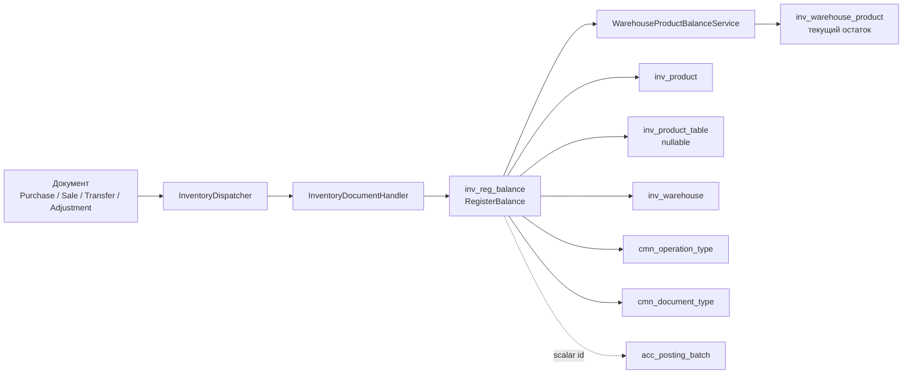
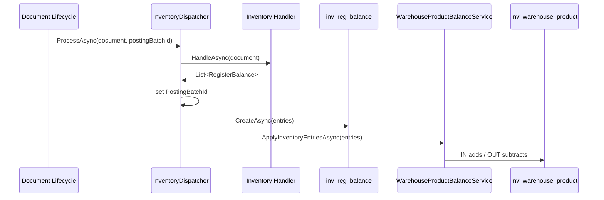
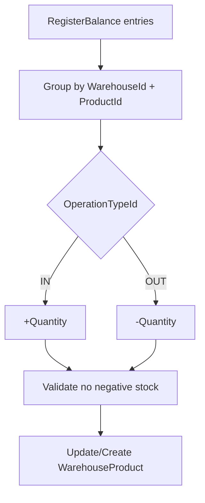
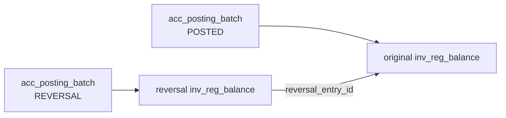
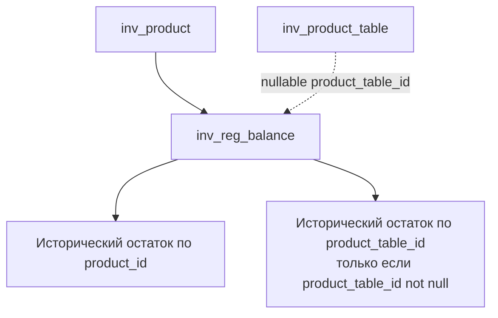
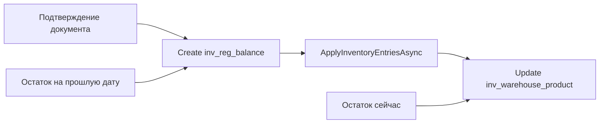

# Документация: `inv_reg_balance`

## Коротко

`inv_reg_balance` — это складской регистр движений товара. Он хранит не текущий остаток, а историю приходов/расходов по документам: какой документ, какой склад, какой товар, какая партия, сколько и на какую сумму изменил склад.

Текущий быстрый остаток живет отдельно в `inv_warehouse_product` (`WarehouseProduct`). После создания строк в `inv_reg_balance` код сразу применяет эти движения к `WarehouseProduct` через `IWarehouseProductBalanceService`.

Главная идея:

- `inv_reg_balance` отвечает на вопрос: **почему и когда изменился склад**.
- `inv_warehouse_product` отвечает на вопрос: **сколько сейчас доступно/зарезервировано/заблокировано**.
- `inv_product_table` отвечает на вопрос: **какая конкретная партия/единица товара где находится и в каком статусе**.

## Основная схема



## Таблица и entity

Entity: `RegisterBalance`

Файл:

- `src/Domain/Entities/Register/RegisterBalance.cs`

Таблица:

- `inv_reg_balance`

### Поля

| Поле | Тип в entity | Назначение |
|---|---:|---|
| `id` | `long` | Первичный ключ движения |
| `organization_id` | `int` | Организация, обязательный scope |
| `document_type_id` | `short` | Тип документа: purchase, sale, transfer, adjustment и т.д. |
| `document_id` | `long` | Id документа-источника |
| `warehouse_id` | `int` | Склад, на котором произошло движение |
| `product_id` | `int` | Товар/номенклатура |
| `product_table_id` | `int?` | Конкретная партия/единица из `inv_product_table`; может быть `null` для непоштучного учета |
| `operation_type_id` | `short` | Вид движения: приход или расход |
| `quantity` | `decimal(18,3)` | Количество движения |
| `amount` | `decimal(18,2)` | Стоимость движения |
| `doc_date` | `DateTime` | Дата документа/движения |
| `created_date` | `DateTime` | Когда запись регистра создана |
| `posting_batch_id` | `long?` | Связь с batch проведения/отмены |
| `source_line_id` | `long?` | Id строки документа-источника |
| `reversal_entry_id` | `long?` | Если это сторно, здесь id исходной строки регистра |

### Навигации

В entity есть навигации:

- `DocumentType`
- `OperationType`
- `Organization`
- `Product`
- `ProductTable`
- `Warehouse`

Важно: навигации на `PostingBatch` нет. `posting_batch_id` хранится как scalar-поле.

### Индексы

В `RegisterBalance` объявлены индексы:

- `idx_inv_reg_balance_doc_date`
- `idx_inv_reg_balance_document` по `document_type_id`, `document_id`
- `idx_inv_reg_balance_organization_id`
- `idx_inv_reg_balance_product_id`
- `idx_inv_reg_balance_product_table_id`
- `idx_inv_reg_balance_warehouse_id`
- `idx_inv_reg_balance_posting_batch_id`
- `idx_inv_reg_balance_reversal_entry_id`

Они хорошо совпадают с реальными запросами: по документу, товару, складу, дате, batch и сторно.

## OperationType

Константы находятся в:

- `src/SharedKernel/Constants/OperationTypeIdConst.cs`

Для `inv_reg_balance` реально используются:

| Const | Значение | Смысл в складском регистре |
|---|---:|---|
| `OperationTypeIdConst.IN` | `1` | Приход на склад |
| `OperationTypeIdConst.OUT` | `2` | Расход со склада |

Есть также `TRANSFER`, `DEBT_INCREASE`, `DEBT_DECREASE`, но складской пересклад сейчас не пишет `TRANSFER`. Перемещение склада записывается как две строки:

- `OUT` со склада-источника;
- `IN` на склад-получатель.

Это правильно для остатков, потому что каждый склад получает свое отдельное изменение.

## DocumentType

Регистр хранит `document_type_id + document_id`, а не прямой FK на каждую документную таблицу.

Основные используемые document type:

| Документ | Const | Что пишет в регистр |
|---|---|---|
| Покупка | `DocumentTypeIdConst.PURCHASE` | Приход товара |
| Продажа | `DocumentTypeIdConst.SALE` | Расход товара |
| Перемещение склада | `DocumentTypeIdConst.WAREHOUSETRANSFER` | Расход со склада-источника и приход на склад-получатель |
| Корректировка склада | `DocumentTypeIdConst.INVENTORYADJUSTMENT` | Приход или расход в зависимости от типа корректировки |

`InventoryCount` напрямую обычно не является источником строк движения. Он показывает движения через созданные `InventoryAdjustmentDoc`.

## Как создаются строки регистра

Центральный класс:

- `src/Application/Features/Register/InventoryRegisterBalances/Services/InventoryDispatcher.cs`

Интерфейс:

- `IInventoryDispatcher.ProcessAsync(object document, CancellationToken ct = default, long? postingBatchId = null)`

Порядок:

1. В lifecycle документа вызывается `InventoryDispatcher.ProcessAsync(...)`.
2. Dispatcher выбирает handler по типу документа.
3. Handler строит `List<RegisterBalance>`.
4. Если передан `postingBatchId`, dispatcher проставляет его во все строки.
5. Dispatcher сохраняет строки через `ICommandRepository<RegisterBalance>.CreateAsync(...)`.
6. Dispatcher сразу вызывает `WarehouseProductBalanceService.ApplyInventoryEntriesAsync(...)`.
7. `WarehouseProduct` обновляет текущий остаток.



## Какие документы пишут в `inv_reg_balance`

### Покупка

Handler:

- `src/Application/Features/Register/InventoryRegisterBalances/Services/Handlers/PurchaseInventoryHandler.cs`

Логика:

- Берет `PurchaseDoc.PurchaseDocProducts`.
- Пропускает услуги: `!line.Product.IsService`.
- Для каждой строки берет `line.PurchaseDocTables`.
- На каждую `PurchaseDocTable` создает одну строку `RegisterBalance`.

Что пишет:

| Поле | Значение |
|---|---|
| `DocumentTypeId` | `PURCHASE` |
| `DocumentId` | `purchase.Id` |
| `WarehouseId` | `purchase.WarehouseId` |
| `ProductId` | `line.ProductId` |
| `ProductTableId` | `table.ProductTableId` |
| `OperationTypeId` | `IN` |
| `Quantity` | `1` |
| `Amount` | `table.TotalAmount` |
| `DocDate` | `purchase.DocDate` |
| `SourceLineId` | `table.Id` |

Нюанс: покупка сейчас пишет движения только через `PurchaseDocTables`. Если для непоштучного товара не создаются `PurchaseDocTables`, то приход в `inv_reg_balance` не появится.

### Продажа

Handler:

- `src/Application/Features/Register/InventoryRegisterBalances/Services/Handlers/SaleInventoryHandler.cs`

Логика разделена по `Product.IsPieceTracked`.

Для поштучного товара:

- Берет `SaleDocProduct.SaleDocTables`.
- На каждую выбранную партию/единицу создает отдельную строку расхода.

Для непоштучного товара:

- Создает одну строку на `SaleDocProduct`.
- `ProductTableId = null`.
- `Quantity = line.Quantity`.

Что пишет для поштучного товара:

| Поле | Значение |
|---|---|
| `DocumentTypeId` | `SALE` |
| `WarehouseId` | `sale.WarehouseId` |
| `ProductId` | `line.ProductTable.ProductId` |
| `ProductTableId` | `line.ProductTableId` |
| `OperationTypeId` | `OUT` |
| `Quantity` | `1` |
| `Amount` | `line.CostPrice` |
| `SourceLineId` | `SaleDocTable.Id` |

Что пишет для непоштучного товара:

| Поле | Значение |
|---|---|
| `DocumentTypeId` | `SALE` |
| `ProductId` | `SaleDocProduct.ProductId` |
| `ProductTableId` | `null` |
| `OperationTypeId` | `OUT` |
| `Quantity` | `SaleDocProduct.Quantity` |
| `Amount` | `SaleDocProduct.CostPrice` |
| `SourceLineId` | `SaleDocProduct.Id` |

### Перемещение склада

Handler:

- `src/Application/Features/Register/InventoryRegisterBalances/Services/Handlers/WarehouseTransferInventoryHandler.cs`

На каждую `WarehouseTransferDocTable` создаются две строки:

1. `OUT` со склада-источника.
2. `IN` на склад-получатель.

| Строка | WarehouseId | OperationTypeId | Quantity | ProductTableId |
|---|---:|---|---:|---:|
| Расход | `SourceWarehouseId` | `OUT` | `1` | `table.ProductTableId` |
| Приход | `DestinationWarehouseId` | `IN` | `1` | `table.ProductTableId` |

`OperationTypeIdConst.TRANSFER` для регистра не используется.

### Корректировка склада

Handler:

- `src/Application/Features/Register/InventoryRegisterBalances/Services/Handlers/InventoryAdjustmentInventoryHandler.cs`

Тип движения зависит от `AdjustmentType`.

Положительные типы:

- `POSITIVE_ADJUSTMENT`
- `FOUND_STOCK`
- `CORRECTION`

Для них пишется `IN`.

Остальные типы пишутся как `OUT`.

На каждую `InventoryAdjustmentDocTable` создается строка:

| Поле | Значение |
|---|---|
| `DocumentTypeId` | `INVENTORYADJUSTMENT` |
| `DocumentId` | `document.Id` |
| `WarehouseId` | `document.WarehouseId` |
| `ProductId` | `line.ProductId` |
| `ProductTableId` | `table.ProductTableId` |
| `OperationTypeId` | `IN` или `OUT` |
| `Quantity` | `1` |
| `Amount` | `table.CostPrice` |
| `SourceLineId` | `table.Id` |

## Как `inv_reg_balance` влияет на `WarehouseProduct`

Сервис:

- `src/Infrastructure/Repositories/WarehouseProductBalanceService.cs`

Метод:

- `ApplyInventoryEntriesAsync(IReadOnlyCollection<RegisterBalance> entries, CancellationToken ct = default)`

Правила:

| OperationTypeId | Изменение `WarehouseProduct.Quantity` |
|---|---:|
| `IN` | `+Quantity` |
| `OUT` | `-Quantity` |

Сервис:

- группирует изменения по `WarehouseId + ProductId`;
- проверяет, что количество не отрицательное;
- проверяет, что остаток не уйдет ниже доступного;
- если `WarehouseProduct` еще нет, создает запись;
- обновляет `Quantity`, `ReservedQuantity`, `BlockedQuantity`.

Важно:

- `RegisterBalance` влияет только на `Quantity`.
- Резерв и снятие резерва выполняются отдельными методами `ReserveAsync` / `ReleaseReservedAsync`.
- Резерв не создает строки в `inv_reg_balance`.



## Связь с `acc_posting_batch`

`posting_batch_id` в `inv_reg_balance` связывает складские движения с batch проведения документа.

Типичный flow:

1. Lifecycle документа создает `PostingBatch`.
2. Создает бухгалтерские проводки в `acc_register_entry`.
3. Вызывает `InventoryDispatcher.ProcessAsync(document, postingBatchId)`.
4. Dispatcher записывает `posting_batch_id` в каждую строку `inv_reg_balance`.

При отмене документа создается новый reversal batch. Сторнирующие строки `inv_reg_balance` получают:

- `posting_batch_id = reversalBatchId`;
- `reversal_entry_id = id исходной строки inv_reg_balance`;
- противоположный `operation_type_id`.



## Как работает отмена движений

Отмена не удаляет старые строки. Она создает новые строки с обратным движением.

### Покупка

Исходная покупка создала `IN`.

Отмена создает `OUT`:

- тот же `OrganizationId`;
- тот же `DocumentTypeId`;
- тот же `DocumentId`;
- тот же `WarehouseId`;
- тот же `ProductId`;
- тот же `ProductTableId`;
- та же `Quantity`;
- та же `Amount`;
- `DocDate = DateTime.Now`;
- `PostingBatchId = reversalBatchId`;
- `ReversalEntryId = entry.Id`.

### Продажа

Исходная продажа создала `OUT`.

Отмена создает `IN`.

Перед отменой код проверяет количество ожидаемых строк:

- для поштучного товара ожидает количество `SaleDocTables`;
- для непоштучного товара ожидает одну строку на `SaleDocProduct`.

Если количество строк регистра не совпало, возвращается ошибка `MissingInventoryRegisterEntries`.

### Перемещение склада

Исходное перемещение создало две строки на партию:

- `OUT` со старого склада;
- `IN` на новый склад.

Отмена создает обратные строки:

- исходный `OUT` превращается в `IN`;
- исходный `IN` превращается в `OUT`.

Ожидаемое количество строк: `WarehouseTransferDocTables.Count * 2`.

### Корректировка склада

Исходная корректировка создала `IN` или `OUT`.

Отмена создает обратное движение:

- `OUT` превращается в `IN`;
- `IN` превращается в `OUT`.

## Кто читает `inv_reg_balance`

### Общий API регистра

Controller:

- `src/Presentation/WebApi/Controllers/Register/InventoryRegisterBalanceController.cs`

Routes:

- `GET /api/register/inventory-register-balances`
- `GET /api/register/inventory-register-balances/{id}`

Permissions:

- `InventoryRegBalanceView`
- `InventoryRegBalanceViewDetail`

Service:

- `src/Application/Features/Register/InventoryRegisterBalances/Services/InventoryRegisterBalanceService.cs`

`GetAllAsync` возвращает paged response.

Фильтр:

- `src/Application/Features/Register/InventoryRegisterBalances/Filters/InventoryRegisterBalanceListFilter.cs`

Доступные фильтры:

| Filter | Условие |
|---|---|
| `DocumentTypeId` | `x.DocumentTypeId == value` |
| `DocumentId` | `x.DocumentId == value` |
| `WarehouseId` | `x.WarehouseId == value` |
| `ProductId` | `x.ProductId == value` |
| `OperationTypeId` | `x.OperationTypeId == value` |
| `DateFrom` | `x.DocDate >= DateFrom` |
| `DateTo` | `x.DocDate <= DateTo` |

Criteria:

- `src/Application/Features/Register/InventoryRegisterBalances/Queries/InventoryRegisterBalanceCriteriaBuilders.cs`

### Movements внутри документов

Есть document-specific endpoints, которые показывают движения по конкретному документу.

| Endpoint | Что читает |
|---|---|
| `GET /api/warehouse-transfers/{id}/inventory-movements` | `RegisterBalance` по `WAREHOUSETRANSFER + documentId` |
| `GET /api/inventory-adjustments/{id}/inventory-movements` | `RegisterBalance` по `INVENTORYADJUSTMENT + documentId` |
| `GET /api/inventory-counts/{id}/inventory-movements` | Движения generated adjustment-документов |

Для `InventoryCount` важный нюанс:

- сам `InventoryCount` может искать свои batch по `DocumentTypeIdConst.INVENTORYCOUNT`;
- но inventory movements возвращает движения `InventoryAdjustment`, которые были созданы по результатам пересчета.

### Исторический расчет остатков

Сервис:

- `src/Application/Features/Inv/ProductStocks/Services/ProductStockCalculateService.cs`

Если дата `choosedDate` в прошлом, сервис не берет текущий `WarehouseProduct`, а считает остаток из `RegisterBalance`.

Логика:

- берет строки `RegisterBalance`;
- фильтрует по `OrganizationId`;
- фильтрует по `WarehouseId`, если передан;
- фильтрует по `ProductId`, если передан список;
- фильтрует по `Product.ProductGroupId`, если передана группа;
- берет только `DocDate <= choosedDate 23:59:59`;
- берет только `IN` и `OUT`;
- превращает:
  - `IN` в `+Quantity`;
  - `OUT` в `-Quantity`.

Для исторического результата:

- `Quantity = сумма движений`;
- `Available = Quantity`;
- `Reserved = 0`;
- `Blocked = 0`.

То есть прошлые даты показывают фактический остаток по движениям, но не восстанавливают исторический резерв/блокировку.

### Manuals/products по складу

В `ManualService.GetProductsAsync(...)` фильтр по складу использует наличие движений:

- `x.RegisterBalances.Any(a => a.WarehouseId == warehouseId)`

Это значит: товар попадает в manual select list по складу, если у него когда-либо было движение по этому складу. Это не обязательно означает, что товар сейчас есть на остатке.

## DTO и projection

DTO:

- `src/Application/Features/Register/InventoryRegisterBalances/DTOs/InventoryRegisterBalanceDtos.cs`

Projection:

- `src/Application/Features/Register/InventoryRegisterBalances/Projections/InventoryRegisterBalanceProjections.cs`

Важный нюанс:

- `InventoryRegisterBalanceBaseDto` содержит `PostingBatchId`, `SourceLineId`, `ReversalEntryId`.
- `InventoryRegisterBalanceDtoProjection` для `GetById` эти поля заполняет.
- `InventoryRegisterBalanceListDtoProjection` для списка эти поля сейчас не заполняет, хотя `InventoryRegisterBalanceListDto` наследуется от `InventoryRegisterBalanceDto`.

Если фронту нужны `postingBatchId`, `sourceLineId`, `reversalEntryId` в списке, надо добавить их в list projection.

## Organization scope

`RegisterBalance` является organization-scoped entity.

В `AppDbContext.OrganizationScope.cs` применяется:

- `ApplyScopedFilter<RegisterBalance>(modelBuilder);`

Это означает, что обычные запросы по регистру ограничиваются текущей организацией из user context.

## Связь с продуктами и партиями

`inv_reg_balance.product_id` всегда указывает на `inv_product`.

`inv_reg_balance.product_table_id` зависит от способа учета:

- для поштучного/партийного движения обычно заполнен;
- для непоштучной продажи может быть `null`;
- для исторических остатков по партиям учитываются только строки, где `ProductTableId.HasValue`.



## Чем отличается от `inv_product_table`

`inv_product_table` хранит состояние конкретной партии/единицы:

- где она сейчас находится;
- в каком статусе;
- какая себестоимость;
- из какой покупки пришла;
- выбрана ли в продаже/перемещении.

`inv_reg_balance` хранит факт движения:

- документ;
- дата;
- склад;
- товар;
- партия, если есть;
- приход или расход;
- количество;
- сумма.

Пример:

| Сущность | Смысл |
|---|---|
| `inv_product_table` | “Эта конкретная единица товара сейчас на складе A / зарезервирована / продана” |
| `inv_reg_balance` | “Документ X в дату Y сделал приход/расход этой единицы” |
| `inv_warehouse_product` | “По товару P на складе A сейчас 15 штук, из них 3 в резерве” |

## Чем отличается от `inv_warehouse_product`

`WarehouseProduct` — агрегированный быстрый остаток по `warehouse_id + product_id`.

Он нужен, чтобы не пересчитывать весь регистр при каждом открытии склада.

`RegisterBalance` — источник исторической правды по движениям.

Связь:



В `ProductStockCalculateService` это уже разделено:

- если `choosedDate == null`, сегодня или будущее — берется `WarehouseProduct` / текущие статусы `ProductTable`;
- если `choosedDate` в прошлом — считается из `RegisterBalance`.

## Важные несостыковки и места внимания

### 1. Покупка непоштучного товара может не попасть в регистр

`PurchaseInventoryHandler` строит строки только из `PurchaseDocTables`.

Если для `Product.IsPieceTracked = false` при покупке не создаются `PurchaseDocTables`, то:

- `inv_reg_balance` не получит `IN`;
- `WarehouseProduct` не увеличится через dispatcher;
- исторический остаток по такому товару будет неполным.

А вот продажа непоштучного товара уже поддерживается: она пишет одну строку `OUT` с `ProductTableId = null`.

### 2. `TRANSFER` operation type не используется

Для перемещения склада создаются `OUT + IN`.

Это не ошибка, но важно не ждать строку `OperationTypeIdConst.TRANSFER` в `inv_reg_balance`.

### 3. Регистр не хранит резерв

Резервирование влияет на `WarehouseProduct.ReservedQuantity`, но не пишет `RegisterBalance`.

Поэтому исторический расчет из регистра не восстановит, сколько было в резерве на прошлую дату.

### 4. List projection не возвращает batch/source/reversal

В list DTO эти поля есть через наследование, но projection их не заполняет.

Для полноценного аудита в списке стоит добавить:

- `PostingBatchId = x.PostingBatchId`;
- `SourceLineId = x.SourceLineId`;
- `ReversalEntryId = x.ReversalEntryId`.

### 5. `ManualService` по складу смотрит на факт движения, а не остаток

Если товар когда-то был на складе, но сейчас остаток ноль, он все равно может попасть в manual select list по складу.

Если нужен список “товары, которые сейчас есть на складе”, лучше смотреть `WarehouseProduct` или `ProductStockCalculateService`.

### 6. `posting_batch_id` без navigation

В `RegisterBalance` есть `PostingBatchId`, но нет navigation property на `PostingBatch`.

Это нормально для легкого регистра, но если понадобится include/query по статусу batch, придется делать отдельный запрос или добавить связь.

## Практические сценарии

### Проверить движения документа

Использовать:

- `document_type_id`;
- `document_id`;

Например:

- покупка: `DocumentTypeIdConst.PURCHASE + PurchaseDoc.Id`;
- продажа: `DocumentTypeIdConst.SALE + SaleDoc.Id`;
- перемещение: `DocumentTypeIdConst.WAREHOUSETRANSFER + WarehouseTransferDoc.Id`;
- корректировка: `DocumentTypeIdConst.INVENTORYADJUSTMENT + InventoryAdjustmentDoc.Id`.

### Проверить текущий остаток

Лучше использовать:

- `WarehouseProduct`;
- `ProductStockCalculateService`;
- product stock endpoints.

Не надо каждый раз суммировать `inv_reg_balance`, если нужна текущая картина.

### Проверить исторический остаток

Использовать `ProductStockCalculateService` с `choosedDate` в прошлом.

Он уже считает:

```text
IN  => +Quantity
OUT => -Quantity
```

### Проверить отмену

Искать строки:

- `reversal_entry_id IS NOT NULL`;
- `posting_batch_id = batch отмены`.

Исходная строка будет по `id = reversal_entry_id`.

## Общий вывод

`inv_reg_balance` сейчас устроен как нормальный журнал складских движений:

- документ создает движения через `InventoryDispatcher`;
- движения сохраняются в `inv_reg_balance`;
- сразу обновляется быстрый остаток `WarehouseProduct`;
- отмена не удаляет движения, а создает обратные;
- исторические остатки считаются из регистра;
- текущие остатки читаются из агрегированной таблицы.

Самое важное место для проверки в будущем — поддержка непоштучного прихода. Продажа уже умеет писать aggregate-строку с `ProductTableId = null`, а покупка пока зависит от наличия `PurchaseDocTables`.

