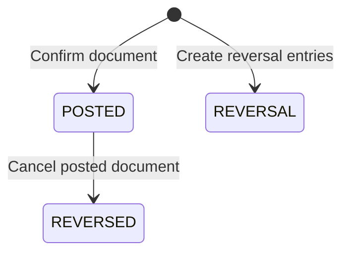
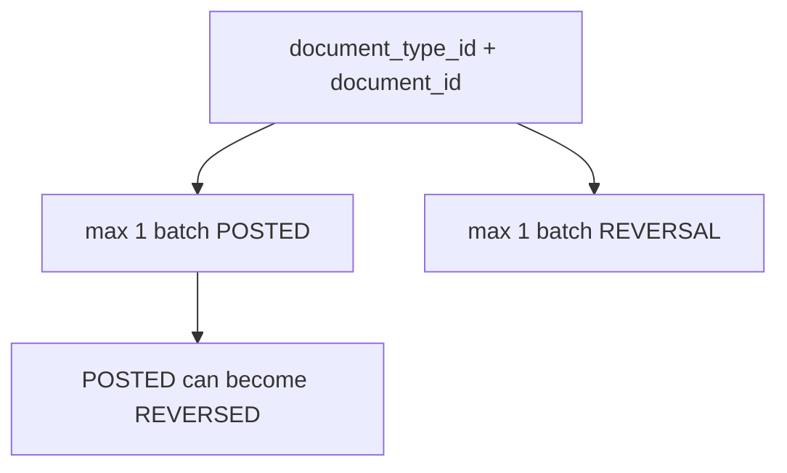
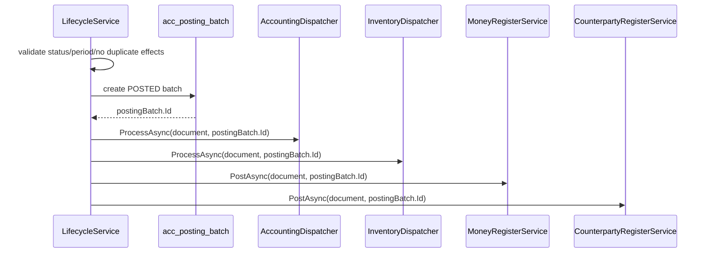
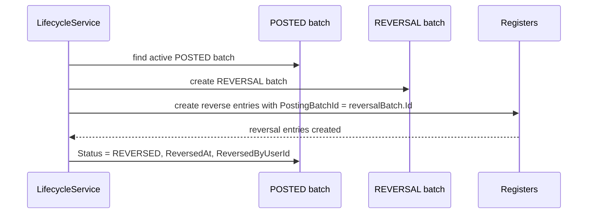
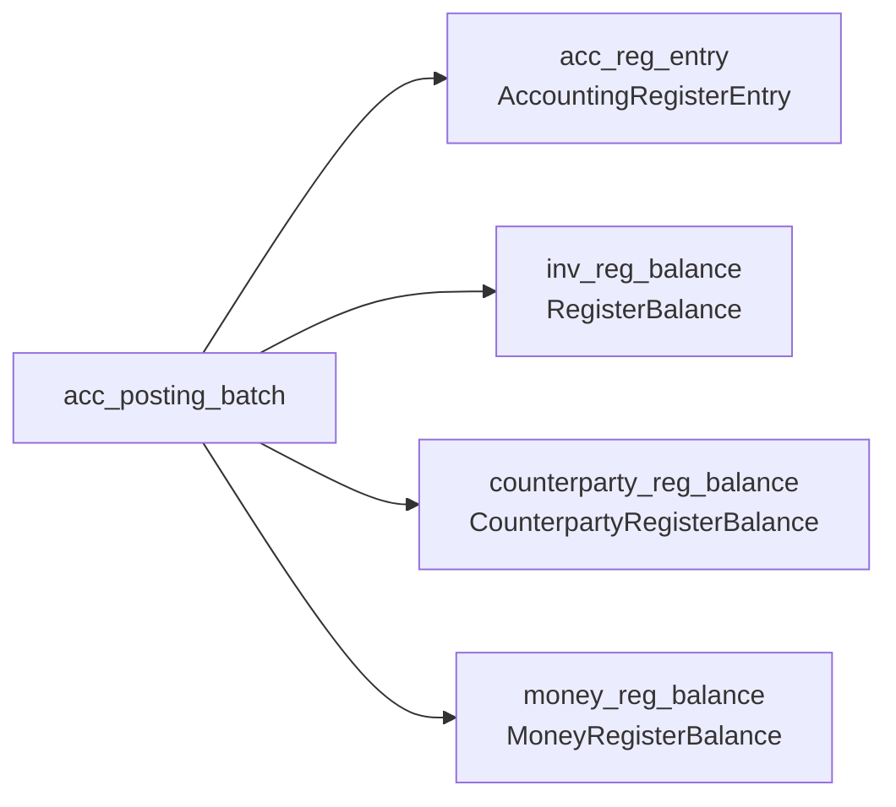
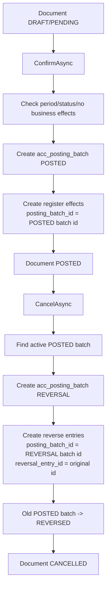

# Документация: `acc_posting_batch` и связь с сервисами

Дата анализа: 2026-07-14  
Область анализа: `PostingBatch`, lifecycle-сервисы подтверждения/отмены документов, бухгалтерский/складской/денежный/контрагентский регистры.

## 1. Что такое `acc_posting_batch`

`acc_posting_batch` — это “пачка проведения” документа.

Она не является самой проводкой. Она является **контейнером/маркером**, который связывает все эффекты одного проведения:

- бухгалтерские проводки `AccountingRegisterEntry`;
- складские движения `RegisterBalance`;
- денежные движения `MoneyRegisterBalance`;
- движения по контрагентам `CounterpartyRegisterBalance`;
- reversal-записи при отмене.

Проще:

> Один документ подтвердили → создали один `PostingBatch` со статусом `POSTED` → все созданные регистры получили `posting_batch_id`.

При отмене:

> Создали новый `PostingBatch` со статусом `REVERSAL` → все обратные записи получили его `posting_batch_id` → старый `POSTED` batch стал `REVERSED`.

## 2. Entity `PostingBatch`

Файл: `src/Domain/Entities/Acc/PostingBatch.cs`

Таблица: `acc_posting_batch`

| Поле | Тип в C# | Назначение |
|---|---:|---|
| `id` | `long` | PK пачки проведения. |
| `organization_id` | `int` | Организация. |
| `document_type_id` | `short` | Тип документа из `DocumentTypeIdConst`. |
| `document_id` | `long` | ID конкретного документа. |
| `status` | `string` | Статус batch: `POSTED`, `REVERSED`, `REVERSAL`. |
| `posted_by_user_id` | `int?` | Кто создал batch/провел документ. |
| `posted_at` | `DateTime` | Когда создан batch/проведение. |
| `reversed_by_user_id` | `int?` | Кто отменил активный posted batch. |
| `reversed_at` | `DateTime?` | Когда posted batch был переведен в `REVERSED`. |
| `comment` | `string?` | Комментарий: например `Sale confirmed`, `Sale cancelled`. |

## 3. Статусы batch

Файл: `src/SharedKernel/Constants/PostingBatchStatusConst.cs`

| Статус | Смысл |
|---|---|
| `POSTED` | Активное проведение документа. |
| `REVERSED` | Старое проведение, которое было отменено. |
| `REVERSAL` | Пачка обратных записей, созданных при отмене. |



Важно: `REVERSAL` — это новая пачка отмены, а `REVERSED` — это измененный статус старой активной пачки.

## 4. Уникальность и защита от дублей

В `AppDbContext` есть два filtered unique index:

Файл: `src/Infrastructure/Persistence/AppDbContext/AppDbContext.cs`

| Индекс | Поля | Filter | Что защищает |
|---|---|---|---|
| `ux_acc_posting_batch_document_posted` | `document_type_id`, `document_id` | `status = 'POSTED'` | У одного документа не может быть две активные posted-пачки. |
| `ux_acc_posting_batch_document_reversal` | `document_type_id`, `document_id` | `status = 'REVERSAL'` | У одного документа не может быть две reversal-пачки. |

Также для `PostingBatch` настроен optimistic concurrency через PostgreSQL `xmin`.



## 5. Как batch создается при confirm

Общий паттерн почти во всех lifecycle-сервисах:



Не каждый документ вызывает все регистры. Например:

- складское перемещение вызывает только inventory;
- валютная переоценка вызывает accounting;
- sale вызывает accounting + inventory + counterparty + money;
- purchase вызывает accounting + inventory + counterparty.

## 6. Как batch используется при cancel

При отмене уже проведенного документа:



Reversal-записи обычно:

- имеют `posting_batch_id = reversalBatch.Id`;
- имеют `reversal_entry_id = originalEntry.Id`;
- по суммам/направлению делают обратное движение.

## 7. Регистры, связанные с `acc_posting_batch`

У регистров связь с batch хранится через scalar поле `posting_batch_id`. В domain entity нет navigation property на `PostingBatch`.

| Регистр | Entity | Поле | Роль batch |
|---|---|---|---|
| Бухгалтерский регистр | `AccountingRegisterEntry` | `PostingBatchId` | Группирует проводки одного проведения/отмены. |
| Складской регистр | `RegisterBalance` | `PostingBatchId` | Группирует складские IN/OUT движения. |
| Контрагенты | `CounterpartyRegisterBalance` | `PostingBatchId` | Группирует дебиторку/кредиторку. |
| Деньги | `MoneyRegisterBalance` | `PostingBatchId` | Группирует денежные движения. |



## 8. Центральные диспетчеры

### `AccountingDispatcher`

Файл: `src/Application/Features/Register/AccountingRegisterEntries/Services/AccountingDispatcher.cs`

Что делает:

1. Получает любой документ.
2. Через `PostingContextDispatcher` строит `PostingContext`.
3. Через `PostingService.BuildEntriesAsync` создает `AccountingRegisterEntry`.
4. Если `postingBatchId` передан — записывает его во все entries.
5. Валидирует проводки.
6. Сохраняет проводки.

Ключевая связь:

```csharp
if (postingBatchId.HasValue)
{
    foreach (var entry in accountingEntries)
        entry.PostingBatchId = postingBatchId.Value;
}
```

### `InventoryDispatcher`

Файл: `src/Application/Features/Register/InventoryRegisterBalances/Services/InventoryDispatcher.cs`

Что делает:

1. По типу документа выбирает handler:
   - `PurchaseDoc`;
   - `SaleDoc`;
   - `WarehouseTransferDoc`;
   - `InventoryAdjustmentDoc`.
2. Handler создает список `RegisterBalance`.
3. Если `postingBatchId` передан — записывает его во все складские entries.
4. Сохраняет `RegisterBalance`.
5. Обновляет `WarehouseProduct` через `WarehouseProductBalanceService`.

## 9. Сервисы, которые создают `PostingBatch`

### Продажа

Файл: `src/Application/Features/Sale/SaleDocs/Services/SaleLifecycleService.cs`

Confirm:

- создает `POSTED` batch;
- передает `postingBatch.Id` в:
  - `AccountingDispatcher.ProcessAsync`;
  - `InventoryDispatcher.ProcessAsync`;
  - `SaleCounterpartyRegisterService.PostAsync`;
  - `SaleMoneyRegisterService.PostAsync`.

Cancel posted:

- находит active `POSTED` batch;
- создает `REVERSAL` batch;
- создает обратные записи:
  - accounting;
  - inventory;
  - counterparty;
  - money;
- переводит старый batch в `REVERSED`.

### Закупка

Файл: `src/Application/Features/Pur/PurchaseDocs/Services/PurchaseLifecycleService.cs`

Confirm:

- создает `POSTED` batch;
- передает batch в:
  - accounting;
  - inventory;
  - purchase counterparty register.

Cancel posted:

- создает `REVERSAL` batch;
- реверсит accounting, inventory, counterparty;
- старый batch переводит в `REVERSED`.

### Банк

Файл: `src/Application/Features/Bank/BankOperations/Services/BankLifecycleService.cs`

Confirm:

- создает `POSTED` batch;
- вызывает:
  - accounting;
  - bank money register;
  - bank counterparty register.

Cancel posted:

- создает `REVERSAL` batch;
- реверсит accounting, money, counterparty;
- старый batch переводит в `REVERSED`.

### Касса

Файл: `src/Application/Features/Cash/CashOperations/Services/CashLifecycleService.cs`

Confirm:

- создает `POSTED` batch;
- вызывает:
  - accounting;
  - cash money register;
  - cash counterparty register.

Cancel posted:

- создает `REVERSAL` batch;
- реверсит accounting, money, counterparty;
- старый batch переводит в `REVERSED`.

### Складское перемещение

Файл: `src/Application/Features/Inv/WarehouseTransfers/Services/WarehouseTransferLifecycleService.cs`

Confirm:

- создает `POSTED` batch;
- вызывает `InventoryDispatcher.ProcessAsync`;
- batch связывает две складские записи: OUT со склада-источника и IN на склад-получатель.

Cancel posted:

- создает `REVERSAL` batch;
- создает обратные складские движения;
- старый batch переводит в `REVERSED`.

### Корректировка склада

Файл: `src/Application/Features/Inv/InventoryAdjustments/Services/InventoryAdjustmentLifecycleService.cs`

Confirm:

- создает `POSTED` batch;
- вызывает `InventoryDispatcher.ProcessAsync`.

Cancel posted:

- создает `REVERSAL` batch;
- реверсит складской регистр;
- старый batch переводит в `REVERSED`.

### Инвентаризация

Файл: `src/Application/Features/Inv/InventoryCounts/Services/InventoryCountLifecycleService.cs`

Confirm:

- создает `POSTED` batch для самого документа инвентаризации;
- фактические складские изменения делаются через generated `InventoryAdjustmentDoc`;
- эти generated adjustment тоже имеют свои batches при confirm.

Cancel posted:

- создает `REVERSAL` batch для инвентаризации;
- отменяет связанные positive/negative adjustment docs;
- старый batch инвентаризации переводит в `REVERSED`.

### Валютная переоценка

Файл: `src/Application/Features/Cmn/CurrencyRevaluations/Services/CurrencyRevaluationService.cs`

Confirm:

- создает `POSTED` batch;
- вызывает accounting dispatcher.

Cancel posted:

- создает `REVERSAL` batch;
- создает обратные accounting entries;
- старый batch переводит в `REVERSED`.

### Основные средства

Batch используют lifecycle-сервисы:

| Сервис | Документ |
|---|---|
| `FaReceiptLifecycleService` | Поступление ОС |
| `FaDepreciationRunService` | Амортизация ОС |
| `FaDisposalLifecycleService` | Выбытие ОС |
| `FaRevaluationLifecycleService` | Переоценка ОС |

Общий паттерн такой же:

- confirm → `POSTED` batch → accounting dispatcher;
- cancel → `REVERSAL` batch → обратные accounting entries → старый batch `REVERSED`.

## 10. Кто читает `PostingBatch`

### Lifecycle-сервисы

Все lifecycle-сервисы перед confirm/cancel ищут active posted batch:

```csharp
x.DocumentTypeId == ...
x.DocumentId == ...
x.Status == PostingBatchStatusConst.POSTED
```

Зачем:

- если документ уже `POSTED`, но batch есть — операция confirm считается idempotent и возвращает success;
- если документ `POSTED`, но batch не найден — возвращается ошибка `MissingPostingBatch`;
- при cancel posted нужен active batch, чтобы перевести его в `REVERSED`.

### API просмотра batches

Методы `GetPostingBatchesAsync` есть для:

| Документ | Controller | Service |
|---|---|---|
| WarehouseTransfer | `WarehouseTransferController` | `WarehouseTransferService` |
| InventoryAdjustment | `InventoryAdjustmentController` | `InventoryAdjustmentService` |
| InventoryCount | `InventoryCountController` | `InventoryCountService` |

Они возвращают batches по `document_type_id + document_id`.

### Закрытие бухгалтерского периода

Файл: `src/Infrastructure/Repositories/AccountingPeriodReadRepository.cs`

Перед закрытием периода проверяется:

1. Нет неизвестных статусов batch.
2. Нет больше одного `POSTED` batch на один документ.

Если нарушено — `AccountingPeriodService` возвращает ошибку `InvalidPostingBatchState`.

## 11. Типовой lifecycle документа



## 12. Почему batch важен

`acc_posting_batch` решает сразу несколько задач:

1. **Группировка эффектов** — все проводки/движения одного проведения имеют общий `posting_batch_id`.
2. **Идемпотентность confirm** — можно понять, что документ уже проведен.
3. **Защита от дублей** — unique index не дает создать две active posted пачки на один документ.
4. **Отмена** — reversal batch отделяет обратные записи от оригинальных.
5. **Аудит** — видно кто и когда провел/отменил документ.
6. **Контроль периода** — закрытие периода проверяет корректность batch-состояний.

## 13. Важные наблюдения

### 13.1. В регистровых entity нет navigation на `PostingBatch`

`AccountingRegisterEntry`, `RegisterBalance`, `CounterpartyRegisterBalance`, `MoneyRegisterBalance` имеют `PostingBatchId`, но нет navigation property `PostingBatch`.

Это нормально, если связь используется как audit/reference id. Но если фронту часто нужно показывать batch metadata рядом с register entries, придется делать join/projection вручную.

### 13.2. Batch создается до эффектов

Lifecycle сначала создает `PostingBatch`, потом вызывает dispatchers. Если один из следующих шагов падает, транзакция lifecycle должна откатить batch вместе с эффектами. Поэтому важно, что confirm/cancel выполняются внутри transaction wrapper.

### 13.3. `REVERSAL` batch не переводится в `REVERSED`

Обычно `REVERSED` ставится старому `POSTED` batch. `REVERSAL` остается отдельной пачкой обратных записей.

### 13.4. Для некоторых документов есть API просмотра batches, для других — нет

На момент анализа `GetPostingBatchesAsync` явно есть у складского перемещения, корректировки и инвентаризации. Для purchase/sale/bank/cash аналогичный публичный метод в найденных controller/service участках не виден.

### 13.5. `InventoryCount` имеет batch, но фактические складские движения идут через adjustment

Инвентаризация создает свой `POSTED`/`REVERSAL` batch как документ контроля, но реальные движения склада формируются в сгенерированных `InventoryAdjustmentDoc`, у которых есть свои batches.

## 14. Короткая формула

Если совсем коротко:

```text
Document confirm
  -> acc_posting_batch(status = POSTED)
  -> register rows(posting_batch_id = postedBatch.Id)

Document cancel
  -> acc_posting_batch(status = REVERSAL)
  -> reverse register rows(posting_batch_id = reversalBatch.Id, reversal_entry_id = original.Id)
  -> old POSTED batch status = REVERSED
```

