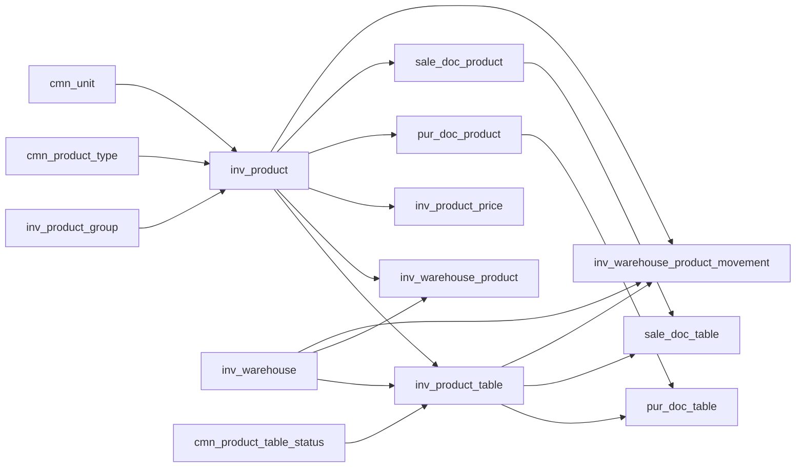

# Отчет: связи `Product` и `inv_product_table` в `Domain.Entities`

Дата анализа: 2026-07-14  
Область анализа: только `src/Domain/Entities/**/*.cs`  
Не анализировались: сервисы, контроллеры, миграции, SQL seed/insert, `AppDbContext` Fluent-конфигурации, DTO, репозитории.

## 1. Короткая модель

В доменной модели есть два разных уровня товара:

| Уровень | Таблица | Entity | Смысл |
|---|---|---|---|
| Номенклатура | `inv_product` | `Product` | Карточка товара/услуги: название, единица, тип, признак услуги, признак поштучного учета, НДС, группа, состояние. |
| Конкретная партия/единица | `inv_product_table` | `ProductTable` | Конкретный складской экземпляр/партия, привязанная к `Product`: текущий склад, статус, серийный номер, маркировка. |
| Агрегированный остаток | `inv_warehouse_product` | `WarehouseProduct` | Остаток по паре `Warehouse + Product`: quantity/reserved/blocked/available. |
| Цена | `inv_product_price` | `ProductPrice` | Цена товара по типу цены, валюте, единице и периоду действия. |

Главная идея:

## 2. `inv_product` / `Product`

Источник: `src/Domain/Entities/Inv/Product.cs`

### Назначение

`Product` — основная карточка номенклатуры. В ней хранится то, что относится к виду товара/услуги, а не к конкретной складской единице.

### Ключевые поля

| Поле | Назначение |
|---|---|
| `id` | PK товара. |
| `organization_id` | Организация-владелец товара. |
| `product_group_id` | Группа товара, nullable. |
| `unit_id` | Основная единица измерения. |
| `barcode` | Штрихкод. |
| `name` | Название. |
| `description` | Описание. |
| `is_service` | Признак услуги. |
| `is_piece_tracked` | Признак поштучного/партионного учета через `inv_product_table`. |
| `state_id` | Состояние записи. |
| `mxik` | МХИК. |
| `product_type_id` | Тип товара/услуги. |
| `is_sold` | Можно продавать. |
| `is_purchased` | Можно покупать. |
| `article` | Артикул. |
| `default_vat_rate_id` | НДС по умолчанию, nullable. В entity нет navigation на `VatRate`. |
| `code` | Код. |
| `sku` | SKU. |
| `min_stock` | Минимальный остаток. |

### Прямые связи `Product`

| Связь | Таблица/Entity | Тип | Роль |
|---|---|---|---|
| `Product.OrganizationId` | `org_organization` / `Organization` | many-to-one | Организация-владелец номенклатуры. |
| `Product.ProductGroupId` | `inv_product_group` / `ProductGroup` | optional many-to-one | Иерархическая/логическая группа товара. |
| `Product.ProductTypeId` | `cmn_product_type` / `ProductType` | many-to-one | Тип товара/услуги для классификации. |
| `Product.UnitId` | `cmn_unit` / `Unit` | many-to-one | Базовая единица измерения. |
| `Product.StateId` | `cmn_state` / `State` | many-to-one | Активность/состояние записи. |
| `Product.ProductPrices` | `inv_product_price` / `ProductPrice` | one-to-many | Цены товара. |
| `Product.ProductTables` | `inv_product_table` / `ProductTable` | one-to-many | Конкретные складские единицы/партии товара. |
| `Product.PurchaseDocProducts` | `pur_doc_product` / `PurchaseDocProduct` | one-to-many | Строки документов закупки по этому товару. |
| `Product.SaleDocProducts` | `sale_doc_product` / `SaleDocProduct` | one-to-many | Строки документов продажи по этому товару. |
| `Product.WarehouseProductMovements` | `inv_warehouse_product_movement` / `WarehouseProductMovement` | one-to-many | Движения складского журнала по товару. |
| `Product.WarehouseProducts` | `inv_warehouse_product` / `WarehouseProduct` | one-to-many | Агрегированные остатки товара по складам. |

### Важное по модели

- `is_service` находится прямо в `Product`.
- `product_type_id` тоже ведет к `ProductType`, где есть `IsService`; получается два места, которые могут описывать услугу. В `Domain.Entities` нет ограничения, которое заставляет `Product.IsService` и `Product.ProductType.IsService` совпадать.
- `is_piece_tracked` логически показывает, нужен ли учет через `ProductTable`, но в `Domain.Entities` нет check-constraint, который запрещает/требует строки `inv_product_table` по этому признаку.
- `default_vat_rate_id` — просто scalar поле; navigation на `VatRate` в `Product` отсутствует.

## 3. `inv_product_table` / `ProductTable`

Источник: `src/Domain/Entities/Inv/ProductTable.cs`

### Назначение

`ProductTable` — конкретная складская единица/партия товара. Это не карточка товара, а экземпляр учета. Через нее документы связываются с конкретными поступившими/проданными/перемещенными единицами.

### Ключевые поля

| Поле | Назначение |
|---|---|
| `id` | PK складской единицы/партии. |
| `product_id` | Ссылка на номенклатуру `inv_product`. |
| `organization_id` | Организация-владелец записи. |
| `current_warehouse_id` | Текущий склад, nullable. |
| `serial_number` | Серийный номер. |
| `marking_number` | Маркировка. |
| `status_id` | Статус складской единицы. |
| `state_id` | Состояние записи. |
| `created_date` | Дата создания. |

### Индексы, объявленные прямо в entity

| Индекс | Поля | Назначение |
|---|---|---|
| `ix_inv_product_table_status_id` | `status_id` | Быстрый поиск по статусу партии. |
| `idx_inv_product_table_current_warehouse_id` | `current_warehouse_id` | Быстрый поиск по текущему складу. |
| `idx_inv_product_table_org_warehouse_status` | `organization_id`, `current_warehouse_id`, `status_id` | Поиск партий организации на складе по статусу. |
| `idx_inv_product_table_org_warehouse_status_product` | `organization_id`, `current_warehouse_id`, `status_id`, `product_id` | Поиск партий конкретного товара на складе по статусу. |

### Прямые связи `ProductTable`

| Связь | Таблица/Entity | Тип | Роль |
|---|---|---|---|
| `ProductTable.ProductId` | `inv_product` / `Product` | many-to-one | Какая номенклатура у этой складской единицы. |
| `ProductTable.OrganizationId` | `org_organization` / `Organization` | many-to-one | Организация-владелец партии. |
| `ProductTable.CurrentWarehouseId` | `inv_warehouse` / `Warehouse` | optional many-to-one | Где сейчас находится партия/единица. |
| `ProductTable.StatusId` | `cmn_product_table_status` / `ProductTableStatus` | many-to-one | Складской статус: в наличии, резерв, продано и т.д. |
| `ProductTable.StateId` | `cmn_state` / `State` | many-to-one | Активность записи. |
| `ProductTable.PurchaseDocTables` | `pur_doc_table` / `PurchaseDocTable` | one-to-many | В каких строках прихода участвовала партия. |
| `ProductTable.SaleDocTables` | `sale_doc_table` / `SaleDocTable` | one-to-many | В каких строках продажи участвовала партия. |
| `ProductTable.FaAssets` | `fa_asset` / `FaAsset` | one-to-many | Основные средства, созданные/связанные с этой складской единицей. |

### Дополнительные FK на `ProductTable`, но без inverse-collection в `ProductTable`

Эти entity имеют FK на `ProductTable`, но сам `ProductTable` не содержит коллекции навигации на них:

| Таблица | Entity | FK | Роль |
|---|---|---|---|
| `inv_warehouse_product_movement` | `WarehouseProductMovement` | `product_table_id` nullable | Движение складского регистра может быть связано с конкретной партией. |
| `inv_transfer_doc_table` | `WarehouseTransferDocTable` | `product_table_id` | Перемещаемая конкретная складская единица. |
| `inv_inventory_adjustment_doc_table` | `InventoryAdjustmentDocTable` | `product_table_id` nullable | Корректируемая или создаваемая складская единица. |
| `inv_inventory_count_doc_table` | `InventoryCountDocTable` | `product_table_id` nullable | Посчитанная/найденная складская единица при инвентаризации. |

### Важное по модели

- `ProductTable` хранит `OrganizationId` отдельно от `Product.OrganizationId`. В `Domain.Entities` нет явного ограничения, что они обязаны совпадать.
- `ProductTable.CurrentWarehouseId` nullable: партия может существовать без текущего склада.
- `ProductTable` не содержит количества. Количество для одной строки `ProductTable` логически равно одной единице/одной партии в документах, где doc-table строки обычно имеют `quantity` на уровне owner-line.
- Статус вынесен в `cmn_product_table_status`.

## 4. Справочники товара

### `inv_product_group` / `ProductGroup`

Источник: `src/Domain/Entities/Inv/ProductGroup.cs`

Роль: группировка товаров внутри организации.

| Связь | Роль |
|---|---|
| `Product.ProductGroupId -> ProductGroup.Id` | Товар может принадлежать группе. |
| `ProductGroup.OrganizationId -> Organization.Id` | Группа принадлежит организации. |
| `ProductGroup.StateId -> State.Id` | Состояние группы. |
| `ProductGroup.ParentId` | Scalar parent id; navigation на parent в entity не описана. |
| `ProductGroup.Products` | Обратная коллекция товаров группы. |

### `cmn_product_type` / `ProductType`

Источник: `src/Domain/Entities/Cmn/ProductType.cs`

Роль: тип товара/услуги.

| Поле/связь | Роль |
|---|---|
| `ProductType.Id` | Используется в `Product.ProductTypeId`. |
| `ProductType.Code` | Код типа. |
| `ProductType.Name` | Название типа. |
| `ProductType.IsService` | Признак, что тип относится к услугам. |
| `ProductType.ProductTypeTranslations` | Переводы типа. |
| `ProductType.Products` | Все товары этого типа. |

### `cmn_product_table_status` / `ProductTableStatus`

Источник: `src/Domain/Entities/Cmn/ProductTableStatus.cs`

Роль: справочник статусов `ProductTable`.

| Связь | Роль |
|---|---|
| `ProductTable.StatusId -> ProductTableStatus.Id` | Статус конкретной партии/единицы. |
| `ProductTableStatus.ProductsTables` | Обратная коллекция партий со статусом. |
| `ProductTableStatus.StateId -> State.Id` | Активность/состояние статуса. |

### `cmn_product_price_type` / `ProductPriceType`

Источник: `src/Domain/Entities/Cmn/ProductPriceType.cs`

Роль: тип цены товара.

| Связь | Роль |
|---|---|
| `ProductPrice.PriceTypeId -> ProductPriceType.Id` | Классифицирует цену: например себестоимость/цена продажи. |
| `ProductPriceType.ProductPrices` | Все цены этого типа. |

## 5. Остатки и цены

### `inv_warehouse_product` / `WarehouseProduct`

Источник: `src/Domain/Entities/Inv/WarehouseProduct.cs`

Роль: текущий агрегированный остаток товара на складе.

| Поле | Роль |
|---|---|
| `warehouse_id` | Часть composite PK, ссылка на склад. |
| `product_id` | Часть composite PK, ссылка на товар. |
| `unit_id` | Единица остатка. |
| `quantity` | Общее количество. |
| `reserved_quantity` | Зарезервировано. |
| `blocked_quantity` | Заблокировано. |
| `available_quantity` | Доступно. |
| `min_quantity` | Минимальный остаток на складе. |

Связи:

| Связь | Роль |
|---|---|
| `WarehouseProduct.ProductId -> Product.Id` | Остаток какого товара. |
| `WarehouseProduct.WarehouseId -> Warehouse.Id` | На каком складе. |
| `WarehouseProduct.UnitId -> Unit.Id` | В какой единице измерения. |

Особенность:

- В `WarehouseProduct` нет `OrganizationId`. Организация выводится косвенно через `Warehouse` и/или `Product`.
- Эта таблица не знает конкретные `ProductTable`; это только сумма по товару и складу.

### `inv_product_price` / `ProductPrice`

Источник: `src/Domain/Entities/Inv/ProductPrice.cs`

Роль: цена товара с типом, валютой, единицей и периодом действия.

| Поле | Роль |
|---|---|
| `organization_id` | Организация цены. |
| `product_id` | Товар. |
| `currency_id` | Валюта цены. |
| `price_type_id` | Тип цены. |
| `unit_id` | Единица цены. |
| `price` | Значение цены. |
| `start_date`, `end_date` | Период действия. |
| `state_id` | Состояние. |

Связи:

| Связь | Роль |
|---|---|
| `ProductPrice.ProductId -> Product.Id` | Цена конкретного товара. |
| `ProductPrice.OrganizationId -> Organization.Id` | Цена внутри организации. |
| `ProductPrice.CurrencyId -> Currency.Id` | Валюта цены. |
| `ProductPrice.PriceTypeId -> ProductPriceType.Id` | Тип цены. |
| `ProductPrice.UnitId -> Unit.Id` | Единица измерения цены. |
| `ProductPrice.StateId -> State.Id` | Активность цены. |

## 6. Приход товаров

### `pur_doc` / `PurchaseDoc`

Источник: `src/Domain/Entities/Pur/PurchaseDoc.cs`

Роль: шапка документа закупки.

Связи с продуктовой моделью косвенные:

| Связь | Роль |
|---|---|
| `PurchaseDoc.WarehouseId -> Warehouse.Id` | На какой склад приходит товар. |
| `PurchaseDoc.PurchaseDocProducts` | Строки закупки по товарам. |
| `PurchaseDoc.CurrencyId -> Currency.Id` | Валюта документа. |
| `PurchaseDoc.SupplierAccountId -> ChartAccount.Id` | Счет поставщика для проводок, не товарная связь напрямую. |

### `pur_doc_product` / `PurchaseDocProduct`

Источник: `src/Domain/Entities/Pur/PurchaseDocProduct.cs`

Роль: агрегированная строка прихода по товару.

| Поле/связь | Роль |
|---|---|
| `owner_id -> pur_doc.id` | Какому документу принадлежит строка. |
| `product_id -> inv_product.id` | Какой товар покупается. |
| `quantity` | Количество по строке. |
| `unit_id -> cmn_unit.id` | Единица. |
| `unit_price`, `amount`, `vat_amount`, `total_amount` | Стоимостные поля строки. |
| `vat_rate_id -> cmn_vat_rate.id` | НДС по строке. |
| `debit_account_id`, `vat_account_id` | Счета учета/НДС для проводок, не FK на продукт. |
| `PurchaseDocTables` | Конкретные партии/единицы этой строки прихода. |

### `pur_doc_table` / `PurchaseDocTable`

Источник: `src/Domain/Entities/Pur/PurchaseDocTable.cs`

Роль: связь строки прихода с конкретной `ProductTable`.

| Поле/связь | Роль |
|---|---|
| `owner_id -> pur_doc_product.id` | К какой товарной строке прихода относится партия. |
| `product_table_id -> inv_product_table.id` | Какая конкретная складская единица/партия пришла. |
| `amount`, `vat_amount`, `total_amount` | Стоимость конкретной партии/единицы. |
| `vat_rate_id -> cmn_vat_rate.id` | НДС по конкретной партии/единице. |

Индекс:

| Индекс | Роль |
|---|---|
| `ux_pur_doc_table_owner_id_product_table_id` | В одной строке прихода один `ProductTable` не может повториться. |

## 7. Продажа товаров

### `sale_doc` / `SaleDoc`

Источник: `src/Domain/Entities/Sale/SaleDoc.cs`

Роль: шапка документа продажи.

Связи с продуктовой моделью косвенные:

| Связь | Роль |
|---|---|
| `SaleDoc.WarehouseId -> Warehouse.Id` | С какого склада продается товар. |
| `SaleDoc.SaleDocProducts` | Строки продажи по товарам. |
| `SaleDoc.CurrencyId -> Currency.Id` | Валюта документа. |
| `CustomerAccountId`, `VatAccountId` | Счета для проводок, не FK на продукт. |

### `sale_doc_product` / `SaleDocProduct`

Источник: `src/Domain/Entities/Sale/SaleDocProduct.cs`

Роль: агрегированная строка продажи по товару.

| Поле/связь | Роль |
|---|---|
| `owner_id -> sale_doc.id` | Какому документу принадлежит строка. |
| `product_id -> inv_product.id` | Какой товар продается. |
| `quantity` | Количество по строке. |
| `unit_id -> cmn_unit.id` | Единица. |
| `unit_price` | Цена продажи единицы. |
| `cost_price` | Себестоимость строки. |
| `amount`, `vat_amount`, `total_amount` | Суммы продажи. |
| `vat_rate_id -> cmn_vat_rate.id` | НДС по строке. |
| `inventory_account_id`, `income_account_id`, `cost_account_id` | Счета учета/дохода/себестоимости, не FK на продукт. |
| `SaleDocTables` | Конкретные партии/единицы, выбранные для продажи. |

### `sale_doc_table` / `SaleDocTable`

Источник: `src/Domain/Entities/Sale/SaleDocTable.cs`

Роль: связь строки продажи с конкретной `ProductTable`.

| Поле/связь | Роль |
|---|---|
| `owner_id -> sale_doc_product.id` | К какой товарной строке продажи относится партия. |
| `product_table_id -> inv_product_table.id` | Какая конкретная складская единица/партия продается. |
| `amount`, `vat_amount`, `total_amount` | Суммы продажи по конкретной партии/единице. |
| `cost_price` | Себестоимость конкретной партии/единицы. |
| `vat_rate_id -> cmn_vat_rate.id` | НДС по конкретной партии/единице. |

## 8. Складское перемещение

### `inv_transfer_doc` / `WarehouseTransferDoc`

Источник: `src/Domain/Entities/Inv/WarehouseTransferDoc.cs`

Роль: шапка документа перемещения между складами.

| Связь | Роль |
|---|---|
| `source_warehouse_id -> inv_warehouse.id` | Склад-источник. |
| `destination_warehouse_id -> inv_warehouse.id` | Склад-получатель. |
| `WarehouseTransferLines` | Строки перемещения по товарам. |

### `inv_transfer_line` / `WarehouseTransferLine`

Источник: `src/Domain/Entities/Inv/WarehouseTransferLine.cs`

Роль: агрегированная строка перемещения по товару.

| Поле/связь | Роль |
|---|---|
| `owner_id -> inv_transfer_doc.id` | Документ перемещения. |
| `product_id -> inv_product.id` | Какой товар перемещается. |
| `unit_id -> cmn_unit.id` | Единица измерения. |
| `quantity` | Количество по строке. |
| `WarehouseTransferDocTables` | Конкретные `ProductTable`, которые перемещаются. |

### `inv_transfer_doc_table` / `WarehouseTransferDocTable`

Источник: `src/Domain/Entities/Inv/WarehouseTransferDocTable.cs`

Роль: конкретная партия/единица в перемещении.

| Поле/связь | Роль |
|---|---|
| `owner_id -> inv_transfer_line.id` | Строка перемещения. |
| `product_table_id -> inv_product_table.id` | Какая складская единица перемещается. |
| `source_warehouse_id` | Склад-источник на уровне строки партии. |
| `destination_warehouse_id` | Склад-получатель на уровне строки партии. |
| `cost_price` | Себестоимость перемещаемой единицы. |

Индекс:

| Индекс | Роль |
|---|---|
| `ux_inv_transfer_doc_table_owner_product_table` | В одной строке перемещения один `ProductTable` не может повториться. |

## 9. Корректировка склада

### `inv_inventory_adjustment_doc` / `InventoryAdjustmentDoc`

Источник: `src/Domain/Entities/Inv/InventoryAdjustmentDoc.cs`

Роль: шапка корректировки склада.

| Поле/связь | Роль |
|---|---|
| `warehouse_id -> inv_warehouse.id` | Склад корректировки. |
| `adjustment_type` | Тип корректировки строкой: приход/списание/потеря/повреждение и т.п. |
| `InventoryAdjustmentLines` | Строки корректировки по товарам. |

### `inv_inventory_adjustment_line` / `InventoryAdjustmentLine`

Источник: `src/Domain/Entities/Inv/InventoryAdjustmentLine.cs`

Роль: агрегированная строка корректировки по товару.

| Поле/связь | Роль |
|---|---|
| `owner_id -> inv_inventory_adjustment_doc.id` | Документ корректировки. |
| `product_id -> inv_product.id` | Какой товар корректируется. |
| `unit_id -> cmn_unit.id` | Единица. |
| `quantity` | Количество корректировки. |
| `InventoryAdjustmentDocTables` | Конкретные партии/единицы корректировки. |

### `inv_inventory_adjustment_doc_table` / `InventoryAdjustmentDocTable`

Источник: `src/Domain/Entities/Inv/InventoryAdjustmentDocTable.cs`

Роль: конкретная партия/единица в корректировке.

| Поле/связь | Роль |
|---|---|
| `owner_id -> inv_inventory_adjustment_line.id` | Строка корректировки. |
| `product_table_id -> inv_product_table.id`, nullable | Существующая партия или отсутствующая ссылка для создаваемой/найденной партии. |
| `cost_price` | Себестоимость партии/единицы. |
| `original_status_id` | Старый статус до корректировки. |
| `original_state_id` | Старое состояние до корректировки. |
| `original_warehouse_id` | Старый склад до корректировки. |
| `was_created` | Признак, что партия была создана в рамках корректировки. |

Особенность:

- `product_table_id` nullable. Это отличается от прихода/продажи/перемещения и показывает, что корректировка может работать не только с уже существующей `ProductTable`, но и с будущей/создаваемой записью.

## 10. Инвентаризация

### `inv_inventory_count_doc` / `InventoryCountDoc`

Источник: `src/Domain/Entities/Inv/InventoryCountDoc.cs`

Роль: шапка инвентаризации склада.

| Поле/связь | Роль |
|---|---|
| `warehouse_id -> inv_warehouse.id` | Склад инвентаризации. |
| `positive_adjustment_doc_id -> inv_inventory_adjustment_doc.id` | Документ положительной корректировки по результатам инвентаризации. |
| `negative_adjustment_doc_id -> inv_inventory_adjustment_doc.id` | Документ отрицательной корректировки по результатам инвентаризации. |
| `InventoryCountLines` | Строки подсчета по товарам. |

### `inv_inventory_count_line` / `InventoryCountLine`

Источник: `src/Domain/Entities/Inv/InventoryCountLine.cs`

Роль: строка подсчета по товару.

| Поле/связь | Роль |
|---|---|
| `owner_id -> inv_inventory_count_doc.id` | Документ инвентаризации. |
| `product_id -> inv_product.id` | Какой товар считали. |
| `unit_id -> cmn_unit.id` | Единица. |
| `counted_quantity` | Фактически посчитанное количество. |
| `default_cost_price` | Себестоимость по умолчанию для найденных позиций. |
| `InventoryCountDocTables` | Детализация по конкретным `ProductTable` или найденным позициям. |

### `inv_inventory_count_doc_table` / `InventoryCountDocTable`

Источник: `src/Domain/Entities/Inv/InventoryCountDocTable.cs`

Роль: конкретная посчитанная/найденная единица при инвентаризации.

| Поле/связь | Роль |
|---|---|
| `owner_id -> inv_inventory_count_line.id` | Строка инвентаризации. |
| `product_table_id -> inv_product_table.id`, nullable | Существующая партия или новая/неидентифицированная позиция. |
| `barcode` | Штрихкод найденной позиции. |
| `serial_number` | Серийный номер найденной позиции. |
| `marking_number` | Маркировка найденной позиции. |
| `cost_price` | Себестоимость найденной/посчитанной позиции. |

Особенность:

- `product_table_id` nullable, потому что при инвентаризации можно зафиксировать найденный товар, которого еще нет как `ProductTable`.
- Есть уникальный индекс `(owner_id, product_table_id)` внутри строки инвентаризации.

## 11. Складской регистр

### `inv_warehouse_product_movement` / `WarehouseProductMovement`

Источник: `src/Domain/Entities/Inv/WarehouseProductMovement.cs`

Роль: журнал/регистр складских движений.

| Поле/связь | Роль |
|---|---|
| `organization_id -> org_organization.id` | Организация движения. |
| `document_type_id -> cmn_document_type.id` | Тип документа-источника. |
| `document_id` | ID документа-источника. |
| `document_line_id` | Строка документа-источника, если движение агрегировано по строке. |
| `warehouse_id -> inv_warehouse.id` | Склад движения. |
| `product_id -> inv_product.id` | Товар движения. |
| `quantity` | Количество движения. |
| `movement_sign` | Направление движения: `1` для прихода и `-1` для расхода. |
| `movement_date` | Дата движения. |
| `created_date` | Дата создания записи. |

Особенность:

- `ProductId` обязателен всегда.
- Прямой ссылки на `ProductTable` нет. Связь движения с партиями хранится через `WarehouseProductBatch` и `WarehouseProductBatchAllocation`.
- Направление задается знаком движения, а тип операции используется только во внутренней модели проведения.

## 12. Склад и организация

### `inv_warehouse` / `Warehouse`

Источник: `src/Domain/Entities/Inv/Warehouse.cs`

Роль: складская точка учета.

Продуктовые связи:

| Связь | Роль |
|---|---|
| `Warehouse.WarehouseProductMovements` | Движения складского журнала по складу. |
| `Warehouse.WarehouseProducts` | Агрегированные остатки товаров на складе. |
| `Warehouse.CurrentProductTables` | Текущие партии/единицы, находящиеся на складе. |
| `Warehouse.PurDocs` | Приходные документы на склад. |
| `Warehouse.SaleDocs` | Продажи со склада. |
| `Warehouse.SourceWarehouseTransferDocs` | Документы перемещения, где склад является источником. |
| `Warehouse.DestinationWarehouseTransferDocs` | Документы перемещения, где склад является получателем. |

### `org_organization` / `Organization`

Источник: `src/Domain/Entities/Organization/Organization.cs`

Роль: владелец данных.

Продуктовые связи:

| Связь | Роль |
|---|---|
| `Organization.Products` | Номенклатура организации. |
| `Organization.ProductGroups` | Группы товаров организации. |
| `Organization.ProductPrices` | Цены товаров организации. |
| `Organization.ProductTables` | Партии/единицы товаров организации. |
| `Organization.WarehouseProductMovements` | Складской журнал организации. |
| `Organization.Warehouses` | Склады организации. |
| `Organization.PurchaseDocs` | Документы закупки. |
| `Organization.SaleDocs` | Документы продажи. |

## 13. Общие справочники, влияющие на товарные связи

### `cmn_unit` / `Unit`

Источник: `src/Domain/Entities/Cmn/Unit.cs`

Роль: единица измерения.

Связанные таблицы:

| Связь | Роль |
|---|---|
| `Product.UnitId` | Базовая единица товара. |
| `ProductPrice.UnitId` | Единица цены. |
| `WarehouseProduct.UnitId` | Единица агрегированного остатка. |
| `PurchaseDocProduct.UnitId` | Единица строки прихода. |
| `SaleDocProduct.UnitId` | Единица строки продажи. |
| `WarehouseTransferLine.UnitId` | Единица строки перемещения. |
| `InventoryAdjustmentLine.UnitId` | Единица строки корректировки. |
| `InventoryCountLine.UnitId` | Единица строки инвентаризации. |

### `cmn_currency` / `Currency`

Источник: `src/Domain/Entities/Cmn/Currency.cs`

Роль: валюта.

Связанные таблицы:

| Связь | Роль |
|---|---|
| `ProductPrice.CurrencyId` | Валюта цены товара. |
| `PurchaseDoc.CurrencyId` | Валюта закупки. |
| `SaleDoc.CurrencyId` | Валюта продажи. |

### `cmn_vat_rate` / `VatRate`

Источник: `src/Domain/Entities/Cmn/VatRate.cs`

Роль: ставка НДС.

Связанные таблицы:

| Связь | Роль |
|---|---|
| `PurchaseDocProduct.VatRateId` | НДС строки прихода. |
| `PurchaseDocTable.VatRateId` | НДС конкретной партии в приходе. |
| `SaleDocProduct.VatRateId` | НДС строки продажи. |
| `SaleDocTable.VatRateId` | НДС конкретной партии в продаже. |
| `FaReceiptDocLine.VatRateId` | НДС строки поступления ОС. |

Примечание:

- `Product.DefaultVatRateId` есть как scalar поле, но в `Product` нет navigation `VatRate`.

### `cmn_state` / `State`

Источник: `src/Domain/Entities/Cmn/State.cs`

Роль: общее состояние/активность сущностей.

Продуктовые связи:

| Связь | Роль |
|---|---|
| `Product.StateId` | Состояние товара. |
| `ProductTable.StateId` | Состояние партии/единицы. |
| `ProductGroup.StateId` | Состояние группы. |
| `ProductPrice.StateId` | Состояние цены. |
| `Warehouse.StateId` | Состояние склада. |
| `ProductTableStatus.StateId` | Состояние статуса партии. |
| `PurchaseDoc.StateId`, `SaleDoc.StateId` | Состояние документов. |

### `cmn_document_type` / `DocumentType`

Источник: `src/Domain/Entities/Cmn/DocumentType.cs`

Роль: тип документа для регистров.

Связь:

| Связь | Роль |
|---|---|
| `WarehouseProductMovement.DocumentTypeId` | Указывает, каким видом документа создано складское движение. |

## 14. Основные средства

### `fa_receipt_doc_line` / `FaReceiptDocLine`

Источник: `src/Domain/Entities/Fa/FaReceiptDocLine.cs`

Роль: строка документа поступления основного средства.

Связь с продуктом:

| Поле | Роль |
|---|---|
| `source_product_id -> inv_product.id`, nullable | Исходный товар, из которого оформляется/связывается основное средство. |

### `fa_asset` / `FaAsset`

Источник: `src/Domain/Entities/Fa/FaAsset.cs`

Роль: карточка основного средства.

Связь с партией товара:

| Поле | Роль |
|---|---|
| `source_product_table_id -> inv_product_table.id`, nullable | Конкретная складская единица/партия, из которой возникло основное средство. |

## 15. Табличная карта всех прямых продуктовых связей

| Таблица | Entity | Связь с `Product` | Связь с `ProductTable` | Роль таблицы |
|---|---|---|---|---|
| `inv_product` | `Product` | сама таблица | `Product.ProductTables` | Карточка товара/услуги. |
| `inv_product_table` | `ProductTable` | `product_id` | сама таблица | Конкретная партия/единица товара на складе. |
| `inv_product_group` | `ProductGroup` | `Products` | нет | Группировка товаров. |
| `cmn_product_type` | `ProductType` | `Products` | нет | Тип товара/услуги. |
| `cmn_product_table_status` | `ProductTableStatus` | нет | `ProductTables` | Статус партии. |
| `inv_product_price` | `ProductPrice` | `product_id` | нет | Цены товара. |
| `inv_warehouse_product` | `WarehouseProduct` | `product_id` | нет | Агрегированный остаток по складу и товару. |
| `pur_doc_product` | `PurchaseDocProduct` | `product_id` | через `PurchaseDocTables` | Строка закупки по товару. |
| `pur_doc_table` | `PurchaseDocTable` | через owner `PurchaseDocProduct` | `product_table_id` | Конкретная партия/единица в закупке. |
| `sale_doc_product` | `SaleDocProduct` | `product_id` | через `SaleDocTables` | Строка продажи по товару. |
| `sale_doc_table` | `SaleDocTable` | через owner `SaleDocProduct` | `product_table_id` | Конкретная партия/единица в продаже. |
| `inv_transfer_line` | `WarehouseTransferLine` | `product_id` | через `WarehouseTransferDocTables` | Строка перемещения по товару. |
| `inv_transfer_doc_table` | `WarehouseTransferDocTable` | через owner `WarehouseTransferLine` | `product_table_id` | Конкретная партия/единица в перемещении. |
| `inv_inventory_adjustment_line` | `InventoryAdjustmentLine` | `product_id` | через `InventoryAdjustmentDocTables` | Строка корректировки по товару. |
| `inv_inventory_adjustment_doc_table` | `InventoryAdjustmentDocTable` | через owner `InventoryAdjustmentLine` | `product_table_id` nullable | Конкретная или создаваемая партия в корректировке. |
| `inv_inventory_count_line` | `InventoryCountLine` | `product_id` | через `InventoryCountDocTables` | Строка инвентаризации по товару. |
| `inv_inventory_count_doc_table` | `InventoryCountDocTable` | через owner `InventoryCountLine` | `product_table_id` nullable | Конкретная или найденная партия при подсчете. |
| `inv_warehouse_product_movement` | `WarehouseProductMovement` | `product_id` | нет прямой ссылки | Складской журнал движений; связь с партиями хранится отдельно. |
| `inv_warehouse` | `Warehouse` | через документы/остатки | `CurrentProductTables` | Склад, где находятся партии и остатки. |
| `org_organization` | `Organization` | `Products` | `ProductTables` | Владелец данных. |
| `fa_receipt_doc_line` | `FaReceiptDocLine` | `source_product_id` nullable | нет | Исходный товар для поступления ОС. |
| `fa_asset` | `FaAsset` | через `SourceProductTable.Product` | `source_product_table_id` nullable | ОС, созданное/связанное с конкретной складской единицей. |

## 16. Основные выводы

1. `Product` — центральная номенклатура. Почти все товарные документы сначала ссылаются на `ProductId` в строке документа.
2. `ProductTable` — детализация конкретных складских единиц/партий. Она используется там, где нужно знать не просто товар, а конкретную единицу: приход, продажа, перемещение, корректировка, инвентаризация и ОС.
3. `WarehouseProduct` — не заменяет `ProductTable`; это агрегированный остаток по `Warehouse + Product`.
4. `WarehouseProductMovement` — журнал складских движений по товару и складу; партионная стоимость и распределение расхода хранятся в batch/allocation таблицах.
5. Приход и продажа имеют одинаковую двухуровневую структуру:
   - header document;
   - product line с `ProductId`;
   - table/detail line с `ProductTableId`.
6. Перемещение, корректировка и инвентаризация тоже разделяют агрегированную строку товара и конкретные `ProductTable`-детали.
7. Nullable `ProductTableId` встречается в строках корректировки, инвентаризации и основных средствах. Это важно: не вся продуктовая операция обязана быть привязана к конкретной партии.
8. В `Domain.Entities` нет жестких модельных проверок для некоторых бизнес-инвариантов:
   - `Product.OrganizationId` должен совпадать с `ProductTable.OrganizationId`;
   - `Product.IsService` должен совпадать по смыслу с `ProductType.IsService`;
   - `Product.IsPieceTracked` должен определять, нужны ли строки `ProductTable`.

## 17. Практическая интерпретация

Если говорить совсем коротко:

- `inv_product` отвечает на вопрос: **что это за товар/услуга?**
- `inv_product_table` отвечает на вопрос: **какая именно физическая единица/партия этого товара?**
- `inv_warehouse_product` отвечает на вопрос: **сколько этого товара сейчас числится на складе агрегированно?**
- `inv_warehouse_product_movement` отвечает на вопрос: **какие движения сформировали остаток?**
- `pur_doc_*`, `sale_doc_*`, `inv_transfer_*`, `inv_inventory_adjustment_*`, `inv_inventory_count_*` отвечают на вопрос: **каким документом и в каком контексте товар/партия участвовали в операции?**

