# Документация по сервисам товаров, партий и складских остатков

Дата анализа: 2026-07-14  
Область анализа: сервисы `src/Application` и `src/Infrastructure`, связанные с `Product`, `ProductTable`, `WarehouseProduct`, `RegisterBalance`.  
Не запускались: build, tests, миграции, тяжелые full-scan операции.

## 1. Главная картина

В сервисном слое товарная логика разделена на 4 источника правды:

| Источник | Таблица/entity | За что отвечает |
|---|---|---|
| Номенклатура | `Product` / `inv_product` | Карточка товара или услуги. |
| Конкретная партия/единица | `ProductTable` / `inv_product_table` | Физическая единица на складе: склад, статус, маркировка, серийник. |
| Текущий агрегированный остаток | `WarehouseProduct` / `inv_warehouse_product` | Остаток по `warehouse + product`: quantity/reserved/blocked/available. |
| История движений | `RegisterBalance` / `inv_reg_balance` | Журнал приходов/расходов по складу, товару и иногда партии. |

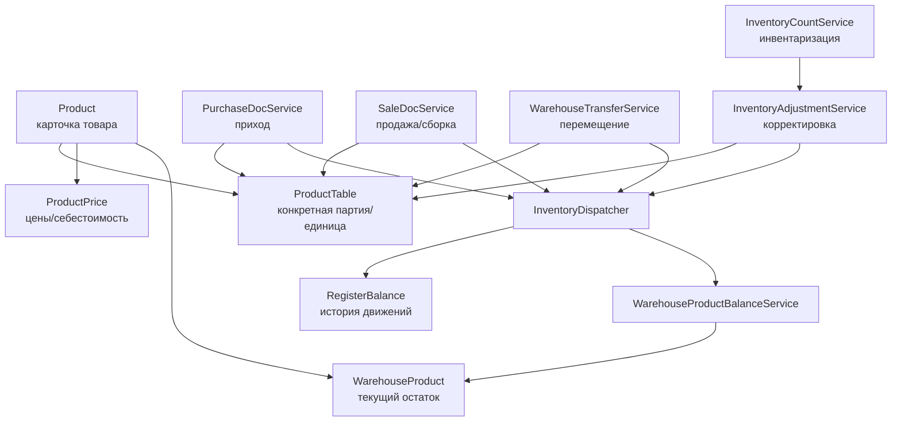

## 2. Карта сервисов

| Сервис | Файл | Роль |
|---|---|---|
| `ProductService` | `src/Application/Features/Inv/Products/Services/ProductService.cs` | CRUD карточек товаров. |
| `ProductGroupService` | `src/Application/Features/Inv/ProductGroups/Services/ProductGroupService.cs` | CRUD групп; также может создавать/обновлять вложенные `Product`. |
| `ProductPriceService` | `src/Application/Features/Inv/ProductPrices/Services/ProductPriceService.cs` | CRUD цен и API-детали `sale/cost` по товару. |
| `ProductPriceCalculateService` | `src/Application/Features/Inv/ProductPrices/Services/ProductPriceCalculateService.cs` | Расчет цены продажи, себестоимости и выбор партий FIFO/LIFO/average. |
| `ProductStockService` | `src/Application/Features/Inv/ProductStocks/Services/ProductTableService.cs` | Чтение остатков через `ProductTable`, группировки и список партий. |
| `ProductStockCalculateService` | `src/Application/Features/Inv/ProductStocks/Services/ProductStockCalculateService.cs` | Новый расчет балансов: current/future из `WarehouseProduct`, historical из `RegisterBalance`. |
| `WarehouseProductBalanceService` | `src/Infrastructure/Repositories/WarehouseProductBalanceService.cs` | Обновление агрегированных остатков и резервов. |
| `ProductTableReservationService` | `src/Infrastructure/Repositories/ProductTableReservationService.cs` | Атомарный резерв выбранных `ProductTable`. |
| `PurchaseDocService` | `src/Application/Features/Pur/PurchaseDocs/Services/PurchaseDocService.cs` | Создание/обновление закупки и draft `ProductTable`. |
| `PurchaseLifecycleService` | `src/Application/Features/Pur/PurchaseDocs/Services/PurchaseLifecycleService.cs` | Confirm/cancel закупки, перевод партий в склад, пересчет cost price. |
| `SaleDocService` | `src/Application/Features/Sale/SaleDocs/Services/SaleDocService.cs` | Создание продажи и этап warehouse assembly. |
| `SaleLifecycleService` | `src/Application/Features/Sale/SaleDocs/Services/SaleLifecycleService.cs` | Confirm/cancel продажи, перевод партий SOLD/IN_STOCK, реверсы. |
| `WarehouseTransferService` | `src/Application/Features/Inv/WarehouseTransfers/Services/WarehouseTransferService.cs` | Создание/валидация перемещения по конкретным партиям. |
| `WarehouseTransferLifecycleService` | `src/Application/Features/Inv/WarehouseTransfers/Services/WarehouseTransferLifecycleService.cs` | Confirm/cancel перемещения, смена `CurrentWarehouseId`. |
| `InventoryAdjustmentService` | `src/Application/Features/Inv/InventoryAdjustments/Services/InventoryAdjustmentService.cs` | Создание корректировки склада. |
| `InventoryAdjustmentLifecycleService` | `src/Application/Features/Inv/InventoryAdjustments/Services/InventoryAdjustmentLifecycleService.cs` | Confirm/cancel корректировки, создание/изменение/восстановление `ProductTable`. |
| `InventoryCountService` | `src/Application/Features/Inv/InventoryCounts/Services/InventoryCountService.cs` | Создание инвентаризации, расчет расхождений. |
| `InventoryCountLifecycleService` | `src/Application/Features/Inv/InventoryCounts/Services/InventoryCountLifecycleService.cs` | Confirm/cancel инвентаризации через auto-generated корректировки. |
| `ActiveInventoryCountGuardService` | `src/Application/Features/Inv/InventoryCounts/Services/ActiveInventoryCountGuardService.cs` | Блокирует складские операции, если по складу идет draft/pending инвентаризация. |
| `InventoryDispatcher` | `src/Application/Features/Register/InventoryRegisterBalances/Services/InventoryDispatcher.cs` | Создает `RegisterBalance` через handlers и обновляет `WarehouseProduct`. |
| `PurchaseInventoryHandler` | `src/Application/Features/Register/InventoryRegisterBalances/Services/Handlers/PurchaseInventoryHandler.cs` | Register IN для закупки. |
| `SaleInventoryHandler` | `src/Application/Features/Register/InventoryRegisterBalances/Services/Handlers/SaleInventoryHandler.cs` | Register OUT для продажи. |
| `WarehouseTransferInventoryHandler` | `src/Application/Features/Register/InventoryRegisterBalances/Services/Handlers/WarehouseTransferInventoryHandler.cs` | Register OUT+IN для перемещения. |
| `InventoryAdjustmentInventoryHandler` | `src/Application/Features/Register/InventoryRegisterBalances/Services/Handlers/InventoryAdjustmentInventoryHandler.cs` | Register IN/OUT для корректировки. |
| `ManualService` | `src/Application/Features/Cmn/Manual/Services/ManualService.cs` | Select-list товаров, групп, типов, source product tables. |
| `FaAssetService` | `src/Application/Features/Fa/FaAssets/Services/FaAssetService.cs` | Проверяет `SourceProductTableId` для основных средств. |
| `InventoryRegisterBalanceService` | `src/Application/Features/Register/InventoryRegisterBalances/Services/InventoryRegisterBalanceService.cs` | Чтение складского регистра. |

## 3. Жизненный цикл `ProductTable`

`ProductTable` живет как складская единица/партия. Основные переходы по сервисам:

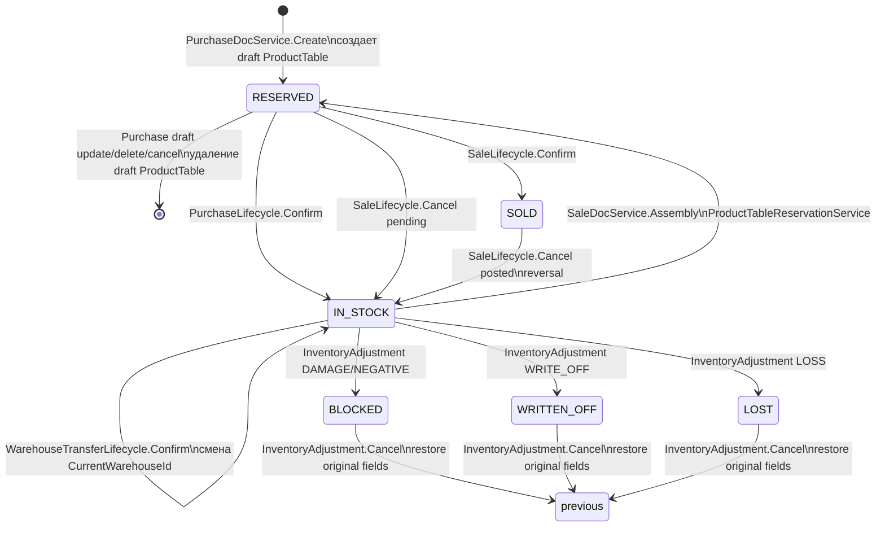

Важное:

- `PurchaseDocService` создает `ProductTable` только через строки `PurchaseDocTable`.
- `SaleDocService.Assembly` не продает сразу, а сначала резервирует агрегированный остаток и конкретные `ProductTable`.
- `SaleLifecycleService.Confirm` переводит выбранные `ProductTable` в `SOLD`.
- `WarehouseTransferLifecycleService` не меняет статус на “transfer”, а меняет `CurrentWarehouseId`, оставляя `IN_STOCK`.
- `InventoryAdjustmentLifecycleService` умеет создавать новые `ProductTable`, если item без `ProductTableId` и adjustment type положительный.

## 4. Приход товара

### Create / update

`PurchaseDocService`:

1. Валидирует шапку документа.
2. Загружает `Product`, `Unit`, `VatRate`.
3. Для услуги или `!IsPieceTracked` запрещает `dto.Items`.
4. Для `IsPieceTracked` требует:
   - `Quantity` целое;
   - `Items.Count == Quantity`;
   - обязательный `MarkingNumber`;
   - уникальность маркировок внутри payload.
5. Создает `PurchaseDocProduct`.
6. Для items создает `PurchaseDocTable` и вложенный `ProductTable` со статусом `RESERVED`.

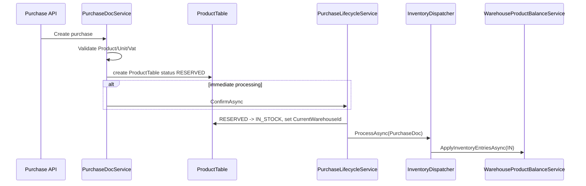

### Confirm

`PurchaseLifecycleService.ConfirmAsync`:

1. Проверяет open accounting period.
2. Проверяет, что по складу нет активной инвентаризации.
3. Проверяет, что нет уже созданных business effects.
4. Проверяет строки:
   - услуги и `!IsPieceTracked` не должны иметь `PurchaseDocTables`;
   - piece-tracked строки должны иметь столько `PurchaseDocTables`, сколько quantity;
   - вложенные `ProductTable` должны быть `RESERVED + ACTIVE`.
5. Создает `PostingBatch`.
6. Переводит `ProductTable` в `IN_STOCK + ACTIVE` и ставит `CurrentWarehouseId`.
7. Запускает:
   - accounting dispatcher;
   - inventory dispatcher;
   - counterparty register.
8. Пересчитывает себестоимость в `ProductPrice` с типом `AVERAGE_COST_PRICE`.

### Cancel

`PurchaseLifecycleService.CancelAsync`:

- Если документ `POSTED`:
  - требует, чтобы партии еще были `IN_STOCK + ACTIVE`;
  - создает reversal batch;
  - реверсит accounting/register/counterparty;
  - переводит партии в `RETURNED_TO_SUPPLIER + PASSIVE`, `CurrentWarehouseId = null`;
  - пересчитывает cost price.
- Если документ еще draft/pending:
  - удаляет draft `PurchaseDocTable` и связанные draft `ProductTable`.

## 5. Продажа товара

Продажа разделена на два этапа:

1. `SaleDocService.Create` — создает документ и строки товара.
2. `SaleDocService.Assembly` — склад выбирает конкретные `ProductTable`, сервис резервирует партии.
3. `SaleLifecycleService.Confirm` — окончательно проводит продажу.

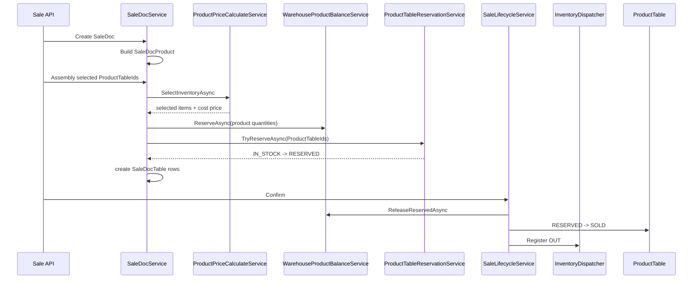

### Create

`SaleDocService.BuildProductLinesAsync`:

- Проверяет существование `Product`.
- Для `IsPieceTracked` требует целое quantity.
- Проверяет `UnitPrice >= 0`, `CostPrice >= 0`.
- Для услуг и `!IsPieceTracked` пишет `CostPrice` сразу в `SaleDocProduct`.
- Для `IsPieceTracked` ставит `CostPrice = 0`, потому что cost придет после выбора партий.

### Assembly

`SaleDocService.ApplyAssemblyAsync`:

1. Разрешен только из `DRAFT`.
2. Если документ уже `PENDING`, повторный assembly только валидирует строки.
3. Для услуг и `!IsPieceTracked` запрещает выбранные `Items`.
4. Для piece-tracked строк требует `Assembled = true`.
5. Вызывает `ProductPriceCalculateService.SelectInventoryAsync`.
6. Резервирует агрегированный остаток через `WarehouseProductBalanceService.ReserveAsync`.
7. Резервирует конкретные партии через `ProductTableReservationService.TryReserveAsync`.
8. Создает `SaleDocTable` на каждую выбранную партию.
9. Переводит документ в `PENDING`.

### Confirm

`SaleLifecycleService.ConfirmAsync`:

1. Разрешен из `DRAFT` или `PENDING`.
2. Пересчитывает суммы из `SaleDocConfirmDto`.
3. Валидирует:
   - услуги и `!IsPieceTracked` не должны иметь `SaleDocTables`;
   - piece-tracked строки должны иметь `SaleDocTables.Count == Quantity`;
   - `ProductTable` должен совпадать по товару, организации, складу;
   - статус должен быть `RESERVED + ACTIVE`.
4. Проверяет источник себестоимости: у каждой продаваемой партии должен быть posted active `PurchaseDocTable` до даты продажи.
5. Если статус был `PENDING`, снимает агрегированный резерв.
6. Переводит `ProductTable` в `SOLD`.
7. Запускает accounting, inventory, counterparty, money registers.

### Cancel

`SaleLifecycleService.CancelAsync`:

- Если `POSTED`:
  - реверсит accounting, inventory, counterparty, money;
  - переводит `ProductTable` из `SOLD` обратно в `IN_STOCK`.
- Если `PENDING`:
  - снимает агрегированный резерв;
  - переводит `ProductTable` из `RESERVED` обратно в `IN_STOCK`.

## 6. FIFO/LIFO/average и расчет цены

`ProductPriceCalculateService` — центральный расчетный сервис для цен и выбора партий.

### Публичные методы

| Метод | Что делает |
|---|---|
| `GetSalePriceMapAsync(productIds)` | Возвращает цену продажи по товарам. Смотрит `PricingCondition`, `ProductPrice`, закупочные партии. |
| `GetCostPriceMapAsync(productIds)` | Возвращает себестоимость и партии. Для average — цена из `ProductPrice`/fallback; для FIFO/LIFO — партии из закупок. |
| `SelectInventoryAsync(...)` | Проверяет выбранные `ProductTableIds` под метод оценки FIFO/LIFO/average и возвращает cost по выбранным партиям. |

### Логика цены продажи

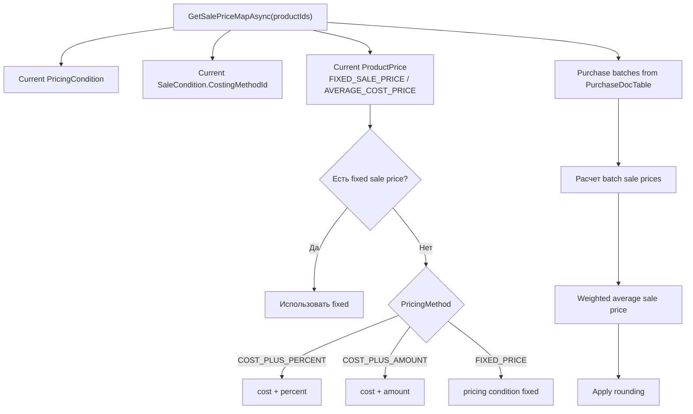

### Выбор FIFO/LIFO

`SelectInventoryAsync` работает так:

1. Берет `CostingMethodId` из текущего `SaleCondition`.
2. Для `!IsPieceTracked` выбор `ProductTableIds` не нужен.
3. Для piece-tracked товаров грузит кандидатов из `PurchaseDocTable`, где:
   - `ProductTable.StatusId == IN_STOCK`;
   - `ProductTable.StateId == ACTIVE`;
   - `ProductTable.CurrentWarehouseId == warehouseId`;
   - организация совпадает.
4. Сортирует:
   - FIFO: `PurchaseDate asc`, `PurchaseDocId asc`, `ProductTableId asc`;
   - LIFO: `PurchaseDate desc`, `PurchaseDocId desc`, `ProductTableId desc`.
5. Для FIFO/LIFO проверяет не точные id, а количество выбранных партий в ожидаемых закупочных batch:
   - если в первой закупке 3 товара, во второй 4, а надо 5 — ожидается 3 из первой batch и 2 из второй;
   - внутри одной batch можно выбрать любые конкретные `ProductTableId`.
6. Для average считает среднюю себестоимость по кандидатам.

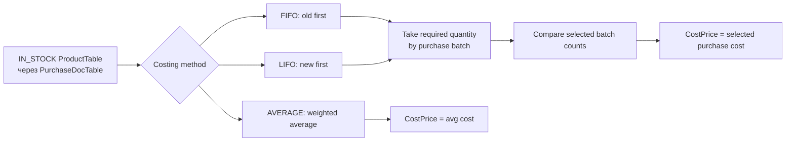

## 7. Агрегированные остатки `WarehouseProduct`

`WarehouseProductBalanceService` обновляет текущие балансы.

### Методы

| Метод | Назначение |
|---|---|
| `ApplyInventoryEntriesAsync(entries)` | Переводит `RegisterBalance` IN/OUT в изменения `WarehouseProduct.Quantity`. |
| `ReserveAsync(warehouseId, items)` | Увеличивает `ReservedQuantity`. |
| `ReleaseReservedAsync(warehouseId, items)` | Уменьшает `ReservedQuantity`. |

### Flow

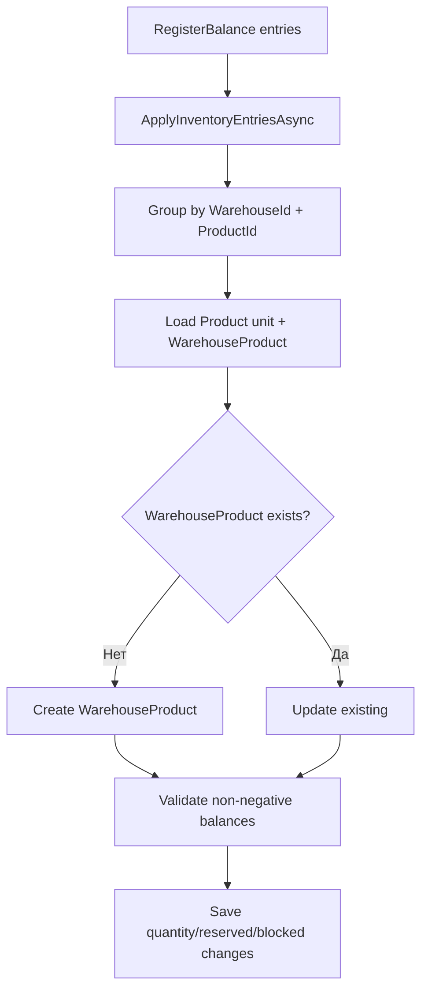

Для резерва сервис может инициализировать отсутствующий `WarehouseProduct` из текущих `ProductTable` со статусами `IN_STOCK`, `RESERVED`, `BLOCKED`.

## 8. Складской регистр и `InventoryDispatcher`

`InventoryDispatcher` — единая точка создания складского регистра.

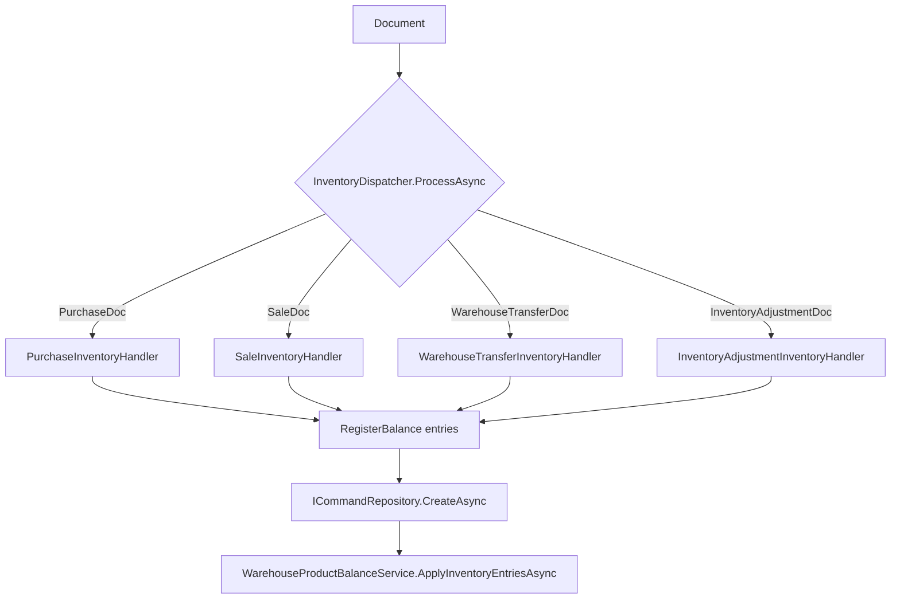

### Handlers

| Handler | Как пишет регистр |
|---|---|
| `PurchaseInventoryHandler` | Для каждой `PurchaseDocTable` пишет `IN`, `Quantity = 1`, `ProductTableId` заполнен. |
| `SaleInventoryHandler` | Для piece-tracked пишет по `SaleDocTable` `OUT`, `Quantity = 1`; для `!IsPieceTracked` пишет одну строку `OUT`, `ProductTableId = null`, `Quantity = line.Quantity`. |
| `WarehouseTransferInventoryHandler` | Для каждой партии пишет две строки: `OUT` со склада-источника и `IN` на склад-получатель. |
| `InventoryAdjustmentInventoryHandler` | Пишет `IN` для положительных типов и `OUT` для отрицательных типов. |

## 9. Остатки для чтения

### `ProductStockService`

Файл фактически называется `ProductTableService.cs`, класс — `ProductStockService`.

Методы:

| Метод | Источник данных | Что возвращает |
|---|---|---|
| `GetByMarkingNumberAsync` | `ProductTable` | Партию по marking number. |
| `GetProductGroupsStockAsync` | `ProductTable IN_STOCK` | Остатки по группам/товарам, quantity = count ProductTable. |
| `GetProductsStockAsync` | `ProductTable IN_STOCK` + отдельно services | Остатки по товарам; услуги показываются с quantity 0. |
| `GetProductTablesStockAsync` | `ProductTable IN_STOCK` | Список конкретных партий/единиц. |

Этот сервис больше “партийный”: он считает quantity через количество строк `ProductTable`.

### `ProductStockCalculateService`

Это расчетный сервис балансов:

| Дата | Источник | Логика |
|---|---|---|
| `choosedDate == null`, today или future | `WarehouseProduct` | Берет текущие агрегированные `Quantity/Available/Reserved/Blocked`. |
| historical date | `RegisterBalance` | Суммирует IN/OUT до даты; `Available = Quantity`, reserved/blocked = 0. |
| product tables current | `ProductTable` | `IN_STOCK => available`, `RESERVED => reserved`, `BLOCKED => blocked`. |
| product tables historical | `RegisterBalance.ProductTableId` | Сумма historical movement по конкретной партии. |

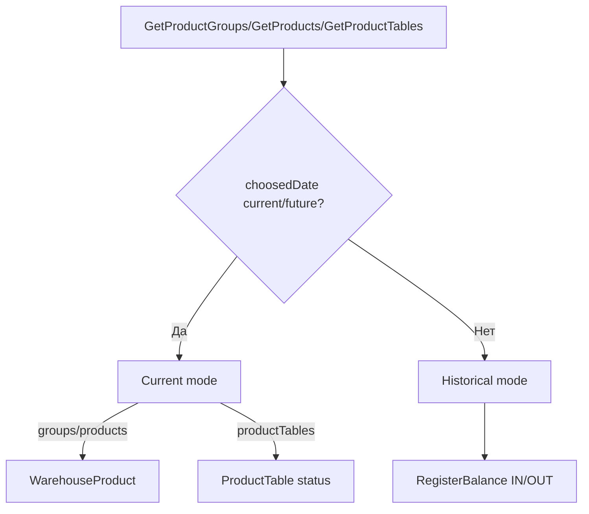

## 10. Перемещение склада

`WarehouseTransferService` создает документ перемещения только по конкретным `ProductTable`.

Validation:

- source/destination warehouse должны быть разными и active;
- product не должен быть service;
- `Items` обязательны;
- `Quantity` целое и равно `Items.Count`;
- `ProductTable` должен:
  - существовать;
  - принадлежать организации;
  - иметь тот же `ProductId`;
  - находиться на source warehouse.

`WarehouseTransferLifecycleService.Confirm`:

- проверяет `ProductTable.StatusId == IN_STOCK`;
- проверяет `CurrentWarehouseId == SourceWarehouseId`;
- создает `PostingBatch`;
- запускает inventory dispatcher;
- меняет `ProductTable.CurrentWarehouseId = DestinationWarehouseId`;
- оставляет `StatusId = IN_STOCK`.

Cancel posted:

- проверяет, что партии еще на destination warehouse и `IN_STOCK`;
- реверсит inventory register;
- возвращает `CurrentWarehouseId = SourceWarehouseId`.

## 11. Корректировка склада

`InventoryAdjustmentService`:

- запрещает услуги;
- требует строки и items;
- `Quantity` целое и равно `Items.Count`;
- для отрицательных типов `ProductTableId` обязателен;
- для положительных типов `ProductTableId` может быть `null`.

`InventoryAdjustmentLifecycleService`:

| Adjustment type | Действие с `ProductTable` |
|---|---|
| `POSITIVE_ADJUSTMENT`, `FOUND_STOCK`, `CORRECTION` без `ProductTableId` | Создает новый `ProductTable` в `IN_STOCK + ACTIVE`, warehouse = doc warehouse. |
| `POSITIVE_ADJUSTMENT`, `FOUND_STOCK`, `CORRECTION` с `ProductTableId` | Переводит существующую партию в `IN_STOCK + ACTIVE`. |
| `WRITE_OFF` | `WRITTEN_OFF + PASSIVE`. |
| `LOSS` | `LOST + PASSIVE`. |
| `DAMAGE`, `NEGATIVE_ADJUSTMENT` | `BLOCKED + ACTIVE`. |

Перед изменением существующей партии сервис сохраняет:

- `OriginalStatusId`;
- `OriginalStateId`;
- `OriginalWarehouseId`.

Cancel корректировки восстанавливает старые значения, а созданные корректировкой партии переводит в `BLOCKED + PASSIVE` и снимает склад.

## 12. Инвентаризация

`InventoryCountService`:

- запрещает услуги;
- проверяет `ProductTable` по складу, статусу `IN_STOCK`, активности и product match;
- хранит counted lines и counted/anonymous items.

`InventoryCountLifecycleService.Confirm`:

1. Сравнивает ожидаемые `ProductTable IN_STOCK` на складе с фактически посчитанными.
2. На missing items создает `InventoryAdjustmentDoc` типа `NEGATIVE_ADJUSTMENT`.
3. На found items создает `InventoryAdjustmentDoc` типа `POSITIVE_ADJUSTMENT`.
4. Подтверждает эти adjustment docs через `InventoryAdjustmentLifecycleService`.
5. Сам документ инвентаризации переводит в `POSTED`.

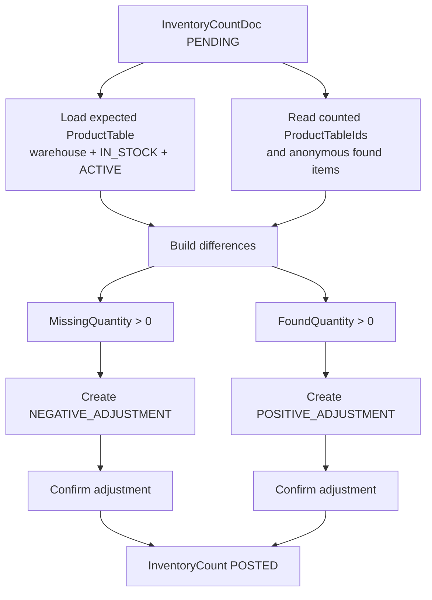

`ActiveInventoryCountGuardService` блокирует операции по складу, если есть active `InventoryCountDoc` в `DRAFT` или `PENDING`, кроме самой текущей инвентаризации.

## 13. Manuals, FA, register views

### `ManualService`

Продуктовые методы:

| Метод | Назначение |
|---|---|
| `GetProductGroupsAsync` | Select-list активных групп. |
| `GetProductTypesAsync(isService)` | Select-list типов товара/услуги с переводом по `_userContext.LanguageId`. |
| `GetProductsAsync(...)` | Select-list товаров с фильтрами group/warehouse/service/type/sold/purchased. |
| `GetSourceProductTablesAsync` | Select-list активных `ProductTable` для источников ОС. |

Особенность:

- `GetProductsAsync(warehouseId)` фильтрует по `x.RegisterBalances.Any(a => a.WarehouseId == warehouseId)`, то есть по факту наличия движения на складе, а не по текущему остатку.

### `FaAssetService`

Использует `ProductTable` только как source:

- при create/update принимает `SourceProductTableId`;
- валидирует, что такой `ProductTable` есть в текущей организации.

### `InventoryRegisterBalanceService`

Сервис только читает `RegisterBalance`:

- `GetAllAsync`;
- `GetByIdAsync`.

## 14. Матрица документов и эффектов

| Документ | Создает/меняет `ProductTable` | Пишет `RegisterBalance` | Меняет `WarehouseProduct` | Особенность |
|---|---:|---:|---:|---|
| Purchase | Да: draft `RESERVED`, confirm `IN_STOCK` | Да, через `PurchaseInventoryHandler` | Да, через dispatcher | Создает партии при приходе. |
| Sale | Да: assembly `RESERVED`, confirm `SOLD` | Да, через `SaleInventoryHandler` | Да: reserve/release + register OUT | Выбор партий идет через `SelectInventoryAsync`. |
| WarehouseTransfer | Да: меняет `CurrentWarehouseId` | Да: OUT + IN | Да, через dispatcher | Работает только по конкретным партиям. |
| InventoryAdjustment | Да: создает/меняет/восстанавливает | Да: IN/OUT | Да, через dispatcher | Может создать новую `ProductTable`. |
| InventoryCount | Не напрямую, а через adjustment | Через generated adjustment | Через generated adjustment | Сравнивает ожидаемые и найденные партии. |

## 15. Важные наблюдения и возможные несостыковки

### 15.1. Непоштучные товары: приход и расход ведут себя по-разному

Сейчас в сервисах видно такое:

- `PurchaseDocService` для `!IsPieceTracked` запрещает `Items`, поэтому `PurchaseDocTables` не создаются.
- `PurchaseInventoryHandler` пишет регистр только из `PurchaseDocTables`.
- Значит, приход `!IsPieceTracked` товара может не создать `RegisterBalance IN` и не увеличить `WarehouseProduct`.
- `SaleInventoryHandler`, наоборот, умеет продавать `!IsPieceTracked`: пишет одну строку `OUT` с `ProductTableId = null` и `Quantity = line.Quantity`.

Это главная потенциальная дырка в складском контуре: расход непоштучного товара поддержан, а приход через текущий handler может не увеличивать остаток.

### 15.2. Перемещение требует конкретные `ProductTable`

`WarehouseTransferService` требует `Items.Count == Quantity` и каждый item должен иметь `ProductTableId`. Сервис не делает отдельной ветки для `!IsPieceTracked`. Если непоштучные товары должны перемещаться агрегированно через `WarehouseProduct`, текущая модель перемещения этого не покрывает.

### 15.3. Корректировка тоже item-based

`InventoryAdjustmentService` требует `Items.Count == Quantity`. Для положительного flow `ProductTableId` может быть `null`, тогда lifecycle создаст новую `ProductTable`. Для отрицательного flow `ProductTableId` обязателен.

### 15.4. Есть два чтения остатков

Сейчас есть два разных подхода:

- `ProductStockService` считает stock через `ProductTable`.
- `ProductStockCalculateService` для current/future читает `WarehouseProduct`.

Это нормально как переходная архитектура, но фронт/бизнес-логика должны понимать, какой сервис является “главным” для остатков. Иначе цифры могут отличаться.

### 15.5. `ProductGroupService` тоже меняет продукты

Помимо `ProductService`, товары можно создавать/обновлять внутри `ProductGroupService`. Это удобно для UI “группа + товары”, но создает вторую точку записи для `Product`.

### 15.6. FIFO/LIFO проверяет batch counts, не конкретные id

Для FIFO/LIFO `SelectInventoryAsync` требует правильное количество из ожидаемых закупочных batch. Внутри одной batch можно выбрать любые `ProductTableId`. Это соответствует логике “если партия пришла одним документом, конкретные единицы внутри нее равнозначны”.

### 15.7. Manual products by warehouse ищет по движениям, не по остатку

`ManualService.GetProductsAsync(warehouseId)` смотрит `RegisterBalances.Any(warehouseId)`. Это означает: товар попадет в список, если по нему когда-либо было движение на складе, даже если текущий остаток ноль.

## 16. Рекомендуемая целевая логика

Если цель — единый и понятный учет:

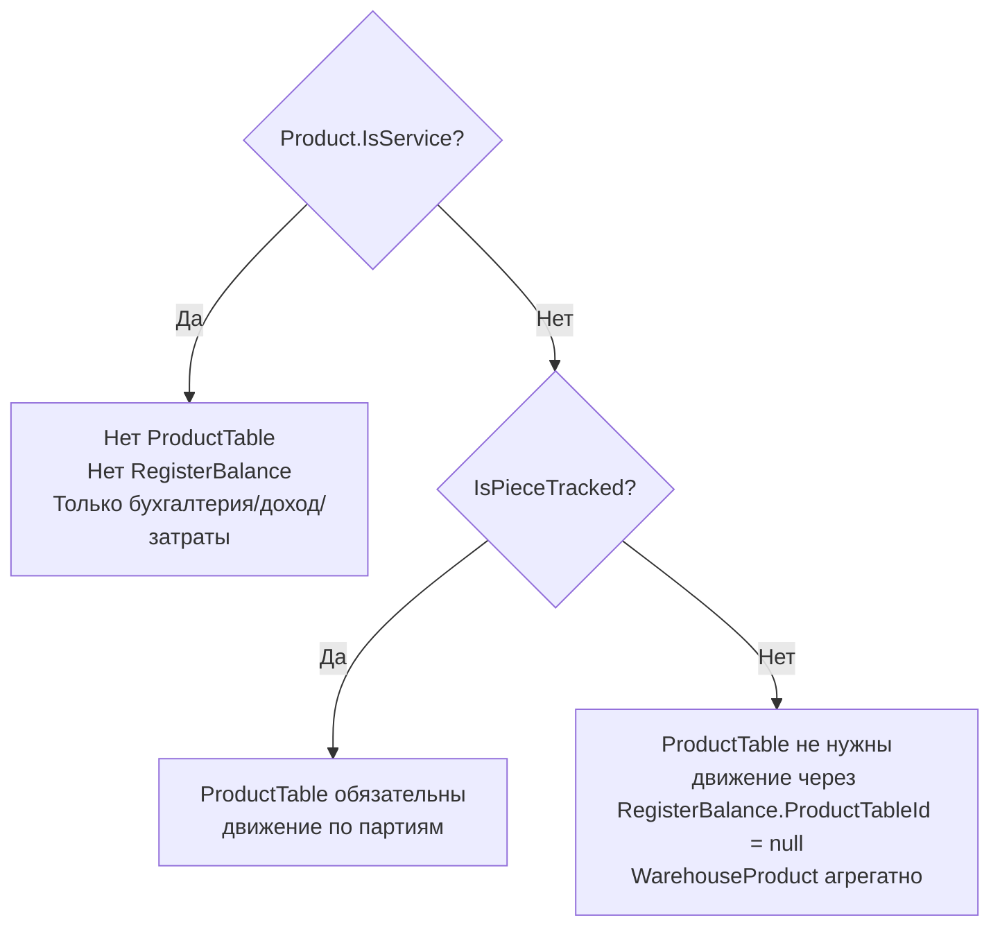

Для этого стоит явно решить:

1. Должны ли `!IsPieceTracked` товары создавать `ProductTable` или нет.
2. Если нет, то `PurchaseInventoryHandler`, `WarehouseTransferService`, `InventoryAdjustmentService` должны иметь агрегированную ветку без `ProductTableId`.
3. Какой read-сервис считать основным для текущего остатка: `ProductStockService` или `ProductStockCalculateService`.
4. Нужно ли оставить `ProductGroupService` как вторую точку записи `Product` или вынести создание товаров только в `ProductService`.

