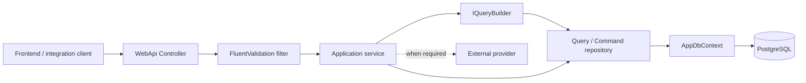
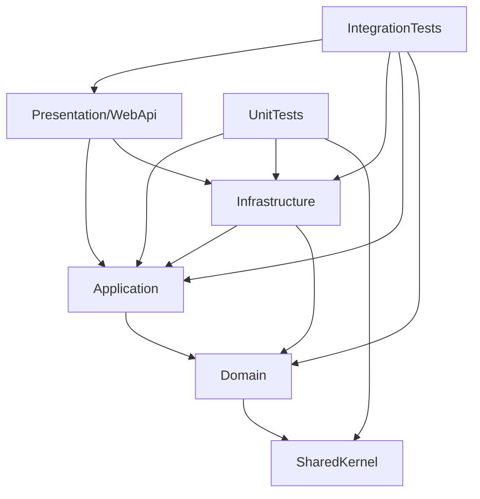
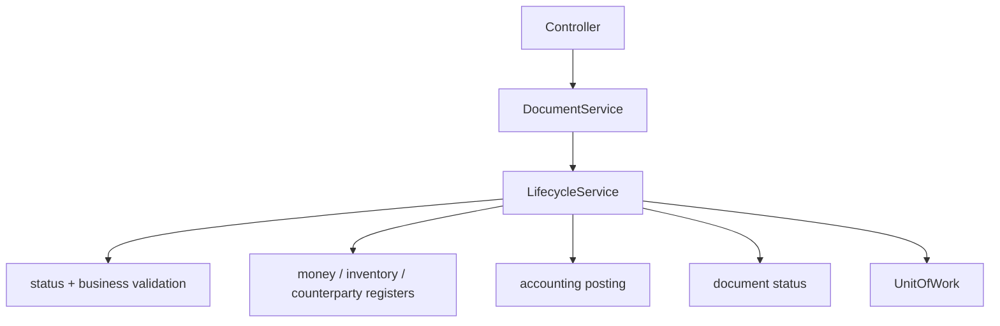
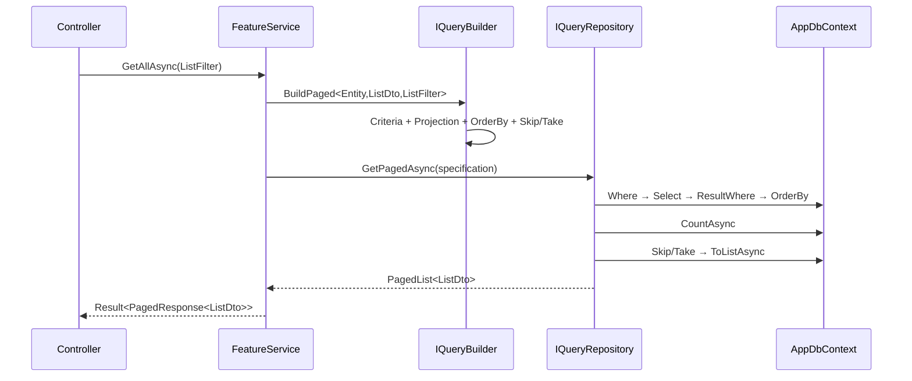
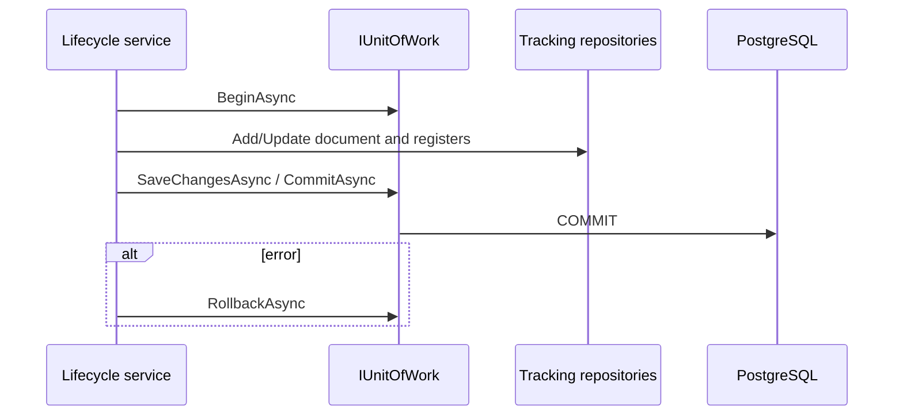
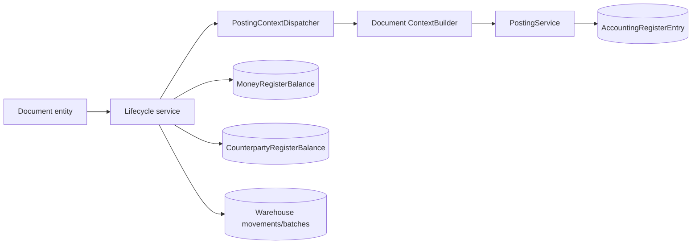
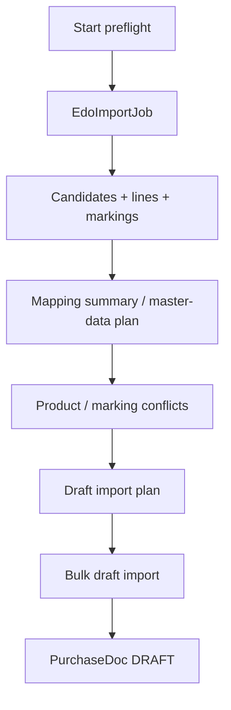

# Архитектура сервисов AccountingBack

> Состояние проекта на 28 августа 2026 года. Документ описывает фактическое рабочее дерево, включая локальные незакоммиченные изменения. Это описание текущей реализации, а не целевая архитектура.

## 1. Краткое резюме

Backend построен как модульный монолит на ASP.NET Core и .NET 10. Функциональность разделена по бизнес-областям, но физически работает в одном Web API и использует один `AppDbContext` PostgreSQL.

Основной поток выполнения:



На текущем снимке:

- 5 production-проектов и 2 test-проекта;
- 27 корневых функциональных областей в `Application/Features`;
- 1 254 C#-файла внутри `Application/Features`;
- 84 каталога с именем `Services`;
- 149 service-интерфейсов во всём Application: 144 объявлены внутри `Features`, ещё 5 — integration/inventory ports в `Abstractions`;
- 272 файла, содержащих `Service` в имени;
- 614 файлов, содержащих `Dto` в имени;
- 94 API-контроллера.

Сервисный слой не является отдельным микросервисным набором. Здесь слово «сервис» означает application service: класс, который выполняет use case внутри общего процесса Web API.

## 2. Проекты solution и направление зависимостей



| Проект | Назначение | Основные зависимости |
|---|---|---|
| `SharedKernel` | Общие результаты, ошибки, фильтры, QueryBuilder-контракты, константы, исключения и утилиты | Не ссылается на другие проекты solution |
| `Domain` | EF-сущности и связи между ними | `SharedKernel`, EF Core |
| `Application` | Use cases, сервисные интерфейсы и реализации, DTO, валидация, фильтры, проекции, отчёты | `Domain`; также использует EF Core/LinqKit/ClosedXML/PDFsharp |
| `Infrastructure` | PostgreSQL, репозитории, `AppDbContext`, внешние интеграции, security, фоновые задания, реализация application-абстракций | `Application`, `Domain` |
| `Presentation/WebApi` | HTTP-контроллеры, authentication/authorization, middleware, Swagger, преобразование результата в HTTP | `Application`, `Infrastructure` |
| `UnitTests` | Быстрые модульные и контрактные тесты | `Application`, `Infrastructure`, `SharedKernel` |
| `IntegrationTests` | Интеграционные/схемные тесты Web API и SQL-контрактов | Все runtime-проекты |

Практически архитектура близка к Clean Architecture, но не является «чистой» в строгом смысле:

- Domain содержит EF-атрибуты и зависит от EF Core;
- Application напрямую использует некоторые EF-типы и инфраструктурные библиотеки для Excel/PDF;
- composition root регистрации сервисов находится преимущественно в `Infrastructure.DependencyInjection`;
- все модули используют один общий `AppDbContext`.

## 3. Корневая файловая структура

```text
Accounting/
├── Accounting.slnx
├── docs/
├── src/
│   ├── SharedKernel/
│   ├── Domain/
│   ├── Application/
│   ├── Infrastructure/
│   └── Presentation/WebApi/
└── tests/
    ├── UnitTests/
    └── IntegrationTests/
```

### 3.1 `src/SharedKernel`

| Папка | Содержимое |
|---|---|
| `Constants` | Числовые ID, коды статусов, типов документов, permissions и другие системные константы |
| `Exceptions` | Исключения репозиториев, concurrency и интеграций |
| `Filters` | Базовые контракты фильтров: поиск и пагинация |
| `Query` | QueryBuilder, criteria/projection/order contracts, specifications и include builders |
| `QueryResults` | Внутренний `PagedList<T>` |
| `Results` | `Result`, `Result<T>`, `Error`, `ErrorType` |
| `Security`, `Text`, `Time` | Общие security/text/time helpers |

### 3.2 `src/Domain`

Основное содержимое — `Entities`. Сущности сгруппированы по предметным областям:

```text
Entities/
├── Acc/             бухгалтерские счета и настройки проводок
├── Bank/            банковские счета, операции, шаблоны выписок
├── Cash/            кассы, кассовые операции и переводы
├── Cmn/             общие справочники
├── Counterparty/    карточка контрагента, счета и контакты
├── Fa/              основные средства
├── Integration/     состояние EDO и импортов
├── Inv/             товары, склады, партии и движения
├── Notification/    уведомления
├── Org/             филиалы, отделы, должности
├── Organization/    организация и её настройки
├── Pay/             зарплата и табели
├── Platform/        tenant/platform administration
├── Pur/             закупки
├── Register/        бухгалтерские, денежные и контрагентские регистры
├── Rtl/             розничные продажи
├── Sale/            продажи и отгрузки
└── Sys/             пользователи, роли, модули и аудит
```

Domain-модель является persistence-aware:

- классы имеют `[Table]`, `[Column]`, `[ForeignKey]`, `[InverseProperty]`;
- коллекции navigation properties находятся непосредственно в сущностях;
- отдельного богатого domain behavior почти нет: основные бизнес-правила реализованы в Application services;
- `partial` используется, чтобы сущности можно было расширять несколькими файлами.

### 3.3 `src/Application`

```text
Application/
├── Abstractions/    порты к БД, auth, файлам и внешним интеграциям
├── Common/          пагинация, extensions, markers, settings
├── Features/        все бизнес-use cases
├── Resources/       шрифты и другие embedded resources
└── DependencyInjection.cs
```

`Abstractions` определяет интерфейсы, которые реализует Infrastructure:

- `IQueryRepository<TEntity>`;
- `ICommandRepository<TEntity>`;
- `ITrackingRepository<TEntity>`;
- `IUnitOfWork`;
- `IUserContext`, `IRequestContext`, `IPermissionChecker`;
- locks для posting/notifications;
- file/import/barcode providers;
- контракты EDO, налоговых и других интеграций.

Service-интерфейсы, объявленные именно в `Abstractions`: `IEdoInboxService`, `IEdoReconciliationService`, `IEdoSigningSessionCleanupService`, `IFakturaService`, `IProductTableReservationService`. Они являются портами Application; их реализации или adapters находятся в Infrastructure/Application integration modules.

### 3.4 `src/Infrastructure`

| Папка | Назначение |
|---|---|
| `Authentication` | JWT, password hashing и permission checking |
| `BackgroundServices` | Quartz jobs и фоновые обработчики |
| `Context` | текущий пользователь, организация и background organization scope |
| `Integration` | Edocs, Didox, Faktura, AslBelgi, ЦБ, Tax, Email, Google Drive, HR files |
| `Options` | strongly typed configuration |
| `Persistence/AppDbContext` | рабочий EF Core context и access scope |
| `Persistence/Scripts` | последовательные SQL create/insert/alter/verify scripts |
| `Persistence/Generated` | reverse-engineered модель; исключена из компиляции через `.csproj` |
| `Query` | реализация `IQueryBuilder` и resolver |
| `Repositories` | query/command/tracking repositories и unit of work |
| `Security`, `Services` | технические реализации application ports |

### 3.5 `src/Presentation/WebApi`

| Папка | Назначение |
|---|---|
| `Controllers` | HTTP transport; сгруппирован по бизнес-областям |
| `Authorization` | `ModuleAuthorize`, global access и guards |
| `Configuration` | startup, DI, JWT, CORS, Quartz, Swagger, logging |
| `Middlewares` | organization scope, correlation ID, security headers |
| `Infrastructure` | validation filter, global exception handler, custom HTTP results |
| `Extensions` | преобразование `Result` в HTTP-ответ |
| `Contracts` | transport-level contracts, если они не принадлежат одному feature |

Контроллеры в основном тонкие: принимают request model, вызывают один application service и преобразуют `Result` в HTTP.

## 4. Структура одного feature

Наиболее полный повторяемый шаблон выглядит так:

```text
Features/<Area>/<Feature>/
├── DTOs/
│   ├── <Entity>BaseDto.cs
│   ├── <Entity>CreateDto.cs
│   ├── <Entity>UpdateDto.cs
│   ├── <Entity>Dto.cs
│   └── <Entity>ListDto.cs
├── Errors/
│   └── <Entity>Errors.cs
├── Filters/
│   └── <Entity>ListFilter.cs
├── OrderBy/
│   └── <Entity>ListDtoOrderByBuilder.cs
├── Projections/
│   ├── <Entity>DtoProjection.cs
│   └── <Entity>ListDtoProjection.cs
├── Queries/
│   ├── <Entity>ByListFilterCriteriaBuilder.cs
│   └── <Entity>ListDtoByListFilterCriteriaBuilder.cs
├── Services/
│   ├── I<Entity>Service.cs
│   └── <Entity>Service.cs
└── Validators/
    └── <Entity>...Validator.cs
```

Не каждый feature содержит все папки. Папка создаётся только когда есть соответствующая ответственность.

| Папка | Что в ней находится | Кто использует |
|---|---|---|
| `DTOs` | Входные и выходные контракты use case/API | Controllers и services |
| `Filters` | Query-string/search/pagination parameters | List/report methods |
| `Validators` | FluentValidation rules | Глобальный action filter через DI |
| `Errors` | Фабрики `Error` с кодом, локализованным сообщением и типом | Services/lifecycle services |
| `Queries` | `ICriteriaBuilder<TEntity,TOptions>` для entity или projected DTO | `IQueryBuilderResolver` |
| `Projections` | `IProjectionBuilder<TEntity,TResult>` | `IQueryBuilder` |
| `OrderBy` | `IOrderByBuilder<TEntity,TResult>` | `IQueryBuilder` |
| `Services` | Контракт и реализация use case | Controllers и другие services |
| `Models` | Внутренние модели, не являющиеся публичным API DTO | Orchestrators/builders |
| `Repositories` | Специализированные application repository contracts | Infrastructure implementations |
| `Extensions` | Регистрация модуля или локальные helpers | DI/startup |

В проекте одновременно применяются два стиля:

1. Один тип на файл: `CounterpartyCardCreateDto.cs`, `CounterpartyCardDto.cs`.
2. Несколько связанных типов в одном файле: `CashCollectionDtos.cs`, `PayrollDocumentDtos.cs`, `EdoImportPreflightDtos.cs`.

## 5. Request, response и внутренние модели

### 5.1 Правила имён

| Суффикс/имя | Роль | Обычно используется |
|---|---|---|
| `BaseDto` | Общие поля create/update | Базовый класс для request DTO; напрямую обычно не принимается endpoint-ом |
| `CreateDto` | Создание одной сущности/документа | `[FromBody]` POST |
| `CreateManyDto` / `...CreateRequestDto` | Пакетное создание | POST batch/import |
| `UpdateDto` | Изменение существующей сущности | `[FromBody]` PUT |
| `SaveDto` | Upsert или сохранение вложенной настройки | POST/PUT application method |
| `ConfirmDto` | Дополнительные данные подтверждения документа | PUT `/{id}/confirm` |
| `RequestDto` | Команда или сложный запрос, который не соответствует простому CRUD | POST/PUT |
| `Filter` / `ListFilter` | Query-string параметры, criteria, search, paging | `[FromQuery]` GET |
| `Dto` | Детальный output; иногда shared input/output | GET by id или результат операции |
| `ListDto` | Укороченная строка списка | `PagedResponse<TListDto>` |
| `DetailDto` | Расширенный output отдельного объекта/шага | GET detail |
| `ResponseDto` | Явно транспортный результат операции | POST/plan/apply/import |
| `ResultDto` | Итог вычисления или создания | Service return value |
| `SelectListDto` | Минимальная модель справочника: обычно `Id`, `Name`, `Code` | `api/manuals/*` |
| `PreviewDto` / `PlanDto` | Результат предварительного расчёта без финальной записи | preview/preflight flows |
| `StatusDto` | Текущее состояние фонового процесса/job | polling endpoints |
| `Model` без `Dto` | Внутренняя модель построителя/движка | Не должна напрямую становиться API contract без явного решения |

### 5.2 Типовой CRUD-контракт

Пример `CounterpartyCard`:

```text
CounterpartyCardBaseDto
├── CounterpartyCardCreateDto       POST body
└── CounterpartyCardUpdateDto       PUT body + StateId

CounterpartyCardListFilter          GET query
CounterpartyCardListDto             GET collection item
CounterpartyCardDto                 GET by id response
CounterpartyCardCreateResultDto     POST response
```

После текущего изменения контрагент нейтрален: в этих контрактах больше нет `CounterpartyTypeId`, `IsCustomer` и `IsSupplier`.

### 5.3 Типовой документный контракт

Для Purchase/Sale/FA/Bank/Cash документов обычно присутствуют:

```text
<Document>BaseDto
├── <Document>CreateDto
└── <Document>UpdateDto

<Document>ListFilter
<Document>ListDto
<Document>Dto
<Document>LineDto / <Document>TableDto
<Document>ConfirmDto          если подтверждению нужны параметры
```

Create/update DTO представляет документ и вложенные строки. `Dto` возвращает заголовок, строки и display-названия связанных справочников. `ListDto` намеренно короче и используется для пагинации.

### 5.4 Пагинированный response

`PagedResponse<T>` имеет единый контракт:

```text
items
page
pageSize
totalCount
totalPages
hasPreviousPage
hasNextPage
```

Если `PageSize` не передан, `QueryBuilder` и `PagedResponseFactory` используют 50. `Page` нормализуется минимум до 1 в QueryBuilder.

### 5.5 Важное ограничение терминологии

Название `Dto` само по себе не гарантирует только response. Например, `BankExportDto` передаётся в `EnrichAsync` и возвращается из parser service. Источник истины — сигнатура метода service/controller, а не только имя файла.

### 5.6 Откуда заполняются входные данные

| HTTP-источник | Модель в коде | Пример |
|---|---|---|
| Route | primitive ID/code | `/{id:long}`, `/banks/{id}/branches` |
| Query string | `Filter`/`ListFilter` или отдельные nullable primitives | `GET /api/counterparty-cards?page=1&search=...` |
| JSON body | `CreateDto`, `UpdateDto`, `RequestDto`, `ConfirmDto` | POST/PUT документов |
| Multipart form | `IFormFile` плюс form fields | Excel import/bank parser |
| Headers | Не DTO; читаются middleware/user context | `Authorization`, `X-OrganizationId`, `X-BranchId`, `X-Language` |

Controller model binding создаёт объект, глобальный FluentValidation filter проверяет его, после чего controller передаёт модель service-у почти без преобразований.

## 6. Сервисный слой

### 6.1 Application service

Типовой сервис:

```csharp
public interface IEntityService
{
    Task<Result<PagedResponse<EntityListDto>>> GetAllAsync(EntityListFilter filter, CancellationToken ct);
    Task<Result<EntityDto>> GetByIdAsync(int id, CancellationToken ct);
    Task<Result<int>> CreateAsync(EntityCreateDto dto, CancellationToken ct);
    Task<Result> UpdateAsync(int id, EntityUpdateDto dto, CancellationToken ct);
    Task<Result> DeleteAsync(int id, CancellationToken ct);
}
```

Реализация обычно зависит от:

- `IUserContext` — текущие user/organization/role/language;
- `IQueryBuilder` — создание спецификации чтения;
- `IQueryRepository<TEntity>` — чтение;
- `ICommandRepository<TEntity>` — простая запись с немедленным `SaveChanges`;
- `ITrackingRepository<TEntity>` + `IUnitOfWork` — составная транзакционная операция;
- других feature services — делегирование lifecycle/posting/register логики.

### 6.2 `BaseService`

В корне `Application/Features` находится общий `BaseService`. Он используется значительной частью новых и переработанных сервисов.

Он предоставляет два режима выполнения:

- `ExecuteAsync` — логирует начало и итог операции без управления транзакцией;
- `ExecuteInTransactionAsync` — вызывает `BeginAsync`, затем `CommitAsync` при успешном `Result` или `RollbackAsync` при ошибке/исключении.

Результат `NotFound` логируется как warning, остальные неуспешные `Result` — как error. Исключение не превращается в `Result`: после попытки rollback оно повторно выбрасывается и обрабатывается Web API exception handler.

Не все сервисы наследуют `BaseService`, поэтому транзакционная и logging-обвязка в старых feature может быть реализована вручную.

### 6.3 Типы сервисов

| Тип | Пример | Ответственность |
|---|---|---|
| CRUD service | `CounterpartyCardService` | List/detail/create/update/delete |
| Lifecycle service | `PurchaseLifecycleService`, `CashLifecycleService` | Confirm/cancel и проверка допустимого статуса |
| Money/inventory service | `CashCollectionMoneyService`, `WarehouseInventoryService` | Изменение регистров/остатков |
| Resolver | `PayrollAccountResolver`, `OrganizationAccountingPolicyResolver` | Найти конфигурацию для расчёта/проводки |
| Builder | `PurchaseDocContextBuilder` | Преобразовать документ в posting contexts |
| Dispatcher/orchestrator | `PostingContextDispatcher`, `AiAssistantOrchestrator` | Выбрать специализированный обработчик и собрать общий поток |
| Parser/import service | `BankStatementParserService`, `EdoImportPreflightService` | Parse → validate → map → plan/apply |
| Report service | `SalesReportService`, `TrialBalanceService` | Read-only aggregation и export |
| Background service | Quartz jobs | Возобновление import jobs, backup, notifications |
| Integration adapter | Edocs/Didox/Faktura/AslBelgi clients | Внешний HTTP/provider protocol |

### 6.4 Почему обычный service и lifecycle service разделены

Document service является фасадом для контроллера. Он отвечает за CRUD и делегирует изменение бизнес-состояния lifecycle service.



Так устроены Purchase, Sale, Bank, Cash, часть FA, warehouse transfer, inventory count/adjustment и новые документы перемещения денег.

### 6.5 Внутренние сервисы без прямого API

Не каждый service имеет собственный controller. Внутренними являются, например:

- `IDocumentNumberService`;
- lifecycle services;
- posting/context builders;
- money/counterparty register posting services;
- account resolvers;
- notification and background processors;
- provider stores/registries;
- PDF generation service;
- locks и transaction helpers.

Они вызываются другими application services и не являются самостоятельным HTTP-контрактом.

### 6.6 Значение имён методов

| Имя метода | Текущий смысл |
|---|---|
| `GetAllAsync` / `GetListAsync` | Список, обычно с filter и `PagedResponse<ListDto>` |
| `GetByIdAsync` | Детальная response-модель или `NotFound` |
| `CreateAsync` | Валидация ссылок и создание; обычно возвращает ID или result DTO |
| `CreateManyAsync` | Пакетная запись после общей проверки конфликтов |
| `UpdateAsync` | Получение текущей entity, проверка статуса/конфликтов и изменение разрешённых полей |
| `DeleteAsync` | Soft delete для справочника или physical delete только допустимого draft |
| `ConfirmAsync` | Проведение документа, движения и регистры |
| `CancelAsync` | Reverse/storno и перевод в cancelled |
| `PreviewAsync` | Расчёт или mapping без окончательной записи |
| `GetPlanAsync` | Возвращает план действий/сопоставлений для подтверждения frontend-ом |
| `ApplyAsync` | Применяет ранее построенный plan/request |
| `PostAsync` / `ReverseAsync` | Создаёт или сторнирует строки регистра; обычно внутренний service |
| `ParseAsync` / `EnrichAsync` | Разбирает внешний формат и дополняет локальными справочниками |
| `ResolveAsync` | Выбирает конфигурацию, счёт, provider или mapping по контексту |
| `ReconcileAsync` | Сопоставляет внешние и внутренние данные и возвращает результат сверки |
| `StartAsync` / `GetJobAsync` / `ProcessAsync` | Долгий job: создать, опрашивать состояние, выполнять в background |
| `RebuildAsync` / `RepostAsync` | Пересоздать производные регистры из исходного документа/периода |

## 7. Чтение: QueryBuilder и QueryRepository

### 7.1 Составные части

| Контракт | Назначение |
|---|---|
| `ICriteriaBuilder<TEntity,TOptions>` | Строит `Expression<Func<TEntity,bool>>` по фильтру |
| `IProjectionBuilder<TEntity,TResult>` | Строит SQL-translatable projection Entity → DTO |
| `IOrderByBuilder<TEntity,TResult>` | Определяет стабильную сортировку результата |
| `IQueryBuilderResolver` | Получает builders из DI |
| `IQueryBuilder` | Собирает query specification fluent или по типам |
| `IQueryRepository<TEntity>` | Применяет specification к EF Core query |

Builders автоматически регистрируются Scrutor-ом из Application assembly со scoped lifetime.

### 7.2 Типовой paged list



Порядок для projected paged query:

1. Global EF query filter.
2. Entity criteria.
3. Projection в response DTO.
4. Result criteria, если фильтрация относится к вычисленному DTO.
5. OrderBy.
6. Count.
7. Skip/Take.

### 7.3 Fluent-вариант

```csharp
var query = queryBuilder.For<CounterpartyCard>()
    .Where(x => x.Id == id)
    .As<CounterpartyCardDto>()
    .Build();
```

`As<TDto>()` требует зарегистрированный `IProjectionBuilder<TEntity,TDto>`. Сортировщик необязателен.

### 7.4 Разница двух способов build

- `IQueryBuilder.Build*<...>(options)` при отсутствии criteria builder использует `_ => true`.
- `EntityQueryBuilder.With(options)` при отсутствии criteria builder использует `_ => false`.

Поэтому `With(options)` безопасно закрывает выдачу при пропущенной регистрации, а generic `Build/BuildPaged` трактует отсутствие criteria builder как «нет дополнительного фильтра». Это существенное текущее различие поведения.

### 7.5 Tracking чтения

- Projected `GetAsync<TResult>`/`GetAllAsync<TResult>` применяют `AsNoTracking`.
- `AnyAsync` применяет `AsNoTracking`.
- Entity-returning `GetAsync`/`GetAllAsync` по умолчанию возвращают tracked entities.

Это позволяет CRUD service получить entity через query repository, изменить свойства и передать её command repository, но название `QueryRepository` не означает, что все его запросы read-only.

## 8. Запись и транзакции

### 8.1 `ICommandRepository<TEntity>`

Методы create/update/delete сразу вызывают `AppDbContext.SaveChangesAsync`. Репозиторий также переводит отдельные PostgreSQL unique violations в `UniqueConstraintViolationException`.

Подходит для одной самостоятельной записи:

```text
Service → CommandRepository.UpdateAsync → SaveChanges
```

### 8.2 `ITrackingRepository<TEntity>` и `IUnitOfWork`

Tracking repository только добавляет/обновляет entity в ChangeTracker и не сохраняет. Владельцем транзакции является service:



`UnitOfWork` поддерживает вложенную глубину: повторный `BeginAsync` не открывает вторую DB transaction, а увеличивает counter; внутренний `CommitAsync` только уменьшает глубину.

### 8.3 Два режима записи

В проекте одновременно существуют:

- command repository с auto-save;
- tracking repository с явным unit of work;
- специализированные repositories, работающие напрямую с `AppDbContext`.

Для составной бухгалтерской операции предпочтителен второй режим, потому что документ, регистры и проводки должны либо сохраниться вместе, либо полностью откатиться.

## 9. Жизненный цикл документов и бухгалтерские проводки

Типовой документ проходит состояния `DRAFT → POSTED/CONFIRMED → CANCELLED`; точные константы зависят от feature.

### 9.1 Create/update

- service проверяет существование связанных справочников;
- получает `OrganizationId` из `IUserContext`;
- получает номер через `IDocumentNumberService`, если это нумеруемый документ;
- создаёт заголовок и строки;
- документ остаётся draft и ещё не обязан влиять на регистры.

### 9.2 Confirm/post

- lifecycle service блокирует повторное подтверждение;
- проверяет статус и закрытый бухгалтерский период;
- резервирует/списывает/приходует товары или деньги;
- создаёт `PostingBatch`;
- dispatcher выбирает `IPostingContextBuilder` по типу документа;
- `PostingService` формирует `AccountingRegisterEntry`;
- специализированные services обновляют `MoneyRegisterBalance` и `CounterpartyRegisterBalance`;
- статус документа изменяется в одной транзакции.



### 9.3 Cancel/reverse

Cancel service не просто меняет статус. Для проведённых документов он должен:

- найти posting batch и связанные записи;
- выполнить reverse/storno регистров;
- вернуть складские или денежные остатки;
- снять резервы;
- установить cancelled status;
- выполнить всё атомарно.

### 9.4 Rebuild

`IAccountingRegisterEntryRebuildService` получает `documentTypeId` и `documentId`, удаляет ранее построенные бухгалтерские записи выбранного документа и повторно запускает posting context для актуальных данных документа. Этот use case предназначен для восстановления проводок после исправления исходных данных.

## 10. DI и создание объектов

### 10.1 Автоматическая регистрация в Application

`Application.DependencyInjection` использует Scrutor:

- все `ICriteriaBuilder<,>` → implemented interfaces;
- все `IProjectionBuilder<,>` → implemented interfaces;
- все `IOrderByBuilder<,>` → implemented interfaces;
- report query/builder/validator types;
- FluentValidation validators через assembly scan.

Lifetime — scoped для builders и validators.

### 10.2 Ручная регистрация в Infrastructure

`Infrastructure.DependencyInjection` вручную связывает большинство service interfaces с реализациями:

```csharp
services.AddScoped<ICounterpartyCardService, CounterpartyCardService>();
services.AddScoped<IPurchaseDocService, PurchaseDocService>();
services.AddScoped<IPurchaseLifecycleService, PurchaseLifecycleService>();
```

Там же регистрируются generic repositories, `IUnitOfWork`, contexts, integrations, parsers, background schedulers, locks и provider registries.

Некоторые крупные модули используют собственные extension methods (`AddReportsModule`, `AddCurrencyModule`, `AddNotificationsModule`), но единый автоматический scan всех application services сейчас отсутствует.

### 10.3 Lifetime

- application services/repositories/context — преимущественно scoped;
- `TimeProvider.System`, background organization scope и некоторые schedulers — singleton;
- external provider clients создаются через `HttpClientFactory`;
- Quartz jobs создаются DI-контейнером по расписанию.

## 11. Cross-cutting поведение

### 11.1 Организационная изоляция

Frontend передаёт `X-OrganizationId`. `OrganizationScopeMiddleware`:

1. читает organization из header/JWT;
2. проверяет membership пользователя;
3. кладёт current organization и role в `HttpContext.Items`;
4. передаёт `IUserContext` в `AppDbContext`.

`AppDbContext.AccessScope` устанавливает global query filters для organization-owned entities и navigation-owned child entities. При `SaveChanges` context дополнительно запрещает запись/изменение/удаление данных чужой организации. Super admin имеет отдельный bypass.

`IgnoreQueryFilters()` является привилегированным инструментом. Он используется для login, platform administration, background jobs и отдельных интеграционных reconciliation flows; service обязан самостоятельно восстановить безопасный organization predicate.

### 11.2 Авторизация

- `[Authorize]` проверяет JWT;
- `[ModuleAuthorize(PermissionCodeConst....)]` проверяет permission текущей роли;
- `GlobalAccessAuthorize` используется для platform/super-admin операций;
- super-admin bypass permission записывается в аудит;
- permission codes хранятся в `SharedKernel.Constants.PermissionCodeConst` и таблицах `sys_module`/`sys_role_module`.

### 11.3 Язык

`IUserContext.LanguageId` определяется по `X-Language`: `uz`, `ru`, `en`, `uz-Cyrl` в соответствии с константами. Errors и справочники используют выбранный язык; при отсутствии корректного значения применяется английский.

### 11.4 Валидация

Validators автоматически находятся FluentValidation assembly scan-ом. Глобальный `FluentValidationFilter` проверяет все action arguments до controller action и возвращает HTTP 400 `ProblemDetails` с `errors` по camelCase property name.

### 11.5 Результаты и ошибки

Application service возвращает `Result` или `Result<T>`. Контроллер использует `Match`:

```csharp
return result.Match(Results.Ok, CustomResults.Problem);
```

| `ErrorType` | HTTP |
|---|---:|
| `Validation` | 400 |
| `Unauthorized` | 401 |
| `Forbidden` | 403 |
| `NotFound` | 404 |
| `Conflict` | 409 |
| `Business` | 422 |
| `Problem` | 500 |
| `Timeout` | 504 |

Необработанные исключения проходят через `GlobalExceptionHandler` и также преобразуются в безопасный `ProblemDetails`.

### 11.6 Logging и correlation

Serilog пишет console и daily rolling file logs. `CorrelationIdMiddleware` добавляет correlation identifier, который присутствует в шаблоне логов и помогает связать HTTP error с серверным trace.

### 11.7 Background jobs

Quartz обслуживает:

- backup;
- ежедневную корректировку/пересчёт остатков;
- email notifications;
- уведомления об окончании контрактов;
- recovery и обработку EDO preflight/bulk jobs;
- очистку signing sessions.

Background services используют `IBackgroundOrganizationScope`, чтобы global query filters и write guards работали так же, как для HTTP-запроса.

## 12. Функциональные области Application

Количество ниже считается по именам C#-файлов. Один plural-файл может содержать несколько типов, поэтому это карта размера и структуры, а не количество классов. Таблица содержит 1 253 файла внутри областей; ещё один файл — общий `Application/Features/BaseService.cs`.

| Область | Всего файлов | `*Service*` | `*Dto*` | `*Validator*` | `*Filter*` |
|---|---:|---:|---:|---:|---:|
| `Acc` | 58 | 11 | 35 | 8 | 6 |
| `AccountingReports` | 7 | 2 | 1 | 0 | 1 |
| `AiAssistant` | 14 | 0 | 0 | 0 | 0 |
| `Bank` | 56 | 8 | 38 | 13 | 7 |
| `BankParsers` | 7 | 2 | 1 | 0 | 0 |
| `Cash` | 78 | 21 | 36 | 11 | 9 |
| `Cmn` | 138 | 31 | 79 | 18 | 19 |
| `Counterparty` | 53 | 6 | 39 | 10 | 8 |
| `DocumentNumbers` | 3 | 2 | 0 | 0 | 0 |
| `Documents` | 2 | 2 | 0 | 0 | 0 |
| `Fa` | 110 | 24 | 56 | 12 | 21 |
| `Hr` | 14 | 6 | 4 | 0 | 0 |
| `Imports` | 3 | 1 | 1 | 0 | 0 |
| `Integration` | 53 | 15 | 15 | 11 | 0 |
| `Inv` | 189 | 34 | 105 | 17 | 27 |
| `Notifications` | 14 | 3 | 1 | 1 | 0 |
| `Org` | 51 | 6 | 36 | 9 | 9 |
| `Organization` | 27 | 4 | 13 | 3 | 3 |
| `Pay` | 31 | 14 | 13 | 1 | 0 |
| `Platform` | 20 | 5 | 10 | 0 | 4 |
| `Pur` | 42 | 8 | 26 | 4 | 6 |
| `Register` | 97 | 30 | 11 | 2 | 6 |
| `Reports` | 48 | 9 | 23 | 6 | 2 |
| `RetailSaleDocs` | 10 | 2 | 2 | 1 | 1 |
| `Sale` | 60 | 10 | 37 | 0 | 12 |
| `SaleDocs` | 12 | 4 | 2 | 0 | 0 |
| `Sys` | 56 | 11 | 30 | 8 | 6 |

| Область | Назначение | Основные feature-папки |
|---|---|---|
| `Acc` | План счетов, периоды, начальные остатки, настройки счетов документов | `AccountingPeriods`, `ChartAccounts`, `ChartAccountPresetAccounts`, `DocumentAccountSettings`, `OpeningBalances` |
| `AccountingReports` | ОСВ-подобные бухгалтерские формы верхнего уровня | DTO, filters, repositories, services |
| `AiAssistant` | Read-only AI orchestration и tools | orchestrator, registry, guards, lookup tools |
| `Bank` | Счета организации, терминалы, банковские операции и lifecycle | `BankOperations`, `BankTerminals`, `OrgBankAccounts` |
| `BankParsers` | Разбор банковских Excel-выписок и enrichment | DTO, errors, parser service |
| `Cash` | Кассы, ПКО/РКО, fiscal transfer, инкассация | `CashBoxes`, `CashOperations`, `CashDocuments`, `CashFiscalTransfers`, `CashCollections`, `FiscalCashRegisters` |
| `Cmn` | Общие справочники, валюты, налоги, договоры, pricing | `Banks`, `Contracts`, `Currencies`, `CurrencyRates`, `CurrencyRevaluations`, `Manual`, `PricingConditions`, `Taxes` |
| `Counterparty` | Единая карточка контрагента, банковские счета и контакты | `CounterpartyCards`, `CounterpartyBankAccounts`, `CounterpartyContacts` |
| `DocumentNumbers` | Единая годовая нумерация документов по организации и типу | root service |
| `Documents` | Общая генерация PDF документов | `Services` |
| `Fa` | Основные средства от прихода до выбытия | `FaAssets`, `FaReceipts`, `FaCommissionings`, `FaMovements`, `FaDepreciations`, `FaRevaluations`, `FaDisposals` |
| `Hr` | Графики, календарь сотрудника, отсутствия и файлы | `Schedules`, `Calendar`, `Absences`, `Files` |
| `Imports` | Общий Excel import, сейчас в основном товары | root importer |
| `Integration` | EDO providers и маркировка | `Edo`, `Edocs`, `Didox`, `AslBelgi` |
| `Inv` | Номенклатура, склады, партии, остатки, инвентаризация | `Products`, `ProductGroups`, `ProductPrices`, `Warehouses`, `WarehouseProducts`, `ProductStocks`, `OpeningInventories`, `WarehouseTransfers`, `InventoryCounts`, `InventoryAdjustments` |
| `Notifications` | Создание, чтение, email dispatch и дедупликация уведомлений | DTO, repository, service, validation |
| `Org` | Внутренняя структура организации | `Branches`, `Departments`, `Positions` |
| `Organization` | Карточка организации и первоначальная настройка | `Organizations`, `Setup` |
| `Pay` | Сотрудники payroll, периоды, табели, расчёт и выплаты | `Employees`, `Components`, `Periods`, `Timesheets`, `PayrollDocuments`, `Payments`, `Reports` |
| `Platform` | Управление tenants/users/organizations глобальным администратором | `Dashboard`, services, filters, projections |
| `Pur` | Приход товаров/услуг и EDO import preflight | `PurchaseDocs`, `PurchaseDocTables` |
| `Register` | Проводки, ledger, ОСВ, денежный и контрагентский регистры | `AccountingRegisterEntries`, `PostingEngines`, `MoneyRegisterBalances`, `CounterpartyRegisterBalances`, `Ledger`, `TrialBalance`, `Reposting` |
| `Reports` | Предметные отчёты и export | bank, cash, financial, payable, purchase, receivable, sales, warehouse |
| `RetailSaleDocs` | Розничный чек, оплаты, товарные строки и lifecycle | standard feature folders |
| `Sale` | Реализация, комплектация, отгрузка и условия продажи | `SaleDocs`, `SaleDocTables`, `SaleShipments`, `SaleConditions` |
| `SaleDocs` | Отдельный EDO preflight/apply для исходящих продаж | `EdoSalePreflight` |
| `Sys` | Login, пользователи, роли, настройки, аудит | `Auth`, `Users`, `Roles`, `Settings`, `AuditLogs` |

## 13. Особые бизнес-потоки

### 13.1 Банковская выписка

```text
multipart Excel + BankId
→ BankStatementParserController
→ IBankStatementParserService
→ DB templates by bank/version
→ parse rows
→ classify by bank-specific rule set
→ enrich bank branch/counterparty/category
→ BankExportDto
→ frontend confirms/creates BankOperation
```

Parser request остаётся transport-oriented: файл приходит как stream и `bankId`. Parsed response — `BankExportDto`. Шаблоны и classification rules хранятся в БД и общие для системы, но привязаны к конкретному bank.

### 13.2 EDO import purchases



Этот flow большой намеренно: он разделяет внешний документ, подготовку master data, разрешение конфликтов, piece tracking и создание локального draft. Job/status DTO используются frontend-ом для polling.

### 13.3 EDO sales

`SaleDocs/EdoSalePreflight` читает исходящие документы provider-а, строит план сопоставления и применяет выбранный plan в draft SaleDoc. Это отдельная область от обычного `Sale/SaleDocs` CRUD.

### 13.4 Payroll

```text
HR employee/schedule/absence
→ payroll employee/employment/components
→ payroll period
→ timesheet
→ payroll document calculation
→ confirm/post accounting entries
→ payment batch
→ payslip/register reports
```

Payroll service contracts часто собраны по нескольку DTO в одном `*Dtos.cs`; для расчёта используются отдельные account resolver и validators.

### 13.5 Инкассация

`CashCollectionService` является API facade. `CashCollectionLifecycleService` переводит документ из draft в in-transit/cancelled, `CashCollectionMoneyService` отражает кассовую часть, а `CashCollectionBankLinkService` связывает ожидающую инкассацию с банковской операцией после появления выписки.

## 14. Полный каталог service contracts и моделей

Ниже перечислены service interfaces, входные request/filter contracts и выходные DTO, которые фактически встречаются в сигнатурах service contracts. Внутренние primitive/domain parameters (`id`, `DateTime`, `Stream`, entity types) в список DTO не включены.

<!-- Сгенерировано по service-интерфейсам текущего дерева. -->
### Acc

- Services: IAccountingPeriodService, IChartAccountPresetAccountService, IChartAccountService, IDocumentAccountSettingService, IOpeningBalanceService
- Requests/filters: ChartAccountCreateDto, ChartAccountImportFromPresetRequestDto, ChartAccountListFilter, ChartAccountPresetAccountListFilter, ChartAccountUpdateDto, DocumentAccountRuleSettingSaveDto, DocumentAccountSettingListFilter, OpeningBalanceAccountSaveDto, OpeningBalanceCreateDto, OpeningBalanceUpdateDto
- Responses: ChartAccountDto, ChartAccountGroupedListDto, ChartAccountImportFromPresetResultDto, ChartAccountListDto, ChartAccountPresetAccountGroupedListDto, ChartAccountPresetAccountListDto, ChartAccountSelectListDto, DocumentAccountSettingDto, DocumentAccountSettingListDto, OpeningBalanceDetailDto, OpeningBalanceDto

### AccountingReports

- Services: IAccountingReportService
- Requests/filters: AccountCardFilter, AccountTurnoverFilter, BalanceSheetFilter, CashFlowFilter, IncomeStatementFilter, JournalFilter
- Responses: AccountCardDto, AccountTurnoverDto, BalanceSheetDto, CashFlowDto, IncomeStatementDto, JournalDto

### AiAssistant

- Services: —
- Requests/filters: —
- Responses: —

### Bank

- Services: IBankLifecycleService, IBankOperationService, IBankTerminalService, IOrgBankAccountService
- Requests/filters: BankOperationCreateDto, BankOperationListFilter, BankOperationsCreateDto, BankOperationUpdateDto, BankTerminalCreateDto, BankTerminalListFilter, BankTerminalUpdateDto, OrgBankAccountCreateDto, OrgBankAccountCreateManyDto, OrgBankAccountListFilter, OrgBankAccountUpdateDto
- Responses: BankOperationDto, BankOperationListDto, BankTerminalDto, BankTerminalListDto, OrgBankAccountCreateResultDto, OrgBankAccountDto, OrgBankAccountListDto

### BankParsers

- Services: IBankStatementParserService
- Requests/filters: BankExportDto
- Responses: BankExportDto

### Cash

- Services: ICashBookService, ICashBoxService, ICashCollectionBankLinkService, ICashCollectionLifecycleService, ICashCollectionMoneyService, ICashCollectionService, ICashDocumentService, ICashFiscalTransferLifecycleService, ICashFiscalTransferMoneyService, ICashFiscalTransferService, ICashLifecycleService, ICashOperationService, IFiscalCashRegisterService
- Requests/filters: CashBookFilter, CashBoxCreateDto, CashBoxListFilter, CashBoxUpdateDto, CashCollectionCreateDto, CashCollectionListFilter, CashCollectionUpdateDto, CashDocumentCreateDto, CashDocumentListFilter, CashDocumentUpdateDto, CashFiscalTransferCreateDto, CashFiscalTransferListFilter, CashFiscalTransferUpdateDto, CashOperationCreateDto, CashOperationListFilter, CashOperationUpdateDto, FiscalCashRegisterCreateDto, FiscalCashRegisterListFilter, FiscalCashRegisterUpdateDto
- Responses: CashBookDto, CashBoxDto, CashBoxListDto, CashCollectionDto, CashCollectionInTransitDto, CashCollectionListDto, CashFiscalTransferDto, CashFiscalTransferListDto, CashOperationDto, CashOperationListDto, FiscalCashRegisterDto, FiscalCashRegisterListDto

### Cmn

- Services: IBankService, IContractExpiryNotificationService, IContractService, ICurrencyRateImportService, ICurrencyRateService, ICurrencyRevaluationService, ICurrencyService, IManualService, IPricingConditionService, IProviderContractReconciliationService, ITaxCalculationService, ITaxIntegrationService, ITaxResolverService, ITaxService
- Requests/filters: BankListFilter, ContractCreateDto, ContractListFilter, ContractUpdateDto, CurrencyCreateDto, CurrencyListFilter, CurrencyRateCreateDto, CurrencyRateListFilter, CurrencyRateUpdateDto, CurrencyRevaluationCreateDto, CurrencyRevaluationListFilter, CurrencyRevaluationPreviewDto, CurrencyUpdateDto, FaAssetListFilter, PricingConditionCreateDto, PricingConditionListFilter, ProviderContractReconciliationCreateDto, TaxBusinessValidationRequestDto, TaxCalculationRequestDto, TaxCreateDto, TaxDocumentRequestDto, TaxListFilter, TaxLookupRequestDto, TaxUpdateDto
- Responses: BankBranchDto, BankBranchSelectListDto, BankDto, BankListDto, ChartAccountSelectListDto, ContractDto, ContractListDto, CurrencyDto, CurrencyListDto, CurrencyRateDto, CurrencyRateImportResultDto, CurrencyRateListDto, CurrencyRateProviderInfoDto, CurrencyRevaluationDto, CurrencyRevaluationListDto, FaAssetSelectListDto, ModuleSubGroupSelectListDto, PricingConditionDto, PricingConditionListDto, ProductSelectListDto, ProviderContractReconciliationResultDto, SelectListDto, TaxCalculationResultDto, TaxDocumentResultDto, TaxDto, TaxListDto, TaxLookupItemDto, TaxProviderInfoDto, TaxProviderStatusDto, TaxResolutionResultDto

### Counterparty

- Services: ICounterpartyBankAccountService, ICounterpartyCardService, ICounterpartyContactService
- Requests/filters: CounterpartyBankAccountCreateDto, CounterpartyBankAccountListFilter, CounterpartyBankAccountUpdateDto, CounterpartyCardCreateDto, CounterpartyCardCreateManyDto, CounterpartyCardListFilter, CounterpartyCardUpdateDto, CounterpartyContactCreateDto, CounterpartyContactListFilter, CounterpartyContactUpdateDto
- Responses: CounterpartyBankAccountDto, CounterpartyBankAccountListDto, CounterpartyCardCreateResultDto, CounterpartyCardDto, CounterpartyCardListDto, CounterpartyContactDto, CounterpartyContactListDto

### DocumentNumbers

- Services: IDocumentNumberService
- Requests/filters: —
- Responses: —

### Documents

- Services: IDocumentPdfService
- Requests/filters: —
- Responses: —

### Fa

- Services: IFaAssetService, IFaCommissioningLifecycleService, IFaCommissioningService, IFaDepreciationRunService, IFaDisposalLifecycleService, IFaDisposalService, IFaMovementLifecycleService, IFaMovementService, IFaReceiptLifecycleService, IFaReceiptService, IFaRevaluationLifecycleService, IFaRevaluationService
- Requests/filters: FaAssetListFilter, FaAssetUpdateDto, FaCommissioningCreateDto, FaCommissioningListFilter, FaCommissioningUpdateDto, FaDepreciationRunListFilter, FaDisposalCreateDto, FaDisposalListFilter, FaDisposalUpdateDto, FaMovementCreateDto, FaMovementListFilter, FaMovementUpdateDto, FaReceiptCreateDto, FaReceiptListFilter, FaReceiptUpdateDto, FaRevaluationCreateDto, FaRevaluationListFilter, FaRevaluationUpdateDto
- Responses: FaAssetDto, FaAssetListDto, FaCommissioningDto, FaCommissioningListDto, FaDepreciationRunDto, FaDepreciationRunListDto, FaDisposalDto, FaDisposalListDto, FaMovementDto, FaMovementListDto, FaReceiptDto, FaReceiptListDto, FaRevaluationDto, FaRevaluationListDto

### Hr

- Services: IHrAbsenceService, IHrEmployeeCalendarService, IHrWorkScheduleService
- Requests/filters: HrAbsenceCreateDto, HrAbsenceListFilter, HrAbsenceUpdateDto, HrWorkScheduleSaveDto
- Responses: HrAbsenceAttachmentDto, HrAbsenceDto, HrAbsenceListDto, HrAbsenceTypeDto, HrEmployeeCalendarDto, HrEmployeeCalendarSummaryDto, HrWorkScheduleDto

### Imports

- Services: —
- Requests/filters: —
- Responses: —

### Integration

- Services: IAslBelgiAggregationService, IAslBelgiOrderService, IAslBelgiUtilizationService, IAslBelgiVerificationService, IDidoxAuthService, IDidoxFacturaService, IEdoAuthenticationService, IEdocsAuthService, IEdocsDebugService, IEdocsFacturaService, IEdoIdempotencyService, IEdoOutboxService, IEdoProviderManagementService, IEdoUnifiedImportService
- Requests/filters: DidoxAuthCompleteRequestDto, DidoxFacturaCreateRequestDto, DidoxFacturaSignRequestDto, EdoActiveProviderRequestDto, EdoAuthChallengeRequestDto, EdoAuthCompleteRequestDto, EdocsAuthCompleteRequestDto, EdocsFacturaCreateRequestDto, EdocsFacturaSignRequestDto, EdoOutboxFacturaCreateRequestDto, EdoOutboxSignRequestDto, EdoUnifiedImportApplyRequestDto, FakturaAuthCompleteRequestDto, MarkingAggregationCreateRequestDto, MarkingCodeCheckRequestDto, MarkingOrderCreateRequestDto, MarkingUtilizationCreateRequestDto, ProductRegistryByGtinRequestDto
- Responses: CounterpartyStatusResponseDto, DidoxAuthChallengeResultDto, DidoxAuthCompleteResultDto, DidoxFacturaCreateResultDto, DidoxFacturaSignChallengeResultDto, DidoxFacturaSignResultDto, EdoAuthChallengeDto, EdoAuthCompleteDto, EdoCapabilitiesResponseDto, EdocsAuthChallengeResultDto, EdocsAuthCompleteResultDto, EdocsFacturaCreateResultDto, EdocsFacturaSignResultDto, EdoOutboxCreateDto, EdoOutboxSignDto, EdoProviderDto, EdoUnifiedImportApplyResponseDto, EdoUnifiedImportBatchDto, EdoUnifiedImportPlanDto, MarkingAggregationCreateResultDto, MarkingOrderCreateResultDto, MarkingOrderFetchCodesResultDto, MarkingUtilizationCreateResultDto

### Inv

- Services: IActiveInventoryCountGuardService, IInventoryAdjustmentLifecycleService, IInventoryAdjustmentService, IInventoryCountLifecycleService, IInventoryCountService, IOpeningInventoryService, IProductGroupService, IProductPriceCalculateService, IProductPriceService, IProductService, IProductStockCalculateService, IProductStockService, IWarehouseInventoryService, IWarehouseProductBalanceService, IWarehouseService, IWarehouseTransferLifecycleService, IWarehouseTransferService
- Requests/filters: InventoryAdjustmentCreateDto, InventoryAdjustmentListFilter, InventoryAdjustmentUpdateDto, InventoryCountCreateDto, InventoryCountListFilter, InventoryCountUpdateDto, OpeningInventoryCreateDto, OpeningInventoryListFilter, OpeningInventoryUpdateDto, ProductCreateDto, ProductGroupCreateDto, ProductGroupListFilter, ProductGroupStockFilter, ProductGroupUpdateDto, ProductListFilter, ProductPriceCreateDto, ProductPriceListFilter, ProductPriceUpdateDto, ProductsCreateDto, ProductStockFilter, ProductTableSelectionRequestDto, ProductTableStockFilter, ProductUpdateDto, WarehouseCreateDto, WarehouseListFilter, WarehouseProductFilter, WarehouseTransferCreateDto, WarehouseTransferListFilter, WarehouseTransferUpdateDto, WarehouseUpdateDto
- Responses: InventoryAdjustmentDto, InventoryAdjustmentListDto, InventoryAdjustmentPostingBatchDto, InventoryCountDifferenceDto, InventoryCountDto, InventoryCountListDto, InventoryCountPostingBatchDto, InventoryMovementListDto, OpeningInventoryDto, OpeningInventoryListDto, ProductCostPriceDto, ProductDto, ProductGroupDto, ProductGroupListDto, ProductGroupStockDto, ProductListDto, ProductPriceDetailsDto, ProductPriceDto, ProductPriceListDto, ProductSalePriceDto, ProductTableByMarkingDto, ProductTableSelectionDto, ProductTableStockDto, WarehouseDto, WarehouseListDto, WarehouseProductDto, WarehouseTransferDto, WarehouseTransferListDto, WarehouseTransferPostingBatchDto

### Notifications

- Services: INotificationService
- Requests/filters: —
- Responses: —

### Org

- Services: IBranchService, IDepartmentService, IPositionService
- Requests/filters: BranchCreateDto, BranchListFilter, BranchUpdateDto, DepartmentCreateDto, DepartmentListFilter, DepartmentUpdateDto, PositionCreateDto, PositionListFilter, PositionUpdateDto
- Responses: BranchDto, BranchListDto, DepartmentDto, DepartmentListDto, PositionDto, PositionListDto

### Organization

- Services: IOrganizationService, IOrganizationSetupService
- Requests/filters: OrganizationCreateDto, OrganizationListFilter, OrganizationSetupAccountingPolicyDto, OrganizationSetupCompanyProfileDto, OrganizationSetupDefaultsDto, OrganizationSetupTaxSettingsDto, OrganizationUpdateDto
- Responses: CompanyBasicDetailsDto, OrganizationDto, OrganizationListDto, OrganizationSetupDto

### Pay

- Services: IPayrollComponentService, IPayrollDocumentService, IPayrollEmployeeService, IPayrollPaymentService, IPayrollPeriodService, IPayrollReportService, IPayrollTimesheetService
- Requests/filters: PayrollCalculateDto, PayrollComponentCreateDto, PayrollComponentListFilter, PayrollComponentUpdateDto, PayrollDocumentListFilter, PayrollEmployeeComponentSaveDto, PayrollEmployeeCreateDto, PayrollEmployeeListFilter, PayrollEmployeeUpdateDto, PayrollEmploymentSaveDto, PayrollPaymentCreateDto, PayrollPaymentListFilter, PayrollPeriodCreateDto, PayrollPeriodListFilter, PayrollTimesheetCreateDto, PayrollTimesheetListFilter, PayrollTimesheetUpdateDto
- Responses: HrEmployeeCalendarDto, PayrollComponentDto, PayrollComponentListDto, PayrollDocumentDto, PayrollDocumentListDto, PayrollEmployeeDto, PayrollEmployeeListDto, PayrollPaymentDto, PayrollPaymentListDto, PayrollPayslipDto, PayrollPeriodDto, PayrollRegisterReportDto, PayrollTimesheetCalendarDto, PayrollTimesheetDto, PayrollTimesheetListDto

### Platform

- Services: IDashboardService, IPlatformService
- Requests/filters: OrganizationCreateDto, PlatformAuditLogListFilter, PlatformOrganizationListFilter, PlatformSetPasswordDto, PlatformTenantCreateDto, PlatformTenantListFilter, PlatformTenantUpdateDto, PlatformUserCreateDto, PlatformUserListFilter, PlatformUserUpdateDto, RoleCreateDto, RoleListFilter, RoleUpdateDto
- Responses: DashboardStatsDto, PlatformAuditLogDto, PlatformDashboardDto, PlatformOrganizationDetailDto, PlatformOrganizationDto, PlatformTenantDto, PlatformUserDetailDto, PlatformUserDto, RoleDto, RoleListDto

### Pur

- Services: IEdoImportPreflightService, IPurchaseDocService, IPurchaseDocTableService, IPurchaseLifecycleService
- Requests/filters: EdoDocumentDto, EdoImportBulkDraftStartRequestDto, EdoImportCandidateListFilter, EdoImportCandidateMappingRequestDto, EdoImportDraftBatchRequestDto, EdoImportDraftFailureApplyRequestDto, EdoImportDraftRequeueRequestDto, EdoImportMarkingConflictApplyRequestDto, EdoImportMasterDataApplyRequestDto, EdoImportPieceTrackingApplyRequestDto, EdoImportPreflightRequestDto, EdoImportProductConflictApplyRequestDto, EdoImportProductDefaultsApplyRequestDto, PurchaseDocCreateDto, PurchaseDocFromEdoRequestDto, PurchaseDocListFilter, PurchaseDocPreviewRequestDto, PurchaseDocTableCreateDto, PurchaseDocTableListFilter, PurchaseDocTableUpdateDto, PurchaseDocUpdateDto
- Responses: EdoImportBulkDraftStatusDto, EdoImportCandidateDetailDto, EdoImportCandidateListDto, EdoImportDraftBatchResponseDto, EdoImportDraftFailureApplyResponseDto, EdoImportDraftFailureListDto, EdoImportDraftPlanDto, EdoImportDraftRequeueResponseDto, EdoImportJobDto, EdoImportMappingSummaryDto, EdoImportMarkingConflictApplyResponseDto, EdoImportMarkingConflictPlanDto, EdoImportMasterDataApplyResponseDto, EdoImportMasterDataPlanDto, EdoImportPieceTrackingApplyResponseDto, EdoImportPieceTrackingPlanDto, EdoImportProductConflictApplyResponseDto, EdoImportProductConflictPlanDto, PurchaseDocDto, PurchaseDocListDto, PurchaseDocPreviewDto, PurchaseDocTableDto, PurchaseDocTableListDto

### Register

- Services: IAccountingRegisterEntryRebuildService, IAccountingRegisterEntryService, IBankCounterpartyRegisterService, IBankMoneyRegisterService, ICashCounterpartyRegisterService, ICashMoneyRegisterService, ICounterpartyRegisterBalanceService, ILedgerService, IMoneyRegisterBalanceService, IPostingService, IPurchaseCounterpartyRegisterService, IRepostService, ISaleCounterpartyRegisterService, ISaleMoneyRegisterService, ITrialBalanceService
- Requests/filters: AccountingRegisterEntryListFilter, CounterpartyRegisterBalanceCreateDto, CounterpartyRegisterBalanceListFilter, CounterpartyRegisterBalanceUpdateDto, LedgerFilter, MoneyRegisterBalanceCreateDto, MoneyRegisterBalanceListFilter, MoneyRegisterBalanceUpdateDto, RepostFilter, TrialBalanceFilter
- Responses: AccountingPostingDto, AccountingRegisterEntryDto, AccountingRegisterEntryListDto, AccountingRegisterEntryRebuildDto, CounterpartyRegisterBalanceDto, CounterpartyRegisterBalanceListDto, LedgerDto, MoneyRegisterBalanceDto, MoneyRegisterBalanceListDto, RepostDto, TrialBalanceDto

### Reports

- Services: IBankReportService, ICashReportService, IFinancialReportService, IPayableReportService, IPurchaseReportService, IReceivableReportService, ISalesReportService, IWarehouseReportService
- Requests/filters: AccountCardFilter, AccountTurnoverFilter, BalanceSheetFilter, BankOperationListFilter, CashFlowFilter, CashOperationListFilter, CounterpartyRegisterBalanceListFilter, IncomeStatementFilter, InventoryCountListFilter, JournalFilter, PurchaseDocListFilter, SaleDocListFilter, WarehouseTransferListFilter
- Responses: AccountCardDto, AccountTurnoverDto, BalanceSheetDto, BankOperationDto, BankOperationListDto, CashFlowDto, CashOperationDto, CashOperationListDto, CounterpartyRegisterBalanceDto, CounterpartyRegisterBalanceListDto, IncomeStatementDto, InventoryCountDto, InventoryCountListDto, JournalDto, PurchaseDocDto, PurchaseDocListDto, SaleDocDto, SaleDocListDto, WarehouseTransferDto, WarehouseTransferListDto

### RetailSaleDocs

- Services: IRetailSaleDocService
- Requests/filters: RetailSaleDocConfirmDto, RetailSaleDocCreateDto, RetailSaleDocListFilter, RetailSaleDocUpdateDto
- Responses: RetailSaleDocDto, RetailSaleDocListDto

### Sale

- Services: ISaleConditionService, ISaleDocService, ISaleDocTableService, ISaleLifecycleService, ISaleShipmentService
- Requests/filters: SaleConditionCreateDto, SaleConditionListFilter, SaleDocConfirmDto, SaleDocCreateDto, SaleDocListFilter, SaleDocProductAssemblyDto, SaleDocTableCreateDto, SaleDocTableListFilter, SaleDocTableUpdateDto, SaleDocUpdateDto, SaleShipmentCreateDto, SaleShipmentFilter, SaleShipmentUpdateDto
- Responses: SaleConditionDto, SaleConditionListDto, SaleDocAvailableProductDto, SaleDocDto, SaleDocListDto, SaleDocTableDto, SaleDocTableListDto, SaleShipmentDto, SaleShipmentListDto

### SaleDocs

- Services: IEdoSaleDraftApplyService, IEdoSalePreflightService
- Requests/filters: EdoSaleDraftApplyRequestDto
- Responses: EdoSaleDraftApplyResponseDto, EdoSalePreflightPlanDto

### Sys

- Services: IAuditLogService, IAuthService, IRoleService, ISettingService, IUserService
- Requests/filters: AuditLogFilter, LoginDto, RoleCreateDto, RoleListFilter, RoleUpdateDto, UserCreateDto, UserListFilter, UserUpdateDto
- Responses: AuditLogDto, LoginResponseDto, RoleDto, RoleListDto, SettingDto, UserDto, UserListDto

## 15. Каталог API controller groups

Таблица показывает базовый route, controller и основные injected application services. Она не заменяет Swagger с перечнем каждого action, но даёт полную карту точек входа в сервисный слой.

| Area | Base route | Controller | Injected service/port |
|---|---|---|---|
| Acc | /api/accounting-periods | AccountingPeriodController | IAccountingPeriodService |
| Acc | /api/chart-accounts | ChartAccountController | IChartAccountService |
| Acc | /api/chart-account-preset-accounts | ChartAccountPresetAccountController | IChartAccountPresetAccountService |
| Acc | /api/document-account-settings | DocumentAccountSettingController | IDocumentAccountSettingService |
| Acc | /api/opening-balances | OpeningBalanceController | IOpeningBalanceService |
| Bank | /api/bank-operations | BankOperationController | IBankOperationService |
| Bank | /api/bank-statement-parser | BankStatementParserController | IBankStatementParserService |
| Bank | /api/bank-terminals | BankTerminalController | IBankTerminalService |
| Bank | /api/org-bank-accounts | OrgBankAccountController | IOrgBankAccountService |
| Cash | /api/cash-boxes | CashBoxController | ICashBoxService |
| Cash | /api/cash-collection-docs | CashCollectionController | ICashCollectionService |
| Cash | /api/cash-documents | CashDocumentController | ICashDocumentService |
| Cash | /api/cash-fiscal-transfers | CashFiscalTransferController | ICashFiscalTransferService |
| Cash | /api/cash-operations | CashOperationController | ICashOperationService |
| Cash | /api/fiscal-cash-registers | FiscalCashRegisterController | IFiscalCashRegisterService |
| Cmn | /api/banks | BankController | IBankService |
| Cmn | /api/barcode | BarcodeController | IBarcodeGenerator |
| Cmn | /api/contracts | ContractController | IContractService, IProviderContractReconciliationService |
| Cmn | /api/currencies | CurrencyController | ICurrencyService |
| Cmn | /api/currency-rates | CurrencyRatesController | ICurrencyRateImportService, ICurrencyRateService |
| Cmn | /api/currency-revaluations | CurrencyRevaluationsController | ICurrencyRevaluationService |
| Cmn | /api/manuals | ManualController | IEdoProviderRegistry, IManualService |
| Cmn | /api/pricing-conditions | PricingConditionController | IPricingConditionService |
| Cmn | /api/taxes | TaxController | ITaxCalculationService, ITaxIntegrationService, ITaxResolverService, ITaxService |
| Counterparty | /api/counterparty-bank-accounts | CounterpartyBankAccountController | ICounterpartyBankAccountService |
| Counterparty | /api/counterparty-cards | CounterpartyCardController | ICounterpartyCardService |
| Counterparty | /api/counterparty-contacts | CounterpartyContactController | ICounterpartyContactService |
| Fa | /api/fa-assets | FaAssetController | IFaAssetService |
| Fa | /api/fa-commissionings | FaCommissioningController | IFaCommissioningService |
| Fa | /api/fa/depreciation | FaDepreciationController | IFaDepreciationRunService |
| Fa | /api/fa/disposals | FaDisposalController | IFaDisposalService |
| Fa | /api/fa-movements | FaMovementController | IFaMovementService |
| Fa | /api/fa-receipts | FaReceiptController | IFaReceiptService |
| Fa | /api/fa/revaluations | FaRevaluationController | IFaRevaluationService |
| Hr | /api/hr/absences | HrAbsenceController | IHrAbsenceService |
| Hr | /api/hr/employees | HrEmployeeController | IHrEmployeeCalendarService, IHrWorkScheduleService, IPayrollEmployeeService |
| Integration | /api/integrations/asl-belgi | AslBelgiController | IAslBelgiAggregationService, IAslBelgiOrderService, IAslBelgiUtilizationService, IAslBelgiVerificationService |
| Integration | /api/edo | EdoController | IEdoAuthenticationService, IEdoInboxService, IEdoOutboxService, IEdoProviderManagementService |
| Integration | /api/edo/import | EdoUnifiedImportController | IEdoUnifiedImportService |
| Inv | /api/inventory-adjustments | InventoryAdjustmentController | IInventoryAdjustmentService |
| Inv | /api/inventory-counts | InventoryCountController | IInventoryCountService |
| Inv | /api/opening-inventories | OpeningInventoryController | IOpeningInventoryService |
| Inv | /api/products | ProductController | IProductService |
| Inv | /api/product-groups | ProductGroupController | IProductGroupService |
| Inv | /api/products/import | ProductImportController | IExcelImporter |
| Inv | /api/product-prices | ProductPriceController | IProductPriceService |
| Inv | /api/product-stocks | ProductStockController | IProductStockService |
| Inv | /api/warehouses | WarehouseController | IWarehouseService |
| Inv | /api/warehouse-transfers | WarehouseTransferController | IWarehouseTransferService |
| Org | /api/branches | BranchController | IBranchService |
| Org | /api/departments | DepartmentController | IDepartmentService |
| Org | /api/positions | PositionController | IPositionService |
| Organization | /api/organizations | OrganizationController | IOrganizationService |
| Organization | /api/setup | SetupController | IOrganizationSetupService |
| Pay | /api/payroll/components | PayrollComponentController | IPayrollComponentService |
| Pay | /api/payroll/documents | PayrollDocumentController | IPayrollDocumentService |
| Pay | /api/payroll/employees | PayrollEmployeeController | IPayrollEmployeeService |
| Pay | /api/payroll/payments | PayrollPaymentController | IPayrollPaymentService |
| Pay | /api/payroll/periods | PayrollPeriodController | IPayrollPeriodService |
| Pay | /api/payroll/reports | PayrollReportController | IPayrollReportService |
| Pay | /api/payroll/timesheets | PayrollTimesheetController | IPayrollTimesheetService |
| Platform | /api/platform | PlatformController | IPlatformService |
| Pur | /api/purchase-docs/edo-imports | EdoImportController | IEdoImportPreflightService |
| Pur | /api/purchase-docs | PurchaseDocController | IDocumentPdfService, IPurchaseDocService |
| Pur | /api/purchase-doc-tables | PurchaseDocTableController | IPurchaseDocTableService |
| Register | /api/register/accounting-register-entries | AccountingRegisterEntryController | IAccountingRegisterEntryRebuildService, IAccountingRegisterEntryService |
| Register | /api/register/cash-book | CashBookController | ICashBookService |
| Register | /api/register/counterparty-register-balances | CounterpartyRegisterBalanceController | ICounterpartyRegisterBalanceService |
| Register | /api/register/ledger | LedgerController | ILedgerService |
| Register | /api/register/money-register-balances | MoneyRegisterBalanceController | IMoneyRegisterBalanceService |
| Register | /api/register/repost | RepostController | IRepostService |
| Register | /api/register/trial-balance | TrialBalanceController | ITrialBalanceService |
| Reports | /api/reports/accounting | AccountingReportController | IAccountingReportService |
| Reports | /api/reports/bank | BankReportController | IBankReportService |
| Reports | /api/reports/cash | CashReportController | ICashReportService |
| Reports | /api/reports/financial | FinancialReportController | IFinancialReportService |
| Reports | /api/reports/payable | PayableReportController | IPayableReportService |
| Reports | /api/reports/purchase | PurchaseReportController | IPurchaseReportService |
| Reports | /api/reports/receivable | ReceivableReportController | IReceivableReportService |
| Reports | /api/reports/sales | SalesReportController | ISalesReportService |
| Reports | /api/reports/warehouse | WarehouseReportController | IWarehouseReportService |
| Rtl | /api/retail-sale-docs | RetailSaleDocController | IRetailSaleDocService |
| Sale | /api/sale-docs/edo-outbox | EdoSalePreflightController | IEdoSaleDraftApplyService, IEdoSalePreflightService |
| Sale | /api/sale-conditions | SaleConditionController | ISaleConditionService |
| Sale | /api/sale-docs | SaleDocController | IDocumentPdfService, ISaleDocService |
| Sale | /api/sale-doc-tables | SaleDocTableController | ISaleDocTableService |
| Sale | /api/sale-shipment-docs | SaleShipmentController | ISaleShipmentService |
| Sys | /api/audit-logs | AuditLogController | IAuditLogService |
| Sys | /api/auth | AuthController | IAuthService |
| Sys | /api/dashboard | DashboardController | IDashboardService |
| Sys | /api/notifications | NotificationsController | INotificationService |
| Sys | /api/roles | RoleController | IRoleService |
| Sys | /api/settings | SettingsController | ISettingService |
| Sys | /api/users | UserController | IUserService |

## 16. Текущие архитектурные особенности и несогласованности

Это не ошибки автоматически, но их нужно учитывать при развитии проекта.

1. **Разные уровни группировки.** Есть `AccountingReports` и `Reports`, `BankParsers` отдельно от `Bank`, `RetailSaleDocs` отдельно от `Sale`, `SaleDocs` отдельно от `Sale/SaleDocs`, `Org` и `Organization`.
2. **Разные layouts feature.** Старые CRUD feature используют по одному классу на файл и все стандартные папки. Новые сложные модули часто объединяют DTO/validators/query builders в plural-файлы.
3. **Namespace не всегда повторяет путь.** Например путь может содержать `Application/Features/Counterparty/CounterpartyCards`, а namespace — `Application.Features.CounterpartyCards`.
4. **Ручная DI-регистрация services.** Builders регистрируются автоматически, но каждый новый service обычно нужно отдельно добавить в Infrastructure DI или module extension.
5. **Два способа сохранения.** CommandRepository сразу сохраняет; TrackingRepository ожидает UnitOfWork. При смешивании в одном use case нужно внимательно следить за границей транзакции.
6. **Два поведения отсутствующего criteria builder.** Generic `Build` открывает все строки, fluent `With` возвращает пусто.
7. **Generated EF model не runtime model.** `Infrastructure/Persistence/Generated/**` исключён из компиляции; рабочая модель — Domain entities + `Persistence/AppDbContext`.
8. **Domain не изолирован от persistence.** EF-атрибуты и navigation properties являются частью Domain-классов.
9. **Не все services возвращают `Result`.** Manuals и часть integrations/background contracts возвращают DTO/list/task напрямую; обработка ошибок у них отличается.
10. **`Dto` не всегда response.** Некоторые модели используются двунаправленно, особенно parser/integration flows.
11. **Soft delete не универсален.** Справочники часто переводятся в PASSIVE, draft documents могут удаляться физически, а проведённые документы отменяются reverse-операцией.
12. **Report implementations неоднородны.** Есть общий report pipeline (`IReportQuery`, `IReportBuilder`, validators), но часть старых отчётов реализована отдельными services.

## 17. Как добавлять новый feature в текущем стиле

Минимальный порядок:

1. Добавить/изменить Domain entity и SQL script.
2. Создать feature-папку в правильной предметной области.
3. Определить request DTO, response DTO и list filter.
4. Добавить FluentValidation validators.
5. Для list/detail добавить criteria/projection/order builders.
6. Создать service interface и implementation.
7. Для составной записи использовать tracking repositories и unit of work.
8. Для документа вынести confirm/cancel в lifecycle service.
9. Если документ создаёт проводки — добавить posting context builder и зарегистрировать dispatcher mapping.
10. Зарегистрировать service в DI; builders подхватит Scrutor.
11. Добавить permission code и `sys_module` SQL, если endpoint защищён module permission.
12. Добавить controller, route и `ModuleAuthorize`.
13. Добавить unit tests бизнес-правил и integration/schema tests для критического SQL/API.
14. Обновить эту документацию, если появился новый архитектурный шаблон.

## 18. Быстрая навигация по исходникам

| Что искать | Файл/каталог |
|---|---|
| Startup pipeline | `src/Presentation/WebApi/Configuration/HostConfiguration.cs` |
| DI application builders | `src/Application/DependencyInjection.cs` |
| DI services/infrastructure | `src/Infrastructure/DependencyInjection.cs` |
| QueryBuilder contract | `src/SharedKernel/Query/IQueryBuilder.cs` |
| QueryBuilder implementation | `src/Infrastructure/Query/QueryBuilder.cs` |
| Generic repositories | `src/Application/Abstractions` и `src/Infrastructure/Repositories` |
| Runtime EF context | `src/Infrastructure/Persistence/AppDbContext` |
| Organization filters/write guard | `AppDbContext.AccessScope.cs` |
| HTTP error conversion | `src/Presentation/WebApi/Infrastructure/CustomResults.cs` |
| Validation pipeline | `src/Presentation/WebApi/Infrastructure/FluentValidationFilter.cs` |
| Feature use cases | `src/Application/Features` |
| Entities | `src/Domain/Entities` |
| SQL execution order | `src/Infrastructure/Persistence/Scripts/_run_order.txt` |
