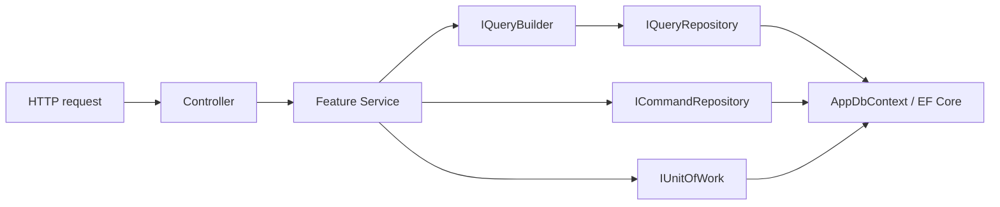
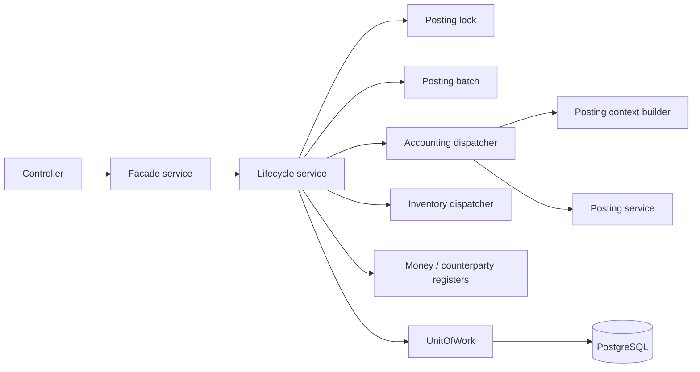
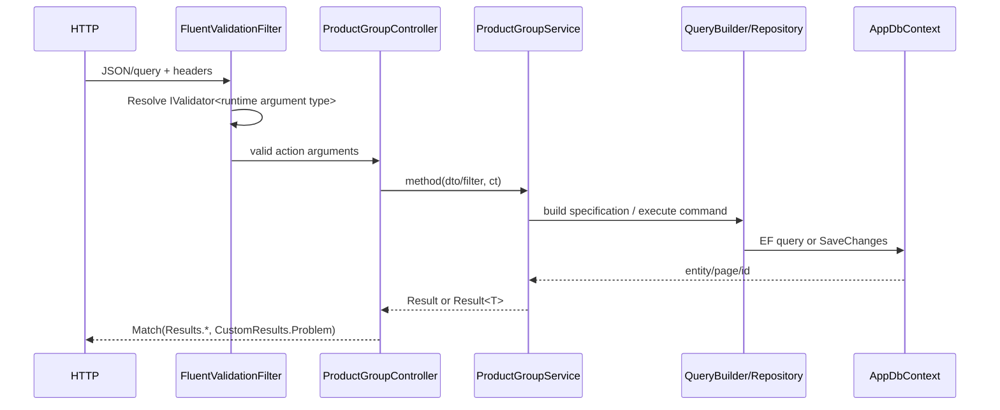

# Глубокий анализ сервисного слоя AccountingBack

Дата статического среза: **2026-08-31**. В анализ включено текущее состояние рабочей копии, включая локальные изменения. На момент начала исследования `git status --short --branch` показывал чистую ветку `master...origin/master`.

## Методика и границы достоверности

- Исследован весь `src`: 2 197 C#-файлов без `bin/obj`, в том числе `Application`, `Infrastructure`, `Presentation`, `Domain` и `SharedKernel`.
- Автоматические метрики получены поиском деклараций и сигнатур. Они отмечены как **статический подсчёт**: partial-классы, вложенные типы, перегрузки и форматирование могут давать небольшую погрешность.
- Архитектурные выводы проверены чтением фактических реализаций: DI, `BaseService`, repositories, query builders, `UnitOfWork`, controllers и крупных сценариев Purchase/Sale/Cash/EDO/Payroll/Rebuild.
- Под «service interface» в метриках понимается интерфейс с именем `I*Service`; порты `*Repository`, `*Store`, `*Provider`, `*Dispatcher`, `*Lock` считаются отдельно.
- Секреты, строки подключений, токены и пароли не исследовались и в документ не включены.

---

# 1. Общая карта сервисного слоя

## 1.1. Физическое размещение

| Вид | Фактическое место | Примеры |
|---|---|---|
| Feature service interfaces | Обычно рядом с реализацией в `src/Application/Features/<Area>/<Feature>/Services` | `Inv/ProductGroups/Services/IProductGroupService.cs`, `Pur/PurchaseDocs/Services/IPurchaseDocService.cs` |
| Feature implementations | Там же, папка `Services`; в старых/компактных feature — прямо в корне feature | `ProductGroupService.cs`; `Reports/FinancialReports/FinancialReportService.cs`; `Hr/Absences/HrAbsenceService.cs` |
| Общие application ports | `src/Application/Abstractions` | `IUnitOfWork`, `IQueryRepository<TEntity>`, `ICommandRepository<TEntity>`, `ITrackingRepository<TEntity>`, `IDocumentPostingLock` |
| Integration application ports | `src/Application/Abstractions/Integration` и `.../Integration/Edo` | `IFakturaService`, `IEdoProvider`, `IEdoDocumentStore`, `IEdoImportStore` |
| Infrastructure implementations | `src/Infrastructure/Repositories`, `Services`, `Context`, `Integration` | `UnitOfWork`, `QueryRepository`, `DocumentPostingLock`, EDO stores |
| External provider adapters | `src/Infrastructure/Integration/*` | `DidoxEdoProvider`, `EdocsEdoProvider`, `FakturaEdoProvider`, AslBelgi services |
| Background jobs | `src/Infrastructure/BackgroundServices` | `RentalAccrualJob`, `EdoImportPreflightJob`, `EdoBulkDraftImportJob` |
| Controllers | `src/Presentation/WebApi/Controllers` | 98 controller-файлов по статическому подсчёту |
| DI composition root | `src/Application/DependencyInjection.cs`, `src/Infrastructure/DependencyInjection.cs`, feature `ServiceCollectionExtensions.cs`, `HostConfiguration.Extensions.cs` | Scrutor + явные регистрации + Quartz |

Исключение границы слоёв: `IFakturaTokenService` объявлен внутри `src/Infrastructure/Integration/Faktura/Http/IFakturaTokenService.cs`, то есть infrastructure-контракт находится не в Application.

## 1.2. Количественная карта

Статический подсчёт по всем production-проектам:

| Метрика | Значение |
|---|---:|
| Интерфейсы `I*Service` | 159 |
| Классы `*Service` (без abstract) | 163 декларации, 159 уникальных имён |
| Lifecycle implementations | 16 |
| Реализации, наследующие `BaseService` | 72 |
| Реализации без `BaseService` | 91 |
| Публичные методы в классах `*Service` | 726 |
| Service interfaces, упомянутые controllers | 111 из 158 Application-интерфейсов |
| Application service interfaces, не используемые controllers напрямую | 47 |

Все 159 интерфейсов `I*Service` имеют реализацию с ожидаемым именем без начальной `I`. Все классы `*Service` имеют такой интерфейс. Это проверка по naming convention; она не доказывает семантическую совместимость реализации.

Автоматическая сверка DI-файлов показала:

- ни один класс `*Service` не остался без упоминания в composition root или module extension;
- точных дублирующих пар `lifetime + interface + implementation` не найдено;
- несколько реализаций намеренно зарегистрированы для `IEdoProvider`, `IEdoHistoricalDocumentSource`, `ITaxProvider`;
- `IEdoImportPreflightScheduler` имеет условную singleton-реализацию: Quartz или disabled scheduler.

## 1.3. Основное направление зависимостей



Фактически `QueryBuilder` не выполняет SQL. Он собирает `QuerySpecification`; SQL выполняет `QueryRepository` через EF Core.

Сложный документный путь:



Пример — Purchase: `PurchaseDocController` → `IPurchaseDocService` → `PurchaseDocService` → `IPurchaseLifecycleService` → `PurchaseLifecycleService` → accounting/inventory/counterparty services → repositories → `UnitOfWork`.

## 1.4. Внешние и внутренние сервисы

Напрямую controllers получают facade/read services: `IProductGroupService`, `IPurchaseDocService`, `ICashCollectionService`, `IAccountingReportService`, `IBankStatementParserService`, `IReportExporter` и т. п. Controllers почти всегда зависят от интерфейса, а не concrete type.

Только внутренними являются:

- lifecycle: `IPurchaseLifecycleService`, `ISaleLifecycleService`, `ICashLifecycleService`;
- posting: `IAccountingDispatcher`, `IPostingContextDispatcher`, `IPostingService`;
- registers: `IPurchaseCounterpartyRegisterService`, `ICashMoneyRegisterService`;
- guards/locks: `IActiveInventoryCountGuardService`, `IDocumentPostingLock`;
- EDO stores/resolvers/idempotency;
- account resolvers и provider-specific adapters.

Фасад скрывает внутренние зависимости. Например, `PurchaseDocService.ConfirmAsync` лишь делегирует:

```csharp
public Task<Result> ConfirmAsync(long id, CancellationToken ct = default) =>
    _purchaseLifecycleService.ConfirmAsync(id, ct);
```

## 1.5. Lifetimes

- Основной lifetime application/repository/query компонентов — `Scoped` (`src/Infrastructure/DependencyInjection.cs`).
- Scrutor регистрирует criteria/projection/order/report builders как `Scoped` (`src/Application/DependencyInjection.cs`, блок builder scanning).
- `TimeProvider.System`, background organization scope, token caches, provider factories/schedulers в отдельных случаях — `Singleton`.
- retry/auth HTTP handlers и часть providers — `Transient`.
- Quartz jobs создаются scheduler-ом; их зависимости разрешаются через DI scope Quartz.

Статически подтверждённого captive dependency `Singleton → Scoped` в явно проверенных singleton-service конструкторах нет. Например, singleton `FakturaService` зависит только от `IHttpClientFactory`. Полную гарантию даёт только запуск host с `ValidateScopes/ValidateOnBuild`, а не grep-анализ.

---

# 2. Файловая архитектура feature

## 2.1. Современный CRUD layout

Наиболее полный пример — `src/Application/Features/Inv/ProductGroups`:

```text
ProductGroups/
├── DTOs/
├── Errors/
├── Filters/
├── OrderBy/
├── Projections/
├── Queries/
├── Services/
└── Validators/
```

Другие примеры: `Inv/Products`, `Counterparty/CounterpartyCards`, `Bank/OrgBankAccounts`.

Назначение:

- `DTOs`: transport/application models;
- `Filters`: list/search/pagination inputs;
- `Validators`: FluentValidation для action arguments;
- `Errors`: мультиязычные factories `Error.*`;
- `Queries`: `ICriteriaBuilder<TEntity,TFilter>`;
- `Projections`: `IProjectionBuilder<TEntity,TDto>`;
- `OrderBy`: `IOrderByBuilder<TEntity,TListDto>`;
- `Services`: interface + implementation.

Builders используются не сервисом напрямую, а через `IQueryBuilderResolver`, разрешающий их из DI.

## 2.2. Document + lifecycle layout

`src/Application/Features/Pur/PurchaseDocs`:

```text
PurchaseDocs/
├── DTOs/                 # header, lines, preview, EDO/preflight models
├── Errors/
├── Filters/
├── OrderBy/
├── Projections/
├── Queries/
├── Services/
│   ├── IPurchaseDocService.cs
│   ├── PurchaseDocService.cs
│   ├── IPurchaseLifecycleService.cs
│   ├── PurchaseLifecycleService.cs
│   ├── EdoImportPreflightService.cs
│   └── EdoImportPreflightProcessor.cs
└── Validators/
```

Аналоги: `Sale/SaleDocs`, `Inv/WarehouseTransfers`, `Inv/InventoryAdjustments`, `Cash/CashOperations`, FA document features.

Отличие от CRUD: facade управляет draft CRUD; lifecycle — status transition и effects; posting builders и register services размещены в отдельных cross-feature модулях.

## 2.3. Компактный/старый layout

Есть feature без подпапок:

```text
Reports/FinancialReports/
├── FinancialReportDtos.cs
└── FinancialReportService.cs   # interface и implementation в одном файле
```

Другие примеры: `Hr/Absences`, `Hr/Schedules`, `Integration/Edo`. В них DTO, interface, implementation и helpers лежат рядом. Это не единый новый стандарт, а фактически используемая альтернативная организация.

## 2.4. Report layout

Сосуществуют два варианта:

1. Старый/основной accounting report: `Features/AccountingReports/{DTOs,Errors,Filters,Models,Repositories,Services}` + специализированные read repositories в Infrastructure.
2. Новый presentation-oriented модуль `Features/Reports` с `Contracts`, `DTOs`, `Models`, `Validation`, `Exports` и area-папками.

`FinancialReportService` и `SalesReportService` в новом модуле в основном адаптируют старые сервисы. Интерфейсы `IReportQuery<,>` и `IReportBuilder<,>` существуют и сканируются Scrutor, но production-реализаций этих generic-контрактов поиск не нашёл. Это признак незавершённой/неиспользуемой абстракции.

## 2.5. Integration/import/preflight layout

- `Features/BankParsers/{DTOs,Errors,Services}` — parser + classifier.
- `Features/Imports` — общий `ExcelImporter`, options/row DTO и module registration.
- `Features/Integration/Edo/UnifiedImport` — plan/apply/status orchestration, DTO и errors.
- `Pur/PurchaseDocs/Services/EdoImportPreflightService.cs` — исторический импорт и его большой state machine находится внутри Purchase feature.
- Provider adapters живут в `Infrastructure/Integration/{Edocs,Didox,Faktura,AslBelgi}`.

## 2.6. Resolver/builder/dispatcher layout

- Query abstractions: `src/SharedKernel/Query`.
- Query implementations: `src/Infrastructure/Query`.
- Accounting posting: `Features/Register/PostingEngines/{Builders,Models,Services}`.
- Inventory dispatch: `Features/Inv/InventoryMovements/Services/Handlers`.
- Tax resolver/calculator: `Features/Cmn/Taxes/Services`.
- Payroll account resolver: `Features/Pay/PayrollDocuments/Services/PayrollAccountResolver.cs`.

## 2.7. Background layout

Quartz jobs находятся в Infrastructure, расписание — в Presentation composition root:

- `Infrastructure/BackgroundServices/RentalAccrualJob.cs`;
- `EdoImportPreflightJob.cs`;
- `EdoBulkDraftImportJob.cs`;
- `ContractExpiryNotificationJob.cs`;
- `NotificationEmailDispatchJob.cs`;
- `BackupJob.cs`;
- `AdjustBalanceJob.cs` (сейчас фактически no-op).

Расписания задаются в `src/Presentation/WebApi/Configuration/HostConfiguration.Extensions.cs`.

## 2.8. Фактическая распространённость папок

По именам директорий в `Application/Features`: 88 `Services`, 84 `DTOs`, 83 `Errors`, 64 `Filters`, 59 `OrderBy`, 56 `Projections`, 55 `Queries`, 49 `Validators`, 9 `Models`, 7 `Repositories`. Следовательно, полный CRUD layout распространён, но не обязателен.

---

# 3. Все виды сервисов

| Тип | Ответственность и зависимости | Транзакция / controller | Реальные примеры |
|---|---|---|---|
| CRUD service | list/detail/create/update/soft-delete; `IQueryBuilder`, generic repositories, `IUserContext` | Обычно facade, вызывается controller; create/update иногда `BaseService` transaction | `ProductGroupService`, `CashBoxService`, `CounterpartyContactService` |
| Document facade | draft CRUD, numbering, lines, audit; delegation lifecycle | Create/update/delete владеют transaction; confirm делегируют | `PurchaseDocService`, `SaleDocService`, `CashCollectionService` |
| Lifecycle | status rules, lock, period, posting batch, effects, reversal | Почти всегда `ExecuteInTransactionAsync`; внутренний | `PurchaseLifecycleService`, `CashLifecycleService`, `CashCollectionLifecycleService` |
| Posting service | превращает `PostingContext` в register entries, subkonto/quantity rules | Не владеет transaction; вызывается dispatcher | `PostingService` |
| Register service | создаёт/реверсирует money/counterparty rows | Не открывает transaction; вызывается lifecycle | `PurchaseCounterpartyRegisterService`, `CashCollectionMoneyService`, `CashMoneyRegisterService` |
| Inventory/money movement | handlers создают entries, balance service применяет их | Transaction принадлежит lifecycle | `InventoryDispatcher`, `WarehouseProductBalanceService` |
| Resolver | выбирает builder/provider/account/policy | Обычно read-only, без transaction | `QueryBuilderResolver`, `OrganizationAccountingPolicyResolver`, `PayrollAccountResolver` |
| Builder | строит expression или posting context | Не владеет transaction | `ProductGroupListDtoProjection`, `PurchaseDocContextBuilder` |
| Dispatcher | выбирает handler по runtime type и запускает цепочку | Не владеет transaction | `AccountingDispatcher`, `PostingContextDispatcher`, `InventoryDispatcher` |
| Orchestrator | координирует несколько subsystems/providers/state transitions | Может явно управлять несколькими transactions | `EdoUnifiedImportService`, `RepostService`, `AiAssistantOrchestrator` |
| Parser | читает внешний формат в DTO | Без transaction, затем enrichment/classification | `BankStatementParserService`, `BankStatementTemplateParser`, `ExcelImporter` |
| Import/preflight | plan → validate hash → apply → job/status; recovery | Смешивает `BaseService` transaction и store save | `EdoImportPreflightService`, `EdoImportPreflightProcessor`, `EdoUnifiedImportService` |
| Report | read repositories, aggregates, mapping | Без transaction; controller-facing | `AccountingReportService`, `LedgerService`, `TrialBalanceService` |
| Integration adapter | HTTP/provider contract translation | Как правило без business transaction; persistence может использовать DbContext | `DidoxEdoProvider`, `EdocsFacturaService`, `CentralBankCurrencyRateProvider` |
| Background service/job | запуск application use case по расписанию | Transaction внутри вызываемого service | `RentalAccrualJob`, `EdoImportPreflightJob` |
| File/PDF/export | stream/bytes/output format | Без transaction | `DocumentPdfService`, `ReportExporter`, `PdfReportExporter`, `ExcelReportExporter` |
| Business-rule service | отдельная проверка/расчёт | Обычно без transaction | `AccountingPeriodValidator`, `RetailSaleVatCalculator`, `RentalAccrualCalculator` |
| Guard | запрещает операцию при активном состоянии | read-only | `ActiveInventoryCountGuardService` |
| Lock/idempotency | PostgreSQL advisory lock или persisted idempotency record | Lock требует ambient transaction; idempotency сам открывает transaction | `DocumentPostingLock`, `EdoIdempotencyService`, `BankOperationDuplicateChecker` |

### Типичные входы/выходы

- CRUD: `CreateDto/UpdateDto/ListFilter` → `Result<long|int>`, `Result`, `Result<Dto>`, `Result<PagedResponse<ListDto>>`.
- Lifecycle: primitive `documentId` (+ confirm DTO для Sale) → `Result`.
- Posting/register: domain entity → `Result<List<...Entry>>`.
- Parser: `Stream + bankId` → `Result<BankExportDto>`.
- Report: filter → `Result<ReportDto>`.
- Background: Quartz `IJobExecutionContext` → `Task`; бизнес-ошибка часто превращается в `JobExecutionException`.

---

# 4. Service interfaces

## 4.1. Размещение и naming

153 из 159 `I*Service` объявлены в `Application/Features`, пять — в `Application/Abstractions`, один — в Infrastructure. Обычно interface лежит рядом с class; исключения — compact feature, где оба типа в одном файле (`FinancialReportService.cs`, `CashCollectionMoneyService.cs`).

## 4.2. Таблица шаблонов сигнатур

| Шаблон | Пример | Семантика |
|---|---|---|
| `Task<Result<PagedResponse<TList>>> GetAllAsync(TFilter, CancellationToken)` | `IProductGroupService.GetAllAsync` | Пагинированный query |
| `Task<Result<List<T>>> GetListAsync(...)` | встречается в selection/report features | Непагинированный список |
| `Task<Result<TDto>> GetByIdAsync(id, CancellationToken)` | большинство CRUD | Detail projection |
| `Task<Result<long/int>> CreateAsync(TCreateDto, CancellationToken)` | Purchase/ProductGroup | Новый id |
| `Task<Result> UpdateAsync(id,TUpdateDto,CancellationToken)` | CRUD | Нет response body |
| `Task<Result> ConfirmAsync(id,...)` | lifecycle | Posting transition |
| `Task<Result> CancelAsync(id,...)` | lifecycle | Reversal/cancel transition |
| `Task<Result<List<TEntity>>> PostAsync(TDocument,batchId,ct)` | register services | Возвращает созданные domain entries |
| `Task<Result<List<TEntity>>> ReverseAsync(...)` | register services | Возвращает reversal rows |
| `Task<Result<TPreview>> PreviewAsync(TRequest,ct)` | Purchase/currency revaluation | Только расчёт/resolve, без фиксации документа |
| `Task<Result<TPlan>> GetPlanAsync(...)` | Unified EDO | Deterministic preflight + hash |
| `Task<Result<TResponse>> ApplyBatchAsync(TRequest,ct)` | Unified EDO | Persisted apply |
| `Task<Result<T>> ParseAsync(Stream,int,ct)` | bank parser | Stream boundary |
| `Task<T>` без `Result` | integration ports, manual lists | Исключения/null используются как альтернативный контракт |
| `Task<bool>` | posting lock/guards | Узкий technical outcome |

## 4.3. CancellationToken и Result

Из 726 публичных методов classes `*Service` статический анализ нашёл восемь без `CancellationToken`. Существенные примеры:

- `PostingService.BuildEntriesAsync(List<PostingContext>)`;
- `AuditLogService.CreateAsync`, `GetByRecordAsync`, setters;
- `FakturaService.GetCompanyDataAsync`.

116 публичных методов classes `*Service` не возвращают `Result`; 48 из них — `ManualService` с `Task<List<SelectListDto>>`. Integration adapters также часто возвращают provider DTO и сигнализируют ошибку исключением. Поэтому `Result` — преобладающий, но не универсальный контракт.

## 4.4. Нетипичные параметры

- `Stream` используется корректно на application boundary: `IBankStatementParserService`, `IExcelImporter`, HR file ports.
- `IFormFile` в Application service signatures не найден: он остаётся в controller/presentation.
- Domain entity намеренно передаётся между внутренними services: `IPurchaseCounterpartyRegisterService.PostAsync(PurchaseDoc,...)`, posting/inventory dispatchers.
- Primitive-heavy signatures характерны для locks/resolvers: `AcquireMoneyAsync(int organizationId,string sourceType,int sourceId,...)`.
- Один DTO может быть input и output: `IBankStatementParserService.EnrichAsync(BankExportDto export)` мутирует и возвращает тот же graph.

## 4.5. Большие и смешанные interfaces

- `IEdoImportPreflightService` содержит job, candidates, mapping plans, apply/requeue/cancel/status — широкий use-case interface.
- `IManualService` объединяет десятки справочников.
- `IPurchaseDocService` совмещает CRUD, lifecycle forwarding, preview и EDO creation; дополнительный `IEdoHistoricalPurchaseDraftFactory` частично отделяет integration use case.
- `IAuditLogService` сочетает mutable state setters, write и query/JSON diff.

---

# 5. Реализации сервисов и стиль класса

## 5.1. Общие наблюдения

- 13 из 163 declarations `*Service` используют primary constructor; преобладает обычный constructor + `private readonly` fields.
- `IUserContext` встречается в 143 service declarations, `ILogger` — в 84.
- В Application нет прямой зависимости от `AppDbContext`; восемь infrastructure services используют его непосредственно.
- 72 сервиса наследуют `BaseService`; остальные либо read-only/technical, либо имеют собственную orchestration обвязку.
- `DateTime.Now/DateTime.UtcNow` преобладают; `TimeProvider` фактически применяется прежде всего в EDO preflight. Это затрудняет детерминированные тесты остальных сервисов.

## 5.2. Простой CRUD: ProductGroupService

Файл: `src/Application/Features/Inv/ProductGroups/Services/ProductGroupService.cs`.

Зависимости: `IUserContext`, `IQueryBuilder`, query/command repository, logger, UoW. Наследует `BaseService`.

- `GetAllAsync`: строит `BuildPaged<ProductGroup,ProductGroupListDto,ProductGroupListFilter>`, repository выполняет projection/paging, затем `PagedResponseFactory`.
- `GetByIdAsync`: fluent query `Where(...).As<ProductGroupDto>().Build()`, затем дополнительная in-memory фильтрация products по `isService`.
- `CreateAsync`: вручную map DTO → `ProductGroup` и nested `Product`; command repository сразу сохраняет.
- `UpdateAsync`: tracked entity + Include products, ручной update/add/soft-disable children.
- `DeleteAsync`: soft delete через `StateId = PASSIVE`.

Класс не использует transaction wrapper для CRUD, хотя command repository сам вызывает `SaveChangesAsync`; Create group с nested products сохраняется одним EF save.

## 5.3. Сложный document facade: PurchaseDocService

Файл имеет 1 652 строки и 23 readonly dependencies. Класс отвечает сразу за list/detail, preview, EDO normalization, draft CRUD, line/product-table construction, numbering, audit и lifecycle delegation.

Ключевые методы:

- `GetAllAsync`/`GetByIdAsync`: standard QueryBuilder projections;
- `PreviewAsync`: resolve counterparty/contract/products/units/VAT/currency/warehouse без сохранения;
- `CreateFromEdoAsync` и `CreateFromHistoricalSnapshotAsync`: provider DTO → normalized purchase draft;
- `CreateAsync`: `ExecuteInTransactionAsync` → validate references → build lines → `IDocumentNumberService.GetNextAsync` → save → optional immediate confirm → audit;
- `UpdateAsync`: status DRAFT, rebuild lines/tables, update totals, audit;
- `ConfirmAsync`/`CancelAsync`: delegation lifecycle;
- `DeleteAsync`: soft-delete draft плюс physical deletion child inventory drafts.

## 5.4. Lifecycle: PurchaseLifecycleService

`ConfirmAsync` владеет transaction и выполняет:

1. organization check;
2. advisory document lock;
3. aggregate load with lines/product tables;
4. idempotent status handling;
5. open accounting period;
6. active inventory count guard;
7. structural line validation;
8. check absence of posting/effects;
9. posting batch;
10. accounting dispatcher;
11. inventory dispatcher;
12. counterparty register;
13. cost price update;
14. status/audit.

`CancelAsync` строит reversal batch, зеркальные accounting entries/subkonto, reverse inventory/counterparty effects и переводит active batch в `REVERSED`.

## 5.5. Report: AccountingReportService

Файл: `src/Application/Features/AccountingReports/Services/AccountingReportService.cs`.

Это read-only service без `BaseService`. Он:

- валидирует period/date/currency;
- читает trial balance/ledger через специализированные read repositories;
- строит balance sheet/income/cash flow/account turnover/card/journal;
- вручную map read rows → DTO;
- возвращает `Result<T>`, но не открывает transaction.

`FinancialReportService` в `Features/Reports` является тонким adapter к нему.

## 5.6. Import/integration: BankStatementParserService

Сигнатура:

```csharp
Task<Result<BankExportDto>> ParseAsync(Stream stream, int bankId, CancellationToken ct = default);
```

Порядок: templates из БД → `ClosedXML` parser по версиям → DB enrichment bank/branch/account/counterparty → classification → special bank-service substitution → duplicate flags. Сервис не сохраняет bank operations и не владеет transaction.

Primary constructor чаще используется в новом EDO-коде (`EdoUnifiedImportService`, `EdoInboxService`), тогда как CRUD/documents сохраняют классический constructor стиль.

---

# 6. Методы сервисов

| Метод | Назначение и типичный алгоритм | Пример |
|---|---|---|
| `GetAllAsync` | validate filter → query/specification → projection → count/page → Result | `ProductGroupService.GetAllAsync` |
| `GetListAsync` | непагинированный selection/report list | report/manual services |
| `GetByIdAsync` | org-scoped predicate → projection/Include → NotFound | `PurchaseDocService.GetByIdAsync(long,ct)` |
| `CreateAsync` | org → FK/business validation → numbering/map → command → audit | `CashCollectionService.CreateAsync` |
| `CreateManyAsync` | batch map/create; встречается реже и чаще в command/store contracts | import/register features |
| `UpdateAsync` | load tracked → status check → old audit → mutate → save → new audit | `PurchaseDocService.UpdateAsync` |
| `DeleteAsync` | draft/status check → soft delete; children иногда physical delete | ProductGroup/Purchase |
| `ConfirmAsync` | lock → period → validate → batch → accounting/register effects → POSTED | Purchase/Cash/Payroll |
| `CancelAsync` | idempotency/status → period → reversal entries → CANCELLED | Purchase/Cash/Payroll |
| `PostAsync` | domain doc → append register rows | `PurchaseCounterpartyRegisterService.PostAsync` |
| `ReverseAsync` | find originals → create linked inverse rows | register/inventory services |
| `PreviewAsync` | resolve/calculation only; no document write | `PurchaseDocService.PreviewAsync` |
| `GetPlanAsync` | compute candidates/status/mapping/hash | `EdoUnifiedImportService.GetPlanAsync` |
| `ApplyAsync/ApplyBatchAsync` | revalidate plan/hash/idempotency → persist state → process items | unified/preflight imports |
| `ResolveAsync` | choose mapping/account/provider/rule | tax/payroll/import resolvers |
| `ParseAsync` | external bytes/stream → neutral DTO | bank parser |
| `EnrichAsync` | neutral DTO → IDs/names/classification metadata | bank parser |
| `StartAsync` | create persisted job and schedule processor | `EdoImportPreflightService.StartAsync` |
| `ProcessAsync` | dispatcher/worker execution | accounting/inventory/EDO processor |
| `GetStatusAsync/GetJobAsync` | persisted state snapshot | currency import/EDO preflight |
| `RebuildAsync` | lock → load posted source → delete entries → dispatch again | `AccountingRegisterEntryRebuildService` |
| `RepostAsync` | cancel + confirm per supported document | `RepostService` |
| `CalculateAsync` | domain calculation + draft document | `PayrollDocumentService.CalculateAsync` |
| `ExportAsync` | query result → Excel/PDF bytes/stream | report exporters |

Общий порядок write-метода: guard clauses → scoped read → business validation → map/mutate → repository write → audit → `Result`. Transaction wrapper применяется не ко всем writes, потому что `CommandRepository` сам сохраняет каждую команду.

Обработка ошибок имеет три ветви:

1. ожидаемая business/validation ошибка → `Result.Failure(feature Errors...)`;
2. infrastructure/provider exception → пробрасывается к `GlobalExceptionHandler`;
3. invariant/configuration/reflection ошибка → `InvalidOperationException`/`ArgumentException`.

---

# 7. Подробный разбор типового CRUD

Выбран `ProductGroups`, потому что feature содержит полный фактический layout.

## 7.1. Состав

| Элемент | Файл |
|---|---|
| Controller | `src/Presentation/WebApi/Controllers/Inv/ProductGroupController.cs` |
| Interface/implementation | `.../Services/IProductGroupService.cs`, `ProductGroupService.cs` |
| DTO | `DTOs/ProductGroupBaseDto.cs`, `CreateDto`, `UpdateDto`, `Dto`, `ListDto` |
| Filter | `Filters/ProductGroupListFilter.cs` |
| Validators | `Validators/ProductGroup*Validator.cs` |
| Errors | `Errors/ProductGroupErrors.cs` |
| Criteria | `Queries/ProductGroupByListFilterCriteriaBuilder.cs`, result criteria builder |
| Projections | `Projections/ProductGroupDtoProjection.cs`, list projection |
| Order | `OrderBy/ProductGroupListDtoOrderByBuilder.cs` |
| Generic repositories | `IQueryRepository<ProductGroup>`, `ICommandRepository<ProductGroup>` |
| DI | service явно в `Infrastructure/DependencyInjection.cs`; builders Scrutor |

## 7.2. HTTP pipeline



## 7.3. Create

1. ASP.NET binds `ProductGroupCreateDto`.
2. `FluentValidationFilter` resolves exact `IValidator<ProductGroupCreateDto>`.
3. `ProductGroupCreateDtoValidator` includes base rules, validates MXIK length for child products.
4. Controller checks permission and calls service.
5. Service checks organization only if nested products exist.
6. Manual map creates `ProductGroup` and child `Product` graph.
7. `ICommandRepository.CreateAsync` calls `DbSet.AddAsync` and immediately `SaveChangesAsync`.
8. Implicit conversion `int → Result<int>` returns id.

Неиспользованная фактическая ошибка: `ProductGroupErrors.CodeConflict` объявлена, но service заранее не проверяет code conflict; DB exception будет обработан инфраструктурой.

## 7.4. GetAll

`BuildPaged<ProductGroup,ProductGroupListDto,ProductGroupListFilter>` разрешает:

- entity criteria: `IsAssignable` и optional `Products.Any(IsService)`;
- result criteria: case-insensitive name search;
- projection: translation по `LanguageId`, fallback на `group.Name`;
- order: `SortOrder → Name → Id`.

`QueryRepository.GetPagedAsync<TResult>` применяет entity predicate, projection, result predicate, order, count, skip/take и `AsNoTracking`.

## 7.5. GetById

Service явно добавляет `group.Id == id && group.IsAssignable`, использует registered detail projection, возвращает localized NotFound. Optional `isService` фильтрует уже материализованную nested collection, а не SQL.

## 7.6. Update

1. Определяется наличие новых products и обязательность organization.
2. Entity query добавляет Include products; entity read остаётся tracked.
3. Обновляются scalar fields.
4. Child с id обновляется; без id создаётся.
5. Отсутствующие в DTO existing children переводятся в PASSIVE.
6. `CommandRepository.UpdateAsync` вызывает `DbSet.Update` + save.

Здесь DTO одновременно задаёт полный desired set children; отсутствие строки означает soft delete.

## 7.7. Delete

Это soft delete: entity загружается, `StateId = PASSIVE`, затем update/save. Query не добавляет organization predicate, потому что `ProductGroup` — общий справочник; это отличается от organization-scoped product rows.

---

# 8. Подробный разбор документного сервиса

Выбран PurchaseDoc.

## 8.1. Модели и validation

- `PurchaseDocBaseDto`: header + lines;
- `PurchaseDocCreateDto`/`UpdateDto`: write contracts;
- `PurchaseDocDto`: detail с lines/tables/account/display fields;
- `PurchaseDocListDto`: list projection;
- `PurchaseDocPreview*`: unresolved/resolved provider input;
- `PurchaseDocBaseDtoValidator`: syntactic rules; FK/status/period остаются в services.

## 8.2. Create sequence

```text
PurchaseDocController.Create
→ PurchaseDocService.CreateAsync
→ BaseService.ExecuteInTransactionAsync
→ ValidateHeaderReferencesAsync
→ BuildAllLinesAsync
→ DocumentNumberService.GetNextAsync(org, PURCHASE, docDate)
→ ICommandRepository<PurchaseDoc>.CreateAsync
→ optional PurchaseLifecycleService.ConfirmAsync
→ AuditLogService
→ outer UnitOfWork.CommitAsync
```

Totals рассчитываются из lines:

```csharp
TotalAmount = allLines.Sum(l => l.Amount);
VatAmount   = allLines.Sum(l => l.VatAmount);
FinalAmount = allLines.Sum(l => l.TotalAmount);
```

Номер не принимается от клиента: генерируется `IDocumentNumberService`; status устанавливается `DRAFT`.

## 8.3. Update sequence

- только DRAFT;
- old DTO → audit;
- заново validate header и rebuild lines;
- существующие purchase-table links и product tables удаляются;
- новые lines получают `OwnerId` и создаются;
- totals пересчитываются;
- header update;
- new DTO → audit.

Из-за `CommandRepository` несколько `SaveChangesAsync` происходят внутри одной ambient transaction. Rollback откатит БД, но ChangeTracker после rollback не очищается.

## 8.4. Confirm sequence

```text
PurchaseDocService.ConfirmAsync
→ PurchaseLifecycleService.ConfirmAsync [transaction owner]
→ DocumentPostingLock.AcquireAsync
→ open period + inventory-count guard
→ ValidateForConfirm
→ PostingBatch(POSTED)
→ AccountingDispatcher.ProcessAsync
   → PostingContextDispatcher
   → PurchaseDocContextBuilder
   → PostingService.BuildEntriesAsync
   → AccountingRegisterEntry command
→ InventoryDispatcher.ProcessAsync
   → PurchaseInventoryHandler
   → WarehouseProductBalanceService
→ PurchaseCounterpartyRegisterService.PostAsync
→ product cost recalculation
→ PurchaseDoc.Status = POSTED
→ audit
→ UnitOfWork.CommitAsync
```

Idempotency: POSTED + active posting batch возвращает success; наличие effects при другом состоянии даёт conflict.

## 8.5. Cancel sequence

- DRAFT/PENDING: удаляются draft product tables, затем document CANCELLED.
- POSTED: создаётся reversal posting batch; accounting rows копируются с Debit/Credit и subkonto sides наоборот; inventory dispatcher reverse; counterparty register reverse; active batch → REVERSED; cost price пересчитывается; document → CANCELLED.

Cancel проверяет исходный и текущий reversal periods, inventory state и наличие original effects.

## 8.6. Владение transaction

| Компонент | Роль |
|---|---|
| `PurchaseDocService.Create/Update/Delete` | Открывает outer transaction |
| `PurchaseLifecycleService.Confirm/Cancel` | Открывает transaction; при nested immediate confirm увеличивает depth того же UoW |
| `AccountingDispatcher`, `InventoryDispatcher`, register services | Не открывают; добавляют/сохраняют изменения в ambient transaction |
| `CommandRepository` | Вызывает SaveChanges на каждом write, но не commit transaction |
| `UnitOfWork.CommitAsync` | На depth 1 дополнительно saves pending changes и commits DB transaction |

## 8.7. Итоговые сущности/tables

Create draft: `PurchaseDoc`, `PurchaseDocProduct`, `PurchaseDocTable/ProductTable` по tracking policy. Confirm дополнительно создаёт `PostingBatch`, `AccountingRegisterEntry`, `RegisterEntrySubkonto`, warehouse movements/balances, `CounterpartyRegisterBalance`, product cost prices и audit log.

---

# 9. BaseService

Файл: `src/Application/Features/BaseService.cs`.

## 9.1. Состояние и зависимости

```csharp
public abstract class BaseService
{
    private readonly ILogger _logger;
    private readonly IUnitOfWork _unitOfWork;
    private string ServiceName => GetType().Name;
}
```

Класс не зависит от `IUserContext`, поэтому organization/language checks остаются в наследниках. Constructor обычный, не primary.

## 9.2. Публичная protected API

```csharp
protected Task<Result<T>> ExecuteAsync<T>(string operationName, Func<Task<Result<T>>> operation);
protected Task<Result> ExecuteAsync(string operationName, Func<Task<Result>> operation);
protected Task<Result<T>> ExecuteInTransactionAsync<T>(
    string operationName,
    Func<Task<Result<T>>> operation,
    CancellationToken ct);
protected Task<Result> ExecuteInTransactionAsync(
    string operationName,
    Func<Task<Result>> operation,
    CancellationToken ct);
```

`ExecuteAsync` только логирует начало/результат; он **не** вызывает `SaveChanges` и не ловит исключения. Persistence происходит внутри repositories/services.

`ExecuteInTransactionAsync`:

1. `IUnitOfWork.BeginAsync(ct)`;
2. выполняет delegate;
3. success → `CommitAsync`; failed Result → `RollbackAsync`;
4. логирует result;
5. exception → пытается rollback, логирует type, повторно `throw`.

Исключение не преобразуется в `Result`. Это сознательная граница: expected failure должен быть создан внутри operation; unexpected exception обрабатывает Presentation exception handler.

## 9.3. Logging

- начало: Information `Processing {Service}.{Operation}`;
- success: Information;
- NotFound: Warning;
- остальные failed Result: Error;
- exception: Error только с exception type; сам exception object в текущем вызове logger не передан, поэтому stack trace может не попасть в structured log из этой записи, хотя GlobalExceptionHandler пишет exception целиком.

## 9.4. Commit/rollback и cancellation

- Token передаётся Begin/Commit/Rollback только transaction overload.
- Non-transaction `ExecuteAsync` не принимает token; token замыкается самим service method в repository calls.
- Если rollback с отменённым `ct` тоже отменится/упадёт, `TryRollbackAsync` подавляет вторую ошибку и повторно бросает исходную.
- При failed `Result` rollback выполняется без exception.

## 9.5. Вложенные вызовы

`UnitOfWork` поддерживает `_depth`. Nested `BeginAsync` не открывает savepoint, а только увеличивает depth. Inner `CommitAsync` уменьшает depth и ничего не commits. Outer commit фиксирует всё.

Критическая особенность: inner rollback не использует savepoint — он откатывает всю transaction и сбрасывает depth в ноль. Это безопасно, пока outer method сразу возвращает inner failure; продолжение outer flow после inner failure было бы ошибочным.

## 9.6. Использование и альтернативы

72 service classes используют `BaseService`. Типичные: CRUD writes, document facades/lifecycles, payroll, repost/rebuild.

Без него работают:

- read-only reports (`AccountingReportService`);
- builders/dispatchers/register helpers;
- parsers;
- provider adapters;
- compact services с ручным flow;
- `EdoUnifiedImportService`, который сам вызывает `unitOfWork.Begin/Save/Commit/Rollback`.

Локальная альтернатива есть в `EdoImportPreflightProcessor.ExecuteInTransactionAsync(Func<Task>,ct)`: собственный try/commit/catch/rollback без Result-aware rollback.

---

# 10. Модели сервисного слоя

## 10.1. Фактические категории

| Категория | Input/output | Примеры и особенности |
|---|---|---|
| Feature `*BaseDto` | общий input shape | `ProductGroupBaseDto`, `PurchaseDocBaseDto`; глобального `BaseDto` типа в проекте нет |
| `CreateDto` | input | 71 типа; часто наследует Base/Save DTO; nested lines допустимы |
| `UpdateDto` | input | 59 типов; обычно добавляет `StateId`, nullable child id |
| `SaveDto` | общий create/update input | Payroll timesheet, HR absence, opening balance |
| `ConfirmDto` | transition input | `SaleDocConfirmDto`, `RetailSaleDocConfirmDto`; содержит уточняемые цены/строки |
| `RequestDto` | use-case/provider input | EDO, tax, report, parser options |
| `ResponseDto/ResultDto` | output boundary | integration/report responses; не всегда wrapped Result на provider boundary |
| `Dto` | detail output | `PurchaseDocDto`, `ProductGroupDto` |
| `DetailDto` | detail/nested output | EDO candidates, opening balance details |
| `ListDto` | row output | 75 типов; обычно projection + order builder |
| `SelectListDto` | lightweight manuals | base `SelectListDto`, bank/product/chart-account extensions |
| `Filter/ListFilter` | query input | 85 types по suffix; часто `ISearchFilter`, `IPaginationFilter` |
| `PreviewDto` | pre-save calculation/resolve | Purchase/currency revaluation |
| `PlanDto` | deterministic planned changes | EDO import/preflight |
| `StatusDto` | persisted job/provider status | EDO, currency import |
| Internal `Model` | service-to-service/read model | `PostingContext`, `RepostCandidate`, report read rows |
| Entity | internal write/orchestration | Purchase/Cash/Payroll docs передаются posting/register services |
| Projection model | internal EF selection | private `BankMatch`, `BankAccountMatch`, read repository rows |
| Provider model | adapter boundary | `EdoDocumentDto`, Faktura/Edocs/Didox contracts |

## 10.2. Nullable и IDs/display names

Input IDs часто nullable, когда значение optional или resolve-ится (`ContractId`, VAT/account fields). Output DTO почти всегда сочетает `XId` и `XName`; projection достаёт display name и translation. Nullable output означает «связь не выбрана/не найдена», а не обязательно отсутствующую сущность.

Nested write collections обычно инициализированы `[]`/`new()`; validators используют `RuleForEach`. Detail DTO содержит материализованные child collections.

## 10.3. Input и output одновременно

Это допустимо, но встречается точечно:

- `BankExportDto` мутируется методами `EnrichAsync` и classifier и возвращается обратно;
- domain entity — input и source output для внутренних register services;
- `SaveDto` — общий base input для Create/Update, но не response.

## 10.4. Названия, не полностью отражающие назначение

- `FinancialReportResponseDto` объявлен, но production usage вне файла декларации не найден; реальные endpoints возвращают отдельные report DTO.
- `IReportQuery/IReportBuilder` зарегистрированы сканированием, но реализаций не найдено.
- `CashDocumentService` имеет 14 методов и шире обычного «document CRUD».
- `ManualService` — фактически агрегатор более 50 select-list queries.
- `PurchaseDocService` — одновременно CRUD, EDO draft factory и preview resolver.

---

# 11. DTO inheritance и mapping

## 11.1. Наследование

Глобального `BaseDto` нет. Используется feature-local inheritance:

```csharp
public class ProductGroupCreateDto : ProductGroupBaseDto { ... }
public class ProductGroupUpdateDto : ProductGroupBaseDto { ... }
```

Save pattern:

```csharp
public sealed class PayrollTimesheetCreateDto : PayrollTimesheetSaveDto;
public sealed class PayrollTimesheetUpdateDto : PayrollTimesheetSaveDto;
```

Плюс inheritance output моделей в report layer (`ReportResponseDto<TItem>`, `ReportItemDto`).

## 11.2. DTO → entity

Преобладает ручной mapping через object initializer и mutation:

- ProductGroup create/update;
- Purchase document/header/lines;
- Cash collection `Apply(dto, entity)` private helper;
- Payroll `PayPayrollDoc` + nested lines.

Преимущество — явные business defaults (`StateId`, generated number, totals). Недостаток — повторение `CreatedDate`, `StateId`, IDs и риск забыть поле.

## 11.3. Entity → DTO

Используются четыре реальных подхода:

1. Registered expression projection — наиболее стандартный:

```csharp
public class ProductGroupListDtoProjection
    : IProjectionBuilder<ProductGroup, ProductGroupListDto>
```

2. Inline expression в service:

```csharp
.As(x => new PayrollDocumentListDto { ... })
```

3. Private static expression helpers: `FiscalCashRegisterService.ToDto/ToListDto`, `PaymentAcceptancePointService`.

4. Static/extension mapping после materialization: `EdoImportPreflightDtos.ToDto/ToListDto/ToDetailDto`, `EdoUnifiedImportService.ToBatchDto`.

Constructor-based DTO mapping почти не используется. AutoMapper/Mapster/`ProjectTo` dependencies/usages не найдены.

## 11.4. Nested collections

- EF projection: `ProductGroupDtoProjection` map-ит `group.Products.Select(...).ToList()`.
- Aggregate load + manual mapping: payroll DTO builders.
- Extension mapping: EDO candidate includes nested line DTO.
- Update child reconciliation: service вручную сопоставляет child ids и soft-deletes отсутствующие.

## 11.5. Повторение

Повторяются:

- localized `translation.Where(LanguageId).Select(Name).FirstOrDefault() ?? Name`;
- entity audit reload → `SetOldValues/SetNewValues`;
- status/date/user audit fields;
- posting batch creation;
- reversal accounting entry mapping.

Часть вынесена в projections/builders, но lifecycle services всё ещё дублируют reversal/batch code.

---

# 12. Validation

## 12.1. Регистрация и запуск

`Application.DependencyInjection` вызывает:

```csharp
services.AddValidatorsFromAssemblyContaining<ApplicationAssemblyMarker>(
    includeInternalTypes: true);
```

`FluentValidationFilter` глобально подключён к MVC с order `-3000`. Для каждого non-null action argument он:

1. создаёт exact type `IValidator<RuntimeType>`;
2. разрешает один validator из request services;
3. вызывает `ValidateAsync(..., RequestAborted)`;
4. агрегирует property errors;
5. при ошибках возвращает RFC problem 400 до controller.

Важное следствие: validator base DTO сам по себе не запускается для derived DTO. Нужен exact validator, который делает `Include(new BaseValidator())`. Для `List<T>` filter ищет `IValidator<List<T>>`, а не автоматически validator каждого `T`.

## 12.2. Syntactic vs business validation

Validators обычно проверяют:

- NotEmpty/length/range;
- positive amount/rate/id;
- collection non-empty;
- child shape;
- conditional required fields.

Services проверяют:

- organization scope;
- FK existence/ownership/state;
- duplicate/business uniqueness;
- document status transition;
- accounting period;
- available inventory/money;
- active batch/effects/idempotency;
- consistency между nested lines и stored entities.

Примеры:

- FK: `PurchaseDocService.ValidateHeaderReferencesAsync`;
- status: `PurchaseLifecycleService`;
- closed period: `AccountingPeriodValidator.EnsureOpenAsync`;
- organization: `IUserContext.OrganizationId` + explicit predicate;
- inventory block: `ActiveInventoryCountGuardService`.

## 12.3. HTTP error contract

FluentValidation возвращает:

```json
{
  "title": "Validation.General",
  "status": 400,
  "detail": "One or more validation errors occurred",
  "errors": { "property": ["message"] }
}
```

Business validation внутри service возвращает feature `Error` и проходит через `CustomResults.Problem`.

## 12.4. Request DTO без exact validator

Статическое сравнение 167 уникальных `[FromBody]` типов с `AbstractValidator<T>` нашло 49 без exact validator. Ограничение: часть может валидироваться вручную в service или быть list wrapper.

Значимые примеры:

- `SaleDocCreateDto`, `SaleDocUpdateDto`, `SaleDocConfirmDto`;
- `CashDocumentCreateDto/UpdateDto`;
- `CurrencyRateCreateDto`;
- `PurchaseDocTableCreateDto/UpdateDto`;
- `MoneyRegisterBalanceCreateDto/UpdateDto`;
- `EdoUnifiedImportApplyRequestDto/PlanRequestDto`;
- `RetailSaleDocConfirmDto`;
- `RepostFilter`;
- several Platform/OrganizationSetup request DTO.

Не все являются дефектом: EDO apply, repost и setup выполняют extensive business validation в methods. Но syntactic validation contract получается неоднородным.

---

# 13. Result и ошибки

## 13.1. Core types

`src/SharedKernel/Results`:

- `Result`: `IsSuccess`, `Error`, `Success()`, `Failure(Error)`;
- `Result<T>`: guarded `Value`, implicit conversion from non-null `T`, `ValidationFailure`;
- `Error`: immutable record `Code`, `Description`, `Type`;
- `ErrorType`: None, Validation, Unauthorized, Forbidden, NotFound, Conflict, Business, Problem, Timeout.

Invariant constructors бросают `InvalidOperationException`, если success содержит error или failure содержит `Error.None`; доступ к `Value` failed Result тоже бросает. Это уместные programming-contract exceptions.

## 13.2. Feature errors и язык

Ошибки обычно находятся в `Features/.../Errors/*Errors.cs` и создаются factory-методами:

```csharp
public static Error NotFound(int id, short? languageId = null) =>
    Error.NotFound("ProductGroup.NotFound", languageId switch { ... });
```

Поддерживаются UZ, UZ_CYRL, RU и fallback EN. Язык берётся из `IUserContext.LanguageId`, который читает `X-Language`.

Есть менее строгие места, где services создают generic `PayrollErrors.Business(code, literalUzText, language)`; factory может локализовать оболочку, но исходное literal description не всегда имеет полноценные переводы.

## 13.3. HTTP mapping

Controller:

```csharp
return result.Match(Results.Ok, CustomResults.Problem);
```

`CustomResults.Problem` преобразует:

| ErrorType | HTTP |
|---|---:|
| Validation | 400 |
| Unauthorized | 401 |
| Forbidden | 403 |
| NotFound | 404 |
| Conflict | 409 |
| Business | 422 |
| Timeout | 504 |
| Problem/default | 500 |

## 13.4. Exceptions

`GlobalExceptionHandler` специально переводит EDO/integration/concurrency/unique-constraint exceptions; остальные становятся sanitized 500 с correlation id.

Application содержит 181 occurrence `throw` в 40 файлах. Большая часть сосредоточена в EDO integration mapping (`EdoInboxService`, `EdoOutboxService`) и parser/rule evaluators. Там exceptions часто означают provider contract violation, unsupported mapping или invalid internal state.

Ожидаемые business failures обычно Result. Исключения для ожидаемого состояния всё ещё встречаются:

- `AuditLogService.CreateAsync` бросает `ArgumentException`, если caller не подготовил old/new values;
- `EdoIdempotencyService` бросает при повторном key in progress или hash mismatch;
- provider services могут бросать specialized integration exception.

## 13.5. Null/bool/direct DTO alternatives

- private query helpers возвращают nullable entity/DTO и public method преобразует null в NotFound;
- technical ports возвращают bool (`TryAcquireAsync`, `AnyAsync`);
- `ManualService` при чтении возвращает list напрямую;
- `AuditLogService.GetByRecordAsync` при failed core query возвращает пустой list, тем самым теряет error distinction;
- integration ports часто возвращают DTO напрямую и полагаются на exception handler.

## 13.6. Успешный и ошибочный путь

Успех: service → `Result.Success(value)`/implicit value → controller `Match` → 200/204.

Expected error: guard → `Result.Failure(FeatureErrors.X(language))` → outer transaction rollback → `CustomResults.Problem`.

Unexpected error: repository/provider throws → `BaseService` rollback/rethrow → `GlobalExceptionHandler` logs and returns typed/sanitized ProblemDetails.

---

# 14. QueryBuilder и чтение данных

## 14.1. Компоненты

- `IQueryBuilder`: entry API;
- `EntityQueryBuilder<TEntity>`: Where/With/OrderBy/Includes/IgnoreFilters/Skip/Take/As;
- `ResultQueryBuilder<TEntity,TResult>`: result predicate/order/projection;
- `IQueryBuilderResolver`: DI lookup criteria/projection/order;
- `QuerySpecification`/`PagedQuerySpecification`: passive query description;
- `IQueryRepository`: EF execution.

Application содержит примерно 113 `IProjectionBuilder` implementation occurrences; физически есть 55 `Queries`, 56 `Projections`, 59 `OrderBy` directories.

## 14.2. Builder resolution semantics

`QueryBuilderResolver`:

```csharp
GetCriteriaBuilder<...>()     => GetService(...)          // optional
GetOrderByBuilder<...>()      => GetService(...)          // optional
GetProjectionBuilder<...>()   => GetRequiredService(...)  // required
```

Различие fallback:

- `QueryBuilder.Build*` без criteria builder использует `_ => true`;
- fluent `EntityQueryBuilder.With(options)` без builder использует `_ => false`;
- order builder optional — query может остаться без deterministic order;
- projection builder required — отсутствие регистрации бросает DI exception;
- explicit `.As(x => new ...)` не требует projection builder.

Это важная несогласованность: одинаково выглядящие high-level APIs по-разному ведут себя при отсутствующем criteria builder.

## 14.3. List query

ProductGroup:

```csharp
var specification = _queryBuilder
    .BuildPaged<ProductGroup, ProductGroupListDto, ProductGroupListFilter>(filter);
var page = await _query.GetPagedAsync(specification, ct);
```

Pipeline: entity criteria → projection → result criteria/search → order → count → paging.

## 14.4. Detail query

```csharp
_queryBuilder.For<PurchaseDoc>()
    .Where(p => p.Id == id && p.OrganizationId == organizationId)
    .As<PurchaseDocDto>()
    .Build();
```

Projection path использует `AsNoTracking`.

## 14.5. Select list

Manual services часто строят explicit scalar/lightweight projection и возвращают list напрямую. Это снижает materialization entities, но `ManualService` агрегирует слишком много зависимостей.

## 14.6. Aggregate/report

Reports чаще обходят generic query repository через специализированные read repositories (`TrialBalanceReadRepository`, `LedgerReadRepository`, `AccountingReportReadRepository`) и EF projections/aggregates, потому что generic builder плохо выражает running balances, unions и сложные totals.

## 14.7. Entity read для update

`QueryRepository.GetAsync(QuerySpecification<TEntity>)` не вызывает `AsNoTracking`; entity остаётся tracked. Includes применяются reflection-based helper. Это используется update/lifecycle services.

Projection overloads всегда `AsNoTracking`. `AnyAsync` тоже `AsNoTracking`.

## 14.8. Specifications и legacy

Хотя application services в основном используют QueryBuilder, contracts `IQueryRepository` всё ещё принимают `QuerySpecification`/`PagedQuerySpecification`. Таким образом, specifications не удалены: они стали output-моделью builder-а, а не feature-authored query objects.

## 14.9. Global filters и IgnoreQueryFilters

`AppDbContext.AccessScope.cs` задаёт organization/tenant global filters для большого числа entities и navigation-owned lines. `IUserContext` и background scope определяют current/allowed organization.

109 вызовов `IgnoreQueryFilters` по всему `src`; 95 из них сосредоточены в EDO import store и generic QueryRepository implementation. В Application прямые calls встречаются, например, в notification/auth/contract expiry/rental generation и должны сопровождаться явным organization predicate.

---

# 15. Репозитории и запись

## 15.1. Generic repositories

| Contract | Tracking | SaveChanges | Назначение |
|---|---|---|---|
| `IQueryRepository<TEntity>` | Entity overload tracked; projection/Any no-tracking | Нет | generic reads/specification execution |
| `ICommandRepository<TEntity>` | Add/Update/Delete через DbSet | **Да, каждый method** | immediate persistence внутри ambient transaction |
| `ITrackingRepository<TEntity>` | Add/Update stages changes | Нет | caller явно вызывает UoW Save/Commit |

`CommandRepository.DeleteAsync(predicate)` использует `ExecuteDeleteAsync`, минуя ChangeTracker. Остальные command methods оборачивают DB exceptions в `DbCommandException`, unique violations — в `UniqueConstraintViolationException`, concurrency — в `OptimisticConcurrencyException`.

## 15.2. Specialized repositories

Application contracts и Infrastructure implementations:

- reports: `ITrialBalanceReadRepository`, `ILedgerReadRepository`, `IAccountingReportReadRepository`;
- repost/rebuild: `IRepostReadRepository`, `IAccountingRegisterEntryRebuildRepository`;
- notifications/cash book/accounting periods;
- FA command repositories;
- EDO stores.

Они нужны для SQL/EF queries, которые не помещаются в generic query abstraction, и для controlled bulk operations.

## 15.3. Прямой AppDbContext

В Application прямых usages `AppDbContext` нет. Infrastructure service/repositories используют его. Примеры:

- `AccountingRegisterEntryRebuildRepository` — Include aggregate + `ExecuteDeleteAsync`;
- `EdoImportStore` — complex stateful import persistence;
- `DocumentPostingLock` — raw/advisory SQL;
- provider integration services — idempotency/persistence.

## 15.4. Transaction ownership

Repository обычно не открывает/commit transaction. Даже `CommandRepository.SaveChangesAsync` фиксирует изменения в БД connection transaction, но окончательный commit/rollback принадлежит `UnitOfWork` owner.

Исключение — operation без outer transaction: тогда `CommandRepository.SaveChangesAsync` является окончательной atomic EF operation.

## 15.5. Смешение способов записи

- Purchase lifecycle: generic command repositories + UnitOfWork + specialized inventory services.
- EDO preflight: store methods, `_store.SaveChangesAsync`, `BaseService.ExecuteInTransactionAsync`.
- EDO unified import: store + direct `IUnitOfWork` lifecycle.
- FA services: specialized command repositories + explicit `_unitOfWork.SaveChangesAsync`.
- rebuild: specialized `ExecuteDeleteAsync` repository + accounting dispatcher/generic command.

Смешение не всегда ошибка, но требует ясного transaction owner. Наиболее рискованны methods, где store сам сохраняет и outer service также calls Save/Commit.

---

# 16. UnitOfWork и транзакции

## 16.1. Реализация

`src/Infrastructure/Repositories/UnitOfWork.cs` хранит один `IDbContextTransaction?` и integer `_depth`.

```csharp
BeginAsync:     transaction null → BeginTransaction, depth=1; иначе depth++
SaveChanges:   AppDbContext.SaveChangesAsync
CommitAsync:   depth>1 → depth--; иначе SaveChanges(if changes) → Commit
RollbackAsync: Rollback → Dispose → transaction=null, depth=0
```

## 16.2. Что отсутствует

- explicit isolation level — используется provider default;
- execution strategy/retry wrapper;
- savepoints для nested scopes;
- ChangeTracker.Clear после rollback;
- explicit concurrency retry;
- transaction ownership token/disposable scope.

## 16.3. Поведение при ошибках

- failed Result в `BaseService` → rollback;
- exception в operation → rollback и rethrow;
- exception в `CommitAsync` → `RollbackAsync` и rethrow;
- cancellation трактуется как exception и вызывает rollback;
- rollback не очищает tracked entities, поэтому продолжать использовать тот же scoped DbContext после caught failed operation рискованно.

## 16.4. Flow 1: Purchase confirm

Transaction owner — `PurchaseLifecycleService.ConfirmAsync` через `BaseService`.

Внутри command repositories делают промежуточные SaveChanges для batch/accounting/inventory/register/status. Все они находятся в одной PostgreSQL transaction. Любой failed Result приводит outer rollback.

## 16.5. Flow 2: Purchase cancel

Owner тот же. Reversal batch и inverse rows записываются до смены статуса original batch/doc. Если missing originals или register reverse failure, Result failure откатывает все уже сохранённые reversal writes.

## 16.6. Flow 3: Accounting rebuild

`AccountingRegisterEntryRebuildService.RebuildAsync`:

1. outer transaction;
2. advisory try-lock;
3. load posted source;
4. `ExecuteDeleteAsync` старых accounting entries;
5. dispatcher rebuilds/creates new entries;
6. empty/failure → rollback восстанавливает удалённые rows;
7. success → commit.

Это корректный пример использования bulk delete в ambient transaction.

## 16.7. Flow 4: Unified EDO apply

`EdoUnifiedImportService.ApplyBatchAsync` вручную открывает transaction только для batch initialization. После commit каждый документ process-ится отдельно, затем batch status reconciled отдельными transactions. Следовательно, batch apply **не атомарен целиком**: часть документов может быть Imported, часть Failed/Blocked. Это соответствует persisted job semantics, а не обычному document transaction.

## 16.8. Concurrency

- Document/money/inventory используют PostgreSQL advisory transaction locks (`DocumentPostingLock`).
- Import использует organization lock и unique idempotency keys.
- CommandRepository переводит known unique constraints.
- EF optimistic concurrency обрабатывается только там, где database/model фактически настроен на concurrency token; статический код repository сам его не создаёт.

# 17. Взаимодействие сервисов

Ниже показаны не только вызовы C#-классов, но и границы ответственности. Во всех схемах стрелка означает синхронный вызов внутри одного HTTP-request, если отдельно не указана фоновая обработка.

## 17.1. Purchase confirm

Входной facade — `PurchaseDocService.ConfirmAsync(long id, CancellationToken ct)`, который делегирует `IPurchaseLifecycleService.ConfirmAsync`. Основная orchestration находится в `src/Application/Features/Pur/PurchaseDocs/Services/PurchaseLifecycleService.cs`.

```text
PurchaseDocsController
  -> PurchaseDocService.ConfirmAsync
    -> PurchaseLifecycleService.ConfirmAsync [transaction owner]
      -> IDocumentPostingLock (document + inventory advisory locks)
      -> IAccountingPeriodValidator
      -> IActiveInventoryCountGuardService
      -> IPostingBatch command repository
      -> IAccountingDispatcher
        -> IPostingContextDispatcher
        -> document-specific IPostingContextBuilder<PurchaseDoc>
        -> IPostingService
      -> IInventoryDispatcher
        -> purchase inventory handler / WarehouseProductBalanceService
      -> PurchaseCounterpartyRegisterService
      -> product cost-price update
      -> PurchaseDoc command repository
      -> AuditLogService
```

Читаются `PurchaseDoc` вместе со строками, товарами, партиями/маркировками и account configuration; также `PostingBatch` и существующие business effects для idempotency guard. Создаются `PostingBatch`, `AccountingRegisterEntry` и subkonto rows, `InventoryMovementEntry`, warehouse balance effects и `CounterpartyRegBalance`; `PurchaseDoc.StatusId` становится `POSTED`. Конкретный набор проводок определяет purchase posting context builder, а не facade.

`PurchaseLifecycleService` владеет transaction через `BaseService.ExecuteInTransactionAsync`. Dispatcher-ы и register services транзакцию не открывают: их `CreateAsync` может делать промежуточный `SaveChangesAsync`, но все записи остаются в ambient transaction одного scoped `AppDbContext`.

## 17.2. Sale confirm

Фактическая последовательность видна в `src/Application/Features/Sale/SaleDocs/Services/SaleLifecycleService.cs:101`:

```text
SaleDocsController
  -> SaleDocService.ConfirmAsync
    -> SaleLifecycleService.ConfirmAsync [transaction owner]
      -> document/inventory locks
      -> open-period validator + active inventory-count guard
      -> ApplyConfirmAmountsAsync
      -> reserved product-table revalidation
      -> PostingBatch
      -> InventoryDispatcher.ProcessAsync
      -> AccountingDispatcher.ProcessAsync
      -> SaleCounterpartyRegisterService.PostAsync
      -> SaleMoneyRegisterService.PostAsync
      -> SaleDoc.StatusId = POSTED
      -> audit old/new snapshot
```

При статусе `PENDING` перед списанием освобождается резерв через `WarehouseProductBalanceService.ReleaseReservedAsync`. Итоговые сущности: `PostingBatch`, `InventoryMovementEntry`, warehouse movements/balances, `AccountingRegisterEntry` с subkonto, `CounterpartyRegBalance`, при применимых способах оплаты `MoneyRegisterBalance`, затем обновлённый `SaleDoc`. Повторный confirm для уже `POSTED` возвращает success только если активный posting batch существует; наличие effects до первого posting считается conflict.

Transaction owner — `SaleLifecycleService`. `InventoryDispatcher`, `AccountingDispatcher`, sale register services являются участниками этой транзакции.

## 17.3. Cash operation confirm

`src/Application/Features/Cash/CashOperations/Services/CashLifecycleService.cs:75` реализует следующий flow:

```text
CashOperationsController
  -> CashOperationService.ConfirmAsync
    -> CashLifecycleService.ConfirmAsync [transaction owner]
      -> document advisory lock
      -> organization/status/open-period checks
      -> cash-box money advisory lock
      -> ValidateForConfirmAsync
      -> duplicate-effects guard
      -> PostingBatch
      -> AccountingDispatcher.ProcessAsync
      -> CashOperationMoneyRegisterService.PostAsync
      -> CashOperationCounterpartyRegisterService.PostAsync
      -> CashOperation.StatusId = POSTED
      -> audit old/new snapshot
```

Создаются бухгалтерские проводки, денежный регистр кассы и, когда операция связана с контрагентом, регистр расчётов. Основные агрегаты — `CashOperation`, `PostingBatch`, `AccountingRegisterEntry`, `MoneyRegisterBalance`, `CounterpartyRegBalance`. Cancel создаёт отдельный reversal batch и обратные записи, не удаляя историю исходного posting.

Transaction owner — lifecycle service. Проверка остатка и блокировка выполняются до записи register effects, поэтому параллельные операции одной кассы сериализуются на уровне PostgreSQL advisory transaction lock.

## 17.4. Cash collection: касса → деньги в пути → банк

Создание draft выполняет `CashCollectionService`; перевод в состояние «в пути» — `CashCollectionLifecycleService.SendToBankAsync` (`src/Application/Features/Cash/CashCollections/Services/CashCollectionLifecycleService.cs:71`).

```text
CashCollectionController.SendToBank
  -> CashCollectionLifecycleService.SendToBankAsync [transaction owner]
      -> document lock
      -> load CashCollectionDoc aggregate
      -> status/open-period/config checks
      -> cash-box money lock
      -> CashCollectionMoneyService.GetCashBoxBalanceAsync
      -> PostingBatch
      -> AccountingDispatcher (cash -> cash-in-transit)
      -> CashCollectionMoneyService.PostAsync (OUT from cash box)
      -> status = IN_TRANSIT
      -> audit old/new snapshot

BankOperation confirm
  -> BankLifecycleService.ConfirmAsync [separate transaction owner]
      -> BankOperationRelatedDocumentService
      -> CashCollectionBankLinkPolicy
      -> bank accounting/money effects
      -> linked CashCollectionDoc.StatusId = COMPLETED
```

На `send-to-bank` банковский доступный остаток не увеличивается. Создаются `PostingBatch`, accounting entries между кассовым счётом и счётом денег в пути, денежный OUT-effect кассы; `CashCollectionDoc` становится `IN_TRANSIT`. Завершение происходит не этим endpoint, а при confirm связанной `BankOperation`: ссылка разрешается через общий document registry/related-document service, валидируются организация, банковский счёт, направление IN, валюта и сумма, затем collection получает `COMPLETED`.

Отмена `IN_TRANSIT` создаёт reversal accounting/money effects. Отмена `COMPLETED` запрещена, пока не отменена связанная bank operation. Это два transaction flow, а не распределённая одна транзакция между моментом сдачи наличных и поздней выпиской банка.

## 17.5. EDO purchase import

Общий orchestration находится в `src/Application/Features/Integration/Edo/UnifiedImport/EdoUnifiedImportService.cs`; тяжёлая предварительная подготовка — в `src/Application/Features/Pur/PurchaseDocs/Services/EdoImportPreflightService.cs` и `EdoImportPreflightProcessor.cs`; persistence abstractions реализованы в `src/Infrastructure/Integration/Edo/Persistence`.

```text
EDO provider (Didox / Edocs / historical source)
  -> unified plan/preflight
     -> IEdoImportStore / IEdoUnifiedImportStore
     -> mapping/reference checks
     -> persisted EdoImportJob + item states

ApplyBatchAsync
  -> initialize/validate batch in transaction, commit
  -> for each planned document:
       ProcessDocumentAsync
       -> purchase draft/import service
       -> PurchaseDocService.CreateFromEdoAsync or provider-specific adapter
       -> update item idempotency/status
  -> reconcile batch status in a separate transaction
```

Входные данные provider-а нормализуются в EDO models, сопоставляются организация, контрагент, склад, товары, единицы, НДС и маркировки. Для purchase создаются `PurchaseDoc`, lines и EDO linkage/import-state rows. `PurchaseDoc` обычно остаётся draft до явного confirm, если конкретная команда import не требует иного.

Важное свойство: `ApplyBatchAsync` не делает весь пакет атомарным. Инициализация batch, обработка отдельных документов и reconciliation сохраняются раздельно. Поэтому ожидаемое итоговое состояние может быть смешанным (`Imported`, `Failed`, `Blocked`), а повторный запуск опирается на hash/idempotency и persisted job state. Это background/import workflow, а не единый CRUD transaction.

## 17.6. Payroll calculation и confirmation

Обе операции реализует `src/Application/Features/Pay/PayrollDocuments/Services/PayrollDocumentService.cs`.

`CalculateAsync`:

```text
PayrollDocumentsController
  -> PayrollDocumentService.CalculateAsync [transaction owner]
      -> pay period + posted timesheet
      -> active calculation components
      -> active employments and employee component assignments
      -> posted advances
      -> BuildPayrollLine for every employee
      -> IDocumentNumberService.GetNextAsync
      -> create PayPayrollDoc aggregate in DRAFT
      -> audit create
```

Regular payroll требует обязательного earning component с `SalaryProrated`. Входные ручные adjustments добавляются к назначенным/обязательным компонентам; вычисляются gross, deductions, employer taxes, advance, net и payable. Создаются `PayPayrollDoc`, `PayPayrollLine` и calculation sublines одной aggregate graph записью.

`ConfirmAsync`:

```text
PayrollDocumentService.ConfirmAsync [transaction owner]
  -> posting lock + aggregate
  -> payroll-period and accounting-period checks
  -> empty/duplicate effects guard
  -> PostingBatch
  -> AccountingDispatcher.ProcessAsync(PayPayrollDoc)
  -> status = POSTED
  -> audit old/new snapshot
```

В текущем confirm создаются accounting entries и batch; отдельного money movement здесь нет. Фактическая выплата зарплаты является другим документом/payment batch. Cancel запрещён при активных posted payments, затем создаёт reversal accounting entries. `PayrollDocumentService` сам является и facade, и lifecycle orchestration, то есть разделение, принятое в Purchase/Sale, здесь не выполнено.

## 17.7. Accounting rebuild и repost

Это два принципиально разных механизма.

`AccountingRegisterEntryRebuildService.RebuildAsync` (`src/Application/Features/Register/AccountingRegisterEntries/Services/AccountingRegisterEntryRebuildService.cs`):

1. открывает transaction и получает document advisory lock;
2. специализированный `IAccountingRegisterEntryRebuildRepository` загружает только поддерживаемый posted source и его active posting batch;
3. удаляет старые `AccountingRegisterEntry` данного document type/id/organization;
4. передаёт исходный document в `IAccountingDispatcher` с прежним `PostingBatchId`;
5. требует, чтобы builder создал хотя бы одну запись;
6. commit происходит только при success; иначе bulk delete откатывается.

Результат содержит `DeletedCount` и `CreatedCount`. Inventory, money и counterparty регистры этот endpoint не перестраивает.

`RepostService.RepostAsync` (`src/Application/Features/Register/Reposting/Services/RepostService.cs`) работает шире:

```text
RepostService [outer transaction owner]
  -> IRepostReadRepository.GetCandidatesAsync
  -> for each candidate: TryAcquire document lock
  -> corresponding facade.CancelAsync
  -> corresponding facade.ConfirmAsync
```

Поддержаны purchase, sale, bank operation, cash operation, warehouse transfer, inventory adjustment и inventory count. Вложенные lifecycle services снова вызывают `ExecuteInTransactionAsync`, но scoped `UnitOfWork` увеличивает transaction depth; физический commit делает внешний уровень. Поэтому ошибка любого кандидата откатывает весь выбранный набор. Для Sale дополнительно собирается `SaleDocConfirmDto` из сохранённых строк. Repost пересоздаёт accounting, inventory, money и counterparty effects согласно lifecycle конкретного документа, а rebuild — только accounting register.

## 17.8. Общие закономерности взаимодействия

- Controller почти всегда вызывает один facade interface; controller не владеет транзакцией.
- Facade отвечает за API-oriented CRUD и делегирует confirm/cancel lifecycle service.
- Lifecycle владеет transaction, блокировками, статусами и порядком side effects.
- Posting context builder знает бухгалтерскую семантику документа; dispatcher только выбирает builder и запускает pipeline.
- Register service знает семантику своего регистра и создаёт/реверсирует строки, но не решает статус документа.
- Generic command repository сохраняет сразу, а transaction atomicity обеспечивается общим `DbContextTransaction`.
- Audit вызывается после получения DTO snapshot, но до outer commit; audit row откатывается вместе с документом.

# 18. Dependency Injection

## 18.1. Application registration

`src/Application/DependencyInjection.cs` является верхней точкой Application registration. В нём:

- регистрируются FluentValidation validators из assembly;
- через Scrutor scanning добавляются `ICriteriaBuilder<,>`, `IProjectionBuilder<,>`, `IOrderByBuilder<,>` и report-related builders;
- вызываются feature module extensions из `Features/*/Extensions/ServiceCollectionExtensions.cs`;
- добавляются orchestration/application services, регистрация которых не относится к Infrastructure.

Scrutor используется для типов, у которых стабильный marker interface и однообразный scoped lifetime. Это снимает необходимость сотен отдельных builder registrations, но не заменяет регистрации сервисов с несколькими реализациями или provider-specific configuration.

## 18.2. Infrastructure registration

`src/Infrastructure/DependencyInjection.cs` связывает Application abstractions с реализациями:

- generic `IQueryRepository<>`, `ICommandRepository<>`, `ITrackingRepository<>`;
- `IUnitOfWork` и `AppDbContext`-based repositories;
- document posting locks;
- специализированные read/write repositories;
- posting and register services;
- provider clients и stores;
- integration modules.

`AppDbContext` конфигурируется в `src/Presentation/WebApi/Configuration/HostConfiguration.Extensions.cs`; DbContext и обычные business services имеют request scope. Контроллеры получают interfaces, а не создают реализации вручную.

## 18.3. Module extension methods

Реальные модули находятся, например, в:

- `src/Application/Features/Reports/Extensions/ServiceCollectionExtensions.cs`;
- `src/Application/Features/Imports/ServiceCollectionExtensions.cs`;
- `src/Application/Features/Notifications/Extensions/ServiceCollectionExtensions.cs`;
- `src/Application/Features/Cmn/CurrencyRates/Extensions/ServiceCollectionExtensions.cs`;
- `src/Infrastructure/Integration/Didox/Configs/ServiceCollectionExtensions.cs`;
- `src/Infrastructure/Integration/Edocs/Configs/ServiceCollectionExtensions.cs`;
- `src/Infrastructure/Integration/Edo/Configs/ServiceCollectionExtensions.cs`;
- `src/Infrastructure/Integration/Faktura/Configs/ServiceCollectionExtensions.cs`;
- `src/Infrastructure/Integration/Tax/Configs/ServiceCollectionExtensions.cs`;
- `src/Infrastructure/Integration/CentralBank/Configs/ServiceCollectionExtensions.cs`.

Application modules группируют собственные services/builders. Infrastructure integration modules используют named/typed `HttpClient`, options и provider implementations. Это оправданное отличие от Scrutor: выбор нескольких provider-ов и их settings невозможно корректно выразить только naming convention.

## 18.4. FluentValidation

Validators регистрируются assembly scan-ом, а выполняются `FluentValidationFilter` до controller action. DI должен содержать точный `IValidator<TActualArgument>`; validator базового DTO автоматически не применяется к derived DTO без отдельного validator, который делает `Include(new BaseValidator())`. Подробный runtime flow приведён в разделе 12.

## 18.5. Provider clients

У одного abstraction допустимо несколько implementations, когда выбор выполняется resolver-ом:

| Interface | Число registrations | Причина |
|---|---:|---|
| `IEdoProvider` | 3 scoped | разные EDO provider-ы |
| `IEdoHistoricalDocumentSource` | 2 scoped | разные исторические источники |
| `ITaxProvider` | 3 scoped | provider-specific реализация |
| `IEdoImportPreflightScheduler` | 2 conditional singleton registrations | конфигурационно выбираемый scheduler/fallback |

Эти случаи не являются случайным DI duplicate: consumers должны получать `IEnumerable<T>` либо resolver/selection layer. Для каждого нового provider-а важно не инжектировать одиночный `T` там, где порядок последней регистрации изменит поведение.

## 18.6. Background jobs

Quartz jobs находятся в `src/Infrastructure/BackgroundServices`:

- `RentalAccrualJob`;
- `NotificationEmailDispatchJob`;
- `EdoImportPreflightJob`;
- `EdoBulkDraftImportJob`;
- `ContractExpiryNotificationJob`;
- `BackupJob`;
- `AdjustBalanceJob`.

Job registration и schedule выполняются в Presentation host configuration; job получает scoped services через Quartz-created scope. `AdjustBalanceJob` в текущем состоянии фактически no-op, поэтому наличие schedule не означает, что корректировка балансов выполняется.

## 18.7. Lifetimes

Статический подсчёт всех generic registration calls в 21 DI/module files дал: 270 `AddScoped`, 10 `AddTransient`, 10 `AddSingleton`. Это число включает не только классы с суффиксом Service.

- Scoped — нормальный lifetime для сервисов, repositories, UoW и stateful `AuditLogService`.
- Transient применим для stateless helpers/builders, если они явно зарегистрированы; многие builders фактически scoped из Scrutor scan.
- Singleton допустим только для stateless/provider scheduling/configuration objects без scoped dependencies.
- `FakturaService` зарегистрирован singleton и по конструктору использует `IHttpClientFactory`; прямого captive `AppDbContext`/repository/UoW у него не найдено.

Статический анализ constructors не может доказать отсутствие captive dependency во всей транзитивной цепочке. Для окончательной runtime-проверки нужен host startup с `ValidateScopes = true` и разрешением всех root services в test environment.

## 18.8. Автоматическая проверка регистраций

Проверка выполнена по production `.cs` без `bin/obj`, с сопоставлением `I{Name}Service` ↔ `{Name}Service` и поиском в DI/module files.

| Проверка | Результат | Ограничение |
|---|---|---|
| service interfaces без convention implementation | 0 | интерфейсы нестандартного имени проверяются отдельно только по текстовым registrations |
| service classes без convention interface | 0 для 159 уникальных convention implementations | internal helper classes без `*Service` не входят |
| service implementations, не упомянутые DI/module registration | 0 | assembly scan считается регистрацией только для его объявленных marker interfaces |
| exact duplicate lifetime/interface/implementation | 0 | conditional branches могут дать runtime-вариант, хотя текстово это не exact duplicate |
| interfaces с несколькими implementations | обнаружены provider cases выше | требуется проверять конкретного consumer-а |
| Application services с прямым `AppDbContext` | 0 | Infrastructure integration services используют context напрямую |
| controller с repository/UnitOfWork/AppDbContext dependency | 0 по статическому поиску | controller может содержать вычисление без такой dependency; это отдельная style review |

Отдельных registrations в Infrastructure много не из-за отсутствия Scrutor, а потому что generic repositories, specialized repositories, dispatchers, provider implementations и classes с нестандартным interface mapping требуют явной связи. Сканировать абсолютно все `*Service` опасно: provider selection и lifetime перестанут быть видны в composition root.

# 19. Code style

## 19.1. Namespace и layout

Преобладает file-scoped namespace: 2 058 из 2 197 production `.cs` files. Block-style найден в 136 файлах; примеры — `src/SharedKernel/Errors/CommonErrors.cs`, `src/SharedKernel/Constants/UserKindCodeConst.cs`, `src/Application/Features/Acc/OpeningBalances/Services/IOpeningBalanceService.cs` и `src/Presentation/WebApi/Configuration/HostConfiguration.cs`. Ещё несколько generated/utility файлов не попали ни в одну простую regex-категорию.

Feature namespace обычно сокращает физические сегменты: файл из `Features/Pur/PurchaseDocs/...` использует `Application.Features.PurchaseDocs`, а не полное отражение папок. Это сложившийся стиль, но из-за него поиск по namespace не показывает domain group `Pur/Sale/Cash`.

## 19.2. Naming

Доминирующие правила:

- interface: `I{Name}Service`, implementation: `{Name}Service`;
- async methods имеют `Async` (`GetAllAsync`, `ConfirmAsync`, `ProcessAsync`);
- DTO role выражается suffix (`CreateDto`, `ListDto`, `ConfirmDto`);
- filter — `{Entity}ListFilter` либо более общий `{Feature}Filter`;
- errors — статический `{Feature}Errors`;
- builder — `{Dto}Projection`, `{Feature}CriteriaBuilder`, `{Dto}OrderByBuilder`;
- lifecycle — `{Document}LifecycleService`;
- repository — generic interface либо `{Feature}ReadRepository`.

Альтернативы существуют: `ManualService` является агрегатором множества справочников; `PlatformService` объединяет tenant administration; EDO classes используют термины store, processor, source и scheduler. Это не синтаксическая ошибка, но suffix `Service` сам по себе не сообщает transaction role.

## 19.3. Async и CancellationToken

Практически все I/O public methods принимают `CancellationToken ct = default` и передают его в repository/provider. По regex-аудиту public service methods найдено 8 кандидатов без token. Среди реальных случаев:

- `PostingService.BuildEntriesAsync` — CPU/mapping orchestration после получения context;
- setters/query helpers `AuditLogService` — часть методов не является I/O либо исторически возвращает collection напрямую;
- `FakturaService.GetCompanyDataAsync` — integration method без token;
- один кандидат в EDO оказался ограничением regex вокруг generic/error syntax, а не гарантированным отсутствием token.

Следовательно, метрика — верхняя оценка, но `FakturaService` является реальным местом для выравнивания cancellation contract. Внутренний код иногда намеренно использует `CancellationToken.None` при сохранении provider token/session после отмены исходного request (`DidoxFacturaService`, `EdocsFacturaService`, AslBelgi services); это обеспечивает cleanup/persistence, но должно оставаться явно мотивированным.

## 19.4. `var`, explicit types и expression-bodied members

В method bodies преобладает `var` для результата LINQ/repository и explicit type там, где тип несёт смысл (`CashCollectionDoc? cashCollection`, `DateTime? dateFrom`). Expression-bodied syntax часто используется для однострочного делегирования в `BaseService`:

```csharp
public Task<Result> ConfirmAsync(long id, CancellationToken ct = default) =>
    ExecuteInTransactionAsync(nameof(ConfirmAsync), async () => { ... }, ct);
```

Для больших методов это только короткая оболочка; body остаётся большим lambda. В `SaleLifecycleService`, `CashLifecycleService`, `PayrollDocumentService` этот стиль не уменьшает фактическую сложность метода и несколько осложняет line-based profiling/stack navigation.

## 19.5. Constructors и dependency fields

Обычные feature services используют явный constructor и private readonly fields. Primary constructors встречаются в 13 service classes, особенно в более новых stateless/integration helpers; всего по `src` найдено 62 files/classes с primary-constructor syntax. Пример primary-constructor orchestration — `EdoUnifiedImportService`.

Оба стиля компилируются одинаково приемлемо, но explicit constructor лучше показывает очень большой dependency set, тогда как primary constructor делает зависимости доступными по parameter names во всём class body. Внутри одного feature стиль не всегда единообразен.

## 19.6. Guard clauses и early returns

Основной pattern — последовательные guard clauses:

```csharp
if (_userContext.OrganizationId is null)
    return Result.Failure(...);
if (entity is null)
    return Result.Failure(...);
if (entity.StatusId != DocumentStatusIdConst.DRAFT)
    return Result.Failure(...);
```

Он преобладает над глубокой вложенностью в CRUD/lifecycle. Большая вложенность появляется в EDO state machines и provider response parsing, где на одном уровне соединены retry, job state, mapping decisions и fallback behavior (`EdoImportPreflightService`, `EdoInboxService`, `EdoOutboxService`).

## 19.7. Null handling

- nullable reference types включены и активно используются (`Entity?`, `short?`, `DateTime?`);
- query repository возвращает `null` при отсутствии single entity, а service переводит это в feature NotFound;
- `OrganizationId` nullable в user context и проверяется guard-ом;
- display names в DTO часто nullable из-за optional navigation/translation;
- `!` применяется после явного guard или в query construction, например `_userContext.OrganizationId!.Value` в private helper;
- null как business outcome используется реже, но `AuditLogService`/некоторые integration helpers всё ещё имеют non-Result contracts.

Риск появляется, когда helper возвращает `null`, а caller не различает «не найдено» и «ошибка чтения». Типовой feature CRUD это различие делает на service boundary.

## 19.8. Collections, record/class, required/init

Современный C# стиль используется активно:

- collection expressions `[]` — например `SupportedDocumentTypes` в `RepostService`;
- object initializers — основной mapping способ;
- `init` accessors — 1 971 текстовое совпадение в production source;
- `record` применяется для immutable internal/provider/read models; простой текстовый поиск даёт 240 строк с record syntax/упоминанием, более строгий declaration scan — около 154 declarations;
- `required` применяется в input/internal models; простой текстовый поиск даёт 174 строки, более строгий property-declaration scan — около 75 declarations.

DTO API чаще остаются mutable classes с `get; set;`, потому что model binding и object initializer projection ожидают mutable shape. Internal read models чаще `sealed record`/`init`.

## 19.9. Private helper naming и порядок методов

Преобладающий порядок:

1. fields;
2. constructor;
3. public interface methods;
4. private query/validation/mapping helpers;
5. nested state/model classes.

Helpers используют verb-oriented names: `GetEntityAsync`, `ValidateForConfirmAsync`, `CreatePostingBatchAsync`, `ReverseAccountingEntriesAsync`, `ApplyConfirmAmountsAsync`. Статические mapping helpers обычно называются `Apply`, `Map`, `Build*`. В очень больших EDO services private helpers сгруппированы по эволюции файла, а не строго по caller; навигация затруднена.

## 19.10. Comments и XML documentation

XML documentation найдена в 89 files, обычные line comments — в 176 files. Для public service interfaces XML-комментарии не являются обязательным проектным стандартом; смысл чаще выражен названием DTO/method и controller endpoint metadata. Больше комментариев находится в infrastructure/integration и сложных business policies.

Недостаток не в общем количестве комментариев, а в отсутствии кратких invariant comments около нестандартных решений: например, почему EDO batch намеренно не atomic, почему некоторые provider saves используют `CancellationToken.None`, почему nested UnitOfWork не применяет savepoints. Эти сведения сейчас выводятся из кода.

## 19.11. Размер и вложенность

Большинство CRUD services компактны (около 100–250 строк) и используют guard clauses. Документные/lifecycle services существенно больше. Критические outliers:

- `EdoImportPreflightService` — 3 885 строк;
- `PurchaseDocService` — 1 653;
- `EdoInboxService` — 1 314;
- `WarehouseProductBalanceService` — 1 310;
- `ManualService` — 1 166;
- `SaleDocService` — 1 097;
- `EdoUnifiedImportService` — 1 061.

Длинные методы часто являются orchestration со множеством early-return, а не алгоритмом с глубокой вложенностью. Это лучше, чем nested `if`, но всё равно создаёт high change coupling: изменение mapping, validation и persistence затрагивает один и тот же файл.

## 19.12. Повторяющийся код

Наиболее заметные повторения:

- organization guard и localized error;
- load entity by id/organization/state;
- DRAFT/POSTED/CANCELLED state guards;
- old/new audit snapshot;
- posting batch creation;
- reversal entry copying;
- active-effects/idempotency checks;
- mapping Create/Update DTO в entity;
- translation/display-name selection;
- EDO provider/store status transition logic.

Не всё следует превращать в generic abstraction. Posting/reversal и lifecycle invariant лучше стандартизировать шаблоном/policy helper; document-specific validation и register composition должны оставаться явными.

# 20. Метрики

## 20.1. Сводная таблица

Подсчёт выполнен по `src/**/*.cs` с исключением `bin/obj`; test projects не включались, если отдельно не указано.

| Метрика | Значение | Способ подсчёта / ограничение |
|---|---:|---|
| Production `.cs` files | 2 197 | `rg --files src -g '*.cs'`, без `bin/obj` |
| `I*Service` interfaces | 159 | declaration regex; включает 158 в Application и `IFakturaTokenService` в Infrastructure |
| service class declarations | 163 | классы с suffix `Service`; несколько partial/alternative declarations дают 159 уникальных implementation names |
| convention interface/implementation pairs | 159 | сопоставление `I{Name}Service` ↔ `{Name}Service` |
| lifecycle services | 16 | class/file name `*LifecycleService` |
| services с `BaseService` | 72 | class inheritance declaration |
| services без `BaseService` | 91 | 163 минус 72; включает stateless helpers/integration implementations |
| public service methods | 726 | regex по public method declarations в `*Service.cs`; multi-line/generic syntax создаёт небольшой error |
| среднее public methods/service class | 4,45 | 726 / 163 |
| максимум public methods | 54 | `ManualService`; aggregator справочников, а не CRUD одного aggregate |
| controller files | 98 | `*Controller.cs` в Presentation |
| service interfaces, прямо используемые controllers | 111 | textual type reference в controller files |
| internal-only service interfaces | 47 | из Application interfaces не найдена controller reference; обычно orchestration/build/register/provider services |
| Create DTO | 71 | declaration/name suffix `CreateDto` |
| Update DTO | 59 | suffix `UpdateDto` |
| List DTO | 75 | suffix `ListDto` |
| Filter models | 85 | declaration/name suffix `Filter`, включая ListFilter |
| Validators | 210 | classes deriving `AbstractValidator<T>` |
| public service methods без `CancellationToken` | 8 кандидатов | regex по method signature; expression/multi-line syntax даёт false positives, реальные исключения описаны в 19.3 |
| public service methods с non-`Result` return | 116 кандидатов | signature scan; 48 из них `Task<List<SelectListDto>>`; включает helpers/providers, где Result boundary не принят |
| прямой `AppDbContext` в Application | 0 | поиск type/name usage в `src/Application`; stores abstractions не считаются прямым context |
| service classes Infrastructure с прямым `AppDbContext` | 8 | constructor/type scan; главным образом provider integration/persistence |
| `IgnoreQueryFilters` calls | 109 | textual call count; 89 находятся в `EdoImportStore` |
| все `.SaveChangesAsync(` call lines | 143 | textual call count, включая UoW/store abstraction calls |
| прямые context saves вне generic UoW/CommandRepository | 59 | исключены `UnitOfWork.cs`, `CommandRepository.cs`, DbContext override; все 59 в Infrastructure integration/stores |
| Application calls `unitOfWork/store.SaveChangesAsync` | 75 | это вызовы abstraction, не прямого DbContext; доминируют EDO preflight и FA explicit flushes |

## 20.2. Самые большие service classes

| Строк | Файл |
|---:|---|
| 3 885 | `src/Application/Features/Pur/PurchaseDocs/Services/EdoImportPreflightService.cs` |
| 1 653 | `src/Application/Features/Pur/PurchaseDocs/Services/PurchaseDocService.cs` |
| 1 314 | `src/Application/Features/Integration/Edo/EdoInboxService.cs` |
| 1 310 | `src/Infrastructure/Repositories/WarehouseProductBalanceService.cs` вместе с partial `WarehouseProductBalanceService.Sales.cs` |
| 1 166 | `src/Application/Features/Cmn/Manual/Services/ManualService.cs` |
| 1 097 | `src/Application/Features/Sale/SaleDocs/Services/SaleDocService.cs` |
| 1 061 | `src/Application/Features/Integration/Edo/UnifiedImport/EdoUnifiedImportService.cs` |
| 910 | `src/Infrastructure/Integration/Didox/Facturas/DidoxFacturaService.cs` |
| 817 | `src/Application/Features/Platform/Services/PlatformService.cs` вместе с partial `PlatformService.Roles.cs` |
| 805 | `src/Application/Features/Pay/PayrollDocuments/Services/PayrollDocumentService.cs` |
| 773 | `src/Application/Features/RetailSaleDocs/Services/RetailSaleDocService.cs` |
| 740 | `src/Application/Features/Pur/PurchaseDocs/Services/PurchaseLifecycleService.cs` |
| 717 | `src/Application/Features/Integration/Edo/EdoOutboxService.cs` |
| 707 | `src/Application/Features/SaleDocs/EdoSalePreflight/EdoSaleDraftApplyService.cs` |
| 706 | `src/Application/Features/Inv/InventoryCounts/Services/InventoryCountService.cs` |

Строки включают using, whitespace и private helpers. Метрика показывает maintenance surface, а не cyclomatic complexity.

## 20.3. Самые длинные public methods

Line-based parser считал расстояние от public method declaration до следующего declaration того же/меньшего уровня; lambda-bodied `ExecuteInTransactionAsync` и primary constructors ограничивают точность. Наиболее крупные устойчивые кандидаты:

| Приблизительно строк | Метод |
|---:|---|
| 384 | `PlatformService.UpdateTenantAsync` |
| 343 | `PayrollTimesheetService.GetAllAsync` |
| 338 | `EdoInboxService.RejectAsync` |
| 241 | `EdoOutboxService.SignAsync` |
| 237 | `PurchaseDocService.CreateFromEdoAsync` |
| 216 | `AslBelgiAggregationService.CreateAggregationAsync` |
| 205 | `HrWorkScheduleService.GetAllAsync` |
| 199 | `FaCommissioningLifecycleService.ConfirmAsync` |
| 168 | sale shipment list method |
| 164 | document account settings lookup |
| 153 | `OpeningBalanceService.GetAsync` |
| 150 | payroll employee list method |
| 149 | EDO preflight runnable bulk-job selection |

Для точного cyclomatic/cognitive complexity нужен Roslyn analyzer; regex не понимает local functions, attributes и expression-bodied lambdas. Поэтому таблица предназначена для выбора кандидатов на review, а не для quality gate.

## 20.4. Наибольшее число dependencies

В качестве воспроизводимого proxy подсчитаны private readonly dependency fields. Base `ILogger`/`IUnitOfWork` могут не отражаться как field дочернего класса, поэтому это не всегда равно числу constructor parameters.

| Dependency fields | Service |
|---:|---|
| 56 | `ManualService` |
| 43 | `OpeningInventoryService` |
| 28 | `OpeningBalanceService` |
| 28 | `RetailSaleDocService` |
| 26 | `WarehouseProductBalanceService` |
| 26 | `SaleDocService` |
| 25 | `PurchaseLifecycleService` |
| 24 | `SaleLifecycleService` |
| 23 | `PurchaseDocService` |

Для `ManualService` это следствие aggregator API. Для document services число показывает, что orchestration знает сразу query, command, audit, numbering, several registers, validators и related services. Это сильный признак необходимости сохранять facade/lifecycle/register boundaries.

## 20.5. Mapping и validation coverage

- AutoMapper/Mapster/`ProjectTo` не найдены.
- `IProjectionBuilder` встречается в 113 production source locations; это основной entity → output DTO mechanism.
- Найдено 167 уникальных `[FromBody]` argument types в controllers.
- Для 118 найден exact `AbstractValidator<ThatType>`.
- Для 49 exact validator не найден.

Последнее число не означает 49 дефектов: часть request-ов command-like и валидируется service/policy; некоторые составные models валидируются вручную. Но runtime filter разрешает именно exact validator, поэтому наследование base validator или validator элемента collection без wrapper-validator не закрывает этот gap автоматически. Примеры кандидатов для review: `SaleDocCreateDto`, `SaleDocUpdateDto`, `SaleDocConfirmDto`, часть Cash document DTO, EDO unified plan/apply models, `RetailSaleConfirmDto`, `RepostFilter`.

## 20.6. SaveChanges и transaction metric

59 direct context saves вне generic repositories распределены так:

| Calls | Файл/группа |
|---:|---|
| 10 | `EdoImportStore.cs` |
| 8 | `AslBelgiOrderService.cs` |
| 8 | `DidoxFacturaService.cs` |
| 8 | `EdocsFacturaService.cs` |
| 7 | `AslBelgiAggregationService.cs` |
| 6 | `AslBelgiUtilizationService.cs` |
| 3 + 3 | EDO auth/document signing session stores |
| 2 + 2 + 1 + 1 | EDO document/idempotency/unified stores и AslBelgi verification |

Это Infrastructure code, где provider session/job persistence часто является самостоятельной transaction boundary. Число нельзя интерпретировать как 59 нарушений UoW: часть stores и есть abstraction boundary. Риск возникает, если такой provider service вызывается из Application transaction и предполагается общий atomic commit — это нужно проверять для конкретного flow, потому что разные context instances/transactions не объединяются автоматически.

## 20.7. Ограничения статического подсчёта

- Regex не строит semantic model и может принять nested/internal method за service method.
- Partial classes и multiple declarations влияют на class count.
- DI registrations через extension method/conditional branch считаются по source, а не по реально выбранной конфигурации.
- `IgnoreQueryFilters` count не показывает, была ли вручную возвращена organization predicate.
- Размер метода по строкам не равен сложности.
- Dependency field count не видит service locator/resolver dependencies и base fields.
- Validator existence не доказывает, что все business invariants проверены.
- Static lifetime audit не заменяет запуск container с scope validation.

Тем не менее, крупные разрывы (огромные классы, концентрация `IgnoreQueryFilters`, 0 прямых AppDbContext в Application, широкое применение BaseService и builders) устойчивы и подтверждаются несколькими независимыми поисками.

# 21. Несогласованности

## 21.1. Сводная таблица

| Область | Текущий подход | Альтернативный подход в том же solution | Риск | Примеры файлов |
|---|---|---|---|---|
| Feature layout | отдельные `DTOs/Filters/Queries/Projections/OrderBy/Validators/Errors/Services` | несколько DTO/validators/builders объединены в один файл; integrations имеют `Stores/Processors/Configs` | разработчик не знает, где искать контракт; большие файлы растут без границы | `Features/Inv/ProductGroups`; `Features/Cash/CashCollections`; `Features/Integration/Edo` |
| Namespace | короткий `Application.Features.PurchaseDocs` независимо от `Pur` | namespace иногда отражает более полный physical feature | одинаковое имя feature из разных domain groups может конфликтовать; поиск по namespace теряет контекст | `Features/Pur/PurchaseDocs`; `Features/Rnt/RentalContracts`; `Features/AccountingReports` |
| Service wrapper | 72 services наследуют `BaseService` | 91 service classes реализуют interface напрямую | разное logging/transaction/exception поведение на одинаково выглядящих методах | `PurchaseLifecycleService`; `ProductGroupService`; `CashBoxService`; `BankStatementParserService` |
| Transaction | `ExecuteInTransactionAsync` у lifecycle | manual `Begin/Commit/Rollback`; одиночный command без explicit transaction; store-owned persistence | caller не всегда понимает atomic boundary; nested/manual transaction могут иметь другую семантику | `BaseService.cs`; `EdoUnifiedImportService.cs`; `UnitOfWork.cs`; EDO stores |
| Write | `ICommandRepository` сразу вызывает SaveChanges | `ITrackingRepository` только stage; explicit `IUnitOfWork.SaveChangesAsync`; direct context save в Infrastructure | промежуточные writes выглядят committed, хотя могут быть rollback; смешение contexts разрушит ожидаемую atomicity | `CommandRepository.cs`; `TrackingRepository.cs`; FA services; `EdoImportStore.cs` |
| Query | builder + generic query repository | specialized read repository; provider store; raw aggregation | разные правила tracking/global filters/paging; сложнее review organization isolation | `QueryRepository.cs`; `AccountingReportService.cs`; `IRepostReadRepository`; EDO stores |
| Result | feature business errors возвращаются через `Result` | provider/integration methods возвращают DTO напрямую и используют exceptions | одинаковая ошибка превращается либо в controlled HTTP Problem, либо в 500 | Purchase/Cash services против `Features/Integration/Edo/EdoInboxService.cs` |
| Exceptions | expected business outcome обычно `Result.Failure` | 181 `throw` occurrences в 40 Application files, большинство в EDO paths | retry/provider failures и user-correctable input могут смешиваться | EDO inbox/outbox/auth/preflight; `BaseService` rethrows unexpected errors |
| Error localization | feature `{Feature}Errors` выбирает язык | FluentValidation/default provider exceptions/hardcoded strings | часть API errors локализована, часть остаётся английской/provider-specific | `UserErrors`; `RentalContractValidators.cs`; EDO services |
| Pagination | `PagedResponse<T>` + `Page/PageSize` | provider `EdoInboxListDto`/web `EdoPagedDocumentResponse`; manual/select returns plain list | frontend получает разные metadata/shape для одинакового понятия списка | ProductGroup, reports, `EdoController.cs`, `ManualService.cs` |
| `GetAllAsync` meaning | paged domain list | full select-list, provider page либо aggregate report | по имени нельзя определить стоимость и shape | CRUD services; `ManualService`; `EdoInboxService`; Accounting reports |
| DTO role | отдельные Create/Update/List/Detail | base DTO наследуется input types; integration DTO пересекает provider/Application/Presentation boundary | изменение внешнего provider contract может протечь во frontend contract | `CashCollectionDtos.cs`; `PurchaseDocDtos`; `Features/Integration/Edo`; `EdoController.cs` |
| Mapping | `IProjectionBuilder<TEntity,TDto>` | inline `.As(x => new ...)`; object initializer после load; controller response adapter | дублирование полей и несовпадение detail/list/provider shapes | ProductGroup projections; Bank parser enrichment; `EdoController.ToSelection` |
| Validation | exact FluentValidation DTO validator | service guard/policy; provider validation; отсутствующий exact validator | часть syntactic errors доходит до service; base/element validator может не выполниться | `FluentValidationFilter.cs`; Sale DTO; EDO apply DTO; CashCollection policy |
| Status transition | отдельный lifecycle service | facade сам содержит calculate/confirm/cancel | large facade и неодинаковая transaction ownership | Purchase/Sale/Cash lifecycle против `PayrollDocumentService.cs` |
| Posting batch | common batch + dispatcher + builder | отдельные document-specific reverse helpers копируют rows | reversal boilerplate и разные completeness checks | Purchase/Sale/Cash/Payroll lifecycle services |
| Audit | old/new snapshot перед `AuditLogService.CreateAsync` | некоторые calls создают update audit без обоих snapshots | runtime `ArgumentException`, rollback бизнес-операции | working Sale/Cash confirms; `CashCollectionLifecycleService.CancelAsync` требует отдельной проверки |
| Organization isolation | global filters + user context | explicit organization predicate; `IgnoreQueryFilters` + ручное восстановление predicate | cross-tenant read при забытом predicate | `AppDbContext.AccessScope.cs`; `EdoImportStore.cs` |
| Controller response | `Result.Match(..., CustomResults.Problem)` | direct `Results.Ok(await service...)` и local response mapping | provider exception/error bypasses единый Result→HTTP mapping | ordinary controllers против `Controllers/Integration/EdoController.cs` |
| Service dependency count | facade/lifecycle depends on focused collaborators | aggregator/god service с 20–56 fields | high change coupling, сложные tests/DI review | `ManualService`; `OpeningInventoryService`; Purchase/Sale/Retail services |
| Report abstraction | specialized `AccountingReportService` + read repository | присутствуют `IReportQuery`/`IReportBuilder`, implementations не найдены | мёртвый abstraction создаёт ложный архитектурный путь | `Features/Reports`; `Features/AccountingReports` |
| Background job | Quartz delegates service workflow | `AdjustBalanceJob` no-op | schedule может создать ложное ожидание выполненной бизнес-функции | `Infrastructure/BackgroundServices/AdjustBalanceJob.cs` |

## 21.2. Controllers и бизнес-логика

Статический поиск не нашёл controller dependencies на `AppDbContext`, `ICommandRepository` или `IUnitOfWork`. Это подтверждает, что domain writes не выполняются в Presentation. Большие controllers (`ManualController` 489 строк, `EdoImportController` 275) велики из-за количества endpoints, а не orchestration.

Однако Presentation mapping неодинаков. Обычный endpoint делает:

```csharp
var result = await service.MethodAsync(..., ct);
return result.Match(Results.Ok, CustomResults.Problem);
```

`src/Presentation/WebApi/Controllers/Integration/EdoController.cs` получает non-Result provider/application DTO, локально вызывает `ToSelection`, `EdoPagedDocumentResponse.From`, `request.ToProviderQuery()` и всегда строит `Results.Ok` при успешном return. Это response adaptation, не бухгалтерская бизнес-логика, но создаёт отдельный error/presentation style.

## 21.3. Смешение способов записи

Три варианта допустимы по отдельности:

1. aggregate command save без explicit transaction для одной SQL unit;
2. несколько command saves внутри `BaseService` transaction;
3. specialized store со своей persistence boundary для job/provider state.

Несогласованность появляется, когда вариант 3 вызывается из варианта 2 и разработчик предполагает общий rollback. `ICommandRepository` и `IUnitOfWork` разделяют scoped `AppDbContext`; provider store может использовать тот же либо другой context в зависимости от registration. Это нельзя выводить только по interface — необходимо проверять concrete registration.

## 21.4. Result против exception

В документных features expected states (`NotFound`, invalid status, closed period, duplicate effects) последовательно возвращают Result. Exceptions оправданы для:

- cancellation;
- broken DI/configuration invariant;
- database/provider transport failure, который caller не может исправить как business input;
- parser/library corruption, если нет контролируемой classification.

В EDO часть user/provider state ошибок оформлена exception, потому что interfaces исторически возвращают DTO напрямую. `GlobalExceptionHandler` не может восстановить feature-specific localized `Error`, если exception не несёт такую модель. Поэтому новый application API должен предпочитать `Result<T>`, даже если нижний provider client бросает transport exception.

## 21.5. Циклы и excessive dependencies

Явный constructor cycle по convention service graph статически не подтверждён; при прямом scoped cycle Microsoft DI не смог бы создать endpoint. Риск здесь не установлен как факт. Подтверждён excessive fan-in: `ManualService` 56 dependency fields, `OpeningInventoryService` 43, несколько document services 23–28. Resolver/dispatcher pattern уменьшает compile-time cycle, но может скрыть runtime selection; поэтому добавление service-to-service зависимости следует проверять на обратный вызов через facade.

## 21.6. Приоритет рисков

1. **Высокий:** organization safety вокруг `IgnoreQueryFilters`, особенно 89 calls в одном EDO store.
2. **Высокий:** неоднозначная transaction boundary при смешении command repository и provider stores/direct context.
3. **Высокий:** слишком большие EDO/Purchase services; изменение одного состояния может сломать retry/idempotency.
4. **Средний:** lifecycle duplication и reversal completeness.
5. **Средний:** non-Result integration contracts и неодинаковый HTTP error shape.
6. **Средний:** validator coverage exact-type gaps.
7. **Низкий/средний:** namespace/file-layout/style различия; они ухудшают сопровождение, но сами не меняют accounting data.

# 22. Эталонные примеры

«Эталонный» здесь означает лучший существующий пример конкретной ответственности, а не полностью бездефектный класс.

## 22.1. CRUD service: ProductGroup

Файлы:

- `src/Application/Features/Inv/ProductGroups/Services/ProductGroupService.cs`;
- `.../IProductGroupService.cs`;
- `.../DTOs`;
- `.../Queries`;
- `.../Projections`;
- `.../OrderBy`;
- `.../Validators`;
- `.../Errors`.

Почему полезен как structural sample:

- полный feature layout;
- интерфейс отделён от реализации;
- list использует criteria/projection/order builders;
- detail использует projection;
- create/update показывают aggregate с nested products;
- soft delete через `StateId`;
- expected not-found возвращается feature Error.

Ограничения: `CodeConflict` объявлен, но service его не проверяет; update silently пропускает неизвестный child `productDto.Id`; audit отсутствует; `ExecuteAsync` вызывается без передачи `ct` в wrapper. Для простого нового CRUD лучше взять структуру ProductGroup, но guards/audit/cancellation — из более новых services.

## 22.2. Document facade: PurchaseDocService

`src/Application/Features/Pur/PurchaseDocs/Services/PurchaseDocService.cs` — наиболее полный пример API facade:

- paged list/detail/preview;
- create/update/delete;
- EDO import path;
- header + lines + product-table mapping;
- document numbering;
- delegation confirm/cancel в lifecycle;
- localized Result errors и audit.

Он полезен для понимания всех возможностей документа, но его 1 653 строки нельзя копировать как размер нового facade. Эталонна граница «CRUD facade → lifecycle», а mapping/reference validation следует дробить на policies/builders.

## 22.3. Lifecycle service: PurchaseLifecycleService

`src/Application/Features/Pur/PurchaseDocs/Services/PurchaseLifecycleService.cs` — лучший общий accounting flow sample:

- outer transaction;
- document/inventory locks;
- organization/status/idempotency checks;
- open accounting period;
- posting batch;
- accounting, inventory и counterparty dispatch;
- status/audit only after all effects;
- symmetric reversal on cancel.

Он явно разделяет transaction owner и participants. Перед копированием следует вынести повторяющиеся posting/reversal helpers, но порядок invariant checks и effects является правильной отправной точкой.

## 22.4. Query implementation: ProductGroup list builders

`ProductGroupByListFilterCriteriaBuilder`, `ProductGroupListDtoProjection`, `ProductGroupListDtoOrderByBuilder` показывают рекомендуемое разложение:

- entity visibility criteria;
- DTO-level search criteria;
- SQL-translatable projection;
- deterministic order;
- generic paging в repository.

Особенно важно, что service не собирает динамический `if`-query вручную. Для simple list это лучше inline projection; inline `.As(x => new ...)` оставлять для одноразового internal shape.

## 22.5. Validator: RentalContract validators

`src/Application/Features/Rnt/RentalContracts/Validators/RentalContractValidators.cs` хорошо показывает:

- base validator, включённый в exact create/update validators;
- `RuleForEach(...).SetValidator(...)` для nested objects;
- cross-field date checks;
- object dates внутри contract interval;
- tax base/rate/account syntactic checks.

Это хороший structural sample для aggregate input. Недостаток — hardcoded English custom messages; для полного проекта-эталона их нужно подключать к принятому multilingual error/message mechanism. FK existence и account ownership всё равно должны проверяться service/policy, не FluentValidation.

## 22.6. Integration/import: BankStatementParserService

`src/Application/Features/BankParsers/Services/BankStatementParserService.cs` имеет ясный pipeline:

```text
parse template versions -> enrich DB ids -> classify -> bank-service substitution
-> resolve counterparty/account -> duplicate flags
```

Сильные стороны:

- template behavior хранится в БД, versions проверяются по порядку;
- parsing вынесен в `BankStatementTemplateParser`;
- classification и duplicate checking имеют отдельные interfaces;
- service read-only и не притворяется transaction owner;
- organization/date/document-number duplicate identity выражена отдельной моделью;
- пустой результат является успешным пустым export после перебора templates.

Ограничение: service имеет семь query repositories и выполняет несколько enrichment passes; при росте полей стоит группировать enrichment в отдельный collaborator, но не скрывать порядок этапов.

## 22.7. Report service: AccountingReportService

`src/Application/Features/AccountingReports/Services/AccountingReportService.cs` — лучший read-only report sample:

- единая base-filter validation;
- специализированные read repositories для тяжёлых SQL projections;
- reuse TrialBalance/Ledger;
- чистые in-memory builders для financial sections;
- `Result<T>` на API boundary;
- cancellation передаётся во все reads;
- отсутствует фиктивная transaction.

Для нового отчёта стоит повторять разделение «validate/filter → read repository → pure assembly», а не добавлять write repository/UoW.

## 22.8. Проблемные примеры

### EdoImportPreflightService

`src/Application/Features/Pur/PurchaseDocs/Services/EdoImportPreflightService.cs`: 3 885 строк, множество job state transitions, mapping plans, conflict handling, retries и direct store saves. Главный риск — локальная поправка одного состояния не синхронизирует все paths. Разделение должно идти по state-machine use cases, не по произвольному числу строк.

### ManualService

`src/Application/Features/Cmn/Manual/Services/ManualService.cs`: 54 public methods и 56 dependency fields. Это facade-aggregator для frontend manuals, поэтому бизнес-логика невелика, но любой новый справочник расширяет constructor/DI/test setup. Лучше множество typed manual readers за одним endpoint facade/resolver, сохраняя существующий API.

### PurchaseDocService и SaleDocService

Оба полные, но смешивают API facade, aggregate mapping, reference validation, EDO adaptation и helper queries. Большой dependency fan-in затрудняет unit tests. Уже существующий lifecycle split нужно продолжить для mapping/reference policies.

### AuditLogService

Stateful setters `SetOldValues`/`SetNewValues` и поздний `CreateAsync` создают temporal coupling: корректность зависит от порядка вызовов в scoped service. Update без snapshot вызывает `ArgumentException`. Это не повод отключать validation; каждый lifecycle должен получать snapshots по одному шаблону либо Audit API должен принимать values параметрами.

### CommandRepository + QueryRepository

`CommandRepository` save-on-every-call удобен для CRUD, но название не сообщает immediate flush. Entity overloads `QueryRepository` tracked, projection overloads no-tracking. Разработчик должен понимать overload behavior; иначе read-only entity query оставляет лишний tracking, а ожидание staged command оказывается неверным.

### EDO controller/contracts

`EdoController` использует direct DTO/exception style и локальные adapters, в отличие от Result-based controllers. Это делает EDO HTTP errors зависимыми от exception handler, а не feature errors.

### Неиспользованный report abstraction

`IReportQuery`/`IReportBuilder` найдены, но implementations статическим поиском не обнаружены. Пока они не участвуют в runtime pipeline, новый отчёт не должен копировать этот путь только из-за наличия interfaces; фактически работающий образец — `AccountingReportService` + specialized repository.

# 23. Рекомендуемый стандарт нового сервиса

Стандарт ниже не вводит MediatR, AutoMapper, новый ORM или новый Result type. Он собирает уже работающие решения проекта в один предсказуемый путь.

## 23.1. Структура папок

Для обычного feature:

```text
Features/{DomainGroup}/{Feature}/
  DTOs/
    {Feature}BaseDto.cs          # только если Create/Update реально делят поля
    {Feature}CreateDto.cs
    {Feature}UpdateDto.cs
    {Feature}Dto.cs
    {Feature}ListDto.cs
  Filters/
    {Feature}ListFilter.cs
  Validators/
    {Feature}Validators.cs       # либо отдельный файл на validator
  Errors/
    {Feature}Errors.cs
  Queries/
    {Feature}CriteriaBuilders.cs
  Projections/
    {Feature}Projections.cs
  OrderBy/
    {Feature}OrderByBuilders.cs
  Services/
    I{Feature}Service.cs
    {Feature}Service.cs
```

Для документа дополнительно:

```text
  Services/
    I{Document}Service.cs
    {Document}Service.cs
    I{Document}LifecycleService.cs
    {Document}LifecycleService.cs
  Posting/
    {Document}PostingContextBuilder.cs
    {Document}PostingValidator.cs       # если нужен
  Policies/                             # cross-entity business rules
```

Физический `DomainGroup` (`Pur`, `Sale`, `Cash`) можно сохранить ради текущей структуры. Namespace должен следовать уже принятому `Application.Features.{Feature}`, пока не выполнен отдельный solution-wide rename.

## 23.2. Interface

Правила:

- один public API use-case — один явно названный method;
- I/O method всегда `Async` и принимает `CancellationToken ct = default`;
- expected outcome возвращается `Result`/`Result<T>`;
- list shape виден в return type (`PagedResponse<T>` или `List<T>`);
- lifecycle methods отделены от CRUD interface;
- provider transport interface может бросать transport exception, но application facade преобразует ожидаемые состояния в Result.

```csharp
public interface ISampleService
{
    Task<Result<PagedResponse<SampleListDto>>> GetAllAsync(
        SampleListFilter filter,
        CancellationToken ct = default);

    Task<Result<SampleDto>> GetByIdAsync(long id, CancellationToken ct = default);
    Task<Result<long>> CreateAsync(SampleCreateDto dto, CancellationToken ct = default);
    Task<Result> UpdateAsync(long id, SampleUpdateDto dto, CancellationToken ct = default);
    Task<Result> DeleteAsync(long id, CancellationToken ct = default);
}
```

## 23.3. DTO и filter

- Create/Update — input only; не возвращать entity из API.
- Detail/List — output only.
- BaseDto допустим только для общих input fields; обязательно создать exact validators для derived runtime types.
- Nested write rows называются `*InputDto` либо `*CreateLineDto`, чтобы не спутать с output row.
- IDs обязательны для связей; display names — output projection.
- Nullable означает конкретную семантику: «не задано/не применимо», а не обход validation.
- `ListFilter` реализует `IPaginationFilter`, а при поиске — `ISearchFilter`.
- Document number/status/audit fields не принимать в обычном CreateDto, если они генерируются backend.

```csharp
public class SampleBaseDto
{
    public string Code { get; set; } = string.Empty;
    public string Name { get; set; } = string.Empty;
}

public sealed class SampleCreateDto : SampleBaseDto;

public sealed class SampleUpdateDto : SampleBaseDto
{
    public short StateId { get; set; }
}

public sealed class SampleListFilter : ISearchFilter, IPaginationFilter
{
    public string? Search { get; set; }
    public int Page { get; set; } = 1;
    public int PageSize { get; set; } = 20;
}
```

## 23.4. Validation

FluentValidation отвечает за shape: empty, length, numeric range, nested collection structure, cross-fields внутри request. Service/policy отвечает за database state: FK exists, same organization, active state, status transition, closed period, duplicate business effects.

```csharp
public sealed class SampleBaseDtoValidator : AbstractValidator<SampleBaseDto>
{
    public SampleBaseDtoValidator()
    {
        RuleFor(x => x.Code).NotEmpty().MaximumLength(100);
        RuleFor(x => x.Name).NotEmpty().MaximumLength(250);
    }
}

public sealed class SampleCreateDtoValidator : AbstractValidator<SampleCreateDto>
{
    public SampleCreateDtoValidator() => Include(new SampleBaseDtoValidator());
}

public sealed class SampleUpdateDtoValidator : AbstractValidator<SampleUpdateDto>
{
    public SampleUpdateDtoValidator()
    {
        Include(new SampleBaseDtoValidator());
        RuleFor(x => x.StateId).GreaterThan((short)0);
    }
}
```

Не полагаться на validator `SampleBaseDto` для runtime `SampleCreateDto`: текущий filter ищет exact `IValidator<SampleCreateDto>`.

## 23.5. Errors и Result

Все expected errors feature хранить в `{Feature}Errors`, передавать `_userContext.LanguageId` и выбирать корректный `ErrorType`:

- NotFound — resource отсутствует или скрыт organization scope;
- Validation — request semantics, которые не удалось/неуместно проверить FluentValidation;
- Conflict — duplicate/status/concurrency/idempotency;
- Business — нарушено бизнес-правило;
- Problem — непредвиденная/инфраструктурная проблема только если она действительно превращена в controlled Error.

Не создавать `new Error(...)` прямо в service и не бросать exception для ожидаемого invalid status. Unexpected exception не проглатывать: `BaseService` rollback/log + `GlobalExceptionHandler`.

## 23.6. Queries, projection и order

Для reusable list зарегистрировать builders; Scrutor обнаружит их автоматически:

```csharp
public sealed class SampleListCriteriaBuilder
    : ICriteriaBuilder<SampleListDto, SampleListFilter>
{
    public Expression<Func<SampleListDto, bool>> Build(SampleListFilter filter) =>
        x => string.IsNullOrWhiteSpace(filter.Search) ||
             x.Code.Contains(filter.Search) ||
             x.Name.Contains(filter.Search);
}

public sealed class SampleListProjection : IProjectionBuilder<Sample, SampleListDto>
{
    public Expression<Func<Sample, SampleListDto>> Build() => x => new()
    {
        Id = x.Id,
        Code = x.Code,
        Name = x.Name,
        StateId = x.StateId
    };
}

public sealed class SampleListOrderByBuilder
    : IOrderByBuilder<Sample, SampleListDto>
{
    public Func<IQueryable<SampleListDto>, IOrderedQueryable<SampleListDto>> Build() =>
        query => query.OrderBy(x => x.Name).ThenBy(x => x.Id);
}
```

Entity criteria для tenant/state должны быть отдельным entity-side builder либо явным `.Where`. Не использовать `IgnoreQueryFilters`, если use-case не является system/admin/import reconciliation; при использовании всегда явно восстанавливать organization predicate.

## 23.7. Template 1 — CRUD service

```csharp
public sealed class SampleService : BaseService, ISampleService
{
    private readonly IUserContext _userContext;
    private readonly IQueryBuilder _queryBuilder;
    private readonly IQueryRepository<Sample> _query;
    private readonly ICommandRepository<Sample> _command;

    public SampleService(
        IUserContext userContext,
        IQueryBuilder queryBuilder,
        IQueryRepository<Sample> query,
        ICommandRepository<Sample> command,
        ILogger<SampleService> logger,
        IUnitOfWork unitOfWork) : base(logger, unitOfWork)
    {
        _userContext = userContext;
        _queryBuilder = queryBuilder;
        _query = query;
        _command = command;
    }

    public Task<Result<PagedResponse<SampleListDto>>> GetAllAsync(
        SampleListFilter filter,
        CancellationToken ct = default) =>
        ExecuteAsync(nameof(GetAllAsync), async () =>
        {
            var query = _queryBuilder
                .BuildPaged<Sample, SampleListDto, SampleListFilter>(filter);
            var page = await _query.GetPagedAsync(query, ct);
            return Result.Success(
                PagedResponseFactory.Create(page, filter.Page, filter.PageSize));
        });

    public Task<Result<SampleDto>> GetByIdAsync(long id, CancellationToken ct = default) =>
        ExecuteAsync(nameof(GetByIdAsync), async () =>
        {
            var query = _queryBuilder.For<Sample>()
                .Where(x => x.Id == id)
                .As<SampleDto>()
                .Build();
            var dto = await _query.GetAsync(query, ct);
            return dto is null
                ? Result.Failure<SampleDto>(SampleErrors.NotFound(id, _userContext.LanguageId))
                : Result.Success(dto);
        });

    public Task<Result<long>> CreateAsync(SampleCreateDto dto, CancellationToken ct = default) =>
        ExecuteAsync(nameof(CreateAsync), async () =>
        {
            if (_userContext.OrganizationId is not { } organizationId)
                return Result.Failure<long>(CommonErrors.UserHasNoOrganization(_userContext.LanguageId));

            if (await _query.AnyAsync(x => x.Code == dto.Code, ct))
                return Result.Failure<long>(SampleErrors.CodeConflict(dto.Code, _userContext.LanguageId));

            var entity = new Sample
            {
                OrganizationId = organizationId,
                Code = dto.Code,
                Name = dto.Name,
                StateId = StateIdConst.ACTIVE,
                CreatedDate = DateTime.Now
            };
            await _command.CreateAsync(entity, ct);
            return Result.Success(entity.Id);
        });

    public Task<Result> UpdateAsync(long id, SampleUpdateDto dto, CancellationToken ct = default) =>
        ExecuteAsync(nameof(UpdateAsync), async () =>
        {
            var entity = await GetTrackedEntityAsync(id, ct);
            if (entity is null)
                return Result.Failure(SampleErrors.NotFound(id, _userContext.LanguageId));
            if (entity.Code != dto.Code && await _query.AnyAsync(x => x.Code == dto.Code, ct))
                return Result.Failure(SampleErrors.CodeConflict(dto.Code, _userContext.LanguageId));

            entity.Code = dto.Code;
            entity.Name = dto.Name;
            entity.StateId = dto.StateId;
            entity.UpdatedDate = DateTime.Now;
            await _command.UpdateAsync(entity, ct);
            return Result.Success();
        });

    public Task<Result> DeleteAsync(long id, CancellationToken ct = default) =>
        ExecuteAsync(nameof(DeleteAsync), async () =>
        {
            var entity = await GetTrackedEntityAsync(id, ct);
            if (entity is null)
                return Result.Failure(SampleErrors.NotFound(id, _userContext.LanguageId));
            entity.StateId = StateIdConst.PASSIVE;
            entity.UpdatedDate = DateTime.Now;
            await _command.UpdateAsync(entity, ct);
            return Result.Success();
        });

    private async Task<Sample?> GetTrackedEntityAsync(long id, CancellationToken ct)
    {
        var query = _queryBuilder.For<Sample>().Where(x => x.Id == id).Build();
        return await _query.GetAsync(query, ct);
    }
}
```

Для одного command save explicit transaction не нужен. Если create/update пишет несколько independent aggregates/registers, method должен использовать `ExecuteInTransactionAsync` либо делегировать lifecycle owner.

## 23.8. Template 2 — document facade

Facade управляет draft aggregate и делегирует posting lifecycle:

```csharp
public sealed class SampleDocumentService : BaseService, ISampleDocumentService
{
    private readonly IUserContext _userContext;
    private readonly IDocumentNumberService _numberService;
    private readonly ISampleDocumentLifecycleService _lifecycle;
    private readonly ICommandRepository<SampleDocument> _command;
    private readonly IQueryRepository<SampleDocument> _query;
    private readonly IQueryBuilder _queryBuilder;

    public SampleDocumentService(
        IUserContext userContext,
        IDocumentNumberService numberService,
        ISampleDocumentLifecycleService lifecycle,
        ICommandRepository<SampleDocument> command,
        IQueryRepository<SampleDocument> query,
        IQueryBuilder queryBuilder,
        ILogger<SampleDocumentService> logger,
        IUnitOfWork unitOfWork) : base(logger, unitOfWork)
    {
        _userContext = userContext;
        _numberService = numberService;
        _lifecycle = lifecycle;
        _command = command;
        _query = query;
        _queryBuilder = queryBuilder;
    }

    public Task<Result<long>> CreateAsync(
        SampleDocumentCreateDto dto,
        CancellationToken ct = default) =>
        ExecuteInTransactionAsync(nameof(CreateAsync), async () =>
        {
            if (_userContext.OrganizationId is not { } organizationId)
                return Result.Failure<long>(CommonErrors.UserHasNoOrganization(_userContext.LanguageId));

            var references = await ValidateReferencesAsync(dto, organizationId, ct);
            if (!references.IsSuccess)
                return Result.Failure<long>(references.Error);

            var number = await _numberService.GetNextAsync(
                organizationId,
                DocumentTypeIdConst.SAMPLE,
                dto.DocDate,
                ct);
            if (!number.IsSuccess)
                return Result.Failure<long>(number.Error);

            var document = new SampleDocument
            {
                OrganizationId = organizationId,
                DocNumber = number.Value.DocumentNumber,
                DocDate = dto.DocDate,
                StatusId = DocumentStatusIdConst.DRAFT,
                StateId = StateIdConst.ACTIVE,
                Lines = dto.Lines.Select(MapNewLine).ToList()
            };
            RecalculateTotals(document);
            await _command.CreateAsync(document, ct);
            return Result.Success(document.Id);
        }, ct);

    public Task<Result> ConfirmAsync(long id, CancellationToken ct = default) =>
        _lifecycle.ConfirmAsync(id, ct);

    public Task<Result> CancelAsync(long id, CancellationToken ct = default) =>
        _lifecycle.CancelAsync(id, ct);

    // GetAll/GetById use projections; Update/Delete are allowed only for DRAFT.
}
```

Правила facade:

- backend генерирует `DocNumber` через общий service по organization/document type/year;
- totals вычисляются в одном helper/policy, не доверяются нескольким конфликтующим request totals;
- update загружает tracked aggregate с lines и применяет add/update/passivate по стабильному ID;
- неизвестный line ID возвращает error, а не silently continue;
- confirm/cancel не дублируются в facade;
- audit create/update получает фактический DTO snapshot после save.

## 23.9. Template 3 — lifecycle service

```csharp
public sealed class SampleDocumentLifecycleService
    : BaseService, ISampleDocumentLifecycleService
{
    private readonly IUserContext _userContext;
    private readonly IDocumentPostingLock _postingLock;
    private readonly IAccountingPeriodValidator _periodValidator;
    private readonly IAccountingDispatcher _accountingDispatcher;
    private readonly IInventoryDispatcher _inventoryDispatcher;
    private readonly IQueryRepository<SampleDocument> _query;
    private readonly ICommandRepository<SampleDocument> _command;
    private readonly ICommandRepository<PostingBatch> _batchCommand;

    public SampleDocumentLifecycleService(
        IUserContext userContext,
        IDocumentPostingLock postingLock,
        IAccountingPeriodValidator periodValidator,
        IAccountingDispatcher accountingDispatcher,
        IInventoryDispatcher inventoryDispatcher,
        IQueryRepository<SampleDocument> query,
        ICommandRepository<SampleDocument> command,
        ICommandRepository<PostingBatch> batchCommand,
        ILogger<SampleDocumentLifecycleService> logger,
        IUnitOfWork unitOfWork) : base(logger, unitOfWork)
    {
        _userContext = userContext;
        _postingLock = postingLock;
        _periodValidator = periodValidator;
        _accountingDispatcher = accountingDispatcher;
        _inventoryDispatcher = inventoryDispatcher;
        _query = query;
        _command = command;
        _batchCommand = batchCommand;
    }

    public Task<Result> ConfirmAsync(long id, CancellationToken ct = default) =>
        ExecuteInTransactionAsync(nameof(ConfirmAsync), async () =>
        {
            if (_userContext.OrganizationId is not { } organizationId)
                return Result.Failure(CommonErrors.UserHasNoOrganization(_userContext.LanguageId));

            await _postingLock.AcquireAsync(DocumentTypeIdConst.SAMPLE, id, ct);
            var document = await LoadAggregateAsync(id, ct);
            if (document is null || document.OrganizationId != organizationId)
                return Result.Failure(SampleDocumentErrors.NotFound(id, _userContext.LanguageId));

            if (document.StatusId == DocumentStatusIdConst.POSTED)
                return await HasActiveBatchAsync(id, ct)
                    ? Result.Success()
                    : Result.Failure(SampleDocumentErrors.MissingPostingBatch(id, _userContext.LanguageId));
            if (document.StatusId is not (DocumentStatusIdConst.DRAFT or DocumentStatusIdConst.PENDING))
                return Result.Failure(SampleDocumentErrors.InvalidStatus(id, document.StatusId, _userContext.LanguageId));

            var period = await _periodValidator.EnsureOpenAsync(
                document.OrganizationId,
                document.DocDate,
                ct);
            if (!period.IsSuccess)
                return period;

            var validation = ValidateForConfirm(document);
            if (!validation.IsSuccess)
                return validation;
            if (await HasBusinessEffectsAsync(id, ct))
                return Result.Failure(SampleDocumentErrors.BusinessEffectsExist(id, _userContext.LanguageId));

            var batch = new PostingBatch
            {
                OrganizationId = organizationId,
                DocumentTypeId = DocumentTypeIdConst.SAMPLE,
                DocumentId = id,
                Status = PostingBatchStatusConst.POSTED,
                PostedAt = DateTime.Now,
                PostedByUserId = _userContext.Id
            };
            await _batchCommand.CreateAsync(batch, ct);

            var accounting = await _accountingDispatcher.ProcessAsync(document, ct, batch.Id);
            if (!accounting.IsSuccess)
                return Result.Failure(accounting.Error);

            var inventory = await _inventoryDispatcher.ProcessAsync(document, ct, batch.Id);
            if (!inventory.IsSuccess)
                return Result.Failure(inventory.Error);

            // Post money/counterparty only when the document semantics require them.
            document.StatusId = DocumentStatusIdConst.POSTED;
            document.PostedAt = DateTime.Now;
            document.PostedByUserId = _userContext.Id;
            await _command.UpdateAsync(document, ct);
            return Result.Success();
        }, ct);

    public Task<Result> CancelAsync(long id, CancellationToken ct = default) =>
        ExecuteInTransactionAsync(nameof(CancelAsync), async () =>
        {
            // Lock -> organization/status/period -> active batch -> reversal batch
            // -> reverse every register created by Confirm -> mark original batch REVERSED
            // -> document CANCELLED -> audit old/new.
            return await CancelCoreAsync(id, ct);
        }, ct);
}
```

Критическое правило: confirm и cancel должны быть симметричны по регистрам. Если confirm создаёт accounting + inventory + money + counterparty, cancel обязан реверсировать все четыре и проверить наличие expected originals. Статус документа меняется последним. Transaction owner только lifecycle; dispatcher/register services не commit-ят независимо.

## 23.10. Template 4 — read-only report service

```csharp
public sealed class SampleReportService : ISampleReportService
{
    private readonly IUserContext _userContext;
    private readonly ISampleReportReadRepository _readRepository;
    private readonly IQueryRepository<AccountingPeriod> _periodQuery;
    private readonly IQueryBuilder _queryBuilder;

    public SampleReportService(
        IUserContext userContext,
        ISampleReportReadRepository readRepository,
        IQueryRepository<AccountingPeriod> periodQuery,
        IQueryBuilder queryBuilder)
    {
        _userContext = userContext;
        _readRepository = readRepository;
        _periodQuery = periodQuery;
        _queryBuilder = queryBuilder;
    }

    public async Task<Result<SampleReportDto>> GetAsync(
        SampleReportFilter filter,
        CancellationToken ct = default)
    {
        if (_userContext.OrganizationId is not { } organizationId)
            return Result.Failure<SampleReportDto>(
                CommonErrors.UserHasNoOrganization(_userContext.LanguageId));

        var validation = await ValidateFilterAsync(filter, organizationId, ct);
        if (!validation.IsSuccess)
            return Result.Failure<SampleReportDto>(validation.Error);

        var rows = await _readRepository.GetRowsAsync(
            new SampleReportReadRequest
            {
                OrganizationId = organizationId,
                DateFrom = validation.Value.DateFrom,
                DateTo = validation.Value.DateTo,
                AccountId = filter.AccountId
            },
            ct);

        return Result.Success(new SampleReportDto
        {
            DateFrom = validation.Value.DateFrom,
            DateTo = validation.Value.DateTo,
            Rows = rows.Select(MapRow).ToList(),
            Total = rows.Sum(x => x.Amount)
        });
    }
}
```

Report service не наследует `BaseService` только ради logging и не открывает transaction для snapshot, если нет доказанной consistency requirement. Тяжёлый SQL и paging принадлежат specialized read repository; grouping/section composition без DB dependencies — pure private builder.

## 23.11. Logging, audit и cancellation

- BaseService logging достаточен для operation start/success/failure; не логировать DTO целиком, токены, банковские реквизиты или PII.
- Structured logs должны содержать document type/id/organization только там, где это безопасно.
- Audit — business trail, logging — diagnostics; одно не заменяет другое.
- Для Update audit сначала загрузить old output snapshot, затем сохранить изменения, загрузить new snapshot, после чего вызвать CreateAsync.
- Передавать `ct` во все DB/provider calls. `CancellationToken.None` допустим только для короткого обязательного cleanup/token persistence и должен быть прокомментирован.

## 23.12. DI registration

- validators — assembly scan;
- criteria/projection/order builders — существующий Scrutor scan;
- application service — явный scoped mapping либо feature module;
- lifecycle/register/policy service — scoped;
- repositories — generic registration или explicit specialized mapping;
- typed provider client — integration module с `HttpClient`/options;
- singleton не должен зависеть от scoped service.

```csharp
services.AddScoped<ISampleService, SampleService>();
services.AddScoped<ISampleDocumentService, SampleDocumentService>();
services.AddScoped<ISampleDocumentLifecycleService, SampleDocumentLifecycleService>();
services.AddScoped<ISampleReportService, SampleReportService>();
services.AddScoped<ISampleReportReadRepository, SampleReportReadRepository>();
```

Не добавлять explicit registration builder-а, уже покрытого Scrutor, если не нужен особый lifetime/selection. Не использовать blind scan всех `*Service`.

## 23.13. Tests

Минимальный набор для нового feature:

1. validator unit tests: boundary lengths, nested rows, cross-field rules;
2. criteria/projection/order tests: search, state/organization isolation, deterministic order;
3. CRUD service tests: not-found, conflict, soft delete, child ID mismatch;
4. lifecycle integration tests с реальным test DB transaction: confirm creates every effect; повторный confirm idempotent; failure in middle rolls back; cancel reverses every effect;
5. closed period и wrong organization;
6. concurrent confirm/insufficient balance test для advisory locks;
7. controller contract test: Result ErrorType → ожидаемый HTTP status/body;
8. DI smoke test с `ValidateScopes` и resolve всех controllers/jobs;
9. для import: partial failure, retry/idempotency, cancellation, duplicate external identity;
10. для report: reconciliation totals с подготовленными register rows.

Unit tests с mocked command repository не доказывают rollback, потому что repository сам вызывает SaveChanges. Transaction semantics проверять integration test-ом на том же provider-е PostgreSQL, который поддерживает advisory locks и `ExecuteDelete`.

# 24. Итоговая карта

## 24.1. Краткая модель сервисного слоя

```text
HTTP Controller
  -> Application facade interface
     -> DTO validation (FluentValidation filter до controller)
     -> QueryBuilder + QueryRepository                 [read]
     -> CommandRepository                              [single write / immediate SaveChanges]
     -> Lifecycle Service + BaseService transaction    [document state change]
        -> PostgreSQL advisory locks
        -> business policies / period validators
        -> PostingBatch
        -> PostingContextDispatcher
           -> document-specific PostingContextBuilder
           -> PostingService
        -> Accounting / Inventory / Money / Counterparty dispatchers
        -> status update + AuditLog
  -> Result.Match -> HTTP response

External provider / Excel / EDO
  -> Infrastructure adapter/store
  -> Application integration/import orchestration
  -> normalized DTO / persisted import job
  -> ordinary document facade/lifecycle where applicable

Reports
  -> filter validation
  -> specialized read repository / trial balance / ledger
  -> pure report assembly
```

Сервисный слой фактически является application orchestration layer. Domain entities преимущественно anemic data models; существенные invariants находятся в validators, services, policies, posting builders и register services. Infrastructure отвечает за EF queries/writes, provider transport и background jobs. Presentation в основном тонкий.

## 24.2. Правила, которые уже соблюдаются

- Controllers не пишут в БД и зависят от services.
- Expected CRUD/document errors обычно возвращаются через `Result` и feature-specific multilingual Errors.
- CancellationToken присутствует почти во всех I/O service methods.
- Dynamic list query разделён на criteria/projection/order builders.
- Projection reads выполняются no-tracking.
- Organization/global filters применяются централизованно.
- Сложные confirm/cancel используют transaction и advisory locks.
- Posting semantics вынесены в document-specific builders и common dispatchers.
- Cancel создаёт reversal history вместо физического удаления posting effects.
- Scrutor регистрирует однородные builders; неоднородные services/providers регистрируются явно.
- FluentValidation исполняется до controller action.
- Отчёты используют read-only repositories и не открывают лишние transactions.

## 24.3. Правила, которые соблюдаются не везде

- Не каждый public application/integration method возвращает Result.
- Не каждый request DTO имеет exact validator.
- Facade и lifecycle разделены у Purchase/Sale/Cash, но объединены у Payroll и некоторых Inventory/FA documents.
- Не все update audit calls гарантированно устанавливают old/new snapshot.
- BaseService используется примерно в 44% service classes; logging/exception wrappers различаются.
- Feature folder layout и namespace naming неодинаковы.
- Paging response отличается в CRUD, EDO и manual/select APIs.
- Некоторые writes идут через CommandRepository, некоторые через TrackingRepository/UoW, некоторые через provider stores/direct context.
- Integration code чаще использует exceptions и `CancellationToken.None`.
- Comments редко объясняют нестандартную transaction/idempotency семантику.
- Очень большие services сохраняют несколько разных responsibilities.

## 24.4. Критические риски

### 1. Tenant/organization isolation

109 `IgnoreQueryFilters` calls, из них 89 в EDO import store, требуют систематической ручной проверки organization predicate. Ошибка здесь потенциально раскрывает или меняет данные другой организации.

### 2. Непрозрачная atomicity

`CommandRepository` делает SaveChanges на каждый call, но outer transaction может откатить их. Provider store с другим DbContext уже не обязательно участвует в той же transaction. Transaction owner должен быть указан в design/review каждого multi-write use case.

### 3. EDO state-machine complexity

Preflight/import/inbox/outbox services являются крупнейшими классами. Partial success и retry — допустимая семантика, но без выделенных transition policies её легко нарушить.

### 4. Reversal completeness

Accounting documents создают несколько регистров. Любое новое effect в confirm требует парного reverse в cancel/repost. Это сейчас контролируется кодом конкретного lifecycle и не обеспечивается type system.

### 5. Audit temporal coupling

Stateful `SetOldValues`/`SetNewValues` зависит от правильного порядка вызовов. Пропуск snapshots превращается в runtime exception и откатывает основную операцию.

### 6. Validation gaps

Exact-type runtime resolution означает, что base validator сам по себе не защищает derived request. 49 `[FromBody]` types являются кандидатами на ручную проверку coverage.

### 7. High fan-in services

23–56 dependencies и классы до 3 885 строк повышают вероятность regression и усложняют isolated testing.

## 24.5. Рекомендуемый стиль для нового кода

1. Сначала определить role: CRUD facade, document facade, lifecycle, register, integration или report.
2. Public application contract — `Task<Result<T>>` + `CancellationToken`.
3. Input/output DTO не смешивать; exact validators создавать для каждого body type.
4. List строить criteria + projection + deterministic order через существующий QueryBuilder.
5. Одна простая aggregate запись — CommandRepository без искусственной transaction.
6. Несколько business effects — один lifecycle transaction owner через BaseService.
7. Status меняется после успешного создания всех effects.
8. Confirm должен быть idempotent; cancel — симметрично реверсировать все effects.
9. Business error хранится в `{Feature}Errors`; unexpected exception не маскируется Result.Error без контекста.
10. Audit old/new snapshots формируются из фактического persisted DTO.
11. Organization predicate обязателен даже при сложном import/admin query; `IgnoreQueryFilters` — исключение с review.
12. DI: builders scan, services/repositories/providers explicit scoped mapping.
13. Report — read repository + pure assembly, без write/UoW transaction.
14. Transaction/lock/idempotency проверяются integration tests, не только mocks.

## 24.6. Что читать разработчику в первую очередь

Рекомендуемый порядок:

1. `src/Application/Features/BaseService.cs` — общая execution/transaction обвязка.
2. `src/Application/Abstractions/IUnitOfWork.cs` и `src/Infrastructure/Repositories/UnitOfWork.cs` — реальная transaction depth/commit/rollback семантика.
3. `src/Application/Abstractions/IQueryRepository.cs`, `ICommandRepository.cs`, `ITrackingRepository.cs` и соответствующие Infrastructure implementations — tracking и момент SaveChanges.
4. `src/SharedKernel/Query/IQueryBuilder.cs`, `IQueryBuilderResolver.cs`, `Builders/EntityQueryBuilder.cs`, `src/Infrastructure/Query/QueryBuilder.cs` и `QueryBuilderResolver.cs` — criteria/projection/order fallback behavior.
5. `src/Application/DependencyInjection.cs` и `src/Infrastructure/DependencyInjection.cs` — composition root и lifetimes.
6. `src/Presentation/WebApi/Infrastructure/FluentValidationFilter.cs`, `WebApi/Extensions/CustomResults.cs`, global exception handler — request/error pipeline.
7. `src/SharedKernel/Results/Result.cs`, `Error.cs`, `ErrorType.cs`, затем `UserErrors`/`PurchaseDocErrors` — Result contract и localization pattern.
8. `src/Application/Features/Inv/ProductGroups` — полный CRUD feature layout.
9. `src/Application/Features/Pur/PurchaseDocs/Services/PurchaseDocService.cs` — document facade.
10. `src/Application/Features/Pur/PurchaseDocs/Services/PurchaseLifecycleService.cs` — confirm/cancel transaction.
11. `src/Application/Features/Register/PostingEngines/Services/PostingContextDispatcher.cs`, `PostingService.cs`, `AccountingDispatcher.cs` — accounting pipeline.
12. `src/Application/Features/Inv/InventoryMovements/Services/InventoryDispatcher.cs` — inventory pipeline.
13. `src/Application/Features/Cash/CashCollections` и `src/Application/Features/Bank/BankOperations` — связанный multi-stage cash→bank workflow.
14. `src/Application/Features/Register/AccountingRegisterEntries/Services/AccountingRegisterEntryRebuildService.cs` и `Features/Register/Reposting/Services/RepostService.cs` — разница rebuild/repost.
15. `src/Application/Features/BankParsers/Services/BankStatementParserService.cs` — управляемая БД integration pipeline.
16. `src/Application/Features/AccountingReports/Services/AccountingReportService.cs` — read-only report pattern.
17. Только после этого `EdoUnifiedImportService`, `EdoImportPreflightService`, `EdoInboxService`, `EdoOutboxService` — самые сложные stateful integration flows.

## 24.7. Финальный вывод

Архитектурное ядро проекта уже сформировано: `Result`, feature errors, QueryBuilder, generic repositories, BaseService/UoW, facade/lifecycle, posting/register dispatchers. Главная задача не в замене этого ядра, а в последовательном применении его границ.

Для нового business document наиболее безопасный путь: тонкий CRUD facade, отдельный lifecycle transaction owner, document-specific posting builder, явные register collaborators, symmetric reversal, exact validators и Result-based errors. Для integration/import — отдельная persisted state machine с явно неатомарной batch semantics. Для report — specialized read repository без write dependencies.

Наибольший технический долг сосредоточен не в простом CRUD, а в EDO workflows, больших aggregator services, mixed persistence boundaries и ручной audit/reversal orchestration. Их рефакторинг должен сопровождаться characterization/integration tests; массовая механическая замена service style без таких тестов рискованна для бухгалтерских данных.
